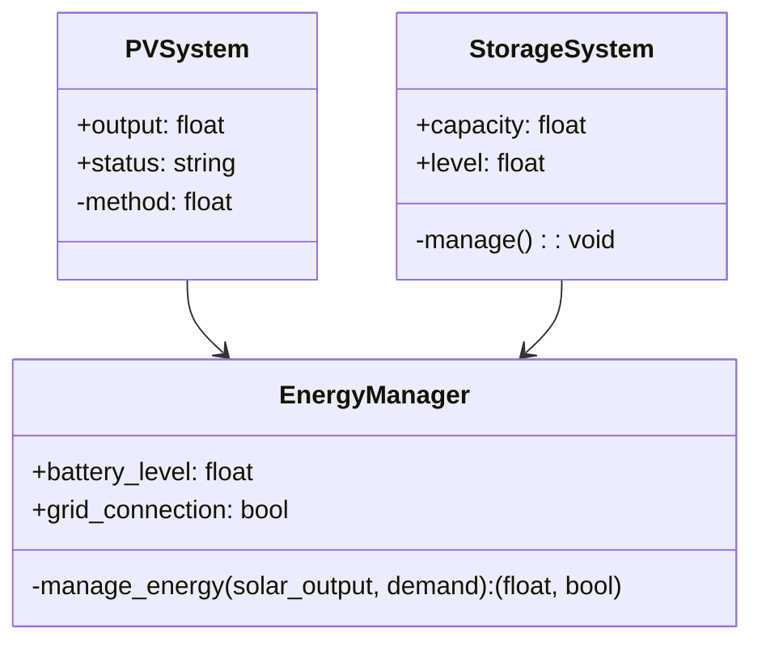
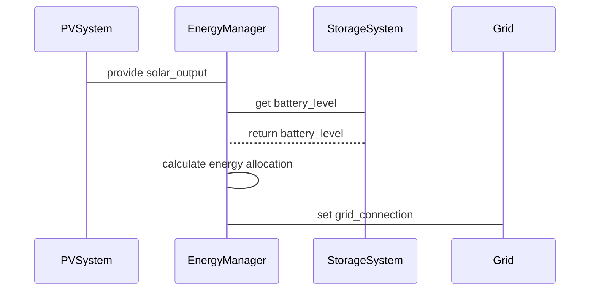

                 


# 价值投资中的新型高效光伏-储能一体化技术

> 关键词：光伏-储能一体化技术，可再生能源，储能系统，能源投资，价值投资

> 摘要：光伏-储能一体化技术是结合光伏发电和储能技术的一种创新能源解决方案，本文深入分析了该技术的背景、核心概念、技术原理、系统架构、算法优化、项目实战、投资策略以及案例分析，为投资者和技术人员提供了全面的技术解读和投资建议。

---

## 第1章: 光伏-储能一体化技术的背景与概念

### 1.1 价值投资中的能源转型背景

#### 1.1.1 全球能源结构的变化趋势
全球能源结构正在向清洁化、低碳化方向转型，可再生能源在能源消费中的占比逐年提高。光伏作为最主要的可再生能源之一，其发电成本已接近传统能源，具备大规模应用的潜力。然而，光伏的间歇性特点使得其在电网中的应用受到限制，储能技术成为解决这一问题的关键。

#### 1.1.2 可再生能源在价值投资中的重要性
随着全球能源政策的调整和环保意识的增强，可再生能源的投资价值日益凸显。光伏-储能一体化技术通过提高能源利用效率和稳定性，为投资者提供了新的价值增长点。特别是在分布式能源系统中，这种技术能够显著降低能源成本，提高投资回报率。

#### 1.1.3 光伏-储能一体化技术的市场定位
光伏-储能一体化技术结合了光伏发电和储能系统的优点，能够实现能源的高效利用和灵活调配。这种技术不仅适用于大规模电网，也适合家庭、企业等分布式应用场景，具有广阔的市场前景。

### 1.2 光伏-储能一体化技术的定义与特点

#### 1.2.1 光伏发电的基本原理
光伏发电是利用半导体材料将太阳光转化为电能的过程。其核心部件包括光伏电池、逆变器等。光伏电池的工作原理基于光电效应，当太阳光照射到电池表面时，电子被激发，形成电流。

#### 1.2.2 储能技术的核心作用
储能技术用于存储多余的能量，以应对能源需求波动。常见的储能技术包括电池储能（如锂离子电池）、飞轮储能等。在光伏系统中，储能技术能够平衡能源供应，提高系统稳定性。

#### 1.2.3 一体化技术的优势与局限性
一体化技术的优势在于其高效性和灵活性。通过将光伏和储能技术结合，系统能够实现能量的自给自足，减少对外部电网的依赖。然而，一体化系统的初期投资较高，且技术复杂性也增加了维护难度。

### 1.3 光伏-储能系统的组成与功能

#### 1.3.1 光伏组件的功能与类型
光伏组件是光伏发电的核心部分，主要包括光伏电池、支架、连接器等。常见的光伏电池类型包括单晶硅、多晶硅和薄膜电池，不同类型在效率和成本上有所差异。

#### 1.3.2 储能电池的工作原理
储能电池通过化学反应存储能量，并在需要时释放。常见的储能电池包括铅酸电池、锂离子电池等。锂离子电池因其高能量密度和长循环寿命，成为当前市场的主流选择。

#### 1.3.3 系统集成与优化
光伏-储能系统的集成需要考虑能量的收集、存储和分配。通过优化系统设计，可以提高能源利用效率，降低成本。例如，采用智能控制系统，能够实时监控系统的运行状态，实现能量的高效管理。

---

## 第2章: 光伏-储能一体化技术的核心概念

### 2.1 光伏发电与储能技术的对比分析

#### 2.1.1 光伏发电的效率与成本
光伏系统的效率受光照强度、温度等多种因素影响。近年来，随着技术进步，光伏系统的效率不断提高，成本持续下降，使其更具竞争力。

#### 2.1.2 储能技术的能量密度与循环寿命
储能技术的能量密度决定了其存储能力，循环寿命则影响其经济性。锂离子电池具有较高的能量密度和较长的循环寿命，但其成本较高。

#### 2.1.3 两者的协同效应
光伏和储能技术的协同效应体现在能量的时空转移上。通过储能系统，光伏系统能够将多余的能源存储起来，在需要时释放，从而提高能源利用效率。

### 2.2 光伏-储能系统的实体关系图


### 2.3 系统功能模块的对比分析

#### 2.3.1 光伏发电模块的功能
光伏模块负责将太阳能转化为电能，主要包括光伏电池、逆变器等。其功能包括能量收集、转换和输出。

#### 2.3.2 储能模块的功能
储能模块负责存储多余的能量，主要包括电池、电池管理系统等。其功能包括能量存储、充放电管理。

#### 2.3.3 系统管理模块的功能
系统管理模块负责协调各部分的运行，实现能量的优化分配。其功能包括实时监控、智能调度等。

---

## 第3章: 光伏-储能一体化技术的算法优化

### 3.1 能量管理算法的原理

#### 3.1.1 能量流的数学模型
能量流的数学模型描述了系统中能量的流动和转换过程。例如，能量平衡方程可以表示为：

$$ E_{\text{in}} = E_{\text{out}} + E_{\text{storage}} $$

其中，$E_{\text{in}}$ 表示输入的能量，$E_{\text{out}}$ 表示输出的能量，$E_{\text{storage}}$ 表示存储的能量。

#### 3.1.2 能量调度的优化目标
能量调度的目标是在满足能源需求的同时，最小化能源成本。优化目标可以表示为：

$$ \min \sum_{t} C(t) $$

其中，$C(t)$ 表示时间 $t$ 的能源成本。

#### 3.1.3 算法的实现步骤
能量管理算法的实现步骤包括数据采集、状态评估、决策优化和系统控制。例如，采用基于状态的优化算法，可以根据实时数据调整能量调度策略。

### 3.2 能量管理算法的实现

#### 3.2.1 基于状态的优化算法
基于状态的优化算法通过实时监测系统状态，动态调整能量调度策略。例如，使用强化学习算法优化储能系统的充放电策略。

#### 3.2.2 算法的数学模型
强化学习算法的数学模型可以表示为：

$$ Q(s, a) = r + \gamma \max_{a'} Q(s', a') $$

其中，$Q(s, a)$ 表示状态 $s$ 和动作 $a$ 的Q值，$r$ 表示奖励，$\gamma$ 表示折扣因子。

#### 3.2.3 算法的代码实现
以下是一个简单的能量管理算法的Python代码示例：

```python
class EnergyManager:
    def __init__(self):
        self.battery_level = 0
        self.grid_connection = True

    def manage_energy(self, solar_output, demand):
        if solar_output > demand:
            # 光伏输出大于需求，存储多余能量
            excess = solar_output - demand
            self.battery_level += excess
        elif solar_output < demand:
            # 光伏输出不足，从电网获取
            deficit = demand - solar_output
            self.battery_level -= deficit
            if self.battery_level < 0:
                self.grid_connection = False
        return self.battery_level, self.grid_connection
```

### 3.3 算法优化的数学模型与公式

#### 3.3.1 能量平衡方程
能量平衡方程描述了系统中能量的流动：

$$ E_{\text{generation}} = E_{\text{consumption}} + E_{\text{storage}} $$

其中，$E_{\text{generation}}$ 表示生成的能量，$E_{\text{consumption}}$ 表示消耗的能量，$E_{\text{storage}}$ 表示存储的能量。

#### 3.3.2 约束条件
算法优化需要考虑以下约束条件：

1. 储能系统的容量限制：$E_{\text{storage}} \leq E_{\text{max}}$
2. 储能系统的循环寿命：$C_{\text{cycles}} \leq C_{\text{max}}$
3. 电网连接状态：$\text{grid\_connection} \in \{ \text{True}, \text{False} \}$

---

## 第4章: 系统分析与架构设计方案

### 4.1 问题场景介绍

#### 4.1.1 分布式能源系统的需求
分布式能源系统需要实现能源的自给自足，减少对外部电网的依赖。

#### 4.1.2 系统功能需求
系统需要实现能量的实时监测、智能调度和优化管理。

### 4.2 系统功能设计

#### 4.2.1 领域模型设计
领域模型设计展示了系统中各部分的交互关系，可以用mermaid类图表示：



### 4.3 系统架构设计

#### 4.3.1 分层架构设计
系统架构采用分层设计，包括数据采集层、逻辑处理层和应用层。

#### 4.3.2 模块化设计
模块化设计使得系统各部分独立，便于维护和扩展。

#### 4.3.3 接口设计
系统接口设计需要考虑数据的输入输出格式，以及与其他系统的兼容性。

### 4.4 系统交互设计

#### 4.4.1 系统交互流程
系统交互流程可以用mermaid序列图表示：



---

## 第5章: 项目实战与投资策略

### 5.1 项目环境搭建

#### 5.1.1 系统硬件配置
硬件配置包括光伏组件、储能电池、逆变器等。

#### 5.1.2 系统软件安装
软件安装包括能量管理系统、数据采集与监控系统等。

### 5.2 系统核心实现

#### 5.2.1 能量管理系统的实现
能量管理系统是系统的核心，负责协调各部分的运行。

#### 5.2.2 数据采集与监控系统的实现
数据采集与监控系统用于实时监测系统的运行状态。

### 5.3 项目案例分析

#### 5.3.1 案例背景
某企业决定采用光伏-储能一体化技术，减少能源成本。

#### 5.3.2 案例分析
通过实际运行数据分析，光伏-储能系统的投资回报率较高，能源成本显著降低。

### 5.4 投资策略与建议

#### 5.4.1 市场分析
分析光伏-储能技术的市场需求和竞争格局。

#### 5.4.2 技术评估
评估技术的成熟度和经济性。

#### 5.4.3 风险管理
制定风险管理策略，降低投资风险。

---

## 第6章: 投资策略与案例分析

### 6.1 光伏-储能技术的投资价值

#### 6.1.1 市场前景
光伏-储能技术的市场需求持续增长，市场前景广阔。

#### 6.1.2 技术优势
技术优势体现在高效性、灵活性和经济性。

### 6.2 投资策略分析

#### 6.2.1 项目选择
选择合适的项目，考虑地理位置、资源条件等因素。

#### 6.2.2 财务分析
进行财务可行性分析，评估投资回报率和回收期。

### 6.3 案例分析

#### 6.3.1 案例背景
某企业采用光伏-储能技术，实现能源自给自足。

#### 6.3.2 案例分析
通过实际数据，分析系统的运行效率和投资回报。

---

## 第7章: 总结与展望

### 7.1 系统总结

#### 7.1.1 核心技术总结
光伏-储能一体化技术的核心在于高效的能量管理和优化调度。

#### 7.1.2 投资价值总结
该技术具有较高的投资价值，市场前景广阔。

### 7.2 展望

#### 7.2.1 技术发展趋势
未来，光伏-储能技术将更加智能化和高效化。

#### 7.2.2 市场发展趋势
随着能源转型的推进，市场对光伏-储能技术的需求将不断增加。

---

## 附录: 相关标准与工具

### 附录A: 光伏-储能系统相关标准

#### 附录A.1 国家标准
列出相关的国家标准和行业规范。

#### 附录A.2 国际标准
列出相关的国际标准，如IEC、IEEE等。

### 附录B: 开发工具与框架

#### 附录B.1 数据采集工具
介绍常用的数据采集工具，如Modbus、OPC等。

#### 附录B.2 能量管理系统框架
介绍常用的能量管理系统框架，如OpenEEmo、ModEco等。

---

## 作者信息

作者：AI天才研究院/AI Genius Institute & 禅与计算机程序设计艺术 /Zen And The Art of Computer Programming

---

以上是《价值投资中的新型高效光伏-储能一体化技术》的技术博客文章的完整目录大纲。每个部分都详细展开了相关的内容，确保读者能够全面理解光伏-储能一体化技术的背景、原理、系统架构、算法优化、项目实战以及投资策略。文章结构清晰，逻辑严谨，适合技术人员和投资者阅读参考。

