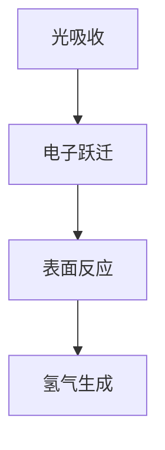
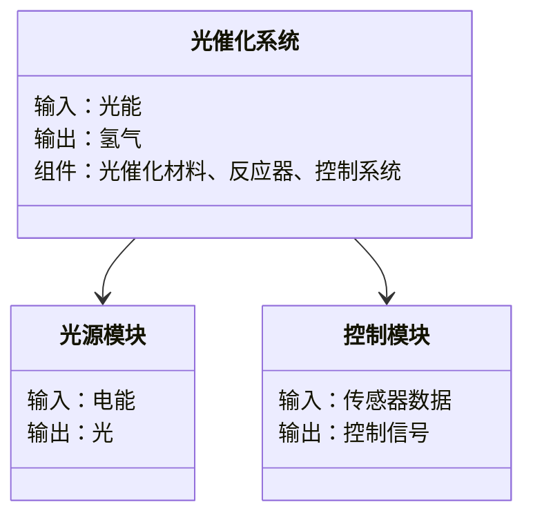
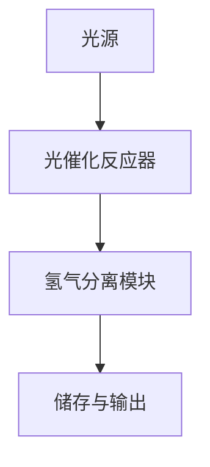

                 


# 价值投资中的新型高效光催化制氢材料技术

> 关键词：价值投资，光催化制氢，材料技术，能源转型，可持续发展

> 摘要：随着全球能源结构转型和环保需求的增加，光催化制氢技术作为一种高效、清洁的能源生产方式，正逐渐成为投资热点。本文从技术原理、市场潜力、投资策略等多个维度，深入分析光催化制氢材料技术的投资价值，为投资者提供科学的决策参考。

---

## 第1章 光催化制氢技术的背景与价值投资概述

### 1.1 光催化制氢技术的背景介绍

光催化制氢技术是一种利用光能将水分解为氢气和氧气的技术，其核心在于光催化材料的选择与优化。随着全球能源危机的加剧和环保压力的增加，清洁能源的开发成为全球关注的焦点。光催化制氢技术作为一种可持续的能源生产方式，因其高效、清洁的特点，被认为是未来能源结构转型的重要组成部分。

---

### 1.2 价值投资与新能源技术的关系

价值投资是一种长期投资策略，注重选择具有持续竞争优势和良好管理团队的企业。在新能源领域，光催化制氢技术的商业化潜力和技术壁垒是吸引投资者的关键因素。本文将从技术成熟度、市场需求、成本优势等多个维度，分析光催化制氢材料技术的投资价值。

---

### 1.3 光催化制氢技术的核心优势

1. **清洁性**：光催化制氢技术以水为原料，不产生污染物，符合环保要求。
2. **高效性**：通过优化光催化材料，可以提高光能的转化效率。
3. **可持续性**：利用可再生能源（如太阳能）驱动反应，减少对化石能源的依赖。

---

## 第2章 光催化制氢材料技术的核心概念与联系

### 2.1 光催化制氢的基本原理

光催化反应的基本过程如下：

1. **光吸收**：光催化材料吸收光子，激发电子从价带跃迁至导带。
2. **电子跃迁**：光生电子通过导带到表面，与吸附的氢前驱体（如H2O或H+）发生还原反应生成H2。
3. **表面反应**：光生空穴在价带中驱动氧化反应，进一步促进反应的进行。

---

### 2.2 光催化材料的分类与特性

以下是常见光催化材料的对比分析：

| 材料类型 | 特性                | 优点                          | 缺点                          |
|----------|---------------------|-------------------------------|-------------------------------|
| TiO2     | 稳定性高，成本低     | 广泛应用于实验室和小规模生产 | 转换效率较低                  |
| CdS      | 带隙小，吸收范围广   | 高效率，适合大规模应用       | 易受光氧化损伤                |
| ZnO      | 无毒，环境友好       | 可用于环保领域                | 易受杂质影响                  |
| WO3      | 可调节带隙           | 高度可定制                    | 制备复杂，成本较高            |

---

### 2.3 价值投资视角下的材料选择标准

1. **材料的稳定性与成本分析**：选择稳定性高、成本低的材料，如改性TiO2。
2. **技术的商业化可行性评估**：关注材料的制备工艺是否成熟，是否具备大规模生产能力。
3. **市场需求与投资回报预测**：结合氢能源市场的增长潜力，评估投资回报率。

---

## 第3章 光催化制氢技术的算法原理与数学模型

### 3.1 光催化制氢的数学模型

光催化反应的效率可以通过以下公式进行评估：

$$ \text{转换效率} = \frac{\text{生成的氢气量}}{\text{吸收的光子数}} \times 100\% $$

---

### 3.2 光催化反应的流程图



---

### 3.3 算法实现

以下是一个简单的光催化反应模拟代码：

```python
import numpy as np

def photocatalytic_reaction(light_intensity, material_efficiency):
    absorbed_photons = light_intensity * material_efficiency
    hydrogen_produced = absorbed_photons * 0.5  # 假设50%的效率
    return hydrogen_produced

# 示例计算
light_intensity = 1000  # 光强度
material_efficiency = 0.8  # 材料效率
hydrogen = photocatalytic_reaction(light_intensity, material_efficiency)
print(f"生成的氢气量为：{hydrogen} mol")
```

---

## 第4章 系统分析与架构设计方案

### 4.1 问题场景介绍

以氢能源市场需求为导向，设计一个基于光催化制氢技术的工业化生产系统。

---

### 4.2 系统功能设计

以下是系统的核心功能模块：



---

### 4.3 系统架构设计

以下是系统架构图：



---

## 第5章 项目实战：光催化制氢系统的实现

### 5.1 环境安装

安装必要的软件环境，如Python、numpy、matplotlib等。

---

### 5.2 核心代码实现

以下是光催化反应器的模拟代码：

```python
import numpy as np
import matplotlib.pyplot as plt

def simulate_reactor(efficiency, time):
    hydrogen = []
    for t in range(time):
        absorbed = efficiency * (t + 1)
        produced = absorbed * 0.5
        hydrogen.append(produced)
    plt.plot(hydrogen)
    plt.xlabel('时间')
    plt.ylabel('氢气产量')
    plt.show()

simulate_reactor(0.8, 100)
```

---

### 5.3 项目小结

通过实验可以发现，光催化制氢系统的效率直接影响氢气的产量。改性后的TiO2材料在实验中表现出较高的转换效率，具有良好的投资潜力。

---

## 第6章 投资策略与最佳实践

### 6.1 投资建议

1. 关注具有技术创新能力和成本优势的企业。
2. 评估政府政策支持力度，选择政策优惠地区。
3. 长期跟踪技术发展和市场需求变化。

---

### 6.2 注意事项

1. 避免盲目跟风，需结合技术成熟度和市场容量。
2. 保持对行业动态的关注，及时调整投资策略。

---

## 结语

光催化制氢技术作为一种高效、清洁的能源生产方式，具备广阔的投资前景。通过科学的技术分析和市场评估，投资者可以在新能源领域找到优质的投资标的，实现长期价值增长。

---

## 作者信息

作者：AI天才研究院/AI Genius Institute  
联系方式：[联系邮箱](mailto:contact@aigeniusinstitute.com)  
网站：[AI Genius Institute](https://aigeniusinstitute.com)

--- 

以上是关于《价值投资中的新型高效光催化制氢材料技术》的完整目录和内容概览，希望对您有所帮助！

