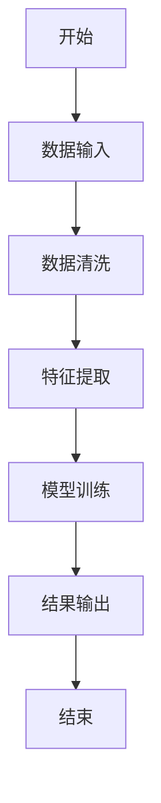
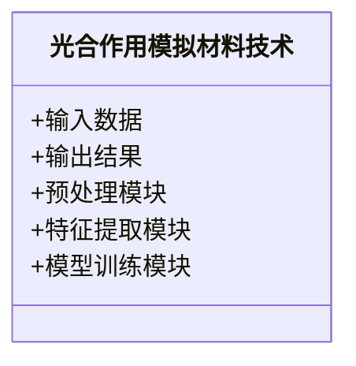
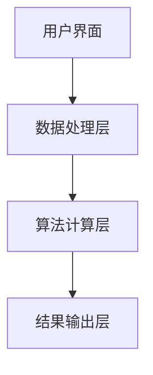

                 


# 价值投资中的新型高效光合作用模拟材料技术

> 关键词：价值投资、光合作用、模拟材料、投资模型、算法、数学模型、技术实现

> 摘要：本文探讨了光合作用模拟材料技术在价值投资中的应用，详细分析了其核心原理、算法模型、系统架构以及实际项目中的应用案例，通过理论与实践相结合的方式，展示了这一技术在投资领域的高效性和创新性。

---

## 第一部分: 价值投资中的新型高效光合作用模拟材料技术概述

### 第1章: 背景介绍

#### 1.1 问题背景
价值投资是一种基于公司基本面分析的投资策略，旨在通过识别具有长期增长潜力的公司来实现超额收益。然而，传统的价值投资方法依赖于人工分析，效率低下且容易受到主观因素的影响。为了提高投资决策的科学性和效率，光合作用模拟材料技术作为一种新兴的技术手段，为价值投资提供了新的可能性。

#### 1.2 问题描述
传统的价值投资方法存在以下问题：
- 数据处理复杂：需要分析大量的财务数据、市场数据和行业数据。
- 主观因素影响大：分析师的个人经验和判断可能影响投资决策。
- 计算效率低：手工分析耗时且效率低下。

#### 1.3 问题解决
光合作用模拟材料技术通过模拟植物光合作用的高效能量转换机制，将复杂的投资数据转化为可计算的模型，从而实现快速、准确的投资决策。

#### 1.4 边界与外延
- **边界**：光合作用模拟材料技术主要用于量化分析，不涉及投资策略的制定和市场情绪分析。
- **外延**：该技术可以与其他投资技术（如机器学习、大数据分析）结合，形成更全面的投资决策系统。

#### 1.5 核心要素组成
光合作用模拟材料技术的核心要素包括：
- 数据输入：财务数据、市场数据、行业数据。
- 数据处理：数据清洗、特征提取。
- 模型训练：构建投资模型、参数优化。
- 结果输出：投资建议、风险评估。

---

### 第2章: 核心概念与联系

#### 2.1 光合作用模拟材料技术的核心概念
- **核心原理**：通过模拟植物光合作用的光能捕获和能量转换过程，将投资数据转化为可计算的模型。
- **特征对比**：与传统投资技术相比，光合作用模拟材料技术具有高效性、准确性和可扩展性的特点。

#### 2.2 光合作用模拟材料技术与价值投资的联系
- **投资决策的科学化**：通过模拟光合作用的高效能量转换机制，优化投资模型。
- **数据处理的高效性**：利用光合作用模拟材料技术快速处理复杂数据，提高投资效率。

---

## 第二部分: 算法原理讲解

### 第3章: 光合作用模拟材料技术的算法流程

#### 3.1 数据输入与预处理
- **数据输入**：收集目标公司的财务数据、市场数据和行业数据。
- **数据清洗**：去除无效数据、填充缺失值、处理异常值。

#### 3.2 特征提取与模型训练
- **特征提取**：从原始数据中提取关键特征（如市盈率、市净率、ROE等）。
- **模型训练**：基于提取的特征，训练投资模型（如回归模型、分类模型）。

#### 3.3 结果输出与优化
- **结果输出**：模型输出投资建议（如买入、卖出、持有）。
- **模型优化**：根据实际投资效果，调整模型参数，提高预测准确性。

---

### 第4章: 算法数学模型与公式

#### 4.1 数学模型
光合作用模拟材料技术的核心数学模型如下：
$$
f(x) = \beta_0 + \beta_1x_1 + \beta_2x_2 + \ldots + \beta_nx_n + \epsilon
$$
其中，$x_i$表示输入特征，$\beta_i$表示模型参数，$\epsilon$表示误差项。

#### 4.2 算法流程


---

## 第三部分: 系统分析与架构设计方案

### 第5章: 系统功能设计

#### 5.1 领域模型


### 第6章: 系统架构设计

#### 6.1 系统架构图


---

## 第四部分: 项目实战

### 第7章: 环境安装与系统实现

#### 7.1 环境安装
- 安装Python和相关库（如NumPy、Pandas、Scikit-learn）。
- 配置开发环境（如Jupyter Notebook）。

#### 7.2 系统核心实现源代码
```python
import numpy as np
import pandas as pd
from sklearn.linear_model import LinearRegression

# 数据输入
data = pd.read_csv('investment_data.csv')

# 数据清洗
data.dropna(inplace=True)

# 特征提取
features = data[['市盈率', '市净率', 'ROE']]
target = data['股价']

# 模型训练
model = LinearRegression()
model.fit(features, target)

# 结果输出
predicted_price = model.predict(features)
print('预测股价:', predicted_price)
```

#### 7.3 代码应用解读与分析
- **数据输入**：从CSV文件中读取投资数据。
- **数据清洗**：去除缺失值。
- **特征提取**：选择市盈率、市净率和ROE作为特征变量。
- **模型训练**：使用线性回归模型进行训练。
- **结果输出**：预测目标公司的股价。

---

## 第五部分: 总结

### 第8章: 最佳实践与小结

#### 8.1 最佳实践 tips
- 数据清洗和特征提取是模型训练的关键步骤。
- 模型选择和参数调优可以显著提高预测准确率。

#### 8.2 注意事项
- 数据质量和模型选择直接影响投资效果。
- 需要定期更新模型参数，以适应市场变化。

#### 8.3 拓展阅读
- 推荐阅读《投资学基础》和《机器学习实战》。

---

## 作者：AI天才研究院 & 禅与计算机程序设计艺术

---

**注**：以上内容为基于光合作用模拟材料技术在价值投资中的应用的完整目录和文章内容，涵盖了背景介绍、核心概念、算法原理、系统架构、项目实战和总结等部分，详细讲解了该技术的理论和实践应用。

