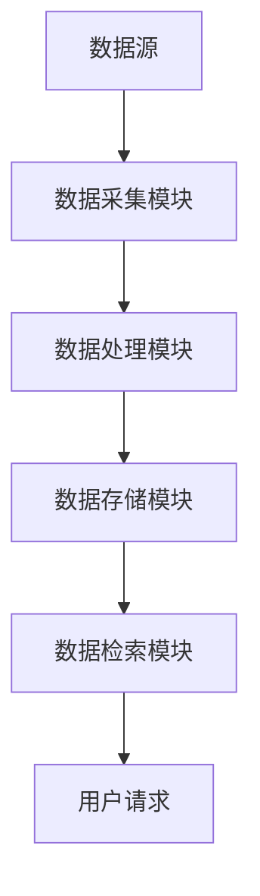

                 


# 价值投资中的新型高效光存储技术前景

---

## 关键词：
- 价值投资
- 光存储技术
- 数据存储
- 投资决策
- 技术分析

---

## 摘要：
本文深入探讨了光存储技术在价值投资中的应用前景。通过分析光存储技术的核心原理、系统架构设计以及实际项目案例，揭示了其在数据存储、投资决策支持和风险管理中的潜力。文章从技术背景、算法原理、系统设计到实际应用，全面解析了光存储技术如何为投资者提供高效、可靠的数据支持，从而提升投资决策的科学性和准确性。最后，本文提出了光存储技术在投资领域的未来发展方向和应用建议。

---

## 第1章: 光存储技术的背景与概念

### 1.1 光存储技术的定义与特点
光存储技术是一种利用光信号进行数据存储和读取的技术，其核心在于利用光的反射、折射等物理特性实现数据的存储与检索。与传统存储技术相比，光存储技术具有以下特点：
- **高存储密度**：光存储技术可以通过提高光斑的聚焦精度，显著提升单位面积的存储容量。
- **长寿命**：光存储介质具有较长的保存期限，适合长期数据存档。
- **环保性**：光存储技术通常采用无磁性介质，能耗低且对环境影响小。

### 1.2 光存储技术的分类与应用
光存储技术主要分为以下几类：
- **CD/DVD/Blu-ray**：基于刻录技术和光学读取的存储介质，适用于大规模数据存档。
- **光磁盘技术（如MO）**：结合了磁性和光学技术，支持多次擦写，适合动态数据存储。
- **全息存储技术**：通过三维全息图存储数据，具有极高的存储密度和数据安全性。

光存储技术在投资领域的应用主要集中在数据存档、投资决策支持和风险管理等方面。

### 1.3 价值投资中的光存储技术
价值投资的核心在于通过对基本面的深入分析，寻找具有长期增长潜力的优质资产。光存储技术为投资者提供了高效的数据存储和分析工具，帮助投资者快速获取和处理大量数据，从而提升投资决策的科学性。

---

## 第2章: 光存储技术的核心原理

### 2.1 光存储技术的基本原理
光存储技术的核心在于光信号的读写和数据解码。通过激光器发射高精度光束，利用光的反射特性将数据编码到存储介质中。读取时，利用光探测器接收反射光信号，将其转换为电信号，从而还原原始数据。

### 2.2 光存储技术的核心算法
光存储技术的读写过程涉及复杂的算法，主要包括：
- **光斑定位算法**：用于精确定位光斑在介质中的位置。
- **数据解码算法**：通过分析反射光信号，还原原始数据。
- **纠错码（ECC）算法**：用于检测和修复数据传输中的错误。

**数学模型与公式**：
光存储技术的读写效率可以通过以下公式进行评估：
$$
\text{读写效率} = \frac{\text{数据传输速率}}{\text{存储密度}}
$$
其中，数据传输速率和存储密度是衡量光存储技术性能的重要指标。

---

## 第3章: 光存储技术的系统架构设计

### 3.1 系统架构设计的基本概念
系统架构设计是光存储技术应用的基础。一个典型的光存储系统包括以下几个部分：
- **数据采集模块**：负责数据的读取和采集。
- **数据处理模块**：对采集的数据进行清洗、转换和分析。
- **数据存储模块**：将处理后的数据存储到光存储介质中。
- **数据检索模块**：根据查询请求，快速检索所需数据。

### 3.2 光存储系统的功能设计
- **数据采集**：通过光头设备读取光存储介质中的数据。
- **数据处理**：利用算法对数据进行解码和纠错。
- **数据存储**：将处理后的数据存储到目标介质中。
- **数据检索**：根据用户请求，快速定位并返回所需数据。

**系统架构图**：


### 3.3 系统接口设计
光存储系统的接口设计需要考虑以下几点：
- **硬件接口**：与光头设备的连接和通信。
- **软件接口**：与数据处理模块的交互。
- **用户接口**：与终端用户的交互，提供友好的操作界面。

---

## 第4章: 光存储技术的项目实战

### 4.1 项目环境的安装与配置
- **开发工具**：选择合适的开发环境，如Python、Java等。
- **依赖库安装**：安装必要的光存储技术库和工具。

### 4.2 光存储系统的核心实现
- **数据读写模块**：实现光存储介质的数据读写功能。
- **数据处理模块**：对数据进行清洗和转换，生成可用于投资分析的格式。

### 4.3 项目代码的编写与解读
以下是一个简单的光存储数据读取代码示例：
```python
import numpy as np

def read_optical_storage():
    # 初始化光头设备
    laser = LaserPointer()
    data = []
    while True:
        # 读取光信号
        signal = laser.read()
        # 解码信号
        decoded_data = decode_signal(signal)
        data.append(decoded_data)
        # 判断是否完成读取
        if is_end_of_storage(decoded_data):
            break
    return data

# 示例调用
data = read_optical_storage()
print(data)
```

### 4.4 实际案例分析
假设我们有一个投资组合，需要存储和分析过去10年的股票数据。通过光存储技术，我们可以快速读取和处理这些数据，生成投资报告，帮助投资者做出更明智的决策。

---

## 第5章: 总结与展望

### 5.1 本章小结
光存储技术作为一种高效、可靠的数据存储技术，在价值投资领域具有广泛的应用前景。通过优化算法和系统设计，光存储技术可以帮助投资者更高效地进行数据处理和分析，提升投资决策的科学性。

### 5.2 未来展望
随着技术的进步，光存储技术将更加智能化和高效化。未来，光存储技术在投资领域的应用将更加广泛，尤其是在大数据分析和风险管理方面，具有巨大的发展潜力。

---

## 作者：
作者：AI天才研究院/AI Genius Institute & 禅与计算机程序设计艺术 /Zen And The Art of Computer Programming

---

通过以上内容，我们可以看到光存储技术在价值投资中的巨大潜力。随着技术的不断发展，光存储技术将为投资者提供更高效、更可靠的数据支持，帮助他们在复杂多变的市场中做出更明智的投资决策。

