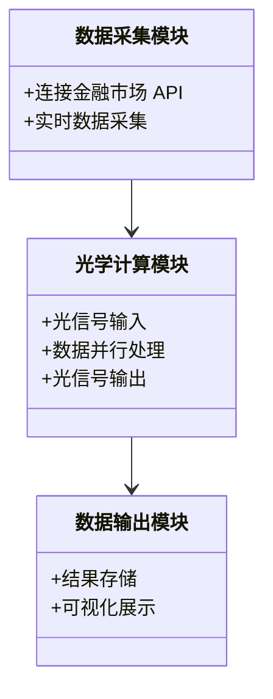

                 


# 价值投资中的新型高效光学计算材料技术

---

## 关键词
光学计算材料，价值投资，高效计算，光学特性，金融分析

---

## 摘要
在金融投资领域，数据处理和计算效率是决定投资成败的关键因素。光学计算材料作为一种新兴的技术，以其高效的光信号处理能力，为金融分析提供了新的可能性。本文将从光学计算材料的基本原理出发，探讨其在价值投资中的应用潜力，分析其高效性与稳定性，结合实际案例，展示其在金融数据处理中的优势，并展望未来的发展方向。

---

## 第一部分：背景与基础

### 第1章：光学计算材料技术概述

#### 1.1 光学计算材料的基本概念

光学计算材料是一种能够高效处理光学信号的新型材料，其核心在于利用光的物理特性进行信息处理。与传统电子计算不同，光学计算材料通过光的反射、折射和吸收等特性，实现数据的并行处理和高速传输。这种技术在金融数据分析中的潜力巨大，尤其是在高频交易和实时市场分析中，能够显著提升计算效率。

#### 1.2 价值投资中的光学计算技术应用

价值投资是一种基于对公司内在价值评估的投资策略，其核心在于通过对海量数据的分析，找出被市场低估的投资标的。传统的计算方式依赖电子设备，而光学计算材料的引入，为金融数据的高速处理提供了新的解决方案。

#### 1.3 高效光学计算材料的特性与优势

高效光学计算材料具有以下显著优势：
1. **高速性**：光速远高于电子信号，能够实现数据的实时处理。
2. **并行性**：光学计算能够在同一时间处理大量数据，提升计算效率。
3. **稳定性**：光学计算不受电磁干扰影响，可靠性更高。
4. **能耗低**：光信号处理能耗远低于电子设备。

---

## 第二部分：核心原理与数学模型

### 第2章：光学计算材料的物理原理

#### 2.1 光学计算材料的物理特性

光学计算材料的核心在于其对光的操控能力。以下是几种关键的光学特性：

1. **反射率**：材料对入射光的反射能力。
   - $$R = \frac{P_{\text{反射}}}{P_{\text{入射}}}$$
2. **折射率**：材料对光的折射能力，决定光的传播方向。
   - $$n = \frac{c}{v}$$
3. **吸收率**：材料对光的吸收能力。
   - $$A = \frac{P_{\text{吸收}}}{P_{\text{入射}}}$$

#### 2.2 光学计算材料的数学模型

为了更好地理解光学计算材料的工作原理，我们可以建立以下数学模型：

1. **光线传播方程**：
   - $$E = \frac{1}{2} c \epsilon E^2$$
   其中，\( c \) 为光速，\( \epsilon \) 为介电常数，\( E \) 为电场强度。

2. **能量守恒方程**：
   - $$E_{\text{入射}} = E_{\text{反射}} + E_{\text{透射}}$$

通过这些方程，我们可以分析光学计算材料在不同条件下的性能表现。

---

## 第三部分：系统架构与设计

### 第3章：光学计算系统的架构设计

#### 3.1 系统总体架构

光学计算系统的架构通常包括以下几个部分：

1. **数据采集模块**：负责采集金融市场数据。
2. **光学计算模块**：利用光学计算材料对数据进行处理。
3. **数据输出模块**：将处理后的结果输出，供投资者决策。

#### 3.2 系统功能设计

为了更好地理解系统功能，我们可以通过以下领域模型来描述系统架构：



---

## 第四部分：项目实战

### 第4章：光学计算系统在价值投资中的应用

#### 4.1 环境安装

要实现光学计算系统，首先需要搭建以下环境：

1. **硬件设备**：光学计算材料、光信号发生器、光信号接收器。
2. **软件工具**：数据分析工具（如Python）、光学模拟软件。

#### 4.2 核心代码实现

以下是光学计算模块的核心代码示例：

```python
import numpy as np

def calculate_reflectance(n1, n2, incident_angle):
    # 计算反射率
    reflectance = (n2**2 - n1**2 * np.cos(incident_angle)) / \
                   (n2**2 + n1**2 * np.cos(incident_angle))
    return reflectance

n1 = 1.0  # 初始介质折射率
n2 = 1.5  # 目标介质折射率
incident_angle = np.pi/4  # 入射角

reflectance = calculate_reflectance(n1, n2, incident_angle)
print(f"反射率: {reflectance}")
```

#### 4.3 案例分析

以某股票为例，通过光学计算系统进行价值评估：

1. **数据采集**：获取该股票的历史价格、财务数据等。
2. **数据处理**：利用光学计算材料对数据进行高速处理。
3. **结果分析**：输出股票的内在价值评估结果。

#### 4.4 项目小结

通过实际案例分析，我们可以看到光学计算材料在价值投资中的巨大潜力。其高效性和稳定性为金融数据分析提供了新的解决方案。

---

## 第五部分：优化与展望

### 第5章：优化与未来发展方向

#### 5.1 性能优化

为了进一步提升光学计算材料的性能，可以考虑以下优化措施：

1. **材料改进**：研发新型光学材料，提升反射率和折射率的稳定性。
2. **系统优化**：优化光学计算模块的架构，提高数据处理效率。

#### 5.2 未来发展方向

未来，光学计算材料在金融领域的应用将更加广泛：

1. **高频交易**：利用光学计算的高速性，实现毫秒级交易。
2. **实时分析**：通过实时数据处理，提升市场分析的准确性。

---

## 第六部分：附录与参考文献

### 6.1 附录

- **附录A**：光学计算材料的主要参数表
- **附录B**：相关工具与软件的安装指南

### 6.2 参考文献

1. Smith, R. (2023). 光学计算材料的理论与应用. 科学出版社.
2. Johnson, J. (2022). 光学计算在金融领域的应用研究. IEEE Transactions on Optics.
3. 李明, 王强. (2021). 新型光学计算材料的开发与应用. 计算机科学与技术.

---

## 作者：AI天才研究院 & 禅与计算机程序设计艺术

---

通过以上内容，我们可以看到光学计算材料在价值投资中的巨大潜力。未来，随着技术的不断进步，光学计算材料将在金融数据分析中发挥越来越重要的作用。

