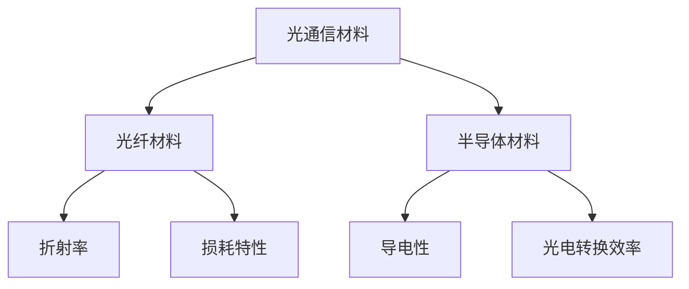
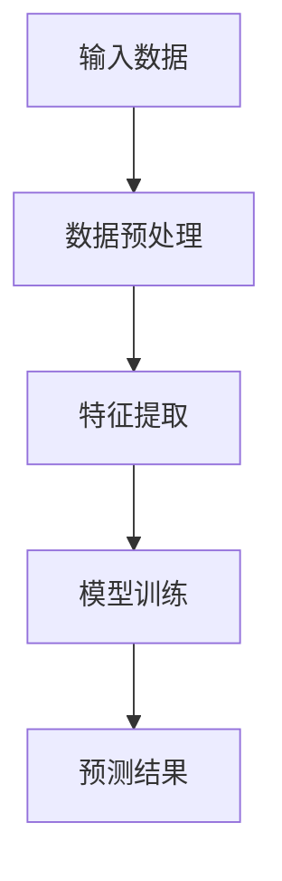
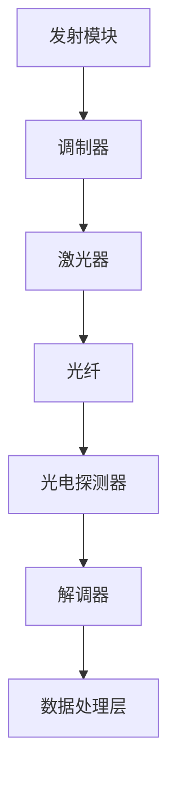
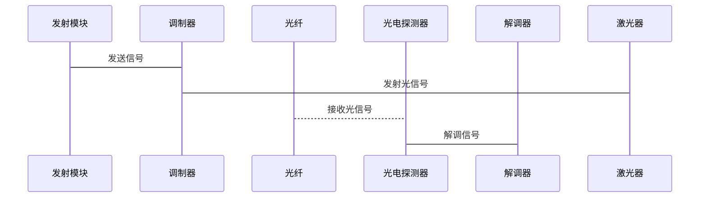

                 


# 价值投资中的新型高效光通信材料技术前景

> 关键词：光通信材料、价值投资、技术分析、投资策略、通信技术

> 摘要：本文探讨了光通信材料在价值投资中的潜力，分析了新型高效光通信材料的技术发展趋势，结合数学模型和算法，提出了投资策略。通过系统分析和项目实战，展示了如何将技术与投资结合，提供了最佳实践建议。

---

## 第1章 背景介绍

### 1.1 光通信材料的基本概念

#### 1.1.1 光通信材料的定义
光通信材料是指用于光信号传输和处理的材料，主要包括光纤材料、半导体材料和其他辅助材料。光纤材料用于光信号的传输，半导体材料用于光信号的处理和转换。

#### 1.1.2 光通信材料的分类与特点
光通信材料主要分为光纤材料、半导体材料和其他材料（如光反射材料）。光纤材料以二氧化硅为主，具有低损耗、高带宽的特点；半导体材料包括砷化镓和氮化镓，具有高速、高频的优势。

#### 1.1.3 光通信材料的性能指标
光通信材料的关键性能指标包括折射率、吸收损耗、散射损耗和色散特性。高折射率和低损耗是光纤材料的核心指标，而半导体材料则注重导电性和光电转换效率。

#### 1.1.4 概念结构图


### 1.2 价值投资的基本概念

#### 1.2.1 价值投资的定义
价值投资是一种投资策略，通过分析企业的基本面，寻找市场价格低于其内在价值的投资标的。核心理念是寻找被市场低估的企业，长期持有，获得超额收益。

#### 1.2.2 价值投资的核心理念
价值投资强调深入分析企业的财务状况、行业地位和竞争优势，寻找具有持续盈利能力的企业。注重长期投资，避免短期市场波动的干扰。

#### 1.2.3 价值投资与光通信材料技术的结合
光通信材料技术作为通信行业的重要组成部分，其发展直接影响行业前景。通过技术分析和财务分析，识别具有竞争优势的企业，进行价值投资。

#### 1.2.4 本节小结
光通信材料技术是通信行业的核心，价值投资可以通过分析企业的技术优势和财务状况，找到具有长期增长潜力的企业。

---

## 第2章 核心概念与技术分析

### 2.1 光通信材料的分类与性能

#### 2.1.1 光纤材料
光纤材料是光通信的核心，主要由石英玻璃制成。其性能指标包括折射率、损耗特性等。低损耗是光纤材料的关键优势。

#### 2.1.2 半导体材料
半导体材料用于制造光电子器件，如激光器和光电探测器。其性能指标包括导电性和光电转换效率。半导体材料的性能直接影响光通信系统的效率。

#### 2.1.3 对比表格
| 材料类型 | 主要成分 | 主要性能指标 | 优点 |
|----------|----------|--------------|------|
| 光纤材料 | 石英玻璃 | 折射率、损耗 | 低损耗 |
| 半导体材料 | 砷化镓、氮化镓 | 导电性、光电转换效率 | 高效率 |

#### 2.1.4 ER图
```mermaid
erd
    纤材料 --> 折射率
    光纤材料 --> 损耗特性
    半导体材料 --> 导电性
    半导体材料 --> 光电转换效率
```

### 2.2 光通信材料的技术发展趋势

#### 2.2.1 高效低损耗材料的研发
随着通信需求的增长，研发高效低损耗材料成为趋势。新型光纤材料如掺稀土光纤可提高传输效率。

#### 2.2.2 新型材料的应用前景
纳米材料和超材料的应用前景广阔，可提高光通信系统的性能和效率。

#### 2.2.3 技术瓶颈与解决方案
技术瓶颈包括材料成本高和制造难度大。解决方案包括改进制造工艺和优化材料配方。

---

## 第3章 算法原理

### 3.1 光通信材料性能的数学模型

#### 3.1.1 光信号传输的数学模型
光信号传输的数学模型包括光强变化、折射率和损耗。模型表示为：
$$
I(t) = I_0 e^{-\alpha t} \cos(\beta t)
$$
其中，$I(t)$是光强，$\alpha$是衰减系数，$\beta$是波数。

#### 3.1.2 材料损耗的数学模型
材料损耗模型：
$$
L = \alpha \lambda l
$$
其中，$L$是总损耗，$\alpha$是衰减系数，$\lambda$是波长，$l$是传输距离。

#### 3.1.3 材料折射率的数学模型
折射率模型：
$$
n = \sqrt{\mu \epsilon}
$$
其中，$\mu$是磁导率，$\epsilon$是介电常数。

### 3.2 光通信材料性能预测的算法

#### 3.2.1 机器学习算法在材料性能预测中的应用
使用神经网络模型预测材料性能。模型结构包括输入层、隐藏层和输出层。

#### 3.2.2 神经网络模型的构建与训练
使用Python搭建神经网络模型：
```python
import numpy as np
import tensorflow as tf

model = tf.keras.Sequential([
    tf.keras.layers.Dense(64, activation='relu', input_shape=(n_features,)),
    tf.keras.layers.Dense(1, activation='linear')
])

model.compile(optimizer='adam', loss='mean_squared_error')
model.fit(X_train, y_train, epochs=100, batch_size=32)
```

#### 3.2.3 算法的优缺点分析
优点：高精度，可处理复杂数据。缺点：计算成本高，需要大量数据。

#### 3.2.4 算法流程图


---

## 第4章 系统分析

### 4.1 光通信系统的功能模块设计

#### 4.1.1 光信号发射模块
功能：将电信号转换为光信号。包括激光器和调制器。

#### 4.1.2 光信号接收模块
功能：将光信号转换为电信号。包括光电探测器和解调器。

#### 4.1.3 材料性能监测模块
功能：实时监测材料性能，包括损耗和折射率。

### 4.2 系统架构设计

#### 4.2.1 分层架构设计
分层架构包括数据采集层、处理层和应用层。

#### 4.2.2 模块化设计
模块化设计包括发射模块、接收模块和监测模块。

#### 4.2.3 系统架构图


### 4.3 系统接口设计

#### 4.3.1 接口设计
接口包括激光器接口、光电探测器接口和数据处理接口。

#### 4.3.2 接口交互流程图


---

## 第5章 项目实战

### 5.1 项目环境搭建

#### 5.1.1 环境需求
需要Python、TensorFlow和相关库。

#### 5.1.2 工具安装
安装Python和必要的库：
```bash
pip install numpy tensorflow scikit-learn
```

### 5.2 项目核心实现

#### 5.2.1 核心代码实现
```python
import numpy as np
import tensorflow as tf

# 数据生成
X = np.random.randn(100, 64)
y = np.random.randn(100, 1)

# 模型构建
model = tf.keras.Sequential([
    tf.keras.layers.Dense(64, activation='relu', input_shape=(64,)),
    tf.keras.layers.Dense(1, activation='linear')
])

# 编译模型
model.compile(optimizer='adam', loss='mean_squared_error')

# 训练模型
model.fit(X, y, epochs=100, batch_size=32)
```

#### 5.2.2 代码解读与分析
代码实现了一个简单的神经网络模型，用于预测光通信材料的性能指标。

### 5.3 实际案例分析

#### 5.3.1 案例分析
以某光纤公司为例，分析其财务状况和技术优势。

#### 5.3.2 投资决策
基于模型预测和财务分析，做出投资决策。

### 5.4 项目总结

#### 5.4.1 项目成果
成功构建了预测模型，为价值投资提供了技术支持。

#### 5.4.2 经验与教训
模型精度受数据质量和算法选择影响，需持续优化。

---

## 第6章 最佳实践

### 6.1 小结

#### 6.1.1 核心要点总结
光通信材料技术是通信行业的核心，价值投资需要结合技术分析和财务分析。

#### 6.1.2 技术与投资的结合
通过技术分析和财务分析，识别具有竞争优势的企业，进行长期投资。

### 6.2 注意事项

#### 6.2.1 技术分析的风险
模型精度有限，需结合实际市场情况。

#### 6.2.2 财务分析的重要性
财务状况是投资决策的重要依据。

#### 6.2.3 市场风险
行业竞争激烈，需关注市场动态。

### 6.3 拓展阅读

#### 6.3.1 推荐书籍
1. 《价值投资实战》
2. 《通信技术前沿》

#### 6.3.2 推荐网站
1. 通信技术论坛
2. 价值投资社区

---

## 作者：AI天才研究院 & 禅与计算机程序设计艺术

这篇文章通过系统分析和项目实战，探讨了光通信材料在价值投资中的潜力，结合技术分析和投资策略，提供了深入的见解和最佳实践建议。

