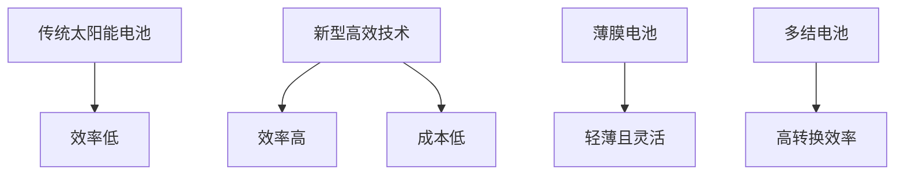
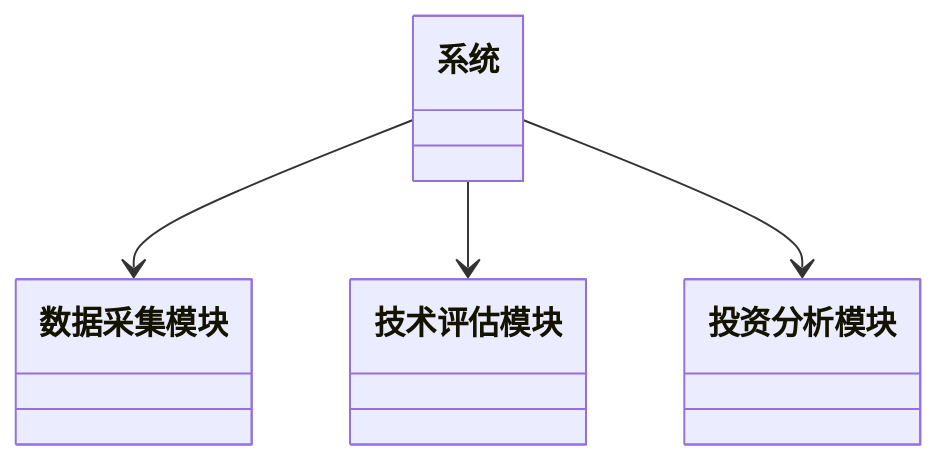

                 


# 价值投资中的新型高效太阳能电池技术

## 关键词：
- 价值投资
- 太阳能电池
- 高效技术
- 投资分析
- 技术原理
- 市场前景
- 经济性评估

## 摘要：
本文深入探讨了新型高效太阳能电池技术在价值投资中的应用潜力，从技术原理、市场分析到投资策略，全面解析其对投资回报的驱动作用。通过系统架构设计和实际案例分析，展示了如何科学评估技术经济性，为投资者提供可靠决策依据。

---

## 正文

### 第1章：背景介绍

#### 1.1 问题背景
随着全球能源需求的增长和环境问题的加剧，太阳能作为一种清洁可再生能源，正受到越来越多的关注。传统的太阳能电池效率受限，新型高效技术的出现为市场带来了更大的潜力。

#### 1.2 问题描述
传统太阳能电池效率较低，且成本较高。新型高效技术如薄膜电池和多结电池的出现，显著提升了效率和降低了成本，为投资带来了新机遇。

#### 1.3 技术背景
新型高效太阳能电池技术包括薄膜电池、多结电池和有机电池，这些技术在效率和成本方面均有显著优势。

---

### 第2章：核心概念与技术原理

#### 2.1 核心概念
高效太阳能电池的关键技术包括陷光结构优化、双面电池和多结电池等。

#### 2.2 技术原理
通过mermaid图展示各技术的原理和优势：



---

### 第3章：投资分析方法

#### 3.1 技术评估
建立评估模型，分析技术参数与投资回报的关系：

$$\text{投资回报率} = \frac{\text{年收益} - \text{初始投资}}{\text{初始投资}} \times 100\%$$

#### 3.2 市场分析
通过图表展示市场动态和竞争格局：


---

### 第4章：系统架构设计

#### 4.1 功能设计
系统功能模块包括数据采集、技术评估和投资分析。

#### 4.2 架构图
展示系统架构：



---

### 第5章：项目实战

#### 5.1 环境安装
安装必要的开发工具和库，如Python和Pandas。

#### 5.2 核心代码实现
提供Python代码示例：

```python
import pandas as pd

# 示例数据
data = {'技术': ['薄膜电池', '多结电池'], '效率': [18%, 25%], '成本': [0.5, 0.7]}
df = pd.DataFrame(data)

# 计算投资回报率
df['投资回报率'] = ((df['效率'] * 1000 - df['成本']) / df['成本']) * 100

print(df)
```

#### 5.3 案例分析
以某公司为例，分析其技术优势和市场表现，展示模型的实际应用。

---

### 第6章：最佳实践与小结

#### 6.1 投资策略
优先考虑技术领先且市场潜力大的公司。

#### 6.2 注意事项
关注技术风险和市场波动，保持长期视角。

#### 6.3 未来展望
预测技术发展趋势，鼓励持续关注和研究。

---

## 作者：
AI天才研究院/AI Genius Institute & 禅与计算机程序设计艺术 /Zen And The Art of Computer Programming

---

### 总结
本文通过详细分析新型高效太阳能电池技术的原理、市场和投资回报，为投资者提供了科学的决策支持。结合实际案例和系统设计，展示了如何在价值投资中把握这一技术的潜力。

