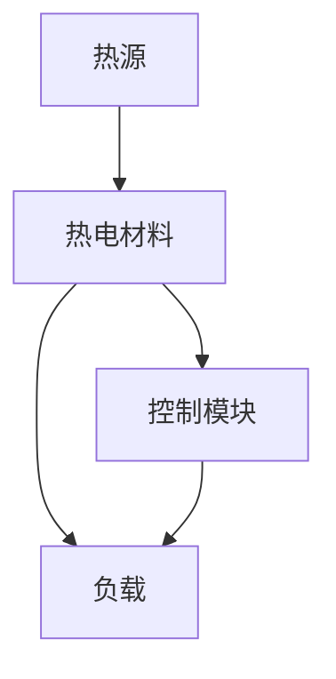

                 


# 价值投资中的新型高效热电转换材料技术

> 关键词：热电转换材料、价值投资、能源效率、可持续发展、热电系统优化

> 摘要：本文深入探讨了热电转换材料在能源领域的潜力及其在价值投资中的重要性。通过分析热电转换的核心原理、系统架构设计以及实际案例，本文为投资者提供了基于热电转换技术的新型投资机会和策略。

---

## 第1章: 热电转换材料的背景与价值

### 1.1 热电转换材料的背景
热电转换材料是一种能够将热能直接转化为电能的材料。随着能源需求的增加和化石燃料的枯竭，开发新型高效热电转换材料成为能源领域的研究热点。热电转换技术具有无污染、效率高的特点，尤其适用于工业废热回收和可再生能源利用。

### 1.2 热电转换材料的分类与特点
热电材料主要分为半导体型和金属型两类：
- **半导体型**：如碲化铋（Bi2Te3）和碲化镉（CdTe），具有较高的热电性能。
- **金属型**：如钨（W）和钼（Mo），适用于高温环境。

制备工艺包括粉末冶金、外延生长和溶胶-凝胶法等。

### 1.3 热电转换技术在价值投资中的应用前景
热电转换材料在能源领域具有巨大潜力，尤其是在工业废热回收和可再生能源利用方面。随着技术进步，热电转换效率将逐步提高，市场潜力巨大。投资者应关注高效热电材料的研发和产业化，布局相关领域以获取长期收益。

---

## 第2章: 热电转换的核心原理

### 2.1 热电效应的基本原理
热电效应是指材料在温差作用下产生电流的现象。其基本方程为：
$$ V = S \cdot \Delta T $$
其中，$S$是热电势，$\Delta T$是温差。

### 2.2 热电材料的性能参数
- **热导率（$\kappa$）**：材料的导热能力。
- **电导率（$\sigma$）**：材料的导电能力。
- **热电优值（$ZT$）**：衡量材料效率的指标，公式为：
$$ ZT = \frac{S^2 \Delta T}{\kappa} $$

### 2.3 热电转换的数学模型
热电转换系统的工作效率可以通过以下公式计算：
$$ \eta = \frac{ZT \cdot \Delta T}{1 + ZT \cdot \Delta T} $$

---

## 第3章: 热电转换系统的架构设计

### 3.1 热电转换系统的组成
系统主要包括热源、热电材料、负载和控制模块。热源提供热量，热电材料将热能转化为电能，负载消耗电能，控制模块调节系统运行。

### 3.2 系统架构图
使用Mermaid绘制系统架构图：


### 3.3 热电转换系统的优化设计
优化设计包括选择高效热电材料、优化热源温度和提高系统散热能力。

---

## 第4章: 项目实战与案例分析

### 4.1 项目环境与工具安装
- **开发环境**：Python 3.8及以上版本。
- **工具**：包括numpy、matplotlib和scipy库。

### 4.2 热电转换系统核心代码实现
```python
import numpy as np
import matplotlib.pyplot as plt

# 定义热电转换模型
def thermoelectric_conversion(S, delta_T):
    ZT = S**2 * delta_T
    eta = ZT / (1 + ZT)
    return eta

# 参数设置
S = 200  # 热电势，mV/K
delta_T = 100  # 温差，K

# 计算效率
eta = thermoelectric_conversion(S, delta_T)
print(f"热电转换效率为: {eta:.2f}%")

# 绘制效率曲线
delta_T_range = np.linspace(50, 200, 100)
eta_range = [thermoelectric_conversion(S, t) for t in delta_T_range]
plt.plot(delta_T_range, eta_range)
plt.xlabel('温差 (K)')
plt.ylabel('效率 (%)')
plt.show()
```

### 4.3 项目实现与结果分析
通过上述代码，可以计算不同温差下的热电转换效率，并绘制效率曲线。结果表明，随着温差的增加，效率逐渐提高，但在一定温差后效率趋于稳定。

---

## 第5章: 总结与展望

### 5.1 本书内容总结
本文详细介绍了热电转换材料的背景、核心原理、系统架构设计及实际应用案例。热电转换技术在能源领域具有广阔的应用前景。

### 5.2 未来发展方向
未来，热电转换材料的研究将重点放在提高材料效率、降低成本和扩大应用场景上。投资者应关注相关领域的技术创新和产业化进程。

---

## 作者：AI天才研究院 & 禅与计算机程序设计艺术

---

**注意事项**：
- 热电转换系统的效率受温差和材料性能的影响，实际应用中需综合考虑。
- 投资者应关注热电转换技术的最新研究进展，选择具有技术优势和市场潜力的项目进行投资。
- 本文内容基于现有研究，未来技术发展可能会进一步提升热电转换效率。

