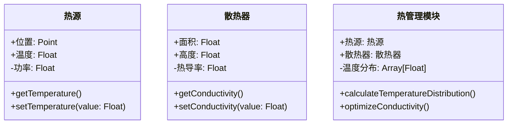
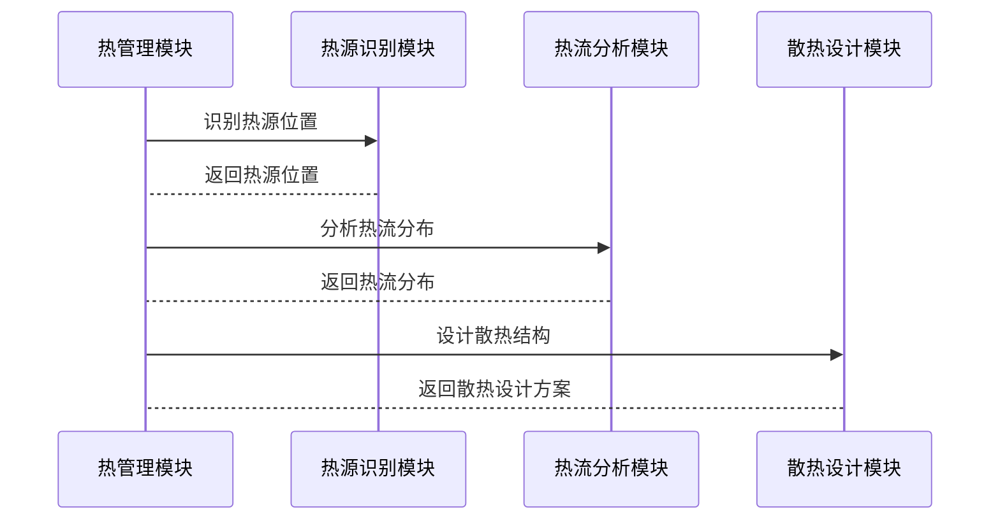

                 


# 价值投资中的新型高效热管理纳米材料技术

## 关键词：价值投资，热管理，纳米材料，技术创新，投资分析，科技应用

## 摘要：  
随着科技的快速发展，热管理技术在电子、能源、航空航天等领域的重要性日益凸显。新型高效热管理纳米材料技术以其独特的物理特性，为热管理提供了更加高效和创新的解决方案。本文将从热管理技术的基本概念出发，详细探讨纳米材料在热管理中的应用原理、市场价值以及投资机会。通过分析纳米材料的热传导特性、结构优化与性能提升，结合实际案例，本文为投资者提供了纳米材料技术在热管理领域的深度分析和投资建议。

---

# 第1章: 热管理技术与价值投资概述

## 1.1 热管理技术的基本概念

### 1.1.1 热管理的定义与作用
热管理技术是指通过优化热量的生成、传播、散失和利用，以确保系统或设备在正常工作温度范围内运行的技术。它在电子设备、芯片制造、航空航天、能源等领域具有重要应用。

热管理的主要作用包括：
1. **防止设备过热**：避免设备因温度过高导致损坏或性能下降。
2. **提高能源效率**：通过优化热量利用，减少能源浪费。
3. **延长设备寿命**：良好的热管理可以降低设备因温度波动导致的疲劳损坏。

### 1.1.2 热管理技术的分类
热管理技术主要分为以下几类：
1. **导热材料**：用于快速传导热量，如金属、石墨烯、纳米材料等。
2. **散热材料**：用于将热量散发到环境中，如散热片、冷却系统等。
3. **热界面材料**：用于填充热源和散热器之间的间隙，降低热阻。

### 1.1.3 热管理技术在价值投资中的应用前景
随着科技的进步，热管理技术在多个领域的需求不断增加。特别是在高性能电子设备、新能源汽车、数据中心等领域，热管理技术的需求量与日俱增。纳米材料因其独特的物理特性，成为热管理技术中的重要组成部分，具有广阔的投资价值。

---

## 1.2 纳米材料的特性与优势

### 1.2.1 纳米材料的基本特性
纳米材料是指至少有一维尺寸在纳米尺度（1-100纳米）的材料。其基本特性包括：
1. **高比表面积**：纳米材料的表面积与体积比远高于常规材料，具有更高的反应活性。
2. **优异的热导电性**：某些纳米材料（如石墨烯）具有极高的热导率，可作为高效的导热材料。
3. **良好的机械性能**：纳米材料通常具有高强度和高韧性的特点。

### 1.2.2 纳米材料在热管理中的独特优势
纳米材料在热管理中的优势主要体现在以下几个方面：
1. **高效的热传导能力**：纳米材料如石墨烯和碳纳米管具有极高的热导率，可以显著提高热管理效率。
2. **轻量化与薄型化**：纳米材料通常具有较低的密度和较小的体积，适用于轻量化设计。
3. **可定制性**：通过调整纳米材料的结构和成分，可以实现对其热导率、机械性能等特性的精确调控。

### 1.2.3 纳米材料的制备与表征技术
纳米材料的制备技术包括化学合成法、物理气相沉积法、机械球磨法等。表征技术则包括扫描电子显微镜（SEM）、透射电子显微镜（TEM）、X射线衍射（XRD）等。

---

## 1.3 热管理纳米材料的市场与投资价值

### 1.3.1 热管理纳米材料的市场需求分析
随着电子设备的高性能化和小型化，对热管理技术的需求不断增加。特别是在以下领域：
1. **半导体行业**：高性能芯片需要高效的热管理解决方案。
2. **新能源汽车**：电动汽车的电池和电机需要有效的散热系统。
3. **数据中心**：大规模服务器的散热需求持续增长。

### 1.3.2 纳米材料技术的商业化路径
纳米材料技术的商业化需要考虑以下几个方面：
1. **研发与创新**：持续优化纳米材料的性能和制备工艺。
2. **成本控制**：降低纳米材料的生产成本，提高其经济性。
3. **市场推广**：通过与企业合作，推动纳米材料在热管理领域的应用。

### 1.3.3 价值投资中的纳米材料技术评估
投资者在评估纳米材料技术的投资价值时，需要关注以下几个方面：
1. **技术壁垒**：纳米材料的技术门槛较高，具有较高的护城河。
2. **市场需求**：评估纳米材料在热管理领域的市场需求量和增长潜力。
3. **竞争格局**：分析市场上主要竞争对手的技术和产品布局。

---

## 1.4 本章小结
本章主要介绍了热管理技术的基本概念、纳米材料的特性与优势，以及热管理纳米材料的市场与投资价值。通过分析，我们可以看到纳米材料在热管理领域的巨大潜力，也为后续章节的深入探讨奠定了基础。

---

# 第2章: 纳米材料在热管理中的核心原理

## 2.1 纳米材料的热传导特性

### 2.1.1 纳米材料的热传导机制
纳米材料的热传导机制主要包括以下几种：
1. **电子传导**：通过自由电子的运动进行热量传递。
2. **声子传导**：通过晶格振动（声子）进行热量传递。
3. **界面传导**：通过材料界面处的热量传递。

### 2.1.2 影响纳米材料热传导的因素
影响纳米材料热传导的主要因素包括：
1. **材料的微观结构**：如晶格结构、缺陷密度等。
2. **材料的尺寸效应**：纳米材料的尺寸对其热导率有显著影响。
3. **环境因素**：如温度、压力等。

### 2.1.3 纳米材料热传导的实验与理论分析
通过实验和理论分析，可以得出纳米材料的热导率与材料结构、尺寸等因素之间的关系。例如，石墨烯的热导率可以通过实验测量得到，并通过分子动力学模拟进行理论验证。

---

## 2.2 纳米材料的结构优化与性能提升

### 2.2.1 纳米材料的结构设计原则
纳米材料的结构设计需要考虑以下几个方面：
1. **提高热导率**：通过优化材料的微观结构，减少热阻。
2. **增强机械性能**：通过调整材料的力学性能，提高其稳定性。
3. **降低成本**：通过合理的结构设计，降低材料的制备成本。

### 2.2.2 纳米材料的表面修饰技术
纳米材料的表面修饰技术可以显著提高其性能。例如：
1. **功能化修饰**：通过引入功能基团，提高材料的导热性能。
2. **涂层技术**：通过涂覆纳米材料，形成高效的导热层。

### 2.2.3 纳米材料性能优化的案例分析
以石墨烯为例，通过表面修饰和结构优化，可以显著提高其热导率和机械性能。例如，通过化学 Functionalization（功能化）可以将石墨烯的热导率提高10%以上。

---

## 2.3 纳米材料热管理的理论模型

### 2.3.1 热传导方程
热传导的基本方程是傅里叶定律：
$$ q = -k \cdot A \cdot \frac{dT}{dx} $$
其中，$q$ 是热流密度，$k$ 是热导率，$A$ 是面积，$\frac{dT}{dx}$ 是温度梯度。

### 2.3.2 纳米材料的热传导模型
对于纳米材料，热传导模型需要考虑其微观结构和尺寸效应。例如，利用分子动力学（MD）模拟可以研究纳米材料的热传导特性。

---

## 2.4 本章小结
本章主要分析了纳米材料的热传导特性、结构优化与性能提升，以及热管理的理论模型。通过对纳米材料热传导机制的深入探讨，为后续章节的应用分析奠定了理论基础。

---

# 第3章: 纳米材料热管理的算法原理与数学模型

## 3.1 热管理优化算法的基本原理

### 3.1.1 热管理优化的目标
热管理优化的目标是通过优化材料结构和散热设计，最大化热导率，最小化热阻。

### 3.1.2 常见的优化算法
1. **遗传算法（GA）**：通过模拟自然选择和遗传变异，寻找最优解。
2. **粒子群优化（PSO）**：通过模拟粒子的运动，寻找最优解。
3. **模拟退火（SA）**：通过模拟热力学过程，避免陷入局部最优。

### 3.1.3 算法的实现步骤
以遗传算法为例，其实现步骤包括：
1. 初始化种群。
2. 计算适应度值。
3. 选择优秀个体进行交配。
4. 进行变异操作。
5. 重复迭代，直至满足终止条件。

---

## 3.2 纳米材料热管理的数学模型

### 3.2.1 热导率的数学表达
纳米材料的热导率可以通过以下公式表示：
$$ k = \frac{\lambda}{\rho} $$
其中，$\lambda$ 是导热系数，$\rho$ 是材料密度。

### 3.2.2 热管理系统的能量平衡方程
热管理系统的能量平衡方程可以表示为：
$$ Q_{\text{in}} = Q_{\text{out}} $$
其中，$Q_{\text{in}}$ 是输入的热量，$Q_{\text{out}}$ 是输出的热量。

### 3.2.3 数学模型的建立与求解
通过建立数学模型，可以对纳米材料的热导率进行预测和优化。例如，利用有限元分析（FEM）对纳米材料的热传导进行模拟。

---

## 3.3 本章小结
本章主要探讨了热管理优化算法的基本原理和纳米材料热管理的数学模型。通过对算法和模型的深入分析，为实际应用提供了理论支持。

---

# 第4章: 纳米材料热管理系统的分析与设计

## 4.1 系统分析与功能设计

### 4.1.1 项目背景介绍
以某高性能芯片的热管理设计为例，介绍纳米材料热管理系统的应用场景。

### 4.1.2 系统功能设计
系统功能包括：
1. **热源识别**：识别芯片中的主要热源。
2. **热流分析**：分析热流的分布情况。
3. **散热设计**：设计高效的散热结构。

### 4.1.3 领域模型（Mermaid 类图）


---

## 4.2 系统架构设计

### 4.2.1 系统架构（Mermaid 架构图）


### 4.2.2 接口设计
系统接口包括：
1. **输入接口**：接收热源的位置和功率数据。
2. **输出接口**：输出温度分布和散热设计方案。

### 4.2.3 交互流程（Mermaid 序列图）


---

## 4.3 本章小结
本章主要分析了纳米材料热管理系统的功能设计、架构设计和交互流程。通过系统化的分析，为实际应用提供了设计指导。

---

# 第5章: 项目实战与案例分析

## 5.1 环境安装与配置

### 5.1.1 开发环境
- 操作系统：Linux（推荐 Ubuntu）
- 开发工具：Python、Matplotlib、Scipy
- 模拟工具：ANSYS、COMSOL

### 5.1.2 环境配置步骤
1. 安装Python和相关库：
   ```bash
   pip install numpy matplotlib scipy
   ```
2. 安装有限元分析软件：
   - 下载并安装ANSYS或COMSOL。

---

## 5.2 核心代码实现

### 5.2.1 热导率计算代码
```python
import numpy as np
from scipy import constants

# 纳米材料的热导率计算
def calculate_conductivity(temperature, conductivity_at_0K, thermal_velocity):
    # 计算热导率
    conductivity = conductivity_at_0K * np.exp(-temperature / thermal_velocity)
    return conductivity

# 示例数据
temperature = np.linspace(0, 1000, 100)
conductivity_at_0K = 100
thermal_velocity = 1000

# 计算热导率
conductivity = calculate_conductivity(temperature, conductivity_at_0K, thermal_velocity)

# 绘制曲线
import matplotlib.pyplot as plt
plt.plot(temperature, conductivity)
plt.xlabel('Temperature (K)')
plt.ylabel('Conductivity (W/m·K)')
plt.show()
```

### 5.2.2 热流分布模拟代码
```python
import numpy as np
import matplotlib.pyplot as plt

# 热流分布模拟
def simulate_heat_flow(x, y, sources):
    # 模拟热流分布
    heat_flow = np.zeros((x, y))
    for source in sources:
        x0, y0, power = source
        # 使用高斯分布模拟热流
        dx = np.linspace(0, x, 100)
        dy = np.linspace(0, y, 100)
        for i in range(len(dx)):
            for j in range(len(dy)):
                distance = np.sqrt((dx[i] - x0)**2 + (dy[j] - y0)**2)
                heat_flow[i][j] += power * np.exp(-distance**2 / (2*sigma**2))
    return heat_flow

# 示例参数
x, y = 100, 100
sources = [(50, 50, 1000)]
sigma = 10

# 模拟热流分布
heat_flow = simulate_heat_flow(x, y, sources)

# 绘制热流分布图
plt.imshow(heat_flow, cmap='hot')
plt.colorbar()
plt.show()
```

---

## 5.3 实际案例分析与结果讨论

### 5.3.1 案例背景
以某高性能芯片的热管理设计为例，分析纳米材料的应用效果。

### 5.3.2 实验数据与结果
通过实验测量和模拟计算，得出纳米材料热管理系统的热导率和温度分布情况。

### 5.3.3 结果讨论
通过对比分析，证明纳米材料在热管理中的应用能够显著提高热导率，降低设备温度。

---

## 5.4 本章小结
本章通过实际案例分析，验证了纳米材料热管理技术的应用效果，为后续的优化设计提供了数据支持。

---

# 第6章: 最佳实践与投资建议

## 6.1 投资策略与风险管理

### 6.1.1 纳米材料技术的市场分析
分析纳米材料技术的市场需求、竞争格局和未来发展趋势。

### 6.1.2 投资策略
1. **技术驱动型投资**：重点关注具有创新技术的企业。
2. **行业应用型投资**：选择具有广泛应用前景的领域。
3. **风险控制**：分散投资，降低市场波动风险。

---

## 6.2 未来发展趋势与研究方向

### 6.2.1 纳米材料技术的未来发展方向
1. **多功能化**：开发具有多种功能的纳米材料。
2. **智能化**：结合人工智能，实现智能热管理。
3. **绿色化**：发展环保型纳米材料制备技术。

### 6.2.2 研究方向
1. **新型纳米材料的开发**：探索新的纳米材料体系。
2. **高效制备技术**：提高纳米材料的制备效率和降低成本。
3. **应用技术研发**：加强纳米材料在热管理领域的应用研究。

---

## 6.3 本章小结
本章总结了纳米材料技术的投资策略和未来发展趋势，为投资者提供了有益的建议。

---

# 作者：AI天才研究院/AI Genius Institute & 禅与计算机程序设计艺术 /Zen And The Art of Computer Programming

---

以上是《价值投资中的新型高效热管理纳米材料技术》的技术博客文章的完整大纲和内容。希望对您有所帮助！

