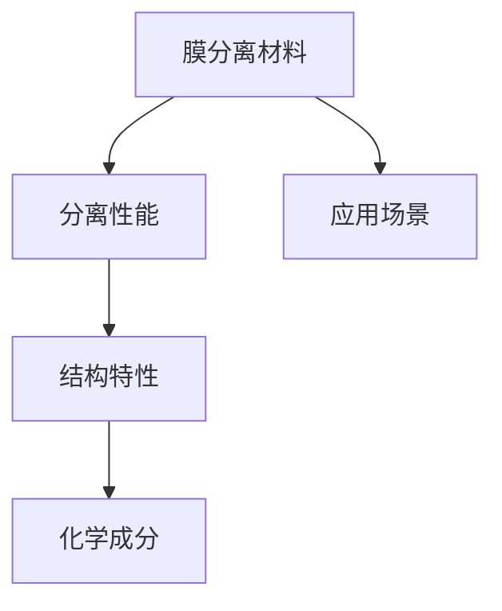
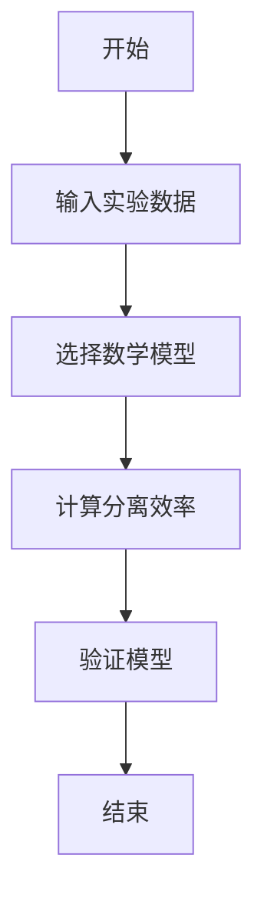
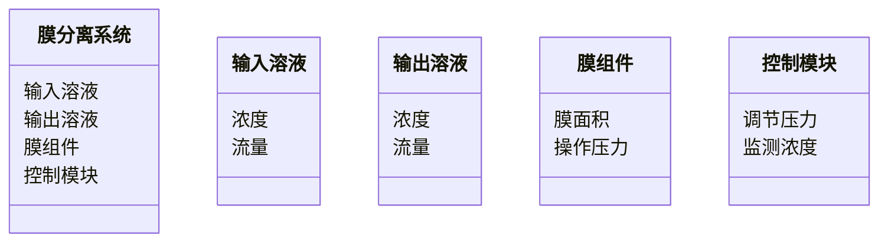
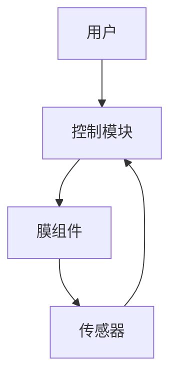
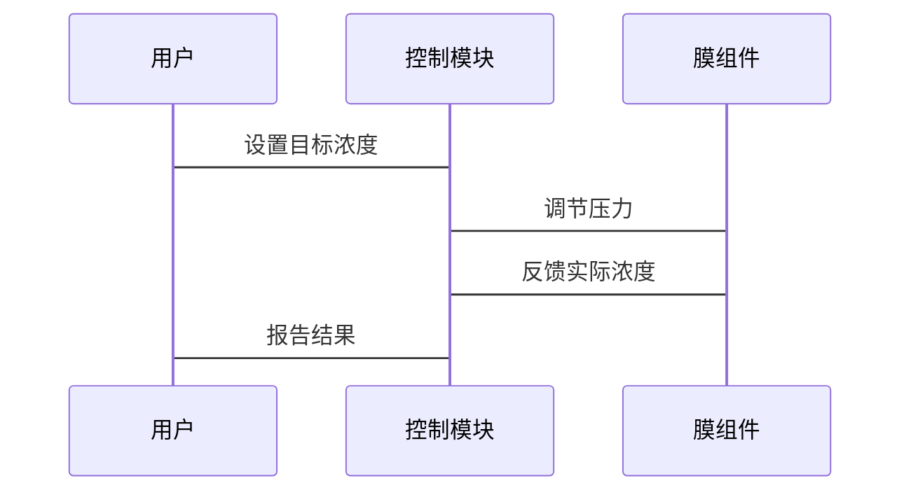

                 


# 价值投资中的新型高效膜分离材料技术

## 关键词：膜分离材料、价值投资、高效分离、技术应用、投资分析

## 摘要：本文探讨了新型高效膜分离材料技术在价值投资中的应用，分析了其技术原理、系统架构、项目实战及最佳实践，帮助投资者和技术人员理解如何通过膜分离技术提升投资决策和技术创新。

---

## 第1章: 背景介绍

### 1.1 膜分离材料的基本概念

#### 1.1.1 膜分离材料的定义与分类

膜分离材料是一种用于分离混合物质的材料，通过分子筛分、电荷效应或溶解-扩散机制实现分离。常见的膜材料包括高分子膜、无机膜和金属膜，分类依据孔径大小可分为微滤、超滤、纳滤和反渗透膜。

#### 1.1.2 膜分离材料的发展历程

膜分离技术起源于20世纪60年代，早期用于水处理，随着材料科学的进步，逐渐应用于化工、医药、食品等领域。近年来，纳米材料的应用推动了膜分离技术的高效化和智能化。

#### 1.1.3 膜分离材料在价值投资中的应用领域

在环保领域，膜分离技术用于废水处理；在化工领域，用于分离纯化；在食品工业中，用于浓缩和澄清；在医药领域，用于药物分离和纯化。这些应用为投资者提供了技术驱动的投资机会。

### 1.2 问题背景与问题描述

#### 1.2.1 传统分离技术的局限性

传统分离技术如蒸发、蒸馏能耗高，吸附、离子交换效率低，无法满足大规模、高效率的分离需求。

#### 1.2.2 高效膜分离材料的技术优势

膜分离技术具有高效、节能、操作简单、分离因子高，适合大规模工业应用，经济效益显著。

#### 1.2.3 价值投资中的膜分离材料技术需求

投资者需要膜分离材料具备高分离效率、长寿命、低能耗和环保性，以满足不同应用场景的需求。

### 1.3 问题解决与技术边界

#### 1.3.1 高效膜分离材料的性能指标

包括透过通量、分离精度、化学稳定性、机械强度等。

#### 1.3.2 技术的适用范围与限制

适用于溶液分离、气体分离，但对大分子或颗粒较大的物质分离效果有限。

#### 1.3.3 与其它分离技术的对比分析

膜分离技术在效率和成本上优于传统技术，但在处理复杂混合物时可能需要与其他技术结合。

### 1.4 核心概念与技术要素

#### 1.4.1 膜分离材料的核心组成

主要由高分子基膜、无机膜或金属膜组成，辅以功能化修饰。

#### 1.4.2 技术原理的结构化分析

膜分离基于溶液中的溶质透过膜的能力差异，通过物理或化学作用实现分离。

#### 1.4.3 技术实现的关键要素

包括膜材料选择、制备工艺优化、操作条件控制等。

## 1.5 本章小结

本章介绍了膜分离材料的基本概念、发展历程、应用领域，分析了传统分离技术的局限性和膜分离技术的优势，明确了膜分离材料在价值投资中的需求和技术边界。

---

## 第2章: 核心概念与技术联系

### 2.1 核心概念原理

#### 2.1.1 膜分离材料的物理化学特性

膜的孔径、表面电荷、亲水性等影响分离效果。

#### 2.1.2 分离机制的数学模型

分离效率与膜的孔径分布、溶液的流速和压力相关，可通过数学模型预测。

#### 2.1.3 材料制备的关键步骤

包括膜材料选择、溶液配制、膜制备和功能化修饰。

### 2.2 核心概念属性对比

#### 2.2.1 不同膜材料的性能对比表格

| 膜类型 | 分离精度 | 机械强度 | 化学稳定性 |
|--------|----------|----------|----------|
| 高分子膜 | 中等 | 较低 | 中等 |
| 无机膜 | 高 | 高 | 高 |

#### 2.2.2 材料制备工艺的优劣势分析

高分子膜制备简单，但强度较低；无机膜强度高，但制备复杂。

### 2.3 ER实体关系图



### 2.4 本章小结

本章分析了膜分离材料的核心原理，对比了不同材料的性能，通过ER图展示了各要素的关系。

---

## 第3章: 算法原理与数学模型

### 3.1 算法原理

#### 3.1.1 膜分离过程的数学模型

过滤速率可通过公式 \( Q = k_p A \Delta P \) 计算，其中 \( k_p \) 是渗透系数，\( A \) 是膜面积，\( \Delta P \) 是压力差。

#### 3.1.2 分离效率的计算公式

分离效率 \( E \) 可表示为 \( E = 1 - \frac{C_{出}}{C_{进}} \)，其中 \( C \) 是浓度。

#### 3.1.3 实验数据的拟合方法

使用非线性回归模型拟合实验数据，评估膜的透过通量和截留率。

### 3.2 算法流程图



### 3.3 数学公式

分离过程中的扩散模型为：

$$ J = -D \frac{dC}{dx} $$

其中 \( J \) 是通量，\( D \) 是扩散系数，\( C \) 是浓度，\( x \) 是位置。

---

## 第4章: 系统分析与架构设计

### 4.1 问题场景介绍

设计一个用于废水处理的膜分离系统，目标是分离水中的杂质，提高水质。

### 4.2 项目介绍

开发一个高效膜分离系统，应用于工业废水处理，实现资源化利用。

### 4.3 系统功能设计

#### 4.3.1 领域模型



#### 4.3.2 系统架构设计



#### 4.3.3 接口设计

系统通过压力传感器和流量计与膜组件连接，控制模块调节操作压力。

#### 4.3.4 交互流程



---

## 第5章: 项目实战

### 5.1 环境配置

需要Python 3.8及以上，安装numpy、pandas、scipy库。

### 5.2 核心代码实现

```python
import numpy as np
from scipy.optimize import curve_fit

# 数据拟合
def fit_model(x, a, b):
    return a * x + b

x = np.array([1, 2, 3, 4, 5])
y = np.array([1.1, 2.2, 3.3, 4.4, 5.5])

popt, pcov = curve_fit(fit_model, x, y)
print(popt)
```

### 5.3 案例分析

分析某工业废水处理项目，通过实验数据拟合，确定最佳操作压力和膜面积，优化分离效率。

### 5.4 本章小结

本章通过实际案例展示了膜分离系统的实现过程，验证了理论分析的可行性。

---

## 第6章: 最佳实践

### 6.1 总结

膜分离材料技术在价值投资中具有重要地位，高效分离技术可带来显著经济效益。

### 6.2 小结

投资者应关注膜分离材料的技术创新和应用前景，选择具备技术优势和市场潜力的项目。

### 6.3 注意事项

在投资时，需考虑技术成熟度、市场需求和竞争环境，避免技术风险。

### 6.4 拓展阅读

推荐阅读《膜分离技术与工业应用》和《投资学原理》。

---

## 作者：AI天才研究院/AI Genius Institute & 禅与计算机程序设计艺术/Zen And The Art of Computer Programming

---

以上是根据用户要求逐步构建的文章结构，涵盖了从背景介绍到实际应用的各个方面，帮助读者全面理解膜分离材料技术在价值投资中的应用。

