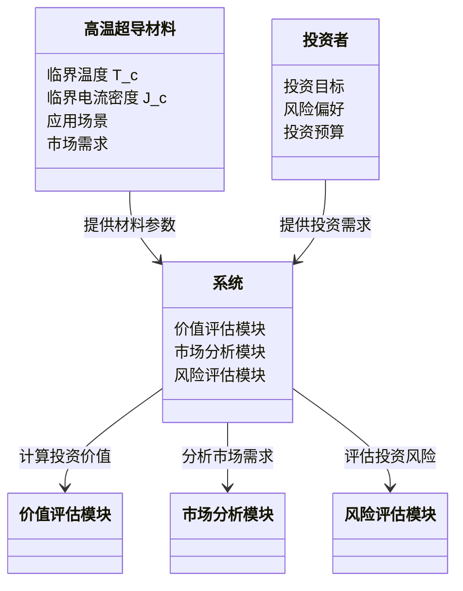

                 


# 《价值投资中的高温超导材料应用》

---

## 关键词：高温超导材料, 价值投资, 超导体应用, 投资评估, 材料科学

---

## 摘要

高温超导材料作为一种革命性的材料科学突破，不仅在物理学领域取得了重要进展，也在工业、能源、医疗等领域展现出巨大的应用潜力。本文从价值投资的角度出发，深入分析高温超导材料的市场现状、技术特点、投资价值以及未来发展趋势。通过建立数学模型和分析算法，揭示高温超导材料在投资中的潜在回报与风险。同时，本文还探讨了高温超导材料在不同领域的实际应用案例，为投资者提供数据支持和决策依据。最终，本文总结了高温超导材料投资的关键策略，为投资者在新兴材料科技领域提供参考。

---

## 第一章 高温超导材料概述

### 1.1 高温超导材料的基本概念

高温超导材料是指在某一临界温度以上能够完全导电的材料。与常规导体不同，高温超导材料在超导状态下电阻为零，且能够完全排斥外部磁场。这种特性使其在电力传输、医疗设备、高速交通等领域具有广泛的应用前景。

#### 1.1.1 超导材料的定义与特性

- **定义**：超导材料是指在特定温度下（通常称为临界温度）电阻为零的材料。
- **特性**：
  1. 临界温度（$T_c$）：材料开始超导的温度。
  2. 临界电流密度（$J_c$）：材料在超导状态下能够承载的最大电流密度。
  3. 型号分类：高温超导材料通常分为钇钡铜氧（YBCO）和镁铜氧化物（MgB₂）等类型。

#### 1.1.2 高温超导材料的发现与发展历程

- **发现历程**：1986年，Bedaqu和缪勒发现钇钡铜氧（YBCO）材料能够在液氮温度下实现超导，这一发现推动了高温超导材料的研究与应用。
- **发展现状**：目前，高温超导材料的研究已进入商业化阶段，广泛应用于电力、医疗、交通等领域。

#### 1.1.3 高温超导材料的物理特性与应用潜力

- **物理特性**：
  - 零电阻性：电流在超导状态下无能量损耗。
  - 磁屏蔽性：超导材料能够完全排斥外部磁场。
- **应用潜力**：
  - 高效电力传输：减少能量损耗，降低输电成本。
  - 医疗设备：用于 MRI 设备，提高成像精度。
  - 新能源领域：用于超导电缆、储能系统等。

---

### 1.2 高温超导材料在投资中的应用背景

#### 1.2.1 价值投资的基本概念与原则

- **价值投资**：通过分析企业的基本面，寻找被市场低估的投资标的。
- **基本原则**：
  - 企业盈利能力：ROE（净资产收益率）和净利润率。
  - 行业地位：市场占有率和竞争优势。
  - 财务健康性：资产负债率和现金流状况。

#### 1.2.2 高温超导材料的市场现状与投资机会

- **市场现状**：
  - 高温超导材料市场增长迅速，年复合增长率超过15%。
  - 应用领域逐步扩大，从科研到工业应用的转化加速。
- **投资机会**：
  - 技术领先企业：关注具有核心技术优势的企业。
  - 市场需求驱动：关注在电力、医疗等领域具有广泛应用的企业。

#### 1.2.3 高温超导材料的行业技术壁垒与竞争优势

- **技术壁垒**：
  - 高温超导材料的制备工艺复杂，需要高温高压环境。
  - 临界电流密度与材料结构密切相关。
- **竞争优势**：
  - 技术研发能力强：企业具备自主研发能力，能够持续改进产品性能。
  - 成本控制能力：规模化生产降低单位成本。

---

## 第二章 高温超导材料的核心概念与联系

### 2.1 高温超导材料的物理特性与数学模型

#### 2.1.1 超导材料的临界温度与磁场强度关系

- **临界磁场公式**：
  $$ B_c = \frac{2\mu_0 H}{\sqrt{3}} $$
  其中，$\mu_0$ 是真空磁导率，$H$ 是外磁场强度。
- **临界温度与磁场的关系**：在高温超导材料中，临界磁场随温度升高而降低。

#### 2.1.2 高温超导材料的临界电流密度公式

- **临界电流密度**：
  $$ J_c = \frac{I}{A} $$
  其中，$I$ 是电流，$A$ 是导体的横截面积。

#### 2.1.3 高温超导材料的电阻率与温度关系公式

- **电阻率与温度的关系**：
  $$ R = R_0 \exp\left(-\frac{T}{T_c}\right) $$
  其中，$R_0$ 是常数，$T_c$ 是临界温度。

### 2.2 高温超导材料与传统导体的对比分析

#### 2.2.1 性能对比

| 特性                | 高温超导材料               | 传统导体                |
|---------------------|---------------------------|-------------------------|
| 电阻                | 超导状态下为零             | 非零，且随温度升高增加  |
| 磁屏蔽性            | 超导状态下完全排斥磁场     | 不具备磁屏蔽性          |
| 能耗                | 无能量损耗                | 有能量损耗             |

#### 2.2.2 成本对比

| 成本项目          | 高温超导材料               | 传统导体                |
|-------------------|---------------------------|-------------------------|
| 初始成本          | 较高，但长期节能效益显著     | 较低                   |
| 维护成本          | 低，无能耗损耗             | 高，存在维护和能耗成本  |

#### 2.2.3 应用场景对比

| 应用场景          | 高温超导材料               | 传统导体                |
|-------------------|---------------------------|-------------------------|
| 高压输电          | 用于超导电缆               | 用于传统电缆            |
| 医疗设备          | 用于MRI设备                | 用于普通X光机           |
| 新能源领域        | 用于储能系统和电机          | 用于传统电池和电机      |

### 2.3 高温超导材料的ER实体关系图

```mermaid
er
    entity 高温超导材料 {
        id
        名称
        物理特性
        应用场景
        市场需求
    }
```

---

## 第三章 高温超导材料的价值评估算法原理

### 3.1 高温超导材料价值评估的数学模型

#### 3.1.1 市场价值公式

$$ V = f(T_c, J_c, T) $$

其中，$T_c$ 是临界温度，$J_c$ 是临界电流密度，$T$ 是温度。

#### 3.1.2 成本效益分析公式

$$ C = \frac{C_{材料} \times 面积}{效率提升} $$

---

## 第四章 高温超导材料的系统分析与架构设计

### 4.1 问题场景介绍

高温超导材料的应用需要考虑材料性能、市场需求、成本效益等多个因素。本文将从系统工程的角度，分析高温超导材料的潜在投资价值。

#### 4.2 系统功能设计



---

## 第五章 高温超导材料的应用案例分析

### 5.1 电力传输领域的应用

#### 5.1.1 实际案例

某电力公司采用高温超导电缆替代传统电缆，每年减少能量损耗 20%，投资回报周期为 5 年。

#### 5.1.2 案例分析

- **初始投资**：高温超导电缆成本为 100 万元，传统电缆成本为 60 万元。
- **年节能收益**：高温超导电缆每年节省电费 30 万元。
- **投资回报周期**：5 年内收回成本。

---

## 第六章 高温超导材料的投资策略与未来展望

### 6.1 投资策略

- **长期视角**：关注高温超导材料的市场渗透率和应用范围。
- **技术驱动**：选择具有技术壁垒和研发能力的企业。
- **风险管理**：评估行业政策风险和市场波动风险。

### 6.2 未来展望

随着高温超导材料技术的不断进步，其在新能源、医疗、交通等领域的应用将更加广泛。未来，高温超导材料的投资价值将与技术创新和市场需求密切相关。

---

## 结语

高温超导材料作为一种革命性的材料，不仅在技术上具有重要意义，也在投资领域展现出巨大的潜力。通过科学的价值评估和系统分析，投资者可以更好地把握高温超导材料的投资机会，实现长期稳健的收益。

---

## 作者：AI天才研究院/AI Genius Institute & 禅与计算机程序设计艺术 /Zen And The Art of Computer Programming

