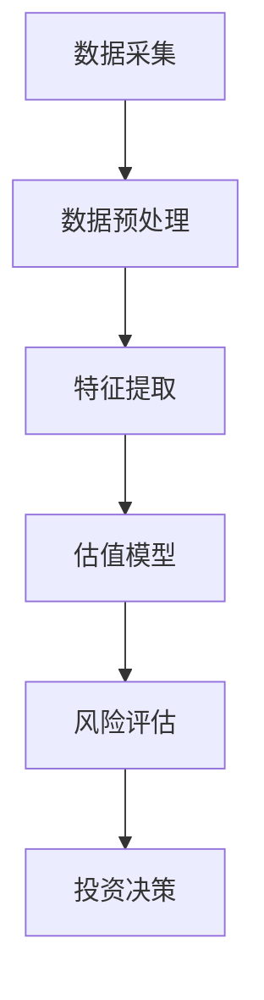

                 


# 价值投资中的新材料科技前景

## 关键词：新材料科技，价值投资，投资策略，产业链分析，股票筛选系统

## 摘要：  
本文探讨新材料科技在价值投资中的应用前景，分析新材料科技的核心概念、产业链结构、投资逻辑和策略。通过系统设计与实战项目，提供基于新材料科技的股票筛选系统实现，结合数学模型和算法，为投资者提供深度分析和决策支持。

---

## 第一部分：新材料科技与价值投资的背景与基础

### 第1章：新材料科技的定义与发展

#### 1.1 新材料科技的定义与分类
- **1.1.1 新材料的定义**  
  新材料是指具有优异性能或特殊功能，区别于传统材料的新型材料。其特性包括高强度、轻量化、耐高温、导电性等。

- **1.1.2 新材料的主要分类**  
  | 分类标准 | 分类类型                 | 典型材料举例                     |
  |----------|--------------------------|----------------------------------|
  | 成分     | 金属材料、无机非金属材料、有机高分子材料、复合材料 | 高强度铝合金、碳纤维复合材料 |
  | 结构     | 晶体材料、非晶材料        | 晶体硅、非晶硅                 |
  | 应用领域 | 纳米材料、智能材料        | 石墨烯、形状记忆合金           |

- **1.1.3 新材料科技的特征与优势**  
  - 高技术门槛：研发投入大，技术壁垒高。  
  - 市场需求广泛：应用于电子、汽车、能源等领域。  
  - 创新驱动：新材料的研发往往推动技术进步。

#### 1.2 价值投资的基本概念
- **1.2.1 价值投资的核心理念**  
  价值投资强调以低于内在价值的价格买入优质资产，长期持有的投资策略。其核心在于寻找市场低估的企业。

- **1.2.2 价值投资的三大核心要素**  
  - 企业质量：包括护城河、竞争优势。  
  - 估值水平：市盈率、市净率等指标。  
  - 安全边际：买入价格与内在价值的差距。

- **1.2.3 价值投资与成长投资的区别**  
  | 方面         | 价值投资              | 成长投资              |
  |--------------|-----------------------|-----------------------|
  | 核心理念     | 买入低估资产          | 投资高增长企业        |
  | 关注点       | 估值、股息率          | 收益增长、ROE         |
  | 风险承受度   | 较低                  | 较高                  |

#### 1.3 新材料科技与价值投资的结合
- **1.3.1 新材料科技在投资中的重要性**  
  新材料科技企业的技术优势和市场地位是其核心竞争力。

- **1.3.2 新材料科技企业的核心竞争力**  
  - 技术壁垒：专利数量、研发团队。  
  - 市场份额：行业龙头企业的定价权。  
  - 产品替代性：独特性能带来的竞争优势。

- **1.3.3 新材料科技行业的周期性与波动性**  
  行业周期性：受宏观经济影响，波动性较大。  
  波动性来源：技术创新、政策变化、市场需求波动。

### 第2章：新材料科技的核心概念与投资逻辑

#### 2.1 新材料科技的核心概念
- **2.1.1 新材料科技的关键技术领域**  
  包括纳米材料、复合材料、生物材料、能源材料等。

- **2.1.2 新材料科技的技术壁垒**  
  | 技术壁垒 | 影响               |
  |----------|--------------------|
  | 专利     | 技术垄断           |
  | 工艺     | 生产成本控制       |
  | 设备     | 技术升级门槛       |

- **2.1.3 新材料科技的市场空间与天花板**  
  市场需求：新能源汽车、5G、半导体等领域的需求增长。  
  市场天花板：技术创新带来的应用拓展。

#### 2.2 价值投资中的核心概念
- **2.2.1 企业的护城河与竞争优势**  
  | 护城河类型 | 描述               | 新材料科技企业的例子         |
  |------------|--------------------|-----------------------------|
  | 技术      | 核心技术专利       | 石墨烯制备技术               |
  | 市场      | 领先的市场份额     | 高端芯片材料供应商           |
  | 成本      | 规模效应降低成本   | 大型材料制造企业             |

- **2.2.2 企业的财务健康状况**  
  关键指标：ROE（净资产收益率）、毛利率、现金流。

- **2.2.3 企业的管理团队与治理结构**  
  能否吸引和留住优秀人才，治理结构是否透明高效。

#### 2.3 新材料科技与价值投资的结合点
- **2.3.1 新材料科技企业的成长性分析**  
  市场需求增长带来的收入增长潜力。

- **2.3.2 新材料科技企业的估值方法**  
  - 市盈率法：市盈率 = 股价 / 每股净利润。  
  - 现金流折现法：DCF模型，计算未来现金流的现值。

- **2.3.3 新材料科技企业的风险与机遇**  
  - 风险：技术替代、政策变化。  
  - 机遇：技术升级、市场需求增长。

### 第3章：新材料科技的产业链分析

#### 3.1 新材料科技的产业链结构
- **3.1.1 上游原材料与关键设备**  
  包括基础金属、非金属矿物等原材料，以及专用设备。

- **3.1.2 中游新材料的制备与加工**  
  包括合成、加工、改性等过程。

- **3.1.3 下游应用领域与市场需求**  
  - 汽车行业：轻量化材料需求。  
  - 半导体行业：高纯度材料需求。  
  - 能源行业：新型电池材料需求。

#### 3.2 新材料科技产业链中的投资机会
- **3.2.1 上游原材料的投资机会**  
  - 技术门槛低，但需求稳定。  
  - 例子：稀土永磁材料供应商。

- **3.2.2 中游新材料制备企业的投资机会**  
  - 技术密集型，进入壁垒高。  
  - 例子：锂电池正极材料制造商。

- **3.2.3 下游应用领域的企业投资机会**  
  - 需求驱动型，市场空间大。  
  - 例子：新能源汽车制造商。

---

## 第二部分：价值投资中的新材料科技投资策略

### 第4章：新材料科技行业的周期性与波动性

#### 4.1 新材料科技行业的周期性
- 行业周期与宏观经济的关系：宏观经济波动影响需求。  
- 技术周期：技术创新驱动行业增长。

#### 4.2 新材料科技行业的波动性
- 价格波动：原材料价格波动影响成本。  
- 技术风险：技术替代的风险。  
- 政策风险：政策变化影响市场需求。

### 第5章：价值投资中的新材料科技投资逻辑

#### 5.1 核心竞争力分析
- 技术壁垒：企业的专利数量、技术先进性。  
- 市场地位：市场份额、客户黏性。  
- 财务状况：盈利能力、现金流情况。

#### 5.2 估值与安全边际
- 市盈率法：合理市盈率区间。  
- 现金流折现法：DCF模型计算内在价值。  
- 安全边际：买入价格与内在价值的差距。

#### 5.3 风险管理
- 分散投资：避免过度集中。  
- 持股期限：长期持有优质资产。  
- 定期复盘：跟踪企业基本面变化。

### 第6章：新材料科技投资的案例分析

#### 6.1 案例一：锂电池正极材料企业
- 企业分析：技术领先，市场需求增长。  
- 估值：市盈率法与DCF模型结合。  
- 投资决策：买入并持有。

#### 6.2 案例二：稀土永磁材料企业
- 企业分析：上游资源控制，技术领先。  
- 估值：市净率法与DCF模型结合。  
- 投资决策：买入并持有。

---

## 第三部分：系统设计与实现

### 第7章：基于新材料科技的股票筛选系统

#### 7.1 系统架构设计


#### 7.2 核心算法实现
- **特征提取算法**：基于财务指标和市场指标的特征工程。
- **估值模型**：改进的DCF模型，结合行业特点。

#### 7.3 代码实现
```python
def calculate_intrinsic_value(revenue, growth_rate, discount_rate, cost_of_equity):
    # 计算自由现金流
    FCFF = revenue * (1 - growth_rate)
    # 折现
    present_value = FCFF / (1 + discount_rate)
    # 计算内在价值
    return present_value / cost_of_equity
```

#### 7.4 系统实现步骤
1. 数据采集：获取新材料科技企业的财务数据和市场数据。  
2. 数据预处理：清洗数据，处理缺失值。  
3. 特征提取：提取关键财务指标和市场指标。  
4. 估值模型：应用DCF模型计算内在价值。  
5. 风险评估：评估企业的技术风险和市场风险。  
6. 投资决策：基于估值和风险评估结果，给出投资建议。

---

## 第四部分：实战项目

### 第8章：新材料科技股票筛选系统实战

#### 8.1 环境搭建
- 安装Python、Pandas、NumPy、Scikit-learn等库。

#### 8.2 数据处理
- 数据来源：股票数据API（如Yahoo Finance）。  
- 数据清洗：处理缺失值和异常值。

#### 8.3 模型实现
```python
import pandas as pd
import numpy as np

# 假设data是一个包含新材料科技企业的数据框
def calculate_dcf(data):
    # 假设增长率和贴现率
    growth_rate = 0.05
    discount_rate = 0.10
    # 计算自由现金流
    FCFF = data['Revenue'] * (1 - growth_rate)
    # 计算现值
    present_value = FCFF / (1 + discount_rate)
    # 计算内在价值
    intrinsic_value = present_value / data['Cost of Equity']
    return intrinsic_value

# 应用DCF模型
intrinsic_values = calculate_dcf(data)
```

#### 8.4 结果分析
- 分析筛选结果：找出内在价值高于当前股价的企业。  
- 可视化展示：绘制股价与内在价值对比图。

#### 8.5 系统优化
- 调整模型参数：优化增长率和贴现率。  
- 增加更多特征：引入更多财务指标和市场指标。

---

## 第五部分：总结与展望

### 第9章：总结与展望

#### 9.1 全文总结
- 新材料科技在价值投资中具有重要地位。  
- 系统化的方法可以提高投资效率和准确性。

#### 9.2 未来展望
- 技术进步将继续推动新材料科技的发展。  
- 投资策略将更加依赖数据驱动的决策支持系统。

### 9.3 投资建议
- 关注具有强大技术壁垒的企业。  
- 合理估值，控制风险。  
- 长期持有优质资产。

### 9.4 注意事项
- 风险管理是投资成功的关键。  
- 定期复盘，调整投资组合。

### 9.5 拓展阅读
- 建议阅读《价值投资实战》和《新材料科技前沿》。

---

## 作者：AI天才研究院/AI Genius Institute & 禅与计算机程序设计艺术 /Zen And The Art of Computer Programming

