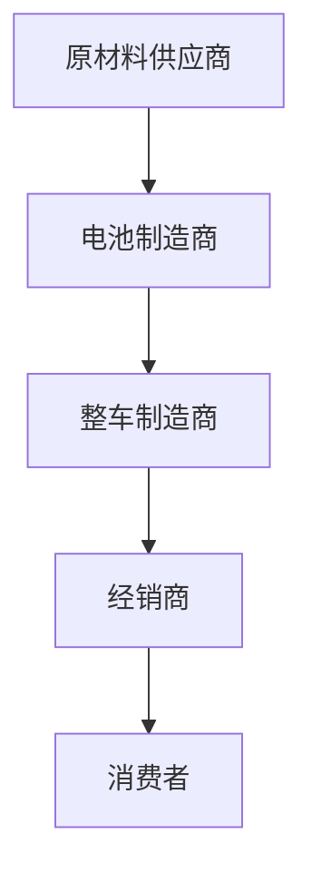
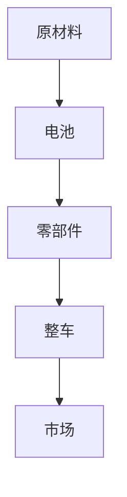

                 


# 价值投资中的新能源汽车产业链分析

> 关键词：价值投资、新能源汽车、产业链分析、投资策略、系统架构

> 摘要：本文从价值投资的角度，全面分析新能源汽车产业链的结构、核心驱动因素及投资策略。通过系统架构设计和实际案例分析，揭示新能源汽车产业链的价值评估方法和投资组合优化策略。

---

# 第1章: 价值投资与新能源汽车产业链的背景介绍

## 1.1 价值投资的核心概念

### 1.1.1 价值投资的定义与特点

价值投资是一种以基本面分析为基础的投资方法，强调以低于内在价值的价格购买优质资产。其核心理念是通过深入研究企业的财务状况、行业地位和竞争优势，找到被市场低估的投资标的。

- **定义**：价值投资关注企业的内在价值，而非市场的短期波动。
- **特点**：
  - 长期视角
  - 侧重基本面分析
  - 寻找市场低估的投资机会

### 1.1.2 新能源汽车行业的崛起背景

新能源汽车行业是近年来全球经济发展的重要驱动力，主要得益于以下几个方面：

- **环保政策支持**：全球范围内对碳排放的限制推动了新能源汽车的发展。
- **技术进步**：电池技术的提升显著降低了新能源汽车的成本。
- **市场需求增长**：消费者对环保和智能化的需求增加，推动了新能源汽车的普及。

### 1.1.3 价值投资与新能源汽车行业的结合

价值投资在新能源汽车行业的应用主要体现在以下几个方面：

- **行业趋势分析**：通过研究行业发展趋势，识别具有长期增长潜力的企业。
- **企业竞争优势分析**：评估企业的技术、成本、市场占有率等核心竞争力。
- **估值分析**：通过市盈率、市净率等指标，寻找被市场低估的投资标的。

---

## 1.2 新能源汽车产业链的结构与特点

### 1.2.1 新能源汽车产业链的定义

新能源汽车产业链是指从原材料供应到整车制造，再到销售和服务的完整生产链条。其核心环节包括：

1. **上游**：原材料供应（如锂、镍、钴等金属）、电池生产。
2. **中游**：零部件制造（如电机、电控系统）和整车制造。
3. **下游**：销售网络和售后服务。

### 1.2.2 产业链的主要环节与参与者

- **上游**：原材料供应商、电池制造商。
- **中游**：零部件供应商、整车制造商。
- **下游**：经销商、消费者。

### 1.2.3 新能源汽车产业链的核心驱动因素

- **技术创新**：电池技术、电机技术的进步直接影响产业链的发展。
- **政策支持**：政府的补贴政策、税收优惠等对行业有重要推动作用。
- **市场需求**：消费者对新能源汽车的接受度和购买力是行业发展的关键。

---

## 1.3 本章小结

本章介绍了价值投资的核心概念和新能源汽车产业链的基本结构，强调了两者的结合点。通过分析行业趋势和产业链的驱动因素，为后续的价值投资分析奠定了基础。

---

# 第2章: 新能源汽车产业链的核心概念与联系

## 2.1 产业链各环节的核心要素

### 2.1.1 上游：原材料与电池技术

- **原材料**：锂、镍、钴等金属是电池生产的上游原材料。
- **电池技术**：电池的能量密度和成本是影响整个产业链的关键因素。

### 2.1.2 中游：零部件与整车制造

- **零部件**：电机、电控系统等是新能源汽车的核心部件。
- **整车制造**：整车厂商的市场地位和技术水平直接影响产业链的竞争力。

### 2.1.3 下游：销售与服务

- **销售网络**：经销商的覆盖范围和服务能力影响市场需求。
- **售后服务**：充电站建设、电池更换等服务是产业链的重要组成部分。

---

## 2.2 产业链的关键驱动因素分析

### 2.2.1 技术创新对产业链的影响

- 技术进步可以降低生产成本，提高产品质量。
- 例如，电池技术的突破可以显著提升新能源汽车的续航能力和降低成本。

### 2.2.2 政策支持与市场需求的关系

- **政策支持**：政府的补贴政策直接推动了行业的快速发展。
- **市场需求**：消费者对新能源汽车的接受度是行业发展的关键。

### 2.2.3 供应链稳定性与成本控制

- 供应链的稳定性直接影响生产成本和交货周期。
- 成本控制是企业竞争力的重要体现。

---

## 2.3 产业链的实体关系图

使用 Mermaid 绘制产业链实体关系图：



---

## 2.4 本章小结

本章详细分析了新能源汽车产业链的各个环节及其核心要素，并通过实体关系图展示了产业链的结构和关系。强调了技术创新、政策支持和成本控制对产业链的重要性。

---

# 第3章: 新能源汽车产业链的系统分析与架构设计

## 3.1 产业链系统分析

### 3.1.1 产业链的系统构成

- **系统构成**：原材料供应、电池生产、零部件制造、整车制造、销售服务。
- **系统运行机制**：从原材料到整车交付的完整流程。

### 3.1.2 产业链的运行机制

- **原材料供应**：上游供应商提供锂、镍等原材料。
- **电池生产**：电池制造商将原材料转化为电池产品。
- **整车制造**：整车厂商整合零部件和电池，生产新能源汽车。
- **销售服务**：经销商将整车交付给消费者，并提供售后服务。

### 3.1.3 产业链的协同效应

- **协同效应**：产业链各环节的协同合作可以降低成本，提高效率。

---

## 3.2 产业链的架构设计

### 3.2.1 产业链的层次结构

- **上游**：原材料供应和电池生产。
- **中游**：零部件制造和整车制造。
- **下游**：销售和服务。

### 3.2.2 产业链的关键节点分析

- **关键节点**：电池生产、整车制造、销售网络。

### 3.2.3 产业链的优化策略

- **优化策略**：加强供应链管理，提升技术水平，拓展销售网络。

---

## 3.3 产业链的系统架构图

使用 Mermaid 绘制系统架构图：



---

## 3.4 本章小结

本章通过系统分析和架构设计，明确了新能源汽车产业链的结构和运行机制，并提出了优化策略。

---

# 第4章: 新能源汽车产业链的价值评估与投资策略

## 4.1 产业链价值评估方法

### 4.1.1 市盈率与市净率分析

- **市盈率（P/E）**：用于衡量企业的估值水平。
- **市净率（P/B）**：用于衡量企业的资产价值。

### 4.1.2 赢利能力分析

- **净利润率**：衡量企业的盈利能力。
- **ROE（净资产收益率）**：衡量企业的资产使用效率。

### 4.1.3 成长能力分析

- **收入增长率**：衡量企业的成长潜力。
- **净利润增长率**：衡量企业的盈利能力增长。

---

## 4.2 投资策略与组合构建

### 4.2.1 产业链投资的多维度分析

- **技术壁垒**：企业的技术优势。
- **成本优势**：企业的生产成本控制能力。
- **市场地位**：企业的市场份额和品牌影响力。

### 4.2.2 投资组合的优化配置

- **分散投资**：通过投资不同环节的企业降低风险。
- **重点配置**：集中投资于具有竞争优势的企业。

### 4.2.3 风险管理与收益平衡

- **风险管理**：通过设定止损点和分散投资降低风险。
- **收益平衡**：在风险可控的前提下追求最大收益。

---

## 4.3 本章小结

本章通过分析产业链的价值评估方法和投资策略，提出了如何在新能源汽车产业链中进行有效投资的建议。

---

# 第5章: 新能源汽车产业链的项目实战

## 5.1 环境搭建

### 5.1.1 安装必要的工具

- **Python**：用于数据分析和建模。
- **Jupyter Notebook**：用于数据可视化和分析。

### 5.1.2 数据来源

- **公开数据**：如上市公司财报、行业报告。
- **爬虫数据**：从互联网获取新能源汽车产业链的相关数据。

---

## 5.2 系统核心实现源代码

### 5.2.1 数据分析代码

```python
import pandas as pd
import numpy as np

# 示例数据：新能源汽车产业链企业的财务数据
data = {
    '公司': ['A公司', 'B公司', 'C公司'],
    '市盈率': [15, 20, 25],
    '市净率': [2, 3, 4],
    '净利润率': [5, 8, 10],
    '收入增长率': [10, 15, 20]
}

df = pd.DataFrame(data)
print(df)
```

### 5.2.2 估值模型代码

```python
def calculate_intrinsic_value(eps, growth_rate, required_return):
    # 简单的内在价值计算公式
    return eps * (1 + growth_rate) / (required_return - growth_rate)

# 示例计算
eps = 5
growth_rate = 0.2
required_return = 0.1

intrinsic_value = calculate_intrinsic_value(eps, growth_rate, required_return)
print(f"内在价值: {intrinsic_value}")
```

---

## 5.3 案例分析与解读

### 5.3.1 案例分析

假设我们选择一家新能源汽车电池制造商进行分析：

- **公司名称**：A公司
- **市盈率**：15
- **市净率**：2
- **净利润率**：5%
- **收入增长率**：20%

### 5.3.2 分析解读

- **估值分析**：市盈率较低，说明公司可能被市场低估。
- **成长性分析**：收入增长率较高，说明公司具有较好的成长潜力。

---

## 5.4 本章小结

本章通过实际案例分析，展示了如何在新能源汽车产业链中进行具体的投资分析和决策。

---

# 第6章: 总结与展望

## 6.1 总结

本文从价值投资的角度，全面分析了新能源汽车产业链的结构、核心驱动因素和投资策略。通过系统架构设计和实际案例分析，揭示了新能源汽车产业链的价值评估方法和投资组合优化策略。

## 6.2 展望

随着技术的进步和政策的支持，新能源汽车产业链将继续保持快速发展。未来，价值投资者需要更加关注技术创新、成本控制和市场需求的变化，以抓住投资机会。

---

# 作者

作者：AI天才研究院/AI Genius Institute & 禅与计算机程序设计艺术 /Zen And The Art of Computer Programming

