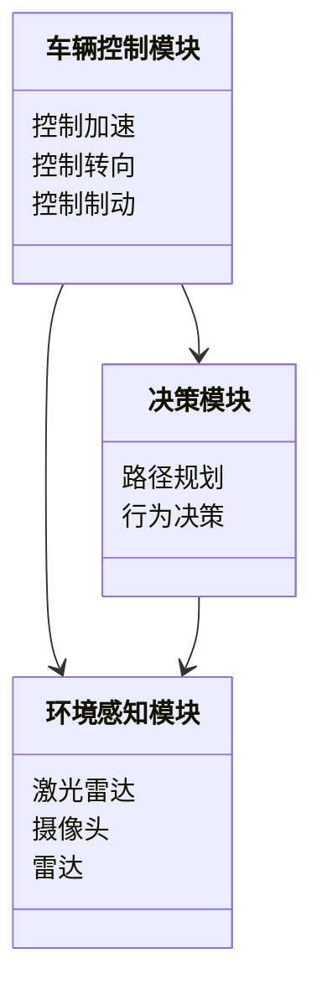
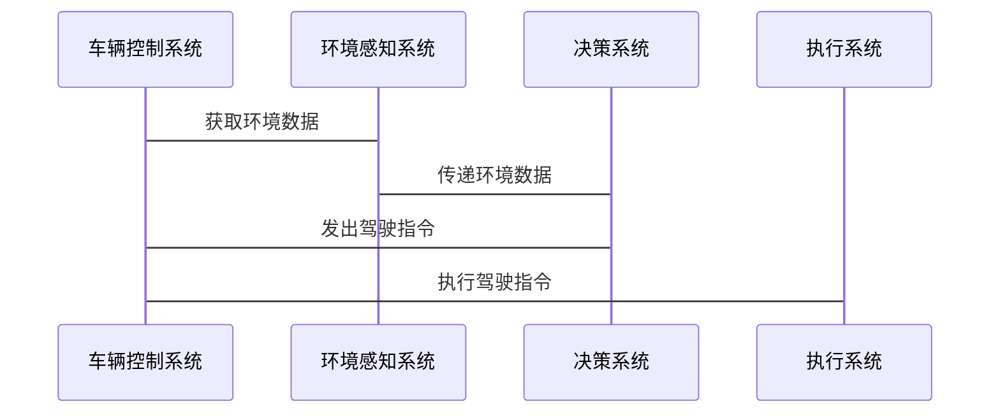

                 


# 价值投资中的无人驾驶技术前景

## 关键词
无人驾驶技术、价值投资、市场分析、技术评估、投资策略、算法原理、系统架构

## 摘要
无人驾驶技术作为一项革命性的技术创新，正在迅速改变交通运输行业。本文将深入分析无人驾驶技术的核心概念、市场前景、技术评估方法以及投资策略。通过详细的技术分析和价值评估模型，结合实际案例分析，为投资者提供科学的决策支持。文章最后总结了无人驾驶技术投资的关键点和未来趋势。

---

# 第1章：无人驾驶技术的定义与发展

## 1.1 无人驾驶技术的定义与核心要素

### 1.1.1 无人驾驶技术的基本概念
无人驾驶技术（Autonomous Driving Technology）是指通过先进的传感器、计算机视觉、人工智能和通信技术，使车辆能够感知环境并自主完成驾驶任务的技术。无人驾驶的核心目标是实现车辆的完全自动化，从无干预（L0）到全自动驾驶（L5）的五个级别。

### 1.1.2 无人驾驶技术的核心组成
无人驾驶技术主要由以下三个系统组成：
1. **感知系统**：通过激光雷达（LiDAR）、摄像头、雷达和超声波传感器等设备，实时感知车辆周围的环境信息。
2. **决策系统**：基于感知数据，利用算法进行路径规划、行为决策和风险评估，生成驾驶指令。
3. **执行系统**：根据决策系统的指令，控制车辆的加速、转向和制动等操作。

### 1.1.3 无人驾驶技术的分类与应用场景
无人驾驶技术根据自动化程度分为五个级别：
1. **L0：无自动化**：完全依赖驾驶员操作。
2. **L1：驾驶辅助**：部分功能自动化，如自适应巡航控制。
3. **L2：部分自动驾驶**：同时控制转向和加减速，但驾驶员仍需监控环境。
4. **L3：有条件自动驾驶**：车辆在特定条件下可以完全自动驾驶，但驾驶员需要随时准备接管。
5. **L4：高度自动驾驶**：车辆在大多数条件下可以自动驾驶，无需驾驶员干预。
6. **L5：完全自动驾驶**：车辆在所有条件下都可以自动驾驶，无需驾驶员。

无人驾驶技术广泛应用于乘用车、商用车、物流机器人等领域。

---

## 1.2 价值投资的基本概念与方法

### 1.2.1 价值投资的定义与核心理念
价值投资是一种投资策略，核心理念是通过深入分析企业的基本面，寻找市场价格低于其内在价值的投资机会。价值投资强调长期视角，关注企业的盈利能力、成长性和竞争优势。

### 1.2.2 价值投资的核心要素与分析框架
价值投资的分析框架包括以下几个方面：
1. **企业基本面分析**：包括收入、利润、资产负债表和现金流等财务指标。
2. **行业地位分析**：包括企业的市场份额、竞争优势和行业发展趋势。
3. **管理团队分析**：包括管理团队的能力、经验和战略规划。
4. **估值分析**：通过市盈率、市净率等指标评估企业的市场价格是否合理。

### 1.2.3 价值投资在技术领域的应用
在技术领域，价值投资需要结合技术创新的能力和市场的商业化潜力。投资者需要评估技术的先进性、可扩展性和盈利能力，同时关注企业的研发投入、技术团队和专利布局。

---

# 第2章：无人驾驶技术的市场价值与投资前景

## 2.1 无人驾驶技术的市场现状与发展趋势

### 2.1.1 无人驾驶技术的全球发展概况
无人驾驶技术在全球范围内快速发展，主要由美国、中国、欧洲等地区的科技公司和汽车制造商推动。中国在政策支持和市场需求的双重驱动下，成为无人驾驶技术的重要市场。

### 2.1.2 无人驾驶技术的主要应用场景
1. **乘用车**：无人驾驶技术正在逐步应用于私家车，从L2到L5的级别逐渐普及。
2. **商用车**：无人驾驶卡车、公交车和物流车在特定场景下已经开始商业化应用。
3. **特种车辆**：无人驾驶技术应用于矿山、港口和机场等特定场景的特种车辆。

### 2.1.3 无人驾驶技术的未来发展趋势
1. **技术融合**：无人驾驶技术将与5G、人工智能和物联网等技术深度融合。
2. **政策支持**：各国政府将继续出台支持无人驾驶技术的政策和法规。
3. **商业化加速**：无人驾驶技术将在特定场景下逐步实现商业化，逐步向更高级别扩展。

---

## 2.2 无人驾驶技术的投资价值分析

### 2.2.1 无人驾驶技术的核心竞争力分析
1. **技术先进性**：企业是否拥有领先的核心技术，如感知算法、决策系统和执行系统。
2. **市场布局**：企业是否具备完整的产业链布局，包括硬件、软件和数据。
3. **商业化能力**：企业是否具备将技术转化为商业价值的能力。

### 2.2.2 无人驾驶技术的市场潜力与投资机会
1. **乘用车市场**：无人驾驶技术的普及将推动高端乘用车市场的增长。
2. **商用车市场**：无人驾驶技术在物流、公共交通等领域的应用将带来巨大的市场潜力。
3. **技术服务商**：提供无人驾驶技术解决方案的企业也将迎来投资机会。

### 2.2.3 无人驾驶技术的长期价值与风险评估
1. **长期价值**：无人驾驶技术将彻底改变交通运输行业，带来巨大的社会和经济效益。
2. **主要风险**：技术瓶颈、政策不确定性、市场竞争和网络安全风险。

---

# 第3章：无人驾驶技术的关键技术分析

## 3.1 感知系统

### 3.1.1 激光雷达（LiDAR）技术
激光雷达通过发射激光并接收反射信号，构建环境的三维点云模型。LiDAR是无人驾驶技术的核心传感器之一。

**LiDAR的工作原理：**
1. 激光发射器发射激光脉冲。
2. 接收器接收反射信号。
3. 通过三角测距计算物体的距离和位置。

**LiDAR的优势：**
1. 高精度：LiDAR可以提供高精度的三维数据。
2. 抗光照干扰：LiDAR可以在强光或弱光条件下工作。

**LiDAR的局限性：**
1. 成本高：LiDAR设备价格昂贵。
2. 环境适应性：在雨雪天气下性能会下降。

### 3.1.2 摄像头与视觉识别技术
摄像头通过捕获环境图像，利用计算机视觉技术进行目标检测、语义分割和场景理解。

**计算机视觉技术：**
1. 目标检测：识别图像中的物体（如行人、车辆）。
2. 语义分割：分割图像中的每个像素，并标注其类别。
3. 场景理解：理解场景中的物体关系和上下文信息。

### 3.1.3 雷达与超声波传感器技术
雷达和超声波传感器用于检测车辆周围的障碍物和距离信息。

**雷达技术：**
1. 使用无线电波检测物体。
2. 适用于长距离检测。

**超声波传感器技术：**
1. 使用超声波检测物体。
2. 适用于短距离检测。

---

## 3.2 决策系统

### 3.2.1 路径规划算法
路径规划算法用于规划车辆的行驶路径，确保车辆安全到达目标位置。

**路径规划算法：**
1. **A*算法**：一种经典的路径规划算法，适用于静态环境。
2. **RRT算法**：用于动态环境的路径规划。
3. **Dijkstra算法**：用于图中的最短路径规划。

### 3.2.2 行为决策算法
行为决策算法用于在复杂环境中做出驾驶决策。

**行为决策算法：**
1. **模糊逻辑**：基于模糊规则进行决策。
2. **强化学习**：通过奖励机制优化决策策略。
3. **规则引擎**：基于预定义规则进行决策。

### 3.2.3 多目标优化模型
多目标优化模型用于在多个目标（如安全、效率、舒适性）之间进行权衡。

**多目标优化模型：**
1. **加权和方法**：通过权重分配各目标的优先级。
2. ** Pareto优化**：寻找最优解的 Pareto 前沿。

---

## 3.3 执行系统

### 3.3.1 车辆控制技术
车辆控制技术用于实现无人驾驶车辆的加速、转向和制动。

**车辆控制技术：**
1. **PID控制**：用于速度和转向控制。
2. **模型预测控制**：基于车辆模型进行预测和控制。

### 3.3.2 动力系统优化
动力系统优化用于提高无人驾驶车辆的能源效率和性能。

**动力系统优化：**
1. **电池管理**：优化电池的充放电策略。
2. **电机控制**：优化电机的转速和扭矩。

### 3.3.3 制动与转向系统控制
制动与转向系统控制用于实现车辆的精确控制。

**制动系统控制：**
1. **防抱死制动系统（ABS）**：防止车轮抱死，提高制动安全性。
2. **电子稳定控制系统（ESC）**：提高车辆稳定性。

---

# 第4章：无人驾驶技术的价值评估模型

## 4.1 无人驾驶技术的核心价值指标

### 4.1.1 技术成熟度评估
技术成熟度评估包括以下几个方面：
1. **感知系统的精度**：LiDAR、摄像头和雷达的检测精度。
2. **决策系统的可靠性**：路径规划和行为决策的准确性和稳定性。
3. **执行系统的响应速度**：车辆的加速、转向和制动的响应时间。

### 4.1.2 市场潜力评估
市场潜力评估包括以下几个方面：
1. **市场规模**：无人驾驶技术的潜在市场规模。
2. **市场增长率**：无人驾驶技术市场的年增长率。
3. **市场竞争格局**：主要竞争对手的技术和市场份额。

### 4.1.3 商业化能力评估
商业化能力评估包括以下几个方面：
1. **生产成本**：无人驾驶技术的硬件和软件成本。
2. **量产能力**：企业的生产规模和生产能力。
3. **销售网络**：企业的销售渠道和售后服务能力。

---

## 4.2 无人驾驶技术的价值评估模型

### 4.2.1 价值评估模型的设计思路
价值评估模型需要综合考虑技术、市场和商业化的三个维度，建立一个全面的价值评估框架。

### 4.2.2 价值评估模型的数学表达
价值评估模型可以通过以下公式进行计算：
$$
\text{技术价值} = f(\text{技术成熟度}, \text{技术先进性}, \text{技术团队})
$$
$$
\text{市场价值} = f(\text{市场规模}, \text{市场增长率}, \text{市场竞争力})
$$
$$
\text{商业价值} = f(\text{生产成本}, \text{量产能力}, \text{销售网络})
$$
$$
\text{综合价值} = \lambda_1 \times \text{技术价值} + \lambda_2 \times \text{市场价值} + \lambda_3 \times \text{商业价值}
$$
其中，$$\lambda_1, \lambda_2, \lambda_3$$ 是各维度的权重系数。

---

# 第5章：算法原理与数学模型

## 5.1 深度学习算法

### 5.1.1 深度学习算法的基本原理
深度学习是一种基于人工神经网络的机器学习算法，通过多层神经网络提取数据的特征。

**深度学习算法的优势：**
1. **特征提取能力强**：深度学习可以自动提取数据的高层次特征。
2. **模型泛化能力强**：深度学习可以在复杂场景下表现出色。

### 5.1.2 深度学习算法的数学模型
深度学习的数学模型主要包括以下几个部分：
1. **输入层**：接收输入数据。
2. **隐藏层**：通过多层神经网络提取特征。
3. **输出层**：生成最终的输出结果。

---

## 5.2 路径规划算法

### 5.2.1 路径规划算法的基本原理
路径规划算法用于在复杂的环境中规划车辆的行驶路径。

**路径规划算法的步骤：**
1. **环境建模**：构建环境的三维模型。
2. **障碍物检测**：检测环境中的障碍物。
3. **路径规划**：规划从起点到终点的安全路径。

### 5.2.2 路径规划算法的数学模型
路径规划算法的数学模型主要包括以下几个部分：
1. **状态空间**：表示车辆的位置和方向。
2. **动作空间**：表示车辆的可能动作。
3. **奖励函数**：用于评估路径的优劣。

---

# 第6章：系统分析与架构设计

## 6.1 系统功能设计

### 6.1.1 系统功能模块
无人驾驶系统的功能模块包括：
1. **感知模块**：负责环境感知。
2. **决策模块**：负责路径规划和行为决策。
3. **执行模块**：负责车辆控制。

### 6.1.2 领域模型（Mermaid类图）


---

## 6.2 系统架构设计

### 6.2.1 系统架构设计（Mermaid架构图）


---

## 6.3 系统接口设计

### 6.3.1 系统接口设计
1. **感知模块接口**：与激光雷达、摄像头和雷达等传感器对接。
2. **决策模块接口**：与路径规划和行为决策算法对接。
3. **执行模块接口**：与车辆的加速、转向和制动系统对接。

---

## 6.4 系统交互设计

### 6.4.1 系统交互流程（Mermaid序列图）


---

# 第7章：项目实战与案例分析

## 7.1 环境安装

### 7.1.1 开发环境
1. **操作系统**：Ubuntu 20.04
2. **编程语言**：Python 3.8
3. **开发工具**：PyCharm
4. **依赖库**：NumPy、Matplotlib、OpenCV、TensorFlow

---

## 7.2 核心实现源代码

### 7.2.1 深度学习模型代码
```python
import numpy as np
import tensorflow as tf

model = tf.keras.Sequential([
    tf.keras.layers.Dense(64, activation='relu'),
    tf.keras.layers.Dense(1, activation='sigmoid')
])

model.compile(optimizer='adam', loss='binary_crossentropy', metrics=['accuracy'])
```

### 7.2.2 路径规划算法代码
```python
def plan_path(start, end, obstacles):
    # 初始化路径
    path = [start]
    # 循环规划路径
    while path[-1] != end:
        # 获取当前位置
        current = path[-1]
        # 计算下一步位置
        next_pos = find_next_position(current, obstacles)
        path.append(next_pos)
    return path
```

---

## 7.3 案例分析

### 7.3.1 技术分析
以某无人驾驶公司为例，分析其技术实力、专利布局和研发投入。

### 7.3.2 市场分析
分析无人驾驶技术的市场规模、增长潜力和竞争格局。

### 7.3.3 财务分析
分析该公司的财务状况、盈利能力和发展能力。

---

## 7.4 项目小结
通过实际案例分析，验证了无人驾驶技术的价值评估模型的有效性，并为投资者提供了参考。

---

# 第8章：最佳实践与投资策略

## 8.1 投资策略

### 8.1.1 短期投资策略
1. **技术服务商**：投资于提供无人驾驶技术解决方案的企业。
2. **零部件供应商**：投资于生产无人驾驶系统关键部件的企业。

### 8.1.2 长期投资策略
1. **整车制造商**：投资于具备无人驾驶技术能力的整车企业。
2. **科技公司**：投资于具备人工智能和大数据能力的科技公司。

---

## 8.2 风险提示

### 8.2.1 技术风险
无人驾驶技术的商业化进程可能受到技术瓶颈的限制。

### 8.2.2 政策风险
无人驾驶技术的商业化可能受到政策法规的不确定性影响。

### 8.2.3 市场风险
无人驾驶技术的市场竞争可能激烈，导致企业盈利能力下降。

---

## 8.3 小结
无人驾驶技术是一项具有广阔前景的技术，但投资需要谨慎评估技术和市场风险。

---

# 作者：AI天才研究院 & 禅与计算机程序设计艺术

--- 

这篇文章详细分析了无人驾驶技术的核心概念、市场价值和投资前景，并通过实际案例和数学模型为投资者提供了科学的决策支持。

