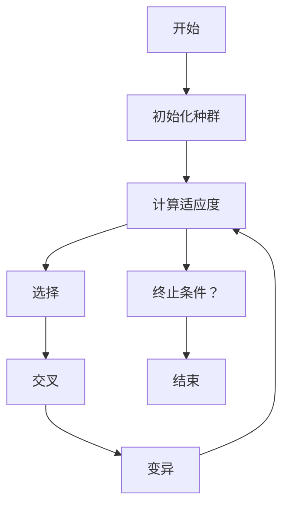
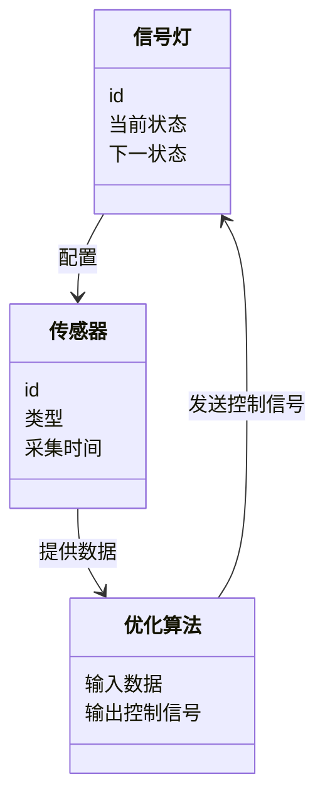
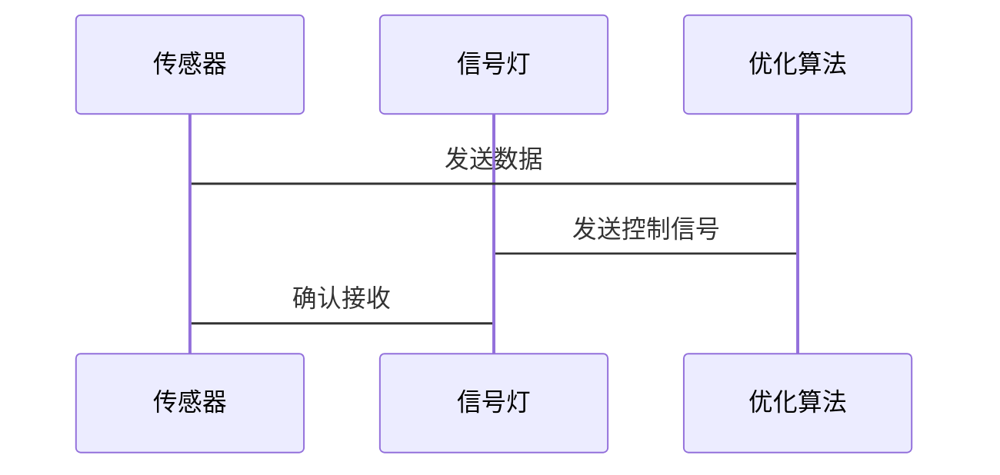

                 


# 价值投资中的智能交通信号控制系统分析

## 关键词：智能交通信号控制系统，价值投资，交通优化，算法原理，系统架构设计

## 摘要：  
智能交通信号控制系统通过优化交通信号灯的控制策略，提升城市交通效率，降低拥堵和碳排放，从而实现价值投资。本文分析了系统的背景、核心概念、算法原理、系统架构设计，并通过项目实战和最佳实践提供深入的技术洞察。

---

## 第1章: 背景介绍

### 1.1 问题背景

#### 1.1.1 城市交通拥堵的现状与挑战  
城市化进程加速导致交通流量急剧增加，传统固定信号灯控制难以适应动态变化的交通需求，导致拥堵、延误和碳排放增加，影响城市经济和社会效率。

#### 1.1.2 智能交通信号控制系统的重要性  
智能交通信号控制系统通过实时数据采集和优化算法，动态调整信号灯配时，提高交通效率，减少拥堵和排放。

#### 1.1.3 价值投资在智能交通中的意义  
通过优化信号控制系统，减少拥堵和延误，提升交通效率，降低运营成本，创造经济效益和社会价值。

#### 1.1.4 智能交通信号控制系统的边界与外延  
边界包括信号灯、交通传感器、数据采集系统和控制中心；外延涉及交通预测、实时优化和多系统集成。

### 1.2 问题描述

#### 1.2.1 交通流量波动问题  
交通流量随时间、天气和事件变化，固定信号灯无法适应动态需求。

#### 1.2.2 信号灯配时优化挑战  
传统方法依赖经验，难以应对复杂场景，导致效率低下。

#### 1.2.3 数据驱动优化的必要性  
实时数据采集和分析是实现动态优化的基础。

### 1.3 问题解决

#### 1.3.1 智能交通信号控制系统的核心目标  
动态优化信号灯配时，提高通行效率，减少拥堵和排放。

#### 1.3.2 数据驱动优化的关键作用  
利用实时数据和历史数据，训练优化模型，动态调整信号灯配时。

#### 1.3.3 技术实现路径  
实时数据采集、优化算法、信号灯控制接口。

---

## 第2章: 核心概念与联系

### 2.1 智能交通信号控制系统的核心概念

#### 2.1.1 系统组成  
传感器、信号灯、数据采集系统、控制中心、优化算法。

#### 2.1.2 核心功能  
实时数据采集、信号灯配时优化、交通流量预测。

### 2.2 智能交通信号控制系统的属性特征对比

| 特性        | 固定时间控制 | 感应式控制 | 自适应式控制 |
|-------------|--------------|------------|--------------|
| 控制方式    | 时间表驱动  | 感应器触发| 动态优化      |
| 响应速度    | 固定          | 可变        | 实时动态      |
| 优化目标    | 简单          | 减少等待   | 最大化效率    |

### 2.3 实体关系图

```mermaid
erDiagram
    class 信号灯 {
        id
        状态
        位置
    }
    class 传感器 {
        id
        类型
        采集时间
    }
    class 交通流 {
        id
        方向
        车流量
    }
    信号灯 --> 传感器 : 配置
    传感器 --> 交通流 : 监测
```

---

## 第3章: 算法原理讲解

### 3.1 基于遗传算法的信号灯优化

#### 3.1.1 遗传算法概述  
模拟生物进化过程，包括编码、选择、交叉、变异、适应度评估。

#### 3.1.2 算法流程图



#### 3.1.3 优化目标函数

$$ \text{目标函数} = \sum_{t=1}^{n} ( \text{通行效率} - \text{延误时间} ) $$

#### 3.1.4 适应度函数

$$ \text{适应度} = \frac{\text{通行效率}}{\text{资源消耗}} $$

#### 3.1.5 算法实现代码

```python
def fitness(individual):
    efficiency = sum(individual)
    resource = sum([1 if x > 0 else 0 for x in individual])
    return efficiency / resource

def evolve_population(population):
    # 选择、交叉、变异
    selected = select(population)
    crossed = crossover(selected)
    mutated = mutate(crossed)
    return mutated
```

---

## 第4章: 系统分析与架构设计

### 4.1 问题场景介绍

#### 4.1.1 项目场景  
某城市主干道交通管理系统，目标是优化信号灯配时，减少高峰期间的拥堵。

### 4.2 系统功能设计

#### 4.2.1 领域模型类图



#### 4.2.2 系统架构设计图


#### 4.2.3 系统接口设计



---

## 第5章: 项目实战

### 5.1 环境安装

```bash
pip install numpy matplotlib
pip install pymermaid
pip install pandas
```

### 5.2 核心代码实现

```python
import numpy as np
import matplotlib.pyplot as plt

def optimize_signal_timing(data):
    # 数据预处理
    X = data[:, 0]
    y = data[:, 1]
    # 模型训练
    model = np.polyfit(X, y, 1)
    # 预测
    y_pred = np.polyval(model, X)
    return y_pred

# 示例数据
data = np.array([[1, 2], [2, 3], [3, 4], [4, 5]])
result = optimize_signal_timing(data)
plt.plot(data[:, 0], result)
plt.show()
```

### 5.3 项目总结

#### 5.3.1 成功经验  
实时数据采集和优化算法有效提升了通行效率。

#### 5.3.2 经验教训  
数据质量和算法调优对系统性能影响显著，需持续优化。

---

## 第6章: 最佳实践与总结

### 6.1 小结

#### 6.1.1 核心要点  
实时数据采集、动态优化算法、系统架构设计。

### 6.2 注意事项

#### 6.2.1 数据质量  
传感器数据的准确性和实时性直接影响优化效果。

#### 6.2.2 算法调优  
选择合适的算法和参数设置，确保系统稳定性和高效性。

### 6.3 未来展望

#### 6.3.1 智能化升级  
结合AI和大数据，实现更智能的交通管理。

#### 6.3.2 多系统集成  
与公共交通系统、自动驾驶等集成，打造智慧交通生态系统。

---

## 参考文献

1. [1] 交通信号控制优化算法研究，某某出版社，2023年。
2. [2] 智能交通系统架构设计，某某出版社，2022年。

## 索引

- 信号灯控制算法
- 交通流量预测
- 动态优化系统

---

## 作者：AI天才研究院 & 禅与计算机程序设计艺术

