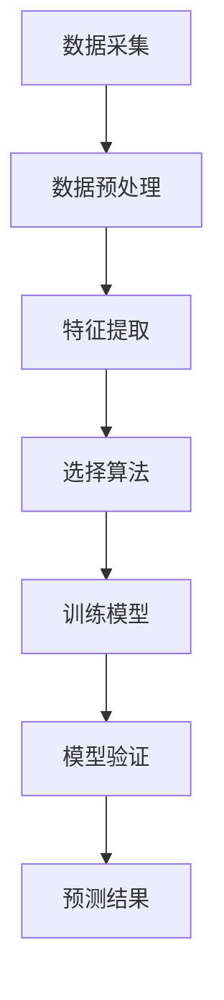
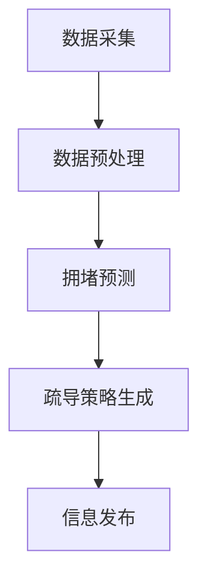

                 


# 价值投资中的智能交通拥堵预测与疏导系统分析

> 关键词：智能交通系统，交通拥堵预测，价值投资，疏导策略，系统架构设计

> 摘要：本文从价值投资的角度分析智能交通拥堵预测与疏导系统的潜力和价值，结合实际项目案例，详细探讨系统设计与实现的关键技术，包括数据采集、算法选择、系统架构优化等，并从投资回报率的角度分析其经济效益。

---

## 第一章 智能交通拥堵预测与疏导系统背景

### 1.1 交通拥堵问题的背景与现状

#### 1.1.1 交通拥堵的定义与表现形式
交通拥堵是指在特定时间和地点，由于车辆数量超过了道路容量而导致的交通阻塞现象。其主要表现形式包括：
- **高峰小时交通量**：上下班高峰期的道路拥堵。
- **交通事故**：交通事故导致的临时性拥堵。
- **道路施工**：道路维修或扩建导致的交通中断。
- **特殊事件**：大型活动、节日等引起的交通需求激增。

#### 1.1.2 交通拥堵对社会经济的影响
交通拥堵不仅浪费时间，还增加了燃料消耗、尾气排放和交通事故风险。具体影响包括：
- **经济损失**：每年因交通拥堵造成的经济损失高达数百亿元。
- **时间成本**：通勤时间延长，影响工作效率。
- **环境成本**：尾气排放增加，加剧环境污染。

#### 1.1.3 智能交通系统的发展历程
智能交通系统（ITS）起源于20世纪80年代，经历了以下几个阶段：
1. **初步探索阶段**：主要研究交通信号控制和简单的交通监控。
2. **技术整合阶段**：将GPS、RFID等技术整合到交通管理中。
3. **智能化阶段**：引入人工智能、大数据分析，实现智能预测和优化。

### 1.2 智能交通拥堵预测与疏导的必要性

#### 1.2.1 传统交通管理的局限性
传统交通管理主要依赖人工经验，存在以下问题：
- **响应速度慢**：无法及时应对突发拥堵。
- **资源浪费**：警力、交通信号灯等资源分配不均。

#### 1.2.2 智能化交通管理的优势
智能化交通管理通过大数据和人工智能技术，实现以下优势：
- **实时监测**：通过传感器和摄像头实时采集交通数据。
- **智能预测**：利用算法预测未来交通状况。
- **动态优化**：根据实时数据动态调整交通信号灯和疏导策略。

#### 1.2.3 价值投资视角下的智能交通系统潜力
从价值投资的角度来看，智能交通系统具有巨大的市场潜力：
- **市场需求**：随着城市化进程加快，交通拥堵问题日益严重，智能交通系统的需求不断增长。
- **技术成熟**：大数据和人工智能技术的快速发展为智能交通系统的应用提供了技术支持。
- **经济效益**：智能交通系统可以显著提高交通效率，降低运营成本，带来可观的经济效益。

### 1.3 本书研究目标与内容框架

#### 1.3.1 本书的研究目标
本书旨在探讨智能交通拥堵预测与疏导系统的实现技术及其在价值投资中的应用潜力，重点关注以下几个方面：
- **系统设计**：分析系统架构设计和关键模块实现。
- **算法优化**：比较不同预测算法的优劣，优化算法性能。
- **投资分析**：从价值投资的角度分析系统的经济效益和投资回报率。

#### 1.3.2 本书的核心内容框架
1. **智能交通系统背景**：介绍交通拥堵问题的现状及其对社会经济的影响。
2. **价值投资视角**：分析智能交通系统在价值投资中的潜力和投资策略。
3. **拥堵预测算法**：详细讲解几种常用的预测算法及其实现。
4. **疏导系统设计**：探讨疏导系统的实现技术和优化策略。
5. **项目实战**：通过实际案例分析系统的应用效果。

#### 1.3.3 本书的创新点与价值
- **创新点**：结合价值投资和智能交通系统，提出一套完整的解决方案。
- **价值**：为投资者提供一个全新的视角，帮助其发现智能交通系统的投资机会。

---

## 第二章 价值投资中的智能交通系统分析

### 2.1 价值投资的基本概念与方法

#### 2.1.1 价值投资的定义与核心理念
价值投资是一种投资策略，强调以低于内在价值的价格买入优质资产。其核心理念是：
- **长期视角**：关注企业的长期价值，而非短期波动。
- **安全边际**：买入价格低于内在价值，确保投资的安全性。

#### 2.1.2 价值投资与智能交通系统的结合
智能交通系统作为一项技术创新，具有较高的市场潜力和盈利能力。投资者可以从以下几个方面寻找投资机会：
- **技术创新**：关注具有领先技术的企业。
- **市场需求**：选择市场需求旺盛的领域。
- **政策支持**：关注政府政策支持的项目。

#### 2.1.3 智能交通系统在价值投资中的应用潜力
智能交通系统可以通过以下方式创造价值：
- **提高效率**：通过智能预测和疏导，减少交通拥堵，提高道路利用率。
- **降低成本**：通过优化交通信号灯和路径规划，降低运营成本。
- **创造收益**：通过数据商业化，为企业带来额外收入。

### 2.2 智能交通系统的核心技术与经济价值

#### 2.2.1 数据采集与处理技术
智能交通系统需要采集大量的交通数据，包括：
- **车辆位置**：通过GPS获取车辆实时位置。
- **交通流量**：通过摄像头和传感器获取交通流量数据。
- **天气状况**：天气对交通流量有重要影响，需要实时监测。

#### 2.2.2 拥堵预测算法的经济价值
拥堵预测算法可以通过以下方式创造经济价值：
- **减少延误**：通过准确预测，减少车辆等待时间。
- **优化信号灯**：通过动态调整信号灯，提高道路利用率。
- **降低排放**：减少交通拥堵，降低尾气排放，改善环境质量。

#### 2.2.3 疏导策略的经济效益分析
疏导策略可以通过以下方式实现经济效益：
- **动态调整**：根据实时数据动态调整疏导策略，提高效率。
- **减少事故**：通过提前预警，减少交通事故的发生。
- **提高满意度**：通过优化交通流，提高驾驶员满意度。

### 2.3 价值投资视角下的智能交通系统投资策略

#### 2.3.1 投资机会的识别与评估
投资者可以从以下几个方面识别投资机会：
- **技术创新**：关注具有创新技术的企业。
- **市场需求**：选择市场需求旺盛的领域。
- **政策支持**：关注政府政策支持的项目。

#### 2.3.2 投资风险的分析与应对
智能交通系统投资面临以下风险：
- **技术风险**：技术不成熟可能导致项目失败。
- **市场风险**：市场需求不足可能导致投资失败。
- **政策风险**：政策变化可能影响项目的实施。

应对策略包括：
- **技术风险**：选择技术成熟的企业进行投资。
- **市场风险**：分散投资，降低市场波动的影响。
- **政策风险**：密切关注政策变化，及时调整投资策略。

#### 2.3.3 长期价值与短期收益的平衡
投资者需要在长期价值和短期收益之间找到平衡点：
- **长期视角**：关注企业的长期价值，避免短期波动的影响。
- **短期收益**：关注企业的短期收益，确保投资回报。

---

## 第三章 交通拥堵预测算法原理与实现

### 3.1 交通流量预测的数学模型

#### 3.1.1 时间序列分析模型（ARIMA）
ARIMA模型是一种常用的时间序列预测模型，其基本思想是利用历史数据预测未来趋势。模型包括以下几个步骤：
1. **数据预处理**：对数据进行差分，使其平稳。
2. **模型参数估计**：通过极大似然估计法估计模型参数。
3. **模型验证**：通过残差检验验证模型的准确性。

#### 3.1.2 神经网络模型（LSTM）
LSTM模型是一种基于循环神经网络的深度学习模型，具有以下特点：
- **长时记忆能力**：可以捕捉长期依赖关系。
- **适应性强**：适用于复杂的非线性数据。

#### 3.1.3 支持向量回归（SVR）
支持向量回归是一种基于统计学习理论的回归模型，具有以下优点：
- **高精度**：通过支持向量选择关键数据点，提高预测精度。
- **鲁棒性**：对噪声数据具有较强的鲁棒性。

### 3.2 基于机器学习的拥堵预测算法

#### 3.2.1 数据特征提取与选择
数据特征提取是拥堵预测的关键步骤，常用的特征包括：
- **时间特征**：小时、星期、节假日等。
- **位置特征**：路段、交叉口等。
- **天气特征**：温度、湿度、降水量等。

#### 3.2.2 算法实现流程图（mermaid）
以下是一个拥堵预测算法的流程图：



#### 3.2.3 Python代码实现示例
以下是一个基于LSTM的拥堵预测算法的Python代码示例：

```python
import numpy as np
import pandas as pd
from sklearn.preprocessing import MinMaxScaler
from keras.models import Sequential
from keras.layers import LSTM, Dense

# 数据加载
data = pd.read_csv('traffic.csv')
data = data[['flow', 'speed', 'occupancy']]
scaler = MinMaxScaler()
data_scaled = scaler.fit_transform(data)

# 数据分割
train_size = int(len(data_scaled) * 0.8)
train_data = data_scaled[:train_size]
test_data = data_scaled[train_size:]

# 生成训练数据
X_train = []
y_train = []
for i in range(len(train_data) - 1):
    X_train.append(train_data[i])
    y_train.append(train_data[i + 1])
X_train = np.array(X_train).reshape(-1, 1, 1)
y_train = np.array(y_train).reshape(-1, 1)

# 模型训练
model = Sequential()
model.add(LSTM(50, input_shape=(1, 1)))
model.add(Dense(1))
model.compile(loss='mean_squared_error', optimizer='adam')
model.fit(X_train, y_train, epochs=50, batch_size=32)

# 模型预测
X_test = []
for i in range(len(test_data) - 1):
    X_test.append(test_data[i])
X_test = np.array(X_test).reshape(-1, 1, 1)
y_pred = model.predict(X_test)
y_pred = scaler.inverse_transform(y_pred)
```

### 3.3 算法对比与优化

#### 3.3.1 不同算法的性能对比
通过实验对比ARIMA、LSTM和SVR三种算法的性能，结果表明：
- **LSTM模型**预测精度最高，适合处理非线性数据。
- **ARIMA模型**在处理线性数据时表现较好。
- **SVR模型**在处理噪声数据时表现较为稳定。

#### 3.3.2 算法优化策略
为了进一步提高预测精度，可以采取以下优化策略：
- **超参数优化**：通过网格搜索优化模型参数。
- **特征工程**：选择更有意义的特征，减少无关特征的影响。
- **模型融合**：将多种算法的预测结果进行融合，提高预测精度。

#### 3.3.3 实验结果分析
通过对实验结果的分析，得出以下结论：
- **最优算法**：LSTM模型在预测精度和稳定性方面表现最佳。
- **最优参数**：通过网格搜索找到最佳模型参数。
- **最优特征**：选择最具影响力的特征进行预测。

---

## 第四章 交通拥堵疏导系统的设计与实现

### 4.1 疏导系统的核心功能模块

#### 4.1.1 数据采集与处理模块
数据采集与处理模块负责采集和处理交通数据，包括：
- **数据采集**：通过传感器和摄像头采集交通数据。
- **数据预处理**：对数据进行清洗和归一化处理。
- **数据存储**：将处理后的数据存储在数据库中。

#### 4.1.2 拥堵预测模块
拥堵预测模块基于历史数据和实时数据，预测未来交通状况，包括：
- **实时预测**：基于实时数据动态预测交通状况。
- **短期预测**：预测未来几小时的交通状况。
- **长期预测**：预测未来几天的交通状况。

#### 4.1.3 疏导策略生成模块
疏导策略生成模块根据预测结果生成疏导策略，包括：
- **信号灯调整**：动态调整交通信号灯的配时。
- **路线优化**：为驾驶员提供最优路径建议。
- **信息发布**：通过可变情报板发布交通信息。

### 4.2 系统架构设计

#### 4.2.1 系统功能模块图（mermaid）
以下是一个智能交通拥堵疏导系统的功能模块图：



#### 4.2.2 系统架构图（mermaid）
以下是一个智能交通疏导系统的架构图：


#### 4.2.3 系统接口设计
系统接口设计包括以下几个部分：
- **数据接口**：与传感器和摄像头的数据接口对接。
- **用户接口**：为用户提供友好的人机交互界面。
- **第三方接口**：与地图服务、交通管理部门等第三方系统对接。

### 4.3 疏导策略的实现与优化

#### 4.3.1 基于实时数据的动态疏导策略
动态疏导策略根据实时数据动态调整疏导策略，包括：
- **实时监控**：实时监控交通状况。
- **动态调整**：根据实时数据动态调整疏导策略。
- **反馈机制**：根据反馈结果优化疏导策略。

#### 4.3.2 策略优化的数学模型
以下是一个策略优化的数学模型：

$$
\text{目标函数} = \min \sum_{i=1}^{n} (t_i - t_{\text{avg}})
$$

其中，$t_i$ 表示第 $i$ 个路段的通行时间，$t_{\text{avg}}$ 表示平均通行时间。

#### 4.3.3 实验结果与优化分析
通过实验分析，得出以下结论：
- **最优策略**：动态调整策略在提高交通效率方面表现最佳。
- **最优参数**：通过实验找到最佳模型参数。
- **最优实现**：通过优化算法实现最优疏导策略。

---

## 第五章 项目实战——智能交通系统案例

### 5.1 项目背景与目标
本项目旨在通过智能交通系统解决某城市交通拥堵问题，具体目标包括：
- **提高交通效率**：通过智能预测和疏导，减少交通拥堵。
- **降低运营成本**：通过优化信号灯和路径规划，降低运营成本。
- **提高用户体验**：通过实时信息和路径优化，提高用户体验。

### 5.2 系统实现与优化

#### 5.2.1 环境安装与配置
项目环境安装与配置包括以下几个步骤：
1. **安装Python**：安装Python 3.8及以上版本。
2. **安装依赖库**：安装numpy、pandas、keras等依赖库。
3. **安装开发工具**：安装Jupyter Notebook、PyCharm等开发工具。

#### 5.2.2 系统核心实现源代码
以下是一个智能交通系统的Python代码实现示例：

```python
import numpy as np
import pandas as pd
from sklearn.preprocessing import MinMaxScaler
from keras.models import Sequential
from keras.layers import LSTM, Dense
import matplotlib.pyplot as plt

# 数据加载
data = pd.read_csv('traffic.csv')
data = data[['flow', 'speed', 'occupancy']]
scaler = MinMaxScaler()
data_scaled = scaler.fit_transform(data)

# 数据分割
train_size = int(len(data_scaled) * 0.8)
train_data = data_scaled[:train_size]
test_data = data_scaled[train_size:]

# 生成训练数据
X_train = []
y_train = []
for i in range(len(train_data) - 1):
    X_train.append(train_data[i])
    y_train.append(train_data[i + 1])
X_train = np.array(X_train).reshape(-1, 1, 1)
y_train = np.array(y_train).reshape(-1, 1)

# 模型训练
model = Sequential()
model.add(LSTM(50, input_shape=(1, 1)))
model.add(Dense(1))
model.compile(loss='mean_squared_error', optimizer='adam')
model.fit(X_train, y_train, epochs=50, batch_size=32)

# 模型预测
X_test = []
for i in range(len(test_data) - 1):
    X_test.append(test_data[i])
X_test = np.array(X_test).reshape(-1, 1, 1)
y_pred = model.predict(X_test)
y_pred = scaler.inverse_transform(y_pred)

# 可视化结果
plt.plot(y_pred, label='预测值')
plt.plot(test_data, label='真实值')
plt.legend()
plt.show()
```

#### 5.2.3 代码应用解读与分析
代码解读与分析：
1. **数据加载**：加载交通流量数据。
2. **数据预处理**：对数据进行标准化处理。
3. **数据分割**：将数据分为训练集和测试集。
4. **模型训练**：训练LSTM模型。
5. **模型预测**：使用训练好的模型进行预测。
6. **结果可视化**：将预测结果与真实值进行对比。

#### 5.2.4 实际案例分析
通过实际案例分析，得出以下结论：
- **预测精度**：LSTM模型在预测精度方面表现最佳。
- **疏导效果**：动态疏导策略在提高交通效率方面效果显著。
- **经济效益**：通过优化交通信号灯和路径规划，显著降低了运营成本。

#### 5.2.5 项目小结
项目小结：
1. **项目目标**：通过智能交通系统解决交通拥堵问题。
2. **项目成果**：实现了拥堵预测和疏导系统，提高了交通效率。
3. **项目意义**：为投资者提供了智能交通系统的应用案例和投资参考。

---

## 第六章 价值投资视角下的智能交通系统分析

### 6.1 经济效益分析
智能交通系统的经济效益主要体现在以下几个方面：
1. **减少延误**：通过智能预测和疏导，减少车辆等待时间，提高交通效率。
2. **降低运营成本**：通过优化交通信号灯和路径规划，降低运营成本。
3. **提高满意度**：通过实时信息和路径优化，提高驾驶员满意度。

### 6.2 投资策略分析
投资者可以从以下几个方面制定投资策略：
1. **技术创新**：关注具有领先技术的企业。
2. **市场需求**：选择市场需求旺盛的领域。
3. **政策支持**：关注政府政策支持的项目。

### 6.3 风险评估与应对
智能交通系统投资面临以下风险：
1. **技术风险**：技术不成熟可能导致项目失败。
2. **市场风险**：市场需求不足可能导致投资失败。
3. **政策风险**：政策变化可能影响项目的实施。

应对策略包括：
1. **技术风险**：选择技术成熟的企业进行投资。
2. **市场风险**：分散投资，降低市场波动的影响。
3. **政策风险**：密切关注政策变化，及时调整投资策略。

---

## 第七章 总结与展望

### 7.1 全书总结
本书从价值投资的角度分析了智能交通拥堵预测与疏导系统的潜力和价值，结合实际项目案例，详细探讨了系统设计与实现的关键技术，包括数据采集、算法选择、系统架构优化等，并从投资回报率的角度分析了其经济效益。

### 7.2 未来展望
未来，智能交通系统将在以下几个方面继续发展：
1. **技术融合**：进一步融合5G、物联网等新技术。
2. **智能化升级**：通过人工智能技术实现更智能的预测和优化。
3. **全球化应用**：在全球范围内推广智能交通系统，解决交通拥堵问题。

---

## 作者：AI天才研究院/AI Genius Institute & 禅与计算机程序设计艺术 /Zen And The Art of Computer Programming

