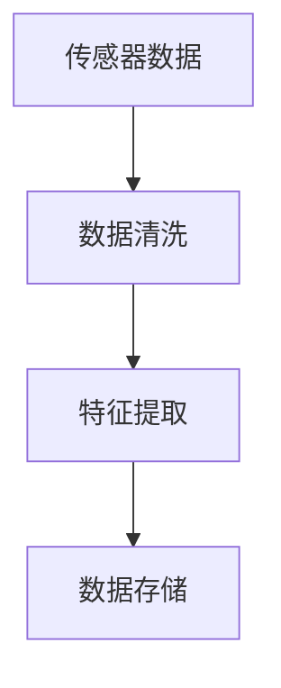
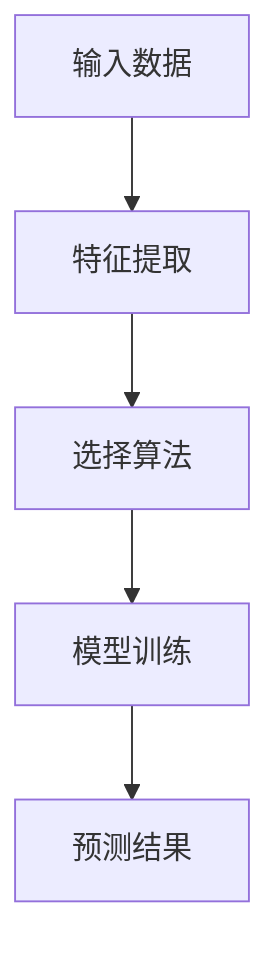
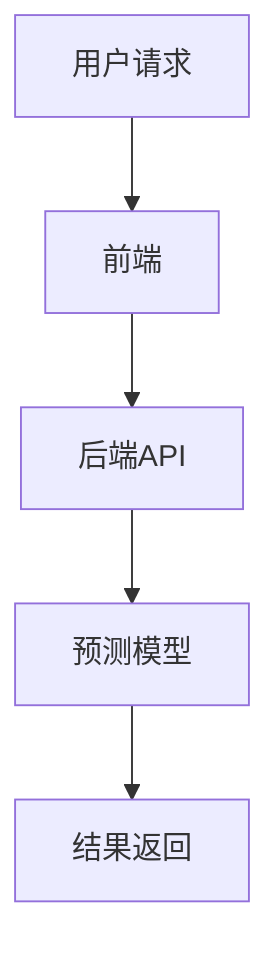
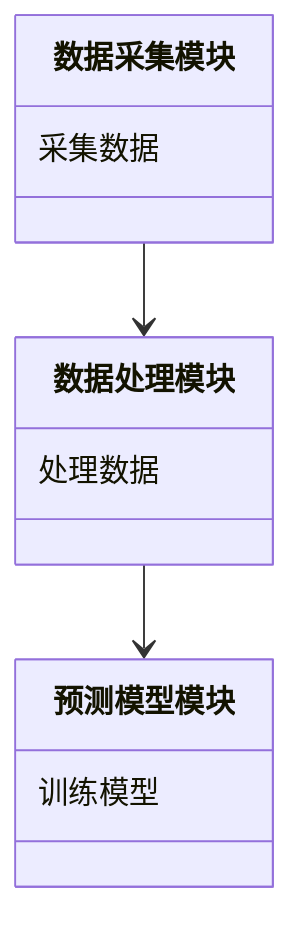
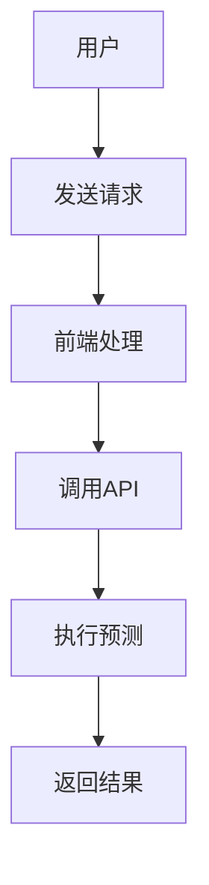

                 


# 价值投资中的智能交通拥堵预测系统分析

> 关键词：价值投资，智能交通，交通拥堵预测，系统分析，算法实现

> 摘要：本文分析了智能交通拥堵预测系统在价值投资中的应用，探讨了系统的核心概念、算法原理、架构设计及其实现，通过案例分析展示了系统的实际价值。

---

# 第一部分: 价值投资中的智能交通拥堵预测系统背景

## 第1章: 价值投资与智能交通拥堵预测系统概述

### 1.1 价值投资与智能交通拥堵预测的结合

#### 1.1.1 价值投资的基本概念

价值投资是一种长期投资策略，强调通过深入分析企业内在价值，寻找市场价格低于内在价值的投资机会。在智能交通领域，价值投资可以用于评估技术解决方案的潜力和投资价值。

#### 1.1.2 智能交通系统的发展现状

智能交通系统（ITS）利用信息技术优化交通管理，减少拥堵，提升效率。随着城市化加剧， ITS的应用越来越广泛，成为解决交通问题的重要手段。

#### 1.1.3 智能交通拥堵预测的必要性

交通拥堵影响城市经济和居民生活质量，实时预测拥堵有助于优化交通管理，减少经济损失，提升城市竞争力。

### 1.2 智能交通拥堵预测系统的核心问题

#### 1.2.1 交通拥堵的定义与特征

交通拥堵指交通流量超过道路容量，导致通行效率下降。其特征包括周期性、区域性、突发性和持续性。

#### 1.2.2 智能交通拥堵预测的挑战

数据多样性、模型精度和计算资源是主要挑战。需处理多源数据，模型需高精度，计算资源需求高。

#### 1.2.3 系统的目标与边界

目标是准确预测拥堵，辅助决策。边界包括预测范围、时间窗口和数据来源。

---

# 第二部分: 智能交通拥堵预测系统的核心概念与联系

## 第2章: 智能交通拥堵预测系统的原理与架构

### 2.1 数据采集与处理

#### 2.1.1 数据源的多样性

系统收集GPS数据、交通传感器数据、历史交通数据和天气数据等。

#### 2.1.2 数据预处理方法

数据清洗：处理缺失值和异常值；特征提取：提取关键特征，如时间、流量、速度；数据流图展示数据处理流程。



### 2.2 算法选择与实现

#### 2.2.1 常见算法对比

| 算法类型 | 优点 | 缺点 |
|----------|------|------|
| 时间序列分析 | 简单易实现 | 对异常值敏感 |
| 机器学习模型 | 高准确性 | 需大量数据 |
| 深度学习模型 | 高精度 | 计算资源需求高 |

#### 2.2.2 算法流程图



### 2.3 系统架构设计

#### 2.3.1 系统整体架构



---

# 第三部分: 智能交通拥堵预测系统的算法实现

## 第3章: 算法原理与实现

### 3.1 时间序列分析

使用ARIMA模型进行预测，公式如下：

$$ ARIMA(p, d, q) $$

其中，p为自回归阶数，d为差分阶数，q为移动平均阶数。

### 3.2 机器学习模型

使用XGBoost进行训练，核心思想是通过树模型捕捉非线性关系。

### 3.3 深度学习模型

采用LSTM进行时间序列预测，公式如下：

$$ LSTM(t, h_{t-1}, c_{t-1}) \rightarrow h_t, c_t $$

---

# 第四部分: 智能交通拥堵预测系统的架构设计

## 第4章: 系统架构与接口设计

### 4.1 系统功能设计

类图展示系统各模块关系。



### 4.2 系统交互设计

序列图展示用户请求处理流程。



---

# 第五部分: 项目实战

## 第5章: 项目实现与案例分析

### 5.1 环境安装

安装Python、NumPy、Pandas、Scikit-learn和XGBoost。

### 5.2 核心代码实现

```python
import pandas as pd
from sklearn.model_selection import train_test_split
from xgboost import XGBRegressor

# 数据加载与处理
data = pd.read_csv('traffic_data.csv')
X = data.drop('target', axis=1)
y = data['target']

# 划分训练集和测试集
X_train, X_test, y_train, y_test = train_test_split(X, y, test_size=0.2)

# 模型训练
model = XGBRegressor(n_estimators=100, learning_rate=0.1)
model.fit(X_train, y_train)

# 预测与评估
y_pred = model.predict(X_test)
```

### 5.3 案例分析

通过实际案例分析模型的准确性和实用性，优化系统性能。

---

# 第六部分: 总结与展望

## 第6章: 总结

### 6.1 系统应用场景

智能交通拥堵预测系统可应用于城市交通管理、自动驾驶路线规划和公共交通优化等领域。

### 6.2 价值投资机会

该系统具有广阔的应用前景，投资者可关注相关技术公司和解决方案提供商。

---

作者：AI天才研究院 & 禅与计算机程序设计艺术

