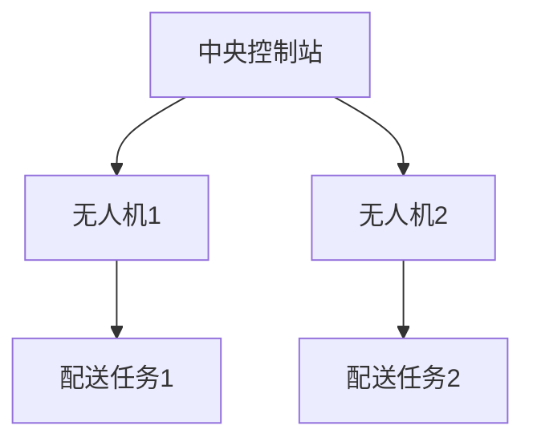
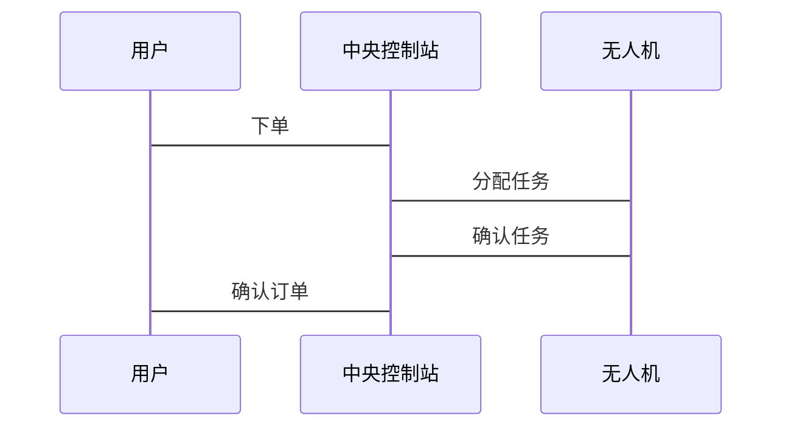

                 


# 价值投资中的智能交通无人机配送系统分析

> 关键词：价值投资，智能交通，无人机配送，物流效率，系统分析，技术实现，投资回报

> 摘要：本文深入分析了智能交通与无人机配送系统在价值投资中的应用与潜力，从技术实现、系统架构、市场分析、财务指标等多个维度进行了详细探讨，旨在为投资者提供全面的分析框架和决策支持。

---

# 第一部分: 价值投资中的智能交通无人机配送系统分析

## 第1章: 引言

### 1.1 价值投资与智能交通的结合
#### 1.1.1 价值投资的基本概念
价值投资是一种以基本面分析为核心的长期投资策略，旨在通过识别具有持续竞争优势和良好财务状况的公司，实现长期稳定的收益。其核心在于寻找市场价格低于其内在价值的投资标的。

#### 1.1.2 智能交通系统的定义与特点
智能交通系统（ITS）利用先进的信息技术、数据通信、自动控制和人工智能等技术，对交通系统的各组成部分进行监测、协调和优化，以提高交通效率、减少拥堵和事故。

#### 1.1.3 无人机配送系统的兴起
无人机配送系统通过无人机完成货物的运输与配送，具有快速、灵活和成本较低的特点，尤其适用于偏远地区和紧急配送场景。

### 1.2 本书的目的与结构
#### 1.2.1 本书的研究目标
分析智能交通与无人机配送系统的结合，探讨其在价值投资中的应用潜力，为投资者提供技术与经济的双重视角。

#### 1.2.2 本书的章节安排
- 第1章：引言
- 第2章：智能交通与无人机配送系统概述
- 第3章：无人机配送系统的技术分析
- 第4章：价值投资中的关键分析指标
- 第5章：系统架构与设计
- 第6章：项目实战与案例分析
- 第7章：结论与展望

#### 1.2.3 本书的适用读者
本书适用于对价值投资、智能交通和无人机配送系统感兴趣的投资人士、技术研究人员以及相关领域的从业者。

---

## 第2章: 智能交通与无人机配送系统概述

### 2.1 智能交通系统的基本概念
#### 2.1.1 智能交通系统的定义
智能交通系统（ITS）是一种利用先进的信息技术和数据处理技术，对交通系统进行实时监控、优化管理和智能决策的系统。

#### 2.1.2 智能交通系统的组成部分
- **交通监测**：包括交通流量监测、交通事故监测等。
- **数据处理**：对交通数据进行收集、分析和预测。
- **智能控制**：通过优化信号灯控制、路径规划等方式提高交通效率。
- **信息服务**：为驾驶员和公众提供实时的交通信息。

#### 2.1.3 智能交通系统的优势
- 提高交通效率，减少拥堵。
- 降低交通事故的发生率。
- 节约能源，减少碳排放。

### 2.2 无人机配送系统的背景与发展
#### 2.2.1 无人机配送系统的起源
无人机配送的概念起源于物流行业对更高效、更灵活配送方式的需求，尤其是在亚马逊等科技公司的推动下，无人机配送逐渐从概念走向实践。

#### 2.2.2 无人机配送系统的现状
目前，无人机配送已在部分国家和地区进行试点，主要应用于偏远地区的货物运输和紧急救援物资的配送。

#### 2.2.3 无人机配送系统的未来趋势
随着技术的成熟和法规的完善，无人机配送将逐步扩大应用范围，成为物流行业的重要组成部分。

### 2.3 智能交通与无人机配送系统的结合
#### 2.3.1 智能交通与无人机配送的协同效应
智能交通系统可以为无人机配送提供实时的交通数据和最优的配送路径，而无人机配送则可以为智能交通系统提供更高效的货物运输方式。

#### 2.3.2 无人机配送在智能交通中的应用
无人机配送可以用于城市内的快速配送，缓解交通压力，提高物流效率。

#### 2.3.3 无人机配送对物流效率的提升
通过无人机配送，可以实现货物的快速运输，减少配送时间，降低物流成本。

---

## 第3章: 无人机配送系统的技术分析

### 3.1 无人机配送系统的硬件组成
#### 3.1.1 无人机的结构与功能
- **飞行器**：包括固定翼无人机、旋翼无人机等。
- **导航与定位**：使用GPS、激光雷达等技术实现精准定位。
- **通信技术**：通过无线通信模块实现无人机与地面控制站的数据传输。

#### 3.1.2 无人机的导航与定位技术
- GPS定位：无人机通过GPS模块确定自身位置。
- 激光雷达：用于障碍物检测和避障。
- 视觉识别：通过摄像头识别道路和障碍物。

#### 3.1.3 无人机的通信技术
- 无线电通信：无人机与地面站之间的数据传输。
- 5G网络：高速、低延迟的通信支持无人机的实时控制。

### 3.2 无人机配送系统的软件设计
#### 3.2.1 无人机配送的路径规划算法
- **A*算法**：基于图搜索的最短路径算法。
- **Dijkstra算法**：用于处理权重相同的路径问题。
- **遗传算法**：通过模拟自然进化过程优化路径。

#### 3.2.2 无人机配送的调度系统
- 中央控制站：负责无人机的调度和任务分配。
- 调度算法：根据任务需求优化无人机的使用。

#### 3.2.3 无人机配送的安全保障措施
- 紧急降落机制：在通信中断或电量不足时自动降落。
- 飞行区域限制：设定飞行区域，避免进入禁飞区。

### 3.3 无人机配送系统的数学模型
#### 3.3.1 无人机配送的路径优化模型
$$ \text{目标函数：} \min \sum_{i=1}^{n} c_{i} $$
$$ \text{约束条件：} x_{ij} \leq 1, \forall i,j $$
其中，\( c_{i} \) 为路径成本，\( x_{ij} \) 为是否选择路径 \( i \) 到 \( j \)。

#### 3.3.2 无人机配送的成本分析模型
$$ \text{总成本} = \text{硬件成本} + \text{维护成本} + \text{能源成本} $$

#### 3.3.3 无人机配送的效率评估模型
$$ \text{配送效率} = \frac{\text{配送货物总量}}{\text{配送时间}} $$

---

## 第4章: 价值投资中的关键分析指标

### 4.1 无人机配送系统的财务指标分析
#### 4.1.1 营业收入与成本分析
- **营业收入**：无人机配送系统的收入来源包括配送服务费、租赁收入等。
- **成本分析**：包括硬件成本、维护成本、能源成本等。

#### 4.1.2 净利润与投资回报率
$$ \text{净利润} = \text{营业收入} - \text{总成本} $$
$$ \text{投资回报率} = \frac{\text{净利润}}{\text{初始投资}} \times 100\% $$

#### 4.1.3 资产负债率与财务健康状况
$$ \text{资产负债率} = \frac{\text{总负债}}{\text{总资产}} \times 100\% $$

### 4.2 无人机配送系统的市场分析
#### 4.2.1 市场规模
- 全球无人机配送市场规模预测：根据市场研究机构的数据，未来几年无人机配送市场将快速增长。

#### 4.2.2 市场竞争格局
- 主要竞争对手分析：包括亚马逊、谷歌、顺丰等企业在无人机配送领域的布局。

#### 4.2.3 市场增长驱动因素
- 技术进步：无人机技术的不断成熟。
- 政策支持：各国政府对无人机配送的政策支持。
- 消费需求：消费者对快速配送的需求增加。

### 4.3 无人机配送系统的风险评估
#### 4.3.1 技术风险
- 技术不成熟可能导致系统故障。
- 数据安全风险：无人机配送系统可能成为黑客攻击的目标。

#### 4.3.2 市场风险
- 市场竞争加剧可能导致利润下降。
- 市场需求不足可能导致投资回报率低。

#### 4.3.3 政策风险
- 法规不完善可能导致无人机配送业务受限。
- 国际贸易政策变化可能影响供应链。

---

## 第5章: 系统架构与设计

### 5.1 无人机配送系统的架构设计
- 中央控制站：负责无人机的调度和任务分配。
- 数据采集模块：收集无人机的实时数据。
- 通信模块：实现无人机与地面站之间的数据传输。

#### 5.1.1 系统架构图


### 5.2 无人机配送系统的功能设计
#### 5.2.1 系统功能模块
- 用户下单模块：用户通过APP下单。
- 任务分配模块：系统根据订单分配无人机。
- 路径规划模块：计算最优配送路径。
- 货物跟踪模块：实时跟踪货物的配送状态。

#### 5.2.2 系统交互流程


### 5.3 系统接口设计
#### 5.3.1 API接口
- `/api/drone/tasks`：用于无人机任务分配。
- `/api/order/status`：用于查询订单状态。

#### 5.3.2 数据接口
- 数据格式：JSON格式传输数据。
- 数据加密：使用SSL协议加密数据传输。

---

## 第6章: 项目实战与案例分析

### 6.1 环境安装
#### 6.1.1 系统运行环境
- 操作系统：Linux或Windows。
- 开发工具：Python、Java、C++等编程语言。

#### 6.1.2 第三方库安装
- Python：`pip install dronekit`、`pip install numpy`。

### 6.2 核心实现
#### 6.2.1 路径规划算法实现
```python
import numpy as np

def a_star(start, end, grid):
    # 实现A*算法
    pass
```

#### 6.2.2 无人机调度系统实现
```python
class DroneManager:
    def __init__(self):
        self.drones = []
    
    def assign_task(self, task):
        # 为无人机分配任务
        pass
```

### 6.3 案例分析
#### 6.3.1 某无人机配送公司分析
- 公司背景：介绍某无人机配送公司的基本情况。
- 财务分析：分析公司的财务状况，包括收入、成本、利润等。
- 市场分析：分析公司的市场地位和竞争优势。

#### 6.3.2 投资回报分析
- 投资回报率：通过公式计算投资回报率。
- 风险评估：分析投资的风险因素。

### 6.4 项目小结
- 项目总结：通过项目实战，验证了无人机配送系统的可行性和经济效益。
- 经验分享：总结项目实施中的经验和教训。

---

## 第7章: 结论与展望

### 7.1 全文总结
- 本文分析了智能交通与无人机配送系统的结合，探讨了其在价值投资中的应用潜力。
- 通过技术分析、系统设计和案例分析，为投资者提供了全面的分析框架。

### 7.2 未来展望
- 技术发展：无人机配送技术的进一步优化。
- 市场扩展：无人机配送在更多领域的应用。
- 投资机会：寻找具有技术优势和市场潜力的无人机配送企业。

---

## 附录

### 附录A: 相关技术术语解释
- **智能交通系统（ITS）**：利用信息技术优化交通管理的系统。
- **无人机配送系统**：通过无人机完成货物配送的系统。

### 附录B: 数据来源与参考文献
- 数据来源：引用的市场研究数据来源。
- 参考文献：相关书籍、论文和研究报告的引用。

---

# 作者：AI天才研究院 & 禅与计算机程序设计艺术

