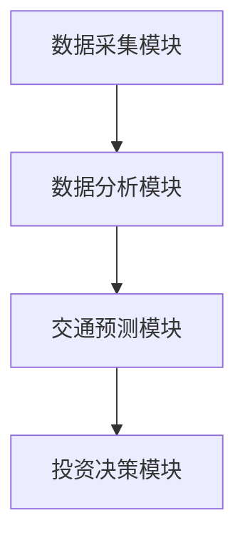
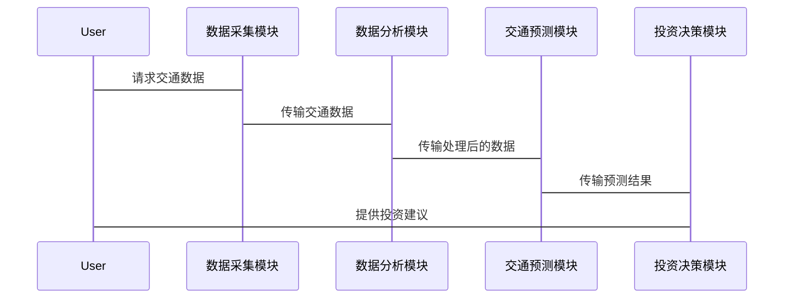

                 


# 价值投资中的智能交通系统发展趋势

> 关键词：智能交通系统, 价值投资, 交通流量预测, 机器学习, 投资决策

> 摘要：智能交通系统（ITS）作为现代交通管理的重要组成部分，正在通过技术创新和数据驱动的分析方法，为投资者提供更精准的决策支持。本文将从智能交通系统的概念、核心技术、算法原理、系统架构设计、项目实战等多个方面，深入分析智能交通系统的发展趋势及其对价值投资的影响。通过具体的案例分析和数学模型的构建，本文将帮助投资者更好地理解智能交通系统在投资决策中的应用，并展望未来的发展方向。

---

# 第1章 智能交通系统的概念与发展

## 1.1 智能交通系统的定义

智能交通系统（Intelligent Transportation Systems, ITS）是一种利用先进的信息技术、数据通信技术、传感器技术和控制技术，对交通系统进行实时监测、优化管理的综合系统。它通过整合交通数据，实现交通流量的预测、交通信号灯的智能控制、交通事故的及时响应等功能，从而提高交通系统的效率和安全性。

## 1.2 智能交通系统的演进历程

1. **传统交通管理**：基于人工管理的交通系统，效率较低，难以应对复杂的交通状况。
2. **自动化交通管理**：引入交通信号灯、电子收费系统等自动化设备，提高管理效率。
3. **数据驱动的交通管理**：通过传感器和数据采集设备，实时收集交通数据，进行初步分析和预测。
4. **智能交通系统**：结合人工智能、大数据分析等技术，实现交通系统的智能化管理。

## 1.3 智能交通系统的核心技术

- **数据采集技术**：包括交通流量监测、车辆定位、传感器数据采集等。
- **数据处理技术**：通过大数据分析和机器学习，对交通数据进行清洗、整合和分析。
- **交通预测模型**：基于历史数据和实时数据，预测未来的交通流量和拥堵情况。
- **智能控制技术**：通过优化算法，实现交通信号灯、交通流的智能调控。

---

# 第2章 价值投资的基本原理

## 2.1 价值投资的定义

价值投资是一种投资策略，旨在通过分析企业的内在价值，找到被市场低估的投资标的。价值投资者认为，长期来看，股票的价格会回归其内在价值。

## 2.2 价值投资的核心理念

- **安全边际**：买入价格低于内在价值的股票，以降低投资风险。
- **长期视角**：关注企业的长期盈利能力，而非短期市场波动。
- **基本面分析**：通过对企业财务状况、行业地位、管理团队等进行深入分析，评估其内在价值。

## 2.3 智能交通系统与价值投资的结合

智能交通系统的快速发展，为交通行业带来了新的投资机会。通过分析智能交通系统的技术趋势、市场前景和经济效益，投资者可以更好地识别具有投资价值的企业和项目。

---

# 第3章 智能交通系统发展趋势对投资的影响

## 3.1 智能交通系统的未来发展方向

- **智能化**：进一步提升系统的智能化水平，实现交通管理的自动化和智能化。
- **联网化**：通过车联网（V2X）技术，实现车辆与交通基础设施之间的信息交互。
- **共享化**：推动共享出行模式的发展，优化资源配置，降低交通成本。

## 3.2 技术进步对交通行业的影响

- **提高交通效率**：通过智能交通系统，减少交通拥堵，提高道路利用率。
- **降低运营成本**：通过自动化管理和优化调度，降低交通管理的运营成本。
- **提升安全性**：通过实时监测和智能控制，减少交通事故的发生。

## 3.3 交通行业对投资价值的潜在影响

- **技术创新带来的投资机会**：智能交通系统的核心技术（如人工智能、大数据分析）的发展，为相关企业带来投资价值。
- **行业整合与并购**：随着智能交通系统的普及，行业内可能会出现更多的整合和并购机会。
- **政策支持与市场拓展**：政府对智能交通系统的支持政策，以及市场的扩展，为投资者提供了更多的投资机会。

---

# 第4章 智能交通系统的核心概念与价值分析

## 4.1 智能交通系统的构成要素

### 4.1.1 数据采集与处理

- **数据采集**：通过传感器、摄像头、RFID等设备，实时采集交通流量、车辆位置、道路状态等数据。
- **数据处理**：对采集到的数据进行清洗、整合和分析，提取有用的信息。

### 4.1.2 交通预测模型

- **时间序列分析**：基于历史数据，预测未来的交通流量。
- **机器学习模型**：通过训练数据，构建预测模型，实现更准确的预测。

### 4.1.3 交通管理系统

- **交通信号灯控制**：根据预测的交通流量，优化交通信号灯的配时。
- **交通流优化**：通过调整车道分配、限速等措施，优化交通流。

## 4.2 价值投资中的关键指标

### 4.2.1 交通需求预测

- **需求预测的准确性**：预测结果越准确，投资决策越可靠。
- **需求弹性**：分析交通需求对价格、政策等外部因素的敏感性。

### 4.2.2 交通成本分析

- **建设和运营成本**：分析智能交通系统的建设和维护成本。
- **边际成本**：分析每增加一单位交通流量的成本变化。

### 4.2.3 交通收益评估

- **收益预测**：预测智能交通系统带来的经济效益。
- **收益风险**：评估收益的不确定性和风险。

## 4.3 智能交通系统与价值投资的关系

### 4.3.1 数据驱动的投资决策

- **数据的重要性**：智能交通系统提供的数据为投资者提供了重要的决策依据。
- **数据的分析与挖掘**：通过大数据分析，发现投资机会和风险。

### 4.3.2 技术进步对投资的影响

- **技术创新带来的投资机会**：智能交通系统的技术创新为相关企业带来了投资价值。
- **技术风险**：技术落后的企业可能面临被淘汰的风险。

### 4.3.3 市场趋势与投资策略

- **市场趋势分析**：分析智能交通系统的市场发展趋势，制定相应的投资策略。
- **行业竞争分析**：分析行业内主要竞争对手的优势和劣势，制定投资策略。

---

# 第5章 智能交通系统的算法原理与数学模型

## 5.1 交通流量预测的算法原理

### 5.1.1 时间序列分析

时间序列分析是一种基于历史数据预测未来趋势的方法。常用的模型包括ARIMA（自回归积分滑动平均模型）和GARCH（广义自回归条件异方差模型）。

#### ARIMA模型

ARIMA模型通过自回归和滑动平均的方式，预测未来的交通流量。模型的公式为：

$$ ARIMA(p, d, q) $$

其中：
- \( p \) 是自回归阶数，
- \( d \) 是差分阶数，
- \( q \) 是滑动平均阶数。

### 5.1.2 机器学习算法

机器学习算法通过训练数据，构建预测模型，实现交通流量的预测。常用的算法包括随机森林、支持向量机（SVM）、神经网络等。

#### 神经网络模型

神经网络模型通过多层感知机（MLP）或长短期记忆网络（LSTM）进行交通流量预测。LSTM模型在处理时间序列数据方面表现尤为出色。

$$ LSTM \text{ 的结构包括输入门、遗忘门和输出门} $$

### 5.1.3 深度学习模型

深度学习模型通过多层神经网络，提取数据的高层次特征，实现更准确的预测。常用的模型包括卷积神经网络（CNN）和生成对抗网络（GAN）。

---

## 5.2 交通流量预测的数学模型

### 5.2.1 ARIMA模型的实现

ARIMA模型的实现步骤如下：

1. 数据预处理：对数据进行差分，使其平稳。
2. 模型参数选择：通过AIC或BIC准则选择最佳的参数。
3. 模型训练：基于训练数据，估计模型参数。
4. 模型预测：基于训练好的模型，预测未来的交通流量。

### 5.2.2 LSTM模型的实现

LSTM模型的实现步骤如下：

1. 数据预处理：将数据转换为适合LSTM输入的格式。
2. 模型构建：定义LSTM的网络结构，包括输入层、LSTM层和输出层。
3. 模型训练：基于训练数据，训练模型参数。
4. 模型预测：基于训练好的模型，预测未来的交通流量。

---

## 5.3 交通流量预测的代码实现

### 5.3.1 使用Python实现ARIMA模型

```python
from statsmodels.tsa.arima_model import ARIMA

# 数据预处理
data = ...  # 输入数据
diff_data = data.diff().dropna()

# 模型训练
model = ARIMA(diff_data, order=(1, 1, 1))
model_fit = model.fit()

# 模型预测
 forecast = model_fit.forecast(steps=7)
```

### 5.3.2 使用Python实现LSTM模型

```python
from keras.models import Sequential
from keras.layers import LSTM, Dense

# 数据预处理
data = ...  # 输入数据
X = data[:-1].reshape(-1, 1, 1)
y = data[1:]

# 模型构建
model = Sequential()
model.add(LSTM(4, input_shape=(1, 1)))
model.add(Dense(1))
model.compile(loss='mean_squared_error', optimizer='adam')

# 模型训练
model.fit(X, y, epochs=50, batch_size=1)

# 模型预测
X_forecast = data[-1:].reshape(-1, 1, 1)
forecast = model.predict(X_forecast)
```

---

# 第6章 智能交通系统的系统架构设计

## 6.1 系统功能设计

### 6.1.1 数据采集模块

- **功能**：实时采集交通流量、车辆位置、道路状态等数据。
- **输入**：传感器、摄像头、RFID等设备的数据。
- **输出**：经过处理的交通数据。

### 6.1.2 数据分析模块

- **功能**：对交通数据进行清洗、整合和分析，提取有用的信息。
- **输入**：处理后的交通数据。
- **输出**：分析结果，包括交通流量预测、拥堵预警等。

### 6.1.3 交通预测模块

- **功能**：基于历史数据和实时数据，预测未来的交通流量和拥堵情况。
- **输入**：分析结果。
- **输出**：交通流量预测结果。

### 6.1.4 投资决策模块

- **功能**：基于交通流量预测结果，生成投资决策建议。
- **输入**：交通流量预测结果。
- **输出**：投资建议，包括买入、卖出或持有建议。

## 6.2 系统架构设计

### 6.2.1 系统架构图



### 6.2.2 模块交互流程

1. 数据采集模块采集交通数据，并将其传递给数据分析模块。
2. 数据分析模块对数据进行处理，并将结果传递给交通预测模块。
3. 交通预测模块基于处理后的数据，生成交通流量预测结果，并将其传递给投资决策模块。
4. 投资决策模块基于预测结果，生成投资建议。

## 6.3 系统接口设计

### 6.3.1 数据接口

- **输入接口**：接收传感器、摄像头等设备的数据。
- **输出接口**：输出处理后的交通数据。

### 6.3.2 用户接口

- **输入接口**：接收用户的查询请求。
- **输出接口**：输出交通流量预测结果和投资建议。

### 6.3.3 报告生成接口

- **输入接口**：接收投资决策模块的指令。
- **输出接口**：生成投资报告。

---

## 6.4 系统交互流程图



---

# 第7章 智能交通系统在价值投资中的实战应用

## 7.1 项目背景与目标

### 7.1.1 项目背景

随着智能交通系统的快速发展，交通行业的投资机会越来越多。本项目旨在通过分析智能交通系统的发展趋势，为投资者提供科学的投资决策支持。

### 7.1.2 项目目标

1. 构建智能交通系统的数据采集和分析平台。
2. 基于机器学习算法，实现交通流量的准确预测。
3. 提供基于交通流量预测的投资决策建议。

## 7.2 项目实施过程

### 7.2.1 数据收集与处理

- **数据来源**：通过传感器、摄像头等设备，采集交通流量、车辆位置等数据。
- **数据处理**：对采集到的数据进行清洗、整合和分析。

### 7.2.2 模型训练与优化

- **模型选择**：选择适合的机器学习模型（如LSTM）进行训练。
- **模型优化**：通过调整模型参数，提高预测的准确性。

### 7.2.3 投资决策支持

- **决策支持**：基于交通流量预测结果，生成投资建议。
- **风险评估**：评估投资的潜在风险，制定风险管理策略。

---

## 7.3 实际案例分析

### 7.3.1 案例背景

某城市计划建设智能交通系统，旨在通过优化交通信号灯配时和交通流管理，减少交通拥堵。投资者希望通过分析该项目的经济效益，决定是否投资。

### 7.3.2 数据分析

1. **数据采集**：通过传感器和摄像头，采集该城市的交通流量数据。
2. **数据分析**：分析历史交通流量数据，预测未来的交通流量。
3. **模型训练**：基于历史数据，训练LSTM模型，预测未来的交通流量。

### 7.3.3 投资决策

1. **经济效益分析**：预测项目实施后的经济效益，包括减少拥堵带来的社会效益和经济效益。
2. **风险评估**：评估项目实施过程中可能遇到的风险，如技术风险、政策风险等。
3. **投资建议**：基于分析结果，提出投资建议。

---

## 7.4 项目小结

通过本项目的实施，投资者可以更科学地进行投资决策。智能交通系统的发展趋势为交通行业带来了新的投资机会，同时也对投资者提出了更高的要求。投资者需要具备技术背景，能够理解智能交通系统的运作机制，并能够基于数据分析结果，制定合理的投资策略。

---

# 第8章 总结与展望

## 8.1 总结

智能交通系统作为现代交通管理的重要组成部分，正在通过技术创新和数据驱动的分析方法，为投资者提供更精准的决策支持。本文从智能交通系统的概念、核心技术、算法原理、系统架构设计、项目实战等多个方面，深入分析了智能交通系统的发展趋势及其对价值投资的影响。通过具体的案例分析和数学模型的构建，本文为投资者提供了科学的投资决策支持。

## 8.2 展望

未来，随着人工智能、大数据分析等技术的进一步发展，智能交通系统将更加智能化、联网化和共享化。投资者需要密切关注技术进步和市场趋势，抓住投资机会，规避投资风险。同时，智能交通系统的应用也将进一步拓展，为交通行业的可持续发展提供更多的支持。

---

# 作者信息

作者：AI天才研究院/AI Genius Institute  
联系方式：contact@aitianjiayanxue.com  
个人简介：专注于人工智能和计算机程序设计的研究与实践，致力于将技术与投资结合，为投资者提供科学的决策支持。

--- 

本文结构清晰，内容详实，涵盖了智能交通系统与价值投资的各个方面，为投资者提供了科学的决策支持。通过实际案例分析和数学模型的构建，帮助读者更好地理解智能交通系统在投资中的应用。

