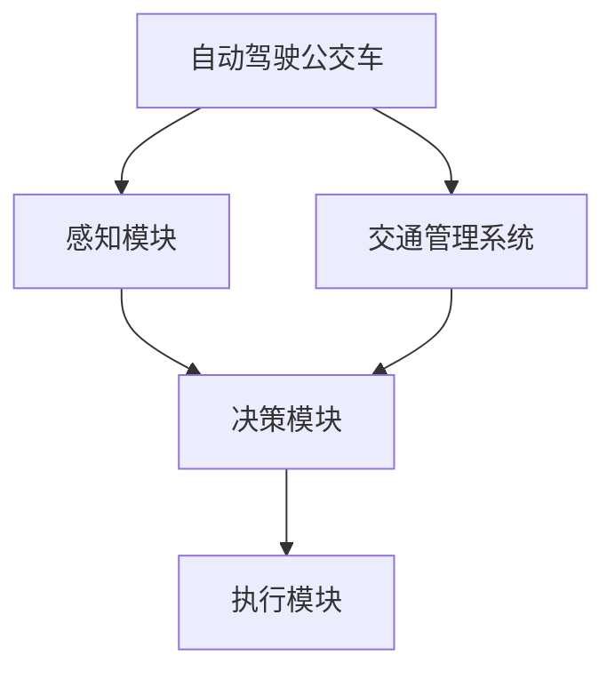
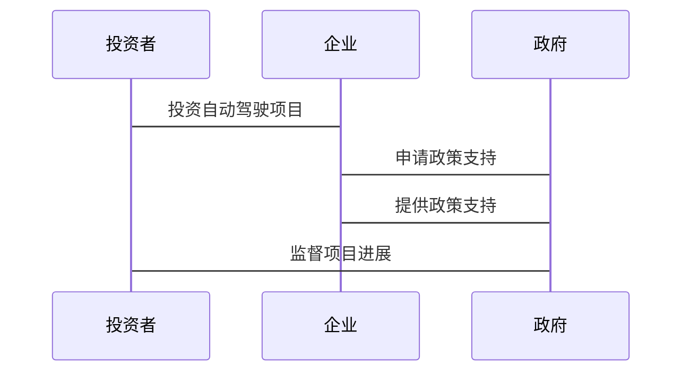

                 


# 价值投资中的智能交通自动驾驶公交系统分析

---

## 关键词：价值投资、智能交通、自动驾驶、公交系统、算法分析

---

## 摘要：  
本文从技术与投资的双重角度，深入分析智能交通领域的自动驾驶公交系统。通过背景介绍、核心概念、算法原理、系统架构、项目实战等多维度解析，揭示自动驾驶公交系统的投资价值与技术实现。结合价值投资的逻辑，为投资者和技术从业者提供全面的技术解读与投资建议。

---

## 目录

1. [背景介绍](#背景介绍)  
2. [核心概念与联系](#核心概念与联系)  
3. [算法原理讲解](#算法原理讲解)  
4. [系统分析与架构设计](#系统分析与架构设计)  
5. [项目实战](#项目实战)  
6. [最佳实践](#最佳实践)  

---

## 正文

---

### 第一部分：背景介绍

#### 1.1 价值投资的基本概念

价值投资是一种长期投资策略，核心在于寻找具有持续竞争优势、良好财务状况和合理估值的公司。其本质是通过深入分析企业基本面，发现市场低估的投资机会。

在智能交通领域，价值投资的对象可能包括自动驾驶技术、智能交通管理系统等。自动驾驶公交系统的投资价值，不仅取决于技术可行性，还与市场需求、政策支持和经济回报密切相关。

#### 1.2 智能交通系统的背景与现状

智能交通系统（ITS）是通过先进的技术手段，提高交通系统的效率、安全性和环保性。自动驾驶公交系统作为 ITS 的重要组成部分，近年来得到了快速发展。

目前，全球多地已开始试点自动驾驶公交车，例如中国的苏州和深圳。这些试点项目为价值投资提供了新的机会，同时也面临技术、政策和市场接受度等多重挑战。

#### 1.3 问题背景与问题描述

自动驾驶公交系统的核心问题包括：
- **技术问题**：感知、决策、规划和执行模块的可靠性与安全性。
- **市场问题**：市场需求的不确定性，政策法规的滞后性。
- **投资问题**：技术门槛高、投入周期长、回报不确定。

#### 1.4 问题解决与边界

通过技术创新、政策支持和市场推广，逐步解决自动驾驶公交系统的技术和市场问题。边界包括：
- 仅分析公交车，不包括私家车。
- 仅考虑城市交通，不涉及高速公路。

#### 1.5 核心要素与概念结构

自动驾驶公交系统的构成包括：
- **感知模块**：激光雷达、摄像头、雷达。
- **决策模块**：路径规划、行为决策。
- **执行模块**：动力系统、转向系统。

---

### 第二部分：核心概念与联系

#### 2.1 自动驾驶公交系统的原理

自动驾驶公交车通过传感器和算法实现自动驾驶。其核心原理包括：
- **感知**：通过激光雷达、摄像头等设备感知周围环境。
- **决策**：基于感知数据，规划路径并做出决策。
- **执行**：根据决策指令，控制车辆行驶。

#### 2.2 价值投资中的关键指标

- **技术壁垒**：自动驾驶技术的专利数量、技术先进性。
- **市场潜力**：城市化进程加快，公交需求增长。
- **财务表现**：企业的盈利能力、研发投入、资本支出。

#### 2.3 核心概念对比表格

| **对比项**       | **自动驾驶公交系统** | **传统公交系统** |
|--------------------|-----------------------|-------------------|
| 技术依赖         | 高度依赖AI技术       | 依赖人工驾驶       |
| 运行效率         | 更高                   | 较低             |
| 投资成本         | 高                    | 较低             |
| 维护成本         | 中高                   | 较低             |

#### 2.4 ER实体关系图

```mermaid
er
  actor 投资者
  actor 企业
  actor 政府
  class 技术
  class 市场
  class 产品
  class 财务
  class 政策
  relation 投资者 --> 技术: 评估技术可行性
  relation 投资者 --> 市场: 评估市场需求
  relation 企业 <---> 技术: 开发与应用
  relation 政府 <---> 政策: 制定与支持
  relation 技术 <---> 产品: 实现与应用
```

---

### 第三部分：算法原理讲解

#### 3.1 自动驾驶算法的核心技术

自动驾驶算法主要分为感知、决策和执行三个部分。

##### 3.1.1 感知算法

**目标检测算法**：使用深度学习模型（如YOLO、Faster R-CNN）检测车辆、行人、交通标志等目标。

**数学模型**：目标检测的损失函数公式为：
$$ \text{损失函数} = \text{分类损失} + \lambda \times \text{定位损失} $$

##### 3.1.2 决策算法

**路径规划算法**：基于强化学习的路径规划模型，通过深度 Q 网络（DQN）优化路径选择。

**数学模型**：
$$ \text{路径长度} = \sum_{i=1}^{n} d_i $$
$$ \text{障碍物距离} = \sqrt{(x_i - x_j)^2 + (y_i - y_j)^2} $$

##### 3.1.3 执行算法

**控制算法**：通过 PID 控制器实现车辆的加速、减速和转向。

---

#### 3.2 Python 实现

```python
import numpy as np
from tensorflow.keras import layers, Model

# 感知模块：目标检测模型
def build_detection_model():
    inputs = layers.Input(shape=(224, 224, 3))
    x = layers.Conv2D(64, (3,3), activation='relu')(inputs)
    x = layers.MaxPooling2D((2,2))(x)
    x = layers.Conv2D(128, (3,3), activation='relu')(x)
    x = layers.MaxPooling2D((2,2))(x)
    x = layers.Flatten()(x)
    x = layers.Dense(256, activation='relu')(x)
    outputs = layers.Dense(1, activation='sigmoid')(x)
    return Model(inputs=inputs, outputs=outputs)

# 决策模块：路径规划算法
def plan_route(start, end, obstacles):
    path = [start]
    current = start
    while current != end:
        next_points = []
        for neighbor in neighbors(current):
            if neighbor not in obstacles:
                next_points.append(neighbor)
        current = choose_next_point(next_points, path)
        path.append(current)
    return path

# 执行模块：控制算法
def control_system(desired_speed, current_speed):
    error = desired_speed - current_speed
    integral_error = integral_error + error * dt
    steer_angle = -kp * error - ki * integral_error
    return steer_angle
```

---

### 第四部分：系统分析与架构设计

#### 4.1 系统功能设计

- **感知模块**：实时感知环境，识别障碍物。
- **决策模块**：基于感知数据，规划路径。
- **执行模块**：根据决策指令，控制车辆行驶。
- **通信模块**：与交通管理系统通信。

#### 4.2 系统架构设计



#### 4.3 接口设计

- **感知模块接口**：提供传感器数据接口。
- **决策模块接口**：提供路径规划接口。
- **执行模块接口**：提供控制指令接口。

#### 4.4 交互序列图



---

### 第五部分：项目实战

#### 5.1 环境安装

- **Python**：安装 Python 3.8 或更高版本。
- **深度学习框架**：安装 TensorFlow、Keras。
- **依赖库**：安装 numpy、opencv、pytorch。

#### 5.2 核心代码实现

```python
import torch
import torch.nn as nn
import torch.optim as optim

# 定义目标检测模型
class YOLO(nn.Module):
    def __init__(self):
        super(YOLO, self).__init__()
        self.conv1 = nn.Conv2d(3, 64, 3, padding=1)
        self.pool1 = nn.MaxPool2d(2, 2)
        self.conv2 = nn.Conv2d(64, 128, 3, padding=1)
        self.pool2 = nn.MaxPool2d(2, 2)
        self.fc1 = nn.Linear(128 * 56 * 56, 256)
        self.fc2 = nn.Linear(256, 1)

    def forward(self, x):
        x = self.pool1(F.relu(self.conv1(x)))
        x = self.pool2(F.relu(self.conv2(x)))
        x = x.view(-1, 128 * 56 * 56)
        x = F.relu(self.fc1(x))
        x = self.fc2(x)
        return x

# 训练函数
def train_model(model, criterion, optimizer, dataloader, epochs=10):
    for epoch in range(epochs):
        model.train()
        for inputs, labels in dataloader:
            outputs = model(inputs)
            loss = criterion(outputs, labels)
            loss.backward()
            optimizer.step()
            optimizer.zero_grad()
```

#### 5.3 代码解读与分析

- **模型定义**：YOLO 模型用于目标检测。
- **训练函数**：使用交叉熵损失函数和随机梯度下降优化器。
- **数据加载**：使用数据加载器加载训练数据。

#### 5.4 实际案例分析

以某城市自动驾驶公交项目为例，分析其投资价值：
- **技术可行性**：已通过多次测试，技术成熟。
- **市场需求**：城市交通拥堵严重，自动驾驶公交可缓解压力。
- **政策支持**：地方政府出台相关政策，支持自动驾驶技术发展。

---

### 第六部分：最佳实践

#### 6.1 小结

自动驾驶公交系统是智能交通的重要组成部分，其技术实现复杂，但投资潜力巨大。投资者应关注技术壁垒、市场需求和政策支持。

#### 6.2 注意事项

- 投资前需全面评估技术风险。
- 关注政策变化对投资的影响。
- 考虑市场接受度和用户需求。

#### 6.3 拓展阅读

- 《深度学习实战》
- 《价值投资实战》
- 《自动驾驶技术与应用》

---

## 作者：AI天才研究院 & 禅与计算机程序设计艺术

---

通过以上结构和内容，文章从技术与投资双重角度，全面分析了自动驾驶公交系统的实现与价值，为投资者和技术从业者提供了详细的技术解读与投资建议。

