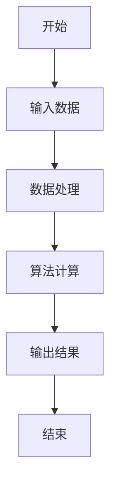
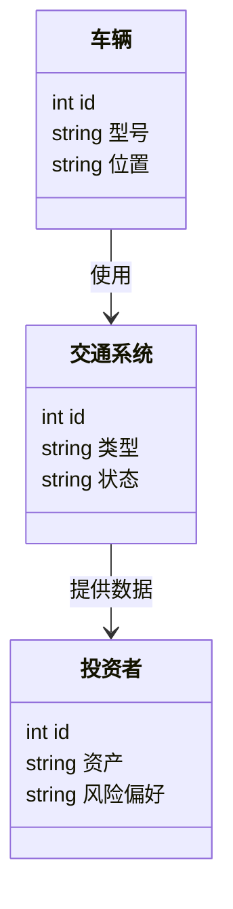
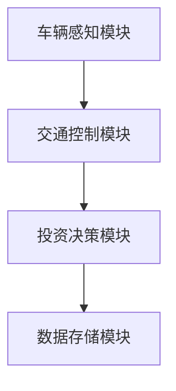
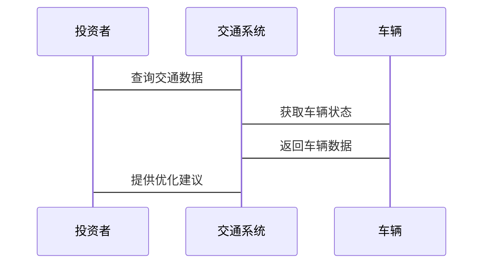

                 


```markdown
# 价值投资中的智能交通自动驾驶协同系统分析

> 关键词：智能交通、自动驾驶、协同系统、价值投资、算法原理、系统架构

> 摘要：本文分析了智能交通与自动驾驶协同系统的价值投资机会，探讨了协同系统的协同机制、算法原理和系统架构，结合实际案例，提出了投资策略和系统优化建议。

---

## 第1章: 背景介绍

### 1.1 智能交通与自动驾驶的定义与背景
#### 1.1.1 智能交通系统的基本概念
智能交通系统（ITS）利用信息技术、通信技术和数据处理技术，优化交通管理、减少拥堵、提升安全性。

#### 1.1.2 自动驾驶技术的发展历程
自动驾驶技术从早期的概念逐步发展，经历了技术突破和商业化应用的过程。

#### 1.1.3 价值投资与智能交通的结合
自动驾驶技术的应用为智能交通带来了新的投资机会，价值投资需考虑技术成熟度和市场潜力。

### 1.2 问题背景与问题描述
#### 1.2.1 智能交通中的投资机会
分析自动驾驶技术在智能交通中的应用前景。

#### 1.2.2 自动驾驶技术的商业化挑战
探讨自动驾驶技术在商业化过程中面临的技术和市场障碍。

#### 1.2.3 协同系统的必要性与目标
阐述智能交通与自动驾驶协同系统的必要性及其目标。

### 1.3 问题解决与边界分析
#### 1.3.1 协同系统的解决方案
通过协同系统实现资源优化和效率提升。

#### 1.3.2 系统的边界与外延
明确系统的边界和外延，确保系统的完整性和可扩展性。

#### 1.3.3 核心要素与组成结构
分析协同系统的核心要素及其组成结构。

## 第2章: 核心概念与协同机制

### 2.1 协同系统的核心概念
#### 2.1.1 协同系统的定义
协同系统是一种通过信息共享和协作控制，实现智能交通和自动驾驶协同运行的系统。

#### 2.1.2 系统的核心要素
包括车辆、交通系统、投资者等关键组成部分。

#### 2.1.3 系统的属性特征
协同性、实时性、安全性等系统属性特征。

### 2.2 协同机制的原理与流程
#### 2.2.1 信息共享机制
通过数据共享实现协同决策。

#### 2.2.2 协调控制机制
通过协调控制实现资源优化配置。

#### 2.2.3 优化决策机制
基于优化算法实现决策优化。

### 2.3 协同系统中的实体关系
#### 2.3.1 ER实体关系图
```mermaid
erDiagram
    participant 车辆 {
        string id
        string 型号
        string 位置
    }
    participant 交通系统 {
        string id
        string 类型
        string 状态
    }
    participant 投资者 {
        string id
        string 资产
        string 风险偏好
    }
    车辆 --> 交通系统 : 使用
    交通系统 --> 投资者 : 提供数据
```

## 第3章: 算法原理与实现

### 3.1 协同系统的算法概述
#### 3.1.1 算法的目标
实现智能交通和自动驾驶协同运行的优化决策。

#### 3.1.2 算法的输入与输出
输入包括交通数据、车辆状态等，输出包括优化策略、投资建议等。

#### 3.1.3 算法的流程


### 3.2 算法的核心实现
#### 3.2.1 路径规划算法
基于Dijkstra算法实现路径优化。
```python
import heapq

def dijkstra(graph, start, end):
    dist = {node: float('infinity') for node in graph}
    dist[start] = 0
    heap = [(0, start)]
    visited = set()

    while heap:
        current_dist, current_node = heapq.heappop(heap)
        if current_node in visited:
            continue
        visited.add(current_node)
        for neighbor, weight in graph[current_node].items():
            if dist[neighbor] > current_dist + weight:
                dist[neighbor] = current_dist + weight
                heapq.heappush(heap, (dist[neighbor], neighbor))
    return dist[end]
```

#### 3.2.2 目标检测算法
使用YOLO算法实现车辆检测。
```python
import cv2

def detect_objects(image_path):
    net = cv2.dnn.readNet("yolov4.cfg", "yolov4.weights")
    classes = ["vehicle", "road", "signal"]
    layer_names = net.getUnconnectedOutLayersNames()
    
    image = cv2.imread(image_path)
    height, width = image.shape[:2]
    blob = cv2.dnn.blobFromImage(image, 0.00392, (416, 416), swapRB=True, crop=False)
    net.setInput(blob)
    outputs = net.forward(layer_names)
    
    results = []
    for out in outputs:
        for detection in out:
            scores = detection[5:]
            class_id = np.argmax(scores)
            confidence = scores[class_id]
            if confidence > 0.5:
                x1 = int(detection[0] * width)
                y1 = int(detection[1] * height)
                x2 = int(detection[2] * width)
                y2 = int(detection[3] * height)
                results.append((x1, y1, x2, y2, class_id))
    return results
```

#### 3.2.3 投资回报预测模型
基于时间序列分析的预测模型。
```python
from statsmodels.tsa.arima_model import ARIMA

def predict RETURNS(series, order=(1, 1, 1)):
    model = ARIMA(series, order)
    model_fit = model.fit(disp=0)
    forecast = model_fit.forecast(steps=1)
    return forecast[0]
```

### 3.3 算法的数学模型与公式
#### 3.3.1 路径规划模型
目标函数：
$$ \text{min} \sum_{i=1}^{n} (c_i \cdot x_i) $$
约束条件：
$$ x_i \in \{0,1\} $$
$$ \sum_{i=1}^{n} x_i = k $$

#### 3.3.2 投资回报预测模型
回归模型：
$$ R = \beta_0 + \beta_1 X + \epsilon $$

## 第4章: 系统分析与架构设计

### 4.1 系统功能设计
#### 4.1.1 领域模型


### 4.2 系统架构设计
#### 4.2.1 模块划分


#### 4.2.2 接口设计
车辆感知模块接口：
```python
interface VehicleSensor {
    def get_vehicle_data(): -> VehicleData
}
```

### 4.3 系统交互设计
#### 4.3.1 交互流程


## 第5章: 项目实战

### 5.1 环境安装与配置
安装Python、OpenCV、TensorFlow等开发工具。

### 5.2 系统核心实现
#### 5.2.1 车辆检测模块实现
使用YOLO算法实现车辆检测。

#### 5.2.2 交通数据分析模块实现
使用Python进行数据分析和可视化。

### 5.3 代码实现与解读
#### 5.3.1 车辆检测代码
```python
import cv2

def detect_vehicles(image_path):
    # 加载YOLO模型并进行车辆检测
    # 返回检测到的车辆位置和类型
    pass
```

#### 5.3.2 数据分析代码
```python
import pandas as pd

def analyze_traffic_data(data_frame):
    # 对交通数据进行分析并生成可视化图表
    pass
```

### 5.4 案例分析与解读
以某个城市为例，分析协同系统的实际应用效果。

## 第6章: 投资策略与系统优化

### 6.1 投资策略分析
#### 6.1.1 风险评估
分析协同系统中的投资风险。

#### 6.1.2 投资回报预测
基于系统性能预测投资回报。

### 6.2 系统优化建议
#### 6.2.1 技术优化
优化算法性能和系统架构。

#### 6.2.2 业务优化
优化商业模式和市场策略。

## 第7章: 总结与展望

### 7.1 本章总结
总结协同系统的分析和研究成果。

### 7.2 未来展望
展望协同系统的发展前景和投资机会。

### 7.3 最佳实践 tips
给出投资和系统实施的最佳实践建议。

### 7.4 注意事项
提醒读者注意相关风险和挑战。

### 7.5 拓展阅读
推荐相关领域的阅读材料和学习资源。

---

# 作者：AI天才研究院/AI Genius Institute & 禅与计算机程序设计艺术 /Zen And The Art of Computer Programming
```

