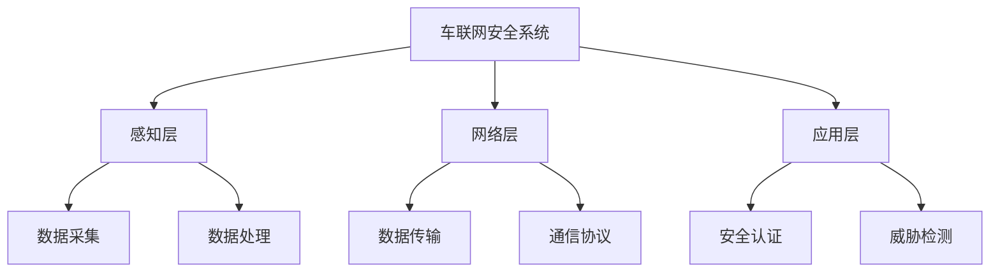
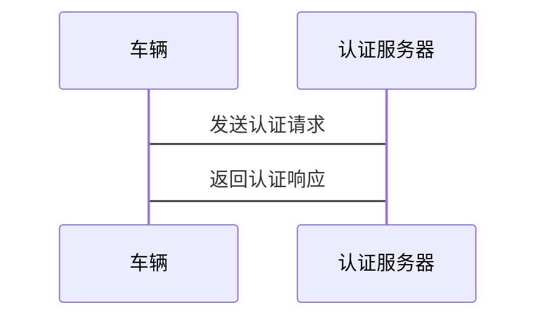
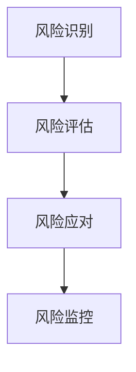

                 


# 价值投资中的智能交通车联网安全系统分析

> 关键词：价值投资、智能交通、车联网安全、系统分析、投资策略、技术实现、风险控制

> 摘要：本文从价值投资的角度，分析智能交通车联网安全系统的构建与实现。通过探讨车联网安全系统的架构设计、关键技术及算法实现，结合价值投资的分析框架，为投资者提供科学的决策依据，同时为技术实现者提供参考。

---

# 第1章 车联网安全系统的背景与价值

## 1.1 价值投资的核心理念

- **核心概念**：价值投资强调以低于内在价值的价格买入优质资产。
- **背景**：随着车联网技术的普及，车联网安全系统的价值日益凸显。
- **结合点**：车联网安全系统的投资价值在于其技术壁垒和市场需求。

## 1.2 车联网安全系统的概念与架构

- **定义**：车联网安全系统用于保护车辆通信和数据安全。
- **架构**：分为感知层、网络层、应用层，采用模块化设计。
- **功能**：数据加密、安全认证、威胁检测。

## 1.3 价值投资与车联网安全的结合

- **投资价值**：车联网安全是智能交通的关键，市场需求大。
- **技术壁垒**：高技术门槛保障投资回报。
- **投资策略**：选择具备技术优势和市场潜力的企业。

---

# 第2章 车联网安全系统的架构设计

## 2.1 系统核心概念与功能模块

- **通信协议**：采用LTE-V和DSRC，确保高效可靠。
- **数据加密**：使用AES算法，保障数据安全性。
- **安全认证**：基于数字证书，实现身份验证。

## 2.2 系统架构设计



## 2.3 关键技术分析

- **通信协议**：选择合适的协议，优化系统性能。
- **数据加密**：AES算法实现高效加密。
- **安全认证**：数字证书确保身份可靠性。

---

# 第3章 价值投资分析框架

## 3.1 财务指标分析

- **盈利能力**：ROE、净利润率等指标评估企业赚钱能力。
- **成长能力**：收入增长率反映市场扩展能力。
- **财务健康性**：现金流和负债率评估企业稳定性。

## 3.2 市场前景分析

- **行业规模**：车联网市场规模预测。
- **竞争格局**：主要参与者分析，竞争优势识别。
- **政策支持**：政府政策对企业发展的促进作用。

## 3.3 技术壁垒分析

- **专利数量**：企业技术实力的体现。
- **研发投入**：技术创新的保障。
- **技术优势**：与竞争对手相比的核心优势。

---

# 第4章 系统实现与算法分析

## 4.1 通信协议实现

- **选择与优化**：基于网络延迟和带宽选择协议。
- **实现步骤**：建立通信链路，数据传输，异常处理。
- **优化方法**：压缩算法、多线程优化。

## 4.2 数据加密实现

```python
import hashlib

def aes_encrypt(data, key):
    cipher = AES.new(key, AES.MODE_ECB)
    return cipher.encrypt(data)

def aes_decrypt(ciphertext, key):
    cipher = AES.new(key, AES.MODE_ECB)
    return cipher.decrypt(ciphertext)
```

## 4.3 安全认证实现

- **数字证书申请**：通过CA机构获取数字证书。
- **认证流程**：发送请求，验证证书，返回结果。
- **流程图**：



---

# 第5章 投资策略与风险管理

## 5.1 投资策略

- **分散投资**：降低单一项目风险。
- **长期持有**：价值投资需要耐心。
- **持续跟踪**：关注企业动态和市场变化。

## 5.2 风险管理

- **风险识别**：技术风险、市场风险、政策风险。
- **风险控制**：建立止损机制，制定应急预案。
- **风险管理流程**：



---

# 总结与展望

车联网安全系统作为智能交通的重要组成部分，其价值投资潜力巨大。通过科学的分析框架和系统设计，投资者和技术实现者可以共同推动行业进步。未来，随着技术的发展，车联网安全系统将更加智能化和高效。

---

# 参考文献

1. 约翰·邓普顿：《成功投资的秘诀》
2. 李笑来：《韭菜的自我修养》
3. 《车联网安全技术白皮书》
4. 《价值投资实战指南》

---

# 作者

**作者：AI天才研究院（AI Genius Institute） & 禅与计算机程序设计艺术（Zen And The Art of Computer Programming）**

---

这篇文章通过系统分析车联网安全系统的架构设计、关键技术及算法实现，结合价值投资的分析框架，为投资者和技术实现者提供了全面的指导。每一章节都详细阐述了核心内容，并通过图表和代码示例增强了理解。希望这篇文章能够帮助读者更好地理解车联网安全系统的投资价值和技术实现。

