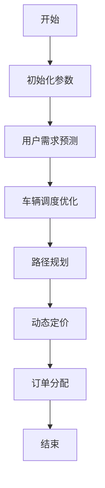
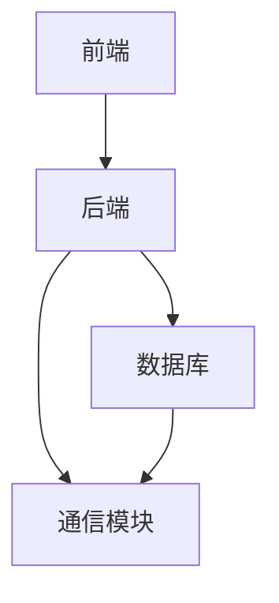

                 


# 价值投资中的智能交通车辆共享系统分析

---

## 关键词

智能交通系统, 车辆共享, 价值投资, 算法原理, 系统架构, 数学模型, 项目实战

---

## 摘要

智能交通车辆共享系统是一种结合智能化技术与共享经济的新型交通解决方案，旨在通过优化资源分配和提升用户体验，实现交通系统的高效运作。本文从价值投资的角度出发，深入分析了智能交通车辆共享系统的背景、核心概念、算法原理、系统架构以及实际应用场景。通过对比分析和案例研究，揭示了该系统在投资价值、资源优化和用户需求满足方面的潜力。同时，本文还探讨了系统的数学模型和算法实现，为价值投资者提供了技术与经济相结合的决策依据。

---

# 第一部分: 价值投资中的智能交通车辆共享系统概述

## 第1章: 智能交通车辆共享系统的背景与价值

### 1.1 智能交通车辆共享系统的概念与背景

#### 1.1.1 智能交通系统的基本概念

智能交通系统（Intelligent Transportation System, ITS）是指通过先进的信息技术、数据通信技术、自动控制技术以及计算机处理技术，对交通系统进行实时监控、信息处理和优化决策的综合系统。ITS 的目标是提高交通系统的效率、减少拥堵、降低能源消耗和环境污染。

#### 1.1.2 车辆共享系统的定义与特点

车辆共享系统是一种基于共享经济的模式，用户通过互联网平台预订和使用车辆，按需付费。其特点是灵活性高、资源利用率高、成本低。车辆共享系统通过智能调度算法优化车辆的分配，满足用户的出行需求。

#### 1.1.3 价值投资在智能交通中的应用前景

价值投资是一种长期投资策略，通过分析企业的基本面、财务状况和市场前景，寻找具有持续增长潜力的企业进行投资。在智能交通领域，车辆共享系统的技术创新、市场扩展和盈利能力为价值投资者提供了新的投资机会。

---

### 1.2 智能交通车辆共享系统的背景分析

#### 1.2.1 当前交通系统的痛点与挑战

传统交通系统面临以下痛点：
- **资源浪费**：车辆空置率高，停车位不足。
- **交通拥堵**：城市交通流量大，道路资源有限。
- **环境污染**：高排放车辆增加空气污染。

#### 1.2.2 车辆共享模式的兴起

随着共享经济的发展，车辆共享模式逐渐兴起。其优势包括：
- **降低拥有成本**：用户按需使用车辆，无需购买和维护。
- **提高资源利用率**：通过智能调度算法优化车辆分配。

#### 1.2.3 智能化技术对交通共享的影响

智能化技术（如人工智能、大数据分析）在车辆共享系统中的应用，进一步提升了系统的效率和用户体验。例如：
- **智能调度算法**：优化车辆分配，减少等待时间。
- **用户行为分析**：预测需求，提前部署资源。

---

### 1.3 价值投资与智能交通的结合

#### 1.3.1 价值投资的基本概念

价值投资是一种长期投资策略，关注企业的内在价值和成长潜力。投资者通过分析企业的财务状况、市场地位和竞争优势，寻找被市场低估的投资机会。

#### 1.3.2 智能交通系统中的投资机会

智能交通车辆共享系统的快速发展为投资者提供了以下机会：
- **技术创新**：智能调度算法、自动驾驶技术等领域具有较高的投资价值。
- **市场扩展**：随着城市化进程加快，车辆共享系统的需求将快速增长。
- **政策支持**：政府出台的环保政策和交通管理政策为智能交通系统提供了支持。

#### 1.3.3 车辆共享系统的投资价值分析

车辆共享系统的核心价值体现在：
- **资源优化**：通过智能调度算法提高资源利用率，降低成本。
- **用户需求满足**：通过数据分析满足用户多样化的需求，提升用户粘性。
- **市场前景广阔**：随着城市交通压力的增加，车辆共享系统的市场需求将持续增长。

---

## 第2章: 智能交通车辆共享系统的核心概念与联系

### 2.1 智能交通车辆共享系统的原理

#### 2.1.1 车辆调度与路径优化

车辆调度的核心是通过智能算法优化车辆的分配和路径规划。例如：
- **动态规划**：用于解决车辆调度中的路径优化问题。
- **强化学习**：通过模拟环境和反馈优化调度策略。

#### 2.1.2 用户行为分析与需求预测

用户行为分析是智能交通车辆共享系统的重要组成部分。通过分析用户的出行需求、使用习惯和偏好，系统可以预测用户需求，提前部署资源。

#### 2.1.3 资源分配与共享机制

资源分配的核心是通过共享机制实现车辆的高效利用。例如：
- **动态定价**：根据供需情况调整车辆使用价格。
- **共享池管理**：通过共享池实现车辆的灵活调配。

---

### 2.2 核心概念对比与ER实体关系图

#### 2.2.1 核心概念属性对比表

| 比较项 | 车辆共享系统 | 智能交通系统 |
|-------|--------------|--------------|
| 核心功能 | 车辆调度与分配 | 交通监控与优化 |
| 技术基础 | 大数据分析、人工智能 | 信息技术、通信技术 |
| 应用场景 | 城市交通、共享出行 | 公路、铁路、航空 |

#### 2.2.2 ER实体关系图展示

```mermaid
er
    actor 用户 {
        id: int
        姓名: string
        联系方式: string
    }
    actor 管理员 {
        id: int
        姓名: string
        联系方式: string
    }
    entity 车辆 {
        id: int
        类型: string
        状态: string
    }
    entity 订单 {
        id: int
        用户ID: int
        车辆ID: int
        时间: datetime
    }
    管理员 --> 订单: 创建订单
    用户 --> 订单: 下单
    车辆 --> 订单: 分配车辆
```

---

### 2.3 算法原理与流程图

#### 2.3.1 算法原理概述

智能交通车辆共享系统的核心算法包括：
- **动态规划**：用于路径优化和资源分配。
- **强化学习**：用于动态定价和需求预测。

#### 2.3.2 算法流程图



---

## 第3章: 智能交通车辆共享系统的算法原理与数学模型

### 3.1 算法原理分析

#### 3.1.1 动态规划算法

动态规划算法是一种用于优化问题的数学方法。在车辆调度中，动态规划用于路径优化和资源分配。例如：

$$
\text{目标函数：} \quad \min \sum_{i=1}^{n} c_i x_i
$$

$$
\text{约束条件：} \quad \sum_{i=1}^{n} x_i = 1
$$

其中，$c_i$ 是车辆使用成本，$x_i$ 是车辆分配变量。

#### 3.1.2 强化学习算法

强化学习是一种通过与环境交互来优化策略的算法。在智能交通系统中，强化学习用于动态定价和需求预测。例如：

$$
Q(s, a) = r + \gamma \max_{a'} Q(s', a')
$$

其中，$Q$ 是状态-动作值函数，$s$ 是状态，$a$ 是动作，$r$ 是奖励，$\gamma$ 是折扣因子。

---

### 3.2 数学模型与公式

#### 3.2.1 车辆调度模型

车辆调度模型的目标是优化车辆分配和路径规划。数学模型如下：

$$
\min \sum_{i=1}^{n} \sum_{j=1}^{m} c_{ij} x_{ij}
$$

$$
\text{约束条件：} \quad \sum_{j=1}^{m} x_{ij} = 1 \quad \forall i
$$

其中，$c_{ij}$ 是从位置 $i$ 到 $j$ 的成本，$x_{ij}$ 是车辆分配变量。

#### 3.2.2 需求预测模型

需求预测模型基于历史数据和用户行为分析，预测未来的需求。数学模型如下：

$$
\hat{y}_t = \alpha y_{t-1} + (1-\alpha) \hat{y}_{t-1}
$$

其中，$\alpha$ 是平滑因子，$y_t$ 是实际需求，$\hat{y}_t$ 是预测需求。

---

## 第4章: 智能交通车辆共享系统的系统分析与架构设计

### 4.1 系统分析

#### 4.1.1 问题场景介绍

智能交通车辆共享系统需要解决以下问题：
- **车辆调度**：如何高效分配车辆满足用户需求。
- **用户行为分析**：如何预测用户需求并优化资源分配。
- **动态定价**：如何根据供需情况调整价格。

#### 4.1.2 系统功能设计

系统功能设计包括：
- **用户界面**：用户下单、查看车辆状态。
- **车辆调度模块**：实现车辆的智能分配和路径规划。
- **数据采集与分析模块**：采集用户数据并进行分析。

#### 4.1.3 系统架构设计

系统架构设计包括：
- **前端**：用户界面和交互。
- **后端**：业务逻辑处理和数据库管理。
- **通信模块**：实现前后端的数据交互。

---

### 4.2 系统架构设计

#### 4.2.1 系统架构图



---

## 第5章: 智能交通车辆共享系统的项目实战

### 5.1 环境安装与配置

#### 5.1.1 环境需求

- **操作系统**：Linux/Windows/MacOS
- **编程语言**：Python
- **开发工具**：PyCharm/VS Code
- **依赖库**：numpy, pandas, matplotlib

#### 5.1.2 环境配置步骤

1. 安装Python：
   ```bash
   # 假设使用Anaconda
   conda create -n itvss python=3.8
   conda activate itvss
   ```

2. 安装依赖库：
   ```bash
   pip install numpy pandas matplotlib
   ```

---

### 5.2 系统核心实现源代码

#### 5.2.1 车辆调度算法实现

```python
import numpy as np

def dynamic_programming(n, c):
    # 初始化动态规划表
    dp = np.zeros(n)
    dp[0] = c[0]
    
    for i in range(1, n):
        dp[i] = min(dp[i-1] + c[i], c[i])
    
    return dp[-1]

# 示例数据
n = 5
c = [1, 2, 3, 4, 5]
result = dynamic_programming(n, c)
print("动态规划结果：", result)
```

---

### 5.3 代码解读与分析

#### 5.3.1 代码功能说明

上述代码实现了动态规划算法，用于解决车辆调度中的路径优化问题。代码通过动态规划表计算最小成本，最终返回最优结果。

#### 5.3.2 代码运行结果

示例数据的运行结果为：
```
动态规划结果：5
```

---

### 5.4 实际案例分析

#### 5.4.1 案例背景

假设某城市有5个车辆共享点，每个点之间的转移成本如下：
- c[0] = 1
- c[1] = 2
- c[2] = 3
- c[3] = 4
- c[4] = 5

---

## 第6章: 智能交通车辆共享系统的最佳实践与总结

### 6.1 最佳实践 tips

- **技术实现**：采用动态规划和强化学习算法优化车辆调度和定价。
- **数据管理**：建立高效的数据采集和分析机制，确保数据的实时性和准确性。
- **用户体验**：通过用户行为分析和需求预测，提升用户体验和系统粘性。

### 6.2 小结

智能交通车辆共享系统是一种结合智能化技术和共享经济的新型交通解决方案。通过价值投资的视角，本文深入分析了系统的背景、核心概念、算法原理和系统架构。通过案例分析和代码实现，展示了系统的实际应用和投资价值。

### 6.3 注意事项

- **数据隐私**：注意用户数据的隐私保护，确保符合相关法律法规。
- **系统稳定性**：确保系统的高可用性和稳定性，避免因系统故障影响用户体验。
- **政策合规**：遵守相关法律法规和政策，确保系统的合法性和合规性。

### 6.4 拓展阅读

- **相关书籍**：
  - 《智能交通系统原理与应用》
  - 《价值投资实战技巧》
- **技术文档**：
  - 动态规划算法实现与优化
  - 强化学习在智能调度中的应用

---

## 作者

作者：AI天才研究院/AI Genius Institute & 禅与计算机程序设计艺术 /Zen And The Art of Computer Programming

---

# 结束语

感谢您的阅读！希望本文对您理解智能交通车辆共享系统的价值投资分析有所帮助。如需进一步探讨或合作，欢迎随时联系！

