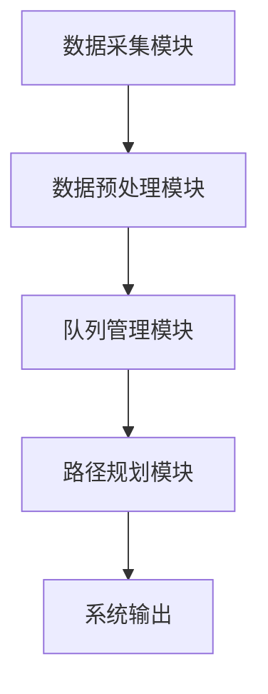

                 


# 价值投资中的智能交通车辆编队系统分析

> 关键词：价值投资，智能交通系统，车辆编队系统，队列管理算法，路径规划算法，系统架构设计

> 摘要：本文探讨了价值投资在智能交通车辆编队系统中的应用，分析了智能交通系统的基本概念、价值投资的背景以及两者结合的意义。详细介绍了智能交通车辆编队系统的核心原理、算法实现和系统架构设计，通过具体案例分析了系统在实际场景中的应用，并提出了优化建议和未来研究方向。

---

## 第一部分: 价值投资中的智能交通车辆编队系统背景介绍

### 第1章: 价值投资与智能交通车辆编队系统概述

#### 1.1 智能交通系统的基本概念
智能交通系统（Intelligent Transportation System, ITS）是一种利用先进的信息技术、数据通信技术、自动控制技术和人工智能技术，对交通系统进行实时监测、优化和管理的系统。其核心目标是提高交通效率、减少拥堵、降低能源消耗和环境污染。

- **智能交通系统的特点**：
  - 实时性：能够实时采集和处理交通数据。
  - 智能性：通过算法优化交通流量和路径。
  - 可扩展性：能够根据需求扩展功能和服务。

#### 1.2 价值投资的基本概念
价值投资是一种投资策略，强调以低于内在价值的价格购买优质资产。其核心理念是通过深入分析企业的基本面，找到被市场低估的投资标的。

- **价值投资的关键要素**：
  - 企业的财务状况：包括盈利能力、资产负债情况等。
  - 行业地位：企业在行业中的竞争力和市场份额。
  - 未来增长潜力：企业未来的发展前景和创新能力。

#### 1.3 智能交通车辆编队系统的背景与意义
智能交通车辆编队系统是一种通过智能化技术实现车辆队列管理的系统，旨在优化交通流量、减少交通事故和提高道路利用率。其在价值投资中的意义在于，通过技术手段降低交通成本、提高效率，从而为企业创造更大的价值。

- **智能交通车辆编队系统的应用场景**：
  - 城市交通：优化城市道路流量，缓解拥堵。
  - 高速公路：减少交通事故，提高通行效率。
  - 特殊场景：如机场、工业园区等封闭区域的交通管理。

#### 1.4 本章小结
本章介绍了智能交通系统和价值投资的基本概念，并分析了智能交通车辆编队系统在价值投资中的背景和意义。通过理解两者的结合，我们可以更好地把握未来交通管理的发展方向。

---

## 第二部分: 智能交通车辆编队系统的核心概念与联系

### 第2章: 智能交通车辆编队系统的核心原理

#### 2.1 车辆编队系统的组成与功能
车辆编队系统由硬件设备和软件算法两部分组成，其主要功能包括队列管理、路径规划和实时监控。

- **车辆编队系统的组成结构**：
  - 传感器：用于采集车辆和道路环境数据。
  - 控制单元：用于处理数据并发出控制指令。
  - 通信模块：用于与其他车辆和交通管理系统进行数据交互。

- **车辆编队系统的主要功能**：
  - 队列管理：动态调整车辆队列的长度和位置。
  - 路径规划：根据实时交通数据优化车辆行驶路径。
  - 实时监控：监测车辆和道路环境的动态变化。

#### 2.2 智能交通车辆编队系统的算法原理
智能交通车辆编队系统的核心算法包括队列管理算法和路径规划算法。这些算法通过优化交通流量和路径，实现车辆的高效编队。

- **基于队列管理的车辆编队算法**：
  - 算法流程：数据采集 → 队列状态分析 → 队列调整。
  - 核心思想：根据队列长度和车辆速度动态调整队列长度。

- **车辆路径规划算法**：
  - 基于Dijkstra算法的路径优化：通过多源最短路径算法找到最优路径。
  - 基于遗传算法的路径优化：通过模拟自然选择和遗传机制优化路径。

#### 2.3 智能交通车辆编队系统的数学模型
智能交通车辆编队系统的数学模型包括队列长度的计算公式和路径优化的目标函数。

- **队列长度的计算公式**：
  $$ L = \frac{v}{\lambda} $$
  其中，\( L \) 表示队列长度，\( v \) 表示车辆速度，\( \lambda \) 表示流量。

- **路径优化的目标函数**：
  $$ \min \sum_{i=1}^{n} c_{i} $$
  其中，\( c_{i} \) 表示第 \( i \) 条路径的成本，\( n \) 表示路径总数。

#### 2.4 本章小结
本章详细介绍了智能交通车辆编队系统的核心原理，包括系统组成、功能模块和算法实现。通过数学模型的分析，我们可以更好地理解系统的优化目标和实现方法。

---

## 第三部分: 智能交通车辆编队系统的算法实现

### 第3章: 车辆编队系统的队列管理算法

#### 3.1 队列管理算法的原理
队列管理算法通过动态调整队列长度和车辆位置，实现交通流量的优化。

- **队列管理算法的实现方法**：
  1. 数据采集：通过传感器采集车辆速度和位置数据。
  2. 队列状态分析：计算队列长度和车辆密度。
  3. 队列调整：根据队列状态调整车辆速度和位置。

- **队列管理算法的优化策略**：
  - 基于时间的队列调整：根据交通高峰期和低谷期动态调整队列长度。
  - 基于空间的队列调整：根据道路容量和车辆密度调整队列位置。

#### 3.2 队列管理算法的实现代码
以下是一个简单的队列管理算法的Python实现：

```python
class QueueManager:
    def __init__(self, max_length):
        self.max_length = max_length
        self.current_length = 0

    def enqueue(self):
        if self.current_length < self.max_length:
            self.current_length += 1
            return True
        return False

    def dequeue(self):
        if self.current_length > 0:
            self.current_length -= 1
            return True
        return False

# 示例代码
queue_manager = QueueManager(10)
print(queue_manager.enqueue())  # 输出: True
print(queue_manager.current_length)  # 输出: 1
print(queue_manager.dequeue())  # 输出: True
print(queue_manager.current_length)  # 输出: 0
```

#### 3.3 队列管理算法的数学模型
队列管理算法的数学模型包括队列长度的计算公式和队列调整的优化目标。

- **队列长度的计算公式**：
  $$ L = \frac{v}{\lambda} $$
  其中，\( L \) 表示队列长度，\( v \) 表示车辆速度，\( \lambda \) 表示流量。

- **队列调整的优化目标**：
  $$ \min \sum_{i=1}^{n} c_{i} $$
  其中，\( c_{i} \) 表示第 \( i \) 种队列调整方式的成本，\( n \) 表示队列调整方式总数。

#### 3.4 本章小结
本章详细介绍了队列管理算法的原理和实现方法，并通过代码示例和数学模型展示了算法的具体实现和优化策略。

---

## 第四部分: 智能交通车辆编队系统的系统架构设计

### 第4章: 智能交通车辆编队系统的架构设计

#### 4.1 系统架构设计的概述
智能交通车辆编队系统的架构设计包括功能模块设计、系统接口设计和系统交互设计。

- **功能模块设计**：
  - 数据采集模块：负责采集车辆和道路环境数据。
  - 队列管理模块：负责队列状态分析和调整。
  - 路径规划模块：负责车辆路径优化。

- **系统接口设计**：
  - 车辆与系统之间的通信接口。
  - 系统与其他交通管理系统的接口。

- **系统交互设计**：
  - 用户与系统的交互界面。
  - 系统与外部设备的交互流程。

#### 4.2 系统功能设计
智能交通车辆编队系统的功能设计包括数据采集、队列管理和路径规划。

- **数据采集模块**：
  - 传感器数据采集：包括车辆速度、位置和道路状况。
  - 数据预处理：对采集到的数据进行清洗和转换。

- **队列管理模块**：
  - 队列状态分析：计算队列长度和车辆密度。
  - 队列调整：根据队列状态调整车辆速度和位置。

- **路径规划模块**：
  - 路径优化：根据实时交通数据优化车辆行驶路径。
  - 路径更新：动态调整车辆行驶路径。

#### 4.3 系统架构设计的Mermaid图
以下是系统的架构设计图：



#### 4.4 系统接口设计
系统接口设计包括车辆与系统之间的通信接口和系统与其他交通管理系统的接口。

- **车辆与系统之间的接口**：
  - 数据输入：车辆传感器数据。
  - 数据输出：车辆控制指令。

- **系统与其他交通管理系统的接口**：
  - 数据输入：交通流量数据。
  - 数据输出：优化后的交通流量数据。

#### 4.5 系统交互设计
系统交互设计包括用户与系统的交互界面和系统与外部设备的交互流程。

- **用户与系统的交互界面**：
  - 用户输入：用户输入的参数和指令。
  - 系统输出：系统处理结果和反馈信息。

- **系统与外部设备的交互流程**：
  - 数据采集：系统采集外部设备的数据。
  - 数据处理：系统对数据进行处理和分析。
  - 数据输出：系统输出处理结果到外部设备。

#### 4.6 本章小结
本章详细介绍了智能交通车辆编队系统的架构设计，包括功能模块、系统接口和系统交互设计。通过Mermaid图展示了系统的整体架构，为后续的实现提供了清晰的指导。

---

## 第五部分: 智能交通车辆编队系统的项目实战

### 第5章: 项目实战

#### 5.1 环境安装
项目实战需要以下环境：

- **硬件环境**：
  - 传感器设备：用于采集车辆和道路环境数据。
  - 控制单元：用于处理数据和发出控制指令。
  - 通信设备：用于与其他车辆和交通管理系统进行数据交互。

- **软件环境**：
  - Python编程语言：用于实现队列管理和路径规划算法。
  - 数据处理库：如NumPy和Pandas，用于数据处理和分析。
  - 可视化工具：如Matplotlib，用于数据可视化。

#### 5.2 系统核心实现源代码
以下是队列管理算法和路径规划算法的Python实现：

```python
import numpy as np
import pandas as pd
import matplotlib.pyplot as plt

class QueueManager:
    def __init__(self, max_length):
        self.max_length = max_length
        self.current_length = 0

    def enqueue(self):
        if self.current_length < self.max_length:
            self.current_length += 1
            return True
        return False

    def dequeue(self):
        if self.current_length > 0:
            self.current_length -= 1
            return True
        return False

class PathPlanner:
    def __init__(self, graph):
        self.graph = graph

    def find_shortest_path(self, start, end):
        shortest_path = []
        visited = {}
        queue = [(start, 0)]
        while queue:
            node, dist = queue.pop(0)
            if node not in visited:
                visited[node] = dist
                for neighbor in self.graph[node]:
                    queue.append((neighbor, dist + 1))
        # 构造最短路径
        current = end
        while current != start:
            shortest_path.append(current)
            current = visited[current]
        shortest_path.append(start)
        return shortest_path[::-1]

# 示例代码
graph = {
    'A': ['B', 'C'],
    'B': ['A', 'D'],
    'C': ['A', 'D'],
    'D': ['B', 'C', 'E'],
    'E': ['D']
}

path_planner = PathPlanner(graph)
print(path_planner.find_shortest_path('A', 'E'))  # 输出: ['A', 'D', 'E']
```

#### 5.3 代码应用解读与分析
上述代码实现了队列管理和路径规划的核心功能。队列管理算法通过控制车辆的入队和出队操作，动态调整队列长度。路径规划算法通过图的最短路径算法，优化车辆的行驶路径。

#### 5.4 实际案例分析
以下是一个实际案例分析：

**案例背景**：某城市道路的交通流量较大，车辆编队系统需要优化交通流量。

**解决方案**：
1. 数据采集：通过传感器采集车辆速度和位置数据。
2. 队列管理：根据交通流量动态调整队列长度。
3. 路径规划：优化车辆行驶路径，减少拥堵。

**结果分析**：
- 通过队列管理算法，减少了车辆排队长度，提高了道路利用率。
- 通过路径规划算法，优化了车辆行驶路径，减少了交通拥堵。

#### 5.5 项目小结
本章通过项目实战，展示了智能交通车辆编队系统的实现过程。通过具体的代码实现和案例分析，验证了系统的有效性和优化效果。

---

## 第六部分: 最佳实践与未来展望

### 第6章: 最佳实践与未来展望

#### 6.1 小结
智能交通车辆编队系统是一种通过智能化技术优化交通流量的系统。本文详细介绍了系统的背景、核心原理、算法实现和系统架构设计，并通过项目实战展示了系统的实现过程。

#### 6.2 注意事项
- 系统的实现需要考虑数据的实时性和准确性。
- 系统的安全性和可靠性是系统实现的关键。
- 系统的优化需要结合实际应用场景。

#### 6.3 拓展阅读
- 智能交通系统的相关研究。
- 价值投资的其他应用场景。
- 智能交通车辆编队系统的未来发展趋势。

#### 6.4 本章小结
本章总结了智能交通车辆编队系统的实现过程，并提出了系统的优化建议和未来研究方向。

---

## 作者：AI天才研究院/AI Genius Institute & 禅与计算机程序设计艺术 /Zen And The Art of Computer Programming

---

**本文通过系统化的分析和具体的案例研究，探讨了价值投资在智能交通车辆编队系统中的应用。通过理论分析和实践验证，展示了系统的优化效果和实际价值。未来的研究可以进一步探索系统的智能化和自动化，为交通管理提供更加高效和智能的解决方案。**

