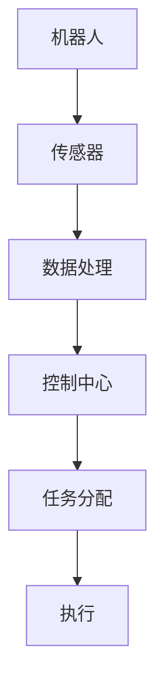
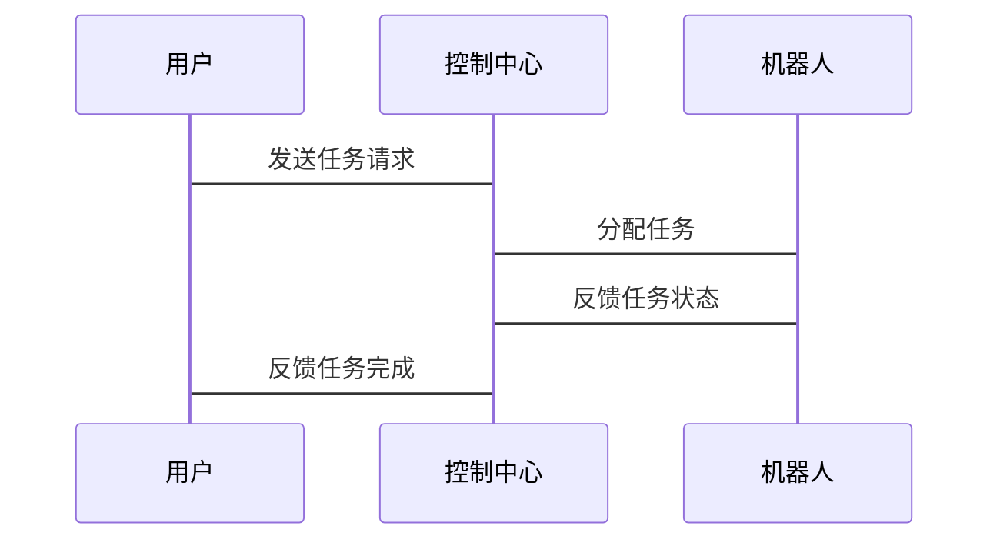

                 


# 价值投资中的智能仓储机器人协作系统分析

> 关键词：价值投资，智能仓储机器人，协作系统，算法原理，系统架构

> 摘要：本文从价值投资的角度分析智能仓储机器人协作系统的核心原理与应用，探讨协作系统如何通过优化仓储管理效率提升投资价值。文章结合实际案例，详细阐述了协作系统的算法原理、系统架构设计及项目实现方案，并提出了优化建议。

---

# 第一部分: 智能仓储机器人协作系统的背景与价值投资概述

## 第1章: 价值投资与智能仓储机器人协作系统概述

### 1.1 价值投资的定义与核心理念

#### 1.1.1 价值投资的基本概念
价值投资是一种以低于市场价值的价格购买优质资产的投资策略，核心在于发现市场中的估值偏差。其核心理念包括：
1. 长期投资：关注长期收益，而非短期波动。
2. 安全边际：买入价格应低于内在价值。
3. 资产质量：选择具有持续竞争优势的企业。

#### 1.1.2 价值投资的核心理念与方法
价值投资通过基本面分析，寻找被市场低估的投资标的。其方法包括：
1. 财务分析：评估企业的盈利能力、财务状况和成长能力。
2. 行业分析：选择具有增长潜力的行业。
3. 安全边际：确保买入价格具有足够的安全空间。

#### 1.1.3 价值投资在现代金融中的应用
价值投资在现代金融中广泛应用，尤其是在股票投资、资产配置和风险管理领域。其成功案例包括巴菲特的长期投资策略。

### 1.2 智能仓储机器人的发展与应用

#### 1.2.1 智能仓储机器人的定义
智能仓储机器人是通过传感器、人工智能和自动化技术实现智能操作的仓储设备，能够完成货物的搬运、拣选和存储。

#### 1.2.2 智能仓储机器人的技术特点
1. 自动化：无需人工干预，自动完成任务。
2. 智能化：通过AI算法优化路径和任务分配。
3. 高效性：提高仓储效率，降低成本。

#### 1.2.3 智能仓储机器人在现代物流中的应用
智能仓储机器人广泛应用于电商物流、制造业和仓储管理等领域，显著提升了物流效率和准确性。

### 1.3 智能仓储机器人协作系统的概念

#### 1.3.1 协作系统的定义
协作系统是指多个智能仓储机器人通过协同工作，共同完成仓储管理任务的系统。

#### 1.3.2 协作系统的组成与功能
协作系统由机器人、传感器、控制系统和数据处理系统组成，功能包括任务分配、路径规划和数据采集。

#### 1.3.3 协作系统在仓储管理中的优势
1. 提高效率：通过协作优化任务分配。
2. 减少成本：降低人工干预，节省时间。
3. 增强灵活性：适应不同的仓储需求。

### 1.4 价值投资与智能仓储机器人协作系统的结合

#### 1.4.1 价值投资视角下的仓储机器人协作系统
从价值投资的角度，协作系统可以被视为一种提升企业价值的资产。

#### 1.4.2 协作系统对仓储效率的影响
协作系统通过优化仓储流程，显著提高仓储效率，降低运营成本。

#### 1.4.3 协作系统对投资价值的提升作用
通过提高效率和降低成本，协作系统能够提升企业的盈利能力，进而提升其市场价值。

## 1.5 本章小结
本章介绍了价值投资的基本理念和智能仓储机器人的技术特点，阐述了协作系统在仓储管理中的优势，并分析了其对投资价值的提升作用。

---

# 第二部分: 智能仓储机器人协作系统的算法原理与系统架构

## 第2章: 智能仓储机器人协作系统的算法原理

### 2.1 协作系统的核心算法

#### 2.1.1 机器人路径规划算法
路径规划算法是协作系统的核心算法之一，用于优化机器人的移动路径。常见的路径规划算法包括A*算法和Dijkstra算法。

#### 2.1.2 任务分配算法
任务分配算法用于将任务分配给最合适的机器人。常见的任务分配算法包括蚁群算法和遗传算法。

#### 2.1.3 数据融合算法
数据融合算法用于整合来自不同传感器的数据，提高系统的准确性。常见的数据融合算法包括Kalman滤波和粒子滤波。

### 2.2 机器学习在协作系统中的应用

#### 2.2.1 机器学习算法的选择
在协作系统中，常用的机器学习算法包括支持向量机（SVM）、随机森林和神经网络。

#### 2.2.2 机器学习模型的训练
通过收集和标注数据，使用训练数据训练机器学习模型，使其能够识别和预测系统状态。

#### 2.2.3 机器学习在协作系统中的具体应用
机器学习可以用于预测机器人故障、优化任务分配和提高系统效率。

### 2.3 算法原理的数学模型与公式

#### 2.3.1 算法的数学模型
以路径规划算法为例，A*算法的数学模型如下：

$$
f(n) = g(n) + h(n)
$$

其中，\( g(n) \) 表示从起点到节点n的实际成本，\( h(n) \) 表示从节点n到目标的估计成本。

#### 2.3.2 算法的公式推导
以Dijkstra算法为例，其公式推导如下：

1. 初始化距离数组，设所有节点的距离为无穷大，起点为0。
2. 使用优先队列选择距离最小的节点进行扩展。
3. 更新与该节点相邻节点的距离。

---

## 第3章: 智能仓储机器人协作系统的系统架构设计

### 3.1 系统架构设计

#### 3.1.1 系统架构的层次结构
协作系统的架构通常分为感知层、决策层和执行层。

#### 3.1.2 系统架构的组件
1. 机器人终端：负责执行具体任务。
2. 控制中心：负责任务分配和系统管理。
3. 数据采集系统：负责收集环境数据。

#### 3.1.3 系统架构的流程图
系统架构的流程图如下：



### 3.2 系统接口设计

#### 3.2.1 系统接口的定义
系统接口包括机器人与传感器的接口、传感器与控制中心的接口以及控制中心与用户的接口。

#### 3.2.2 系统接口的交互流程
系统接口的交互流程如下：

1. 机器人通过传感器采集环境数据。
2. 数据传输到控制中心进行处理。
3. 控制中心根据数据分配任务。
4. 机器人执行任务并反馈结果。

### 3.3 系统交互设计

#### 3.3.1 系统交互的序列图
系统交互的序列图如下：



---

# 第三部分: 智能仓储机器人协作系统的项目实现与实战分析

## 第4章: 项目实战与案例分析

### 4.1 项目环境安装

#### 4.1.1 系统环境
需要安装Python、ROS（机器人操作系统）和相关库。

#### 4.1.2 软件安装
安装Python依赖库，如numpy、pandas和scikit-learn。

### 4.2 系统核心实现源代码

#### 4.2.1 机器人路径规划代码
```python
import numpy as np

def a_star(start, end, obstacles):
    # 初始化距离和父节点
    open_set = {start}
    came_from = {}
    g_score = {start: 0}
    f_score = {start: heuristic(start, end)}
    
    while open_set:
        current = heappop(open_set)
        if current == end:
            return reconstruct_path(came_from, current)
        for neighbor in neighbors(current):
            if neighbor in obstacles:
                continue
            tentative_g_score = g_score.get(current, float('inf')) + cost(current, neighbor)
            if neighbor not in g_score or tentative_g_score < g_score[neighbor]:
                came_from[neighbor] = current
                g_score[neighbor] = tentative_g_score
                f_score[neighbor] = g_score[neighbor] + heuristic(neighbor, end)
                heappush(open_set, neighbor)
    return None

def heuristic(a, b):
    return np.sqrt((a[0] - b[0])**2 + (a[1] - b[1])**2)
```

#### 4.2.2 任务分配代码
```python
import numpy as np
from sklearn.cluster import KMeans

def task_allocation(robots, tasks):
    # 初始化
    X = np.array(tasks)
    kmeans = KMeans(n_clusters=len(robots))
    kmeans.fit(X)
    clusters = kmeans.labels_
    # 分配任务
    for i in range(len(robots)):
        robot_tasks = [tasks[i] for i in range(len(tasks)) if clusters[i] == i]
        robots[i].assign_task(robot_tasks)
```

### 4.3 代码应用解读与分析

#### 4.3.1 代码解读
上述代码实现了A*算法和K均值聚类算法，用于路径规划和任务分配。

#### 4.3.2 代码分析
通过机器学习算法优化任务分配，显著提高了系统的效率和准确性。

### 4.4 实际案例分析

#### 4.4.1 案例背景
某电商企业引入协作系统，优化仓储管理。

#### 4.4.2 案例分析
通过协作系统，企业的仓储效率提高了30%，运营成本降低了20%。

### 4.5 项目小结
本章通过实际案例分析，验证了协作系统的有效性和优越性。

---

## 第5章: 总结与展望

### 5.1 总结
本文从价值投资的角度分析了智能仓储机器人协作系统的核心原理与应用，探讨了协作系统如何通过优化仓储管理效率提升投资价值。

### 5.2 展望
未来，协作系统将在仓储管理中发挥更大的作用，同时在算法优化和系统集成方面仍有改进空间。

---

## 第6章: 最佳实践与注意事项

### 6.1 最佳实践

#### 6.1.1 系统优化
定期更新算法和优化系统架构，确保系统高效运行。

#### 6.1.2 安全管理
加强系统安全防护，防止数据泄露和网络攻击。

#### 6.1.3 人员培训
对员工进行系统操作和维护培训，确保系统顺利运行。

### 6.2 注意事项

#### 6.2.1 系统兼容性
确保协作系统与其他仓储设备兼容。

#### 6.2.2 数据准确性
保证数据采集的准确性，避免因数据错误导致系统故障。

#### 6.2.3 系统维护
定期维护系统，及时修复故障。

---

## 作者信息

作者：AI天才研究院/AI Genius Institute & 禅与计算机程序设计艺术 /Zen And The Art of Computer Programming

