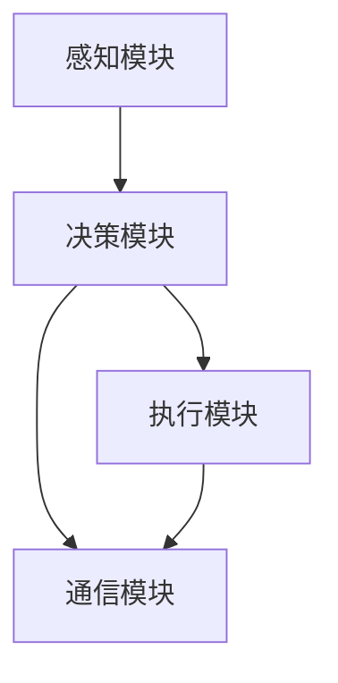
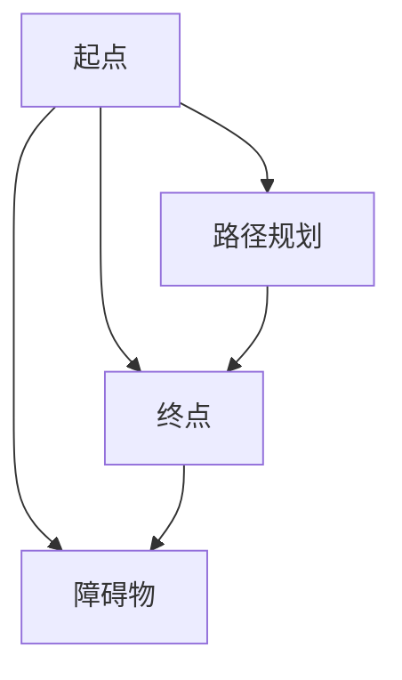
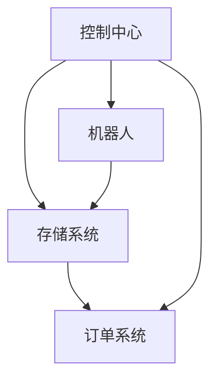

                 


# 价值投资中的智能仓储机器人系统分析

> 关键词：价值投资，智能仓储机器人，系统分析，算法原理，系统架构

> 摘要：本文分析了智能仓储机器人系统在价值投资中的应用，探讨了系统的核心概念、算法原理、系统架构，提供了项目实战案例和最佳实践建议。

---

## 第一部分: 价值投资中的智能仓储机器人系统概述

### 第1章: 智能仓储机器人系统背景与价值投资概述

#### 1.1 智能仓储机器人系统的发展背景

智能仓储机器人系统是现代物流和仓储行业的重要组成部分，随着科技的进步，仓储行业正逐步从人工化向智能化转变。智能仓储机器人通过自动化技术、物联网技术和人工智能技术的结合，实现了仓储管理的高效化和精准化。这种技术的应用不仅提高了仓储效率，还降低了运营成本，为企业的价值创造提供了新的可能性。

在价值投资的角度来看，智能仓储机器人系统的应用能够显著提升企业的运营效率和盈利能力，从而为投资者带来更高的投资回报。因此，智能仓储机器人系统的价值不仅体现在技术层面，更体现在其对企业价值的提升能力。

#### 1.2 价值投资的基本概念

价值投资是一种以低于市场价值的价格购买优质资产的投资策略。其核心理念是通过深入分析企业的基本面，寻找那些被市场低估的企业，长期持有以获得超额收益。价值投资的关键在于对企业内在价值的评估，这要求投资者具备扎实的财务分析能力和对企业运营模式的深刻理解。

在智能仓储机器人系统的背景下，价值投资的对象可以是相关企业（如仓储机器人制造商或应用企业），也可以是通过引入智能仓储机器人技术优化自身运营的企业。通过分析这些企业在引入智能仓储机器人技术后的盈利能力和竞争优势，投资者可以更准确地评估其内在价值。

---

### 第2章: 智能仓储机器人系统的核心概念与体系结构

#### 2.1 智能仓储机器人系统的定义与特征

智能仓储机器人系统是一种基于人工智能、物联网和自动化技术的仓储管理解决方案。它通过机器人设备（如无人搬运车、拣选机器人等）实现仓储货物的自动化存储、拣选、搬运和包装等操作。与传统仓储相比，智能仓储机器人系统具有以下核心特征：

- **自动化**：机器人能够独立完成仓储操作，减少人工干预。
- **智能化**：通过传感器和AI算法，机器人能够感知环境并做出决策。
- **高效性**：智能仓储机器人系统能够显著提高仓储效率，降低运营成本。
- **可扩展性**：系统可以根据需求灵活扩展，适应不同规模的仓储场景。

#### 2.2 智能仓储机器人系统的体系结构

智能仓储机器人系统的体系结构可以分为以下几个核心模块：

1. **感知模块**：通过传感器和摄像头等设备感知仓储环境。
2. **决策模块**：基于感知数据和预设算法做出操作决策。
3. **执行模块**：通过机器人设备执行具体的操作。
4. **通信模块**：实现机器人与控制中心的数据交互。

以下是一个简化的系统架构图：



---

## 第三部分: 价值投资中的智能仓储机器人系统分析

### 第3章: 智能仓储机器人系统的算法原理与数学模型

#### 3.1 系统核心算法概述

智能仓储机器人系统的算法主要集中在路径规划、库存管理和异常处理三个方面。

- **路径规划算法**：用于机器人在复杂环境中找到最优路径。
- **库存管理算法**：用于实时监控和优化库存分布。
- **异常处理算法**：用于处理系统运行中的突发事件。

#### 3.2 路径规划算法实现

路径规划是智能仓储机器人系统的核心算法之一。常用算法包括A*算法和遗传算法。以下是一个简化的A*算法流程图：



A*算法的数学模型可以表示为：

$$
\text{cost}(s, a) = \text{g}(s) + \text{h}(s)
$$

其中，$\text{g}(s)$表示从起点到当前点的实际成本，$\text{h}(s)$表示从当前点到终点的估算成本。

---

### 第4章: 智能仓储机器人系统的系统架构设计

#### 4.1 系统功能设计

智能仓储机器人系统的功能模块包括：

1. **货物存储**：实现货物的自动存储和检索。
2. **货物拣选**：根据订单需求拣选货物。
3. **货物搬运**：将拣选的货物搬运至指定区域。
4. **货物包装**：对货物进行包装并准备发货。

#### 4.2 系统架构设计

以下是一个简化的系统架构图：



---

## 第五部分: 价值投资中的智能仓储机器人系统应用案例

### 第5章: 项目实战——智能仓储机器人在电商仓库中的应用

#### 5.1 项目背景与目标

随着电商行业的快速发展，仓储管理的效率成为制约企业发展的关键因素。通过引入智能仓储机器人系统，电商仓库可以显著提高订单处理速度和库存管理效率。

#### 5.2 系统实现

以下是系统实现的核心代码示例：

```python
import math

class WarehouseRobot:
    def __init__(self, x, y):
        self.x = x
        self.y = y

    def move_to(self, target_x, target_y):
        # 计算路径
        path = self.find_path(self.x, self.y, target_x, target_y)
        # 执行移动
        for point in path:
            self.update_position(point.x, point.y)

    def find_path(self, start_x, start_y, end_x, end_y):
        # 简化路径规划算法
        path = []
        # 假设直接移动到目标位置
        path.append((end_x, end_y))
        return path

# 示例应用
robot = WarehouseRobot(0, 0)
robot.move_to(10, 10)
```

---

### 第6章: 最佳实践与投资建议

#### 6.1 投资建议

在选择智能仓储机器人系统相关的投资标的时，投资者应重点关注以下几点：

- **技术壁垒**：企业的技术储备和创新能力。
- **市场需求**：行业对智能仓储机器人的需求量。
- **运营效率**：企业引入智能仓储机器人后的效率提升情况。

#### 6.2 项目小结

智能仓储机器人系统的应用不仅能够显著提升企业的运营效率，还能够为投资者带来可观的投资回报。在选择投资标的时，建议投资者深入分析企业的技术实力和市场前景，结合价值投资的基本原则做出决策。

---

## 作者：AI天才研究院/AI Genius Institute & 禅与计算机程序设计艺术 /Zen And The Art of Computer Programming

---

以上是基于《价值投资中的智能仓储机器人系统分析》的完整目录大纲和部分章节内容。接下来将按照上述大纲逐步展开详细写作，确保每部分内容详实、逻辑清晰。

