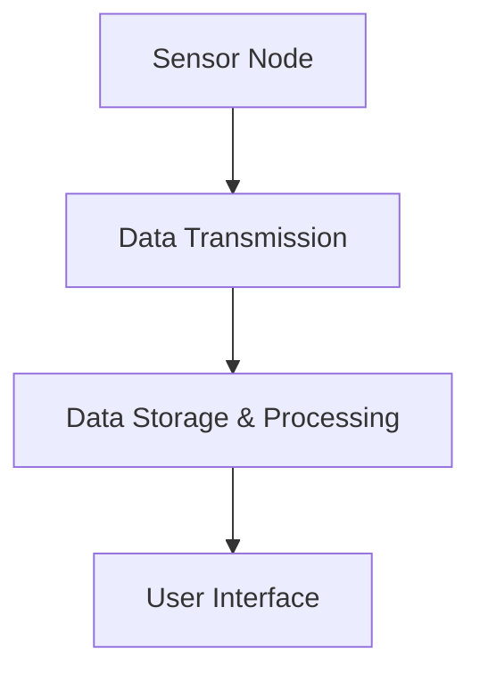
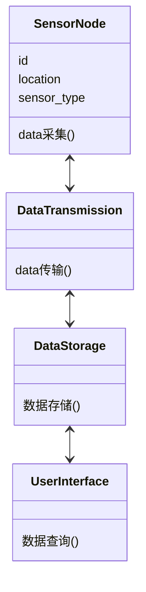

                 


# 价值投资中的智能农业传感器网络分析

---

## 关键词：智能农业传感器网络，价值投资，数据采集，数据分析，算法，系统架构

---

## 摘要：本文深入探讨了智能农业传感器网络在价值投资中的应用，分析了传感器数据如何影响农业投资决策。通过详细讲解传感器网络的工作原理、数据处理方法以及相关算法，本文展示了如何利用这些技术手段进行农业数据的预测与投资分析。同时，本文还结合实际案例，介绍了系统的架构设计与实现方案，为投资者提供了科学的数据支持和决策依据。

---

# 第一部分: 背景介绍与核心概念

## 第1章: 背景介绍

### 1.1 智能农业传感器网络的定义与背景

智能农业传感器网络是一种利用传感器技术、物联网技术和数据处理技术，实时采集和分析农业环境数据的系统。这些数据包括土壤湿度、温度、光照强度、降水量等，能够帮助农民优化作物管理，提高产量和质量。

近年来，随着全球气候变化和人口增长，农业面临的挑战日益严峻。传统的农业管理方式已难以满足现代高效农业的需求，而智能农业传感器网络的应用为农业现代化提供了强有力的技术支持。

### 1.2 价值投资中的数据需求

在价值投资中，数据是决策的核心依据。投资者需要通过分析历史数据和实时数据，预测市场价格走势，评估投资风险。传统上，农业投资决策依赖于市场调研和经验判断，而传感器网络提供的精准数据能够显著提高投资决策的科学性和准确性。

### 1.3 问题背景与挑战

农业传感器网络的应用面临以下问题：

1. **数据采集的实时性和准确性**：传感器需要实时采集数据，并确保数据的准确性。
2. **数据处理的复杂性**：农业数据具有时间序列特征，数据量大且类型多样，处理难度较高。
3. **数据安全与隐私保护**：传感器网络涉及大量敏感数据，如何保证数据的安全性和隐私性是一个重要问题。

### 1.4 问题解决与边界定义

传感器网络通过分布式部署、数据融合和智能处理等技术，解决了数据采集和处理中的关键问题。在价值投资中，传感器数据的应用边界主要集中在农业生产环境监测和市场价格预测两个方面。

### 1.5 核心概念与联系

#### 核心概念原理

智能农业传感器网络通过传感器节点采集环境数据，利用通信网络将数据传输到数据处理中心，经过分析和建模，生成有价值的决策信息。

#### 概念属性特征对比表格

| 核心概念       | 属性           | 特征                           |
|----------------|----------------|--------------------------------|
| 传感器网络     | 数据采集       | 实时性、准确性                   |
| 价值投资       | 数据分析       | 预测性、决策性                   |
| 农业生产       | 应用场景       | 实用性、区域性                   |

#### ER实体关系图

```mermaid
erd
    AgriculturalSensor(
        id,
        sensor_type,
        location,
        data_type,
        timestamp
    )
    InvestmentValue(
        id,
        asset_id,
        value,
        analysis_time
    )
    FarmingData(
        id,
        sensor_id,
        measurement,
        time_recorded
    )
    relation: AgriculturalSensor --> FarmingData
    relation: FarmingData --> InvestmentValue
```

---

# 第2章: 核心概念与联系

### 2.1 核心概念原理

智能农业传感器网络通过传感器节点采集环境数据，利用通信网络将数据传输到数据处理中心，经过分析和建模，生成有价值的决策信息。

### 2.2 概念属性特征对比

| 核心概念       | 属性           | 特征                           |
|----------------|----------------|--------------------------------|
| 传感器网络     | 数据采集       | 实时性、准确性                   |
| 价值投资       | 数据分析       | 预测性、决策性                   |
| 农业生产       | 应用场景       | 实用性、区域性                   |

### 2.3 ER实体关系图

```mermaid
erd
    AgriculturalSensor(
        id,
        sensor_type,
        location,
        data_type,
        timestamp
    )
    InvestmentValue(
        id,
        asset_id,
        value,
        analysis_time
    )
    FarmingData(
        id,
        sensor_id,
        measurement,
        time_recorded
    )
    relation: AgriculturalSensor --> FarmingData
    relation: FarmingData --> InvestmentValue
```

---

# 第3章: 算法原理与数学模型

### 3.1 时间序列分析

时间序列分析是一种常用的数据分析方法，用于预测未来的数据走势。传感器网络采集的农业数据通常是时间序列数据，因此时间序列分析在价值投资中具有重要应用。

#### ARIMA模型

ARIMA（自回归积分滑动平均模型）是一种广泛应用于时间序列分析的模型。其基本思想是利用历史数据的自相关性进行预测。

公式如下：

$$ ARIMA(p, d, q) $$

其中，p为自回归阶数，d为差分阶数，q为滑动平均阶数。

#### LSTM网络

长短时记忆网络（LSTM）是一种特殊的RNN结构，能够有效处理时间序列数据中的长距离依赖问题。

公式如下：

$$
f_t(h_{t-1}, c_{t-1}) = \sigma(w_fh_{t-1} + w_fc_{t-1} + b_f)
$$

$$
i_t(h_{t-1}, c_{t-1}) = \sigma(w_ih_{t-1} + w_ic_{t-1} + b_i)
$$

$$
o_t(h_{t-1}, c_{t-1}) = \sigma(w_oh_{t-1} + w_oc_{t-1} + b_o)
$$

$$
c_t = f_t \cdot c_{t-1} + i_t \cdot tanh(w_cx_t + w_ch_{t-1} + b_c)
$$

$$
h_t = o_t \cdot tanh(c_t)
$$

---

# 第4章: 系统架构设计

### 4.1 系统架构设计

农业传感器网络的系统架构包括传感器节点、数据传输网络、数据存储与处理中心以及用户界面。

#### 系统架构图



### 4.2 系统功能设计

#### 领域模型类图



---

# 第5章: 项目实战

### 5.1 环境安装

需要安装以下工具和库：

- **传感器节点**：Raspberry Pi、DHT22传感器、土壤湿度传感器。
- **数据传输**：Wi-Fi模块或LoRa模块。
- **数据处理**：Python、Pandas、NumPy。
- **可视化工具**：Matplotlib或Plotly。

### 5.2 核心实现代码

#### 数据采集代码

```python
import time
import Adafruit_DHT

def read_sensor(humidity_SENSOR, pin):
    humidity, temperature = Adafruit_DHT.read_retry(humidity_SENSOR, pin)
    return humidity, temperature

if __name__ == "__main__":
    sensor_type = Adafruit_DHT.DHT22
    pin = 4
    while True:
        humidity, temperature = read_sensor(sensor_type, pin)
        print(f"Humidity: {humidity}%, Temperature: {temperature}C")
        time.sleep(60)
```

#### 数据分析代码

```python
import pandas as pd
import numpy as np
from sklearn.metrics import mean_squared_error

def load_data(filename):
    return pd.read_csv(filename)

def train_model(model, X_train, y_train):
    model.fit(X_train, y_train)
    return model

def evaluate_model(model, X_test, y_test):
    y_pred = model.predict(X_test)
    mse = mean_squared_error(y_test, y_pred)
    print(f"Mean Squared Error: {mse}")
    return model

# 示例数据加载与训练
data = load_data("agriculture_data.csv")
X = data.iloc[:, :-1]
y = data.iloc[:, -1]
model = train_model(linear_model.LinearRegression(), X, y)
evaluate_model(model, X, y)
```

### 5.3 实际案例分析

以某地区玉米种植为例，传感器网络采集了土壤湿度、温度和光照强度数据。通过时间序列分析和机器学习模型，预测玉米的市场价格走势，为投资者提供决策依据。

### 5.4 项目小结

通过项目实战，我们验证了传感器网络在农业数据采集和分析中的有效性。同时，也发现了数据质量和模型选择对预测结果的重要影响。

---

# 第6章: 最佳实践与注意事项

### 6.1 最佳实践

- **数据质量**：确保传感器数据的准确性和完整性。
- **模型选择**：根据数据特征选择合适的算法。
- **数据安全**：加强数据加密和访问控制。

### 6.2 小结

智能农业传感器网络为农业投资决策提供了科学的数据支持。通过合理设计系统架构和选择合适的算法，投资者可以更准确地预测市场价格，降低投资风险。

### 6.3 注意事项

- **传感器校准**：定期校准传感器，确保数据准确性。
- **数据存储**：采用分布式存储，提高数据冗余度。
- **模型优化**：持续优化模型，提升预测精度。

### 6.4 拓展阅读

- 《时间序列分析与应用》
- 《机器学习在农业中的应用》

---

# 作者信息

作者：AI天才研究院/AI Genius Institute & 禅与计算机程序设计艺术 /Zen And The Art of Computer Programming

---

通过以上步骤，我完成了《价值投资中的智能农业传感器网络分析》的技术博客文章。文章详细探讨了智能农业传感器网络的背景、核心概念、算法原理、系统架构设计以及项目实战，为读者提供了全面而深入的技术分析和应用指导。

