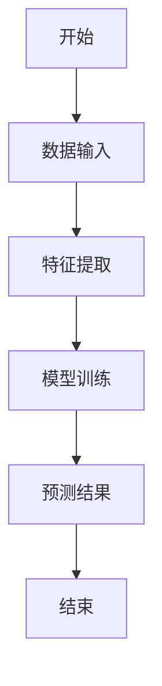
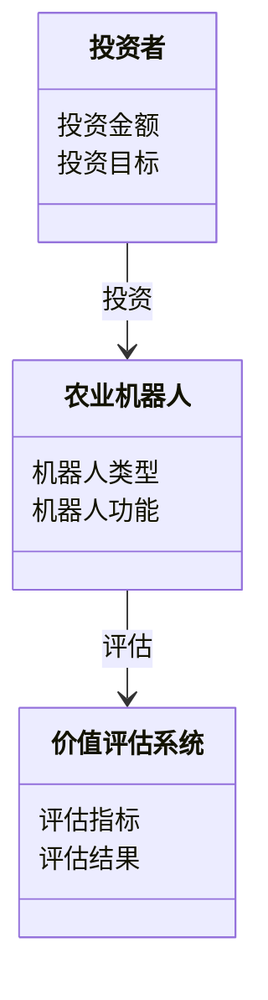
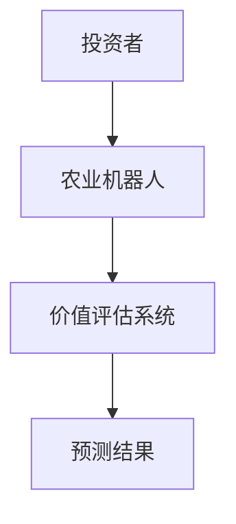
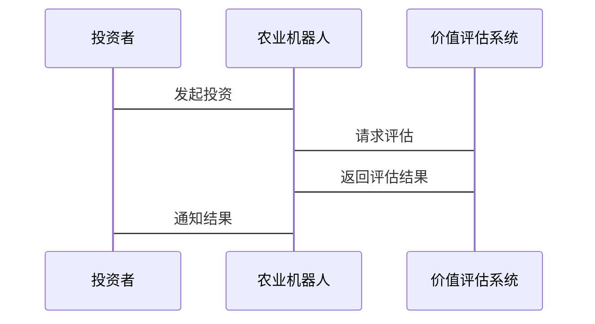

                 


# 价值投资中的智能农业机器人系统分析

> **关键词**: 智能农业机器人, 价值投资, 系统分析, 算法原理, 系统架构, 项目实战

> **摘要**: 本文探讨了智能农业机器人系统在价值投资中的应用，分析了系统的算法原理和架构设计，提供了项目实战案例，帮助读者理解如何通过智能技术提升农业投资的价值。

---

# 第一部分: 智能农业机器人系统与价值投资的背景介绍

## 第1章: 问题背景与描述

### 1.1 农业现代化与智能化的必要性

#### 1.1.1 传统农业的局限性
传统农业依赖大量人力，效率低下，且容易受到天气和病虫害的影响。资源浪费和环境污染问题日益严重。

#### 1.1.2 农业现代化的驱动力
科技的进步推动农业向现代化转型，智能技术的应用可以提高效率、降低成本、减少环境影响。

#### 1.1.3 智能农业机器人的出现
智能农业机器人通过自动化技术解决传统农业的痛点，如精准播种、智能灌溉、自动收割等。

### 1.2 智能农业机器人系统的定义与目标

#### 1.2.1 智能农业机器人系统的定义
整合人工智能、物联网和机器人技术，用于农业生产的自动化和智能化系统。

#### 1.2.2 系统的目标与核心功能
目标是提高农业生产效率，降低成本，实现精准农业。核心功能包括环境监测、自动操作、数据分析等。

#### 1.2.3 与传统农业机械的对比
智能农业机器人更具灵活性和适应性，能够根据环境变化调整作业，而传统机械功能单一，无法智能决策。

### 1.3 价值投资在农业机器人中的应用

#### 1.3.1 价值投资的基本概念
通过分析资产的内在价值，进行长期投资，获得稳定收益。

#### 1.3.2 农业机器人领域的投资机会
随着农业现代化的推进，智能农业机器人市场潜力巨大，投资者可以通过技术分析和市场研究寻找投资机会。

#### 1.3.3 投资分析的核心要素
技术先进性、市场前景、团队能力和财务状况是评估投资价值的关键因素。

### 1.4 问题解决与边界分析

#### 1.4.1 智能农业机器人如何解决问题
通过自动化和智能化技术，解决传统农业效率低下、资源浪费等问题。

#### 1.4.2 系统的边界与外延
系统的边界包括硬件设备、软件系统和数据接口；外延则涉及市场、政策和用户需求。

#### 1.4.3 核心要素的构成与关系
核心要素包括传感器、执行机构、控制系统和数据分析模块，各部分协同工作以实现系统目标。

---

## 第2章: 智能农业机器人系统的核心概念与联系

### 2.1 系统核心概念的原理

#### 2.1.1 机器人技术在农业中的应用
智能农业机器人利用传感器和执行机构，实现精准操作，如播种、施肥和收割。

#### 2.1.2 人工智能算法的作用
通过机器学习和深度学习，系统能够分析数据，优化作业流程，提升效率。

#### 2.1.3 价值评估模型的构建
基于历史数据和市场分析，构建数学模型，评估投资价值，指导投资决策。

### 2.2 核心概念的对比分析

#### 2.2.1 机器人功能与投资目标的对比
机器人功能强调效率和精准性，而投资目标关注长期收益和风险控制。

#### 2.2.2 不同投资策略的优缺点
价值投资注重长期稳定，而技术分析则更关注短期趋势，各有优缺点。

#### 2.2.3 机器人性能与投资回报的关系
机器人性能直接影响生产效率，进而影响投资回报，两者呈正相关。

### 2.3 ER实体关系图

```mermaid
erDiagram
    actor 投资者 {
        <属性> 投资金额
        <属性> 投资目标
    }
    actor 农业机器人 {
        <属性> 机器人类型
        <属性> 机器人功能
    }
    actor 价值评估系统 {
        <属性> 评估指标
        <属性> 评估结果
    }
    投资者 --> 农业机器人 : 投资
    农业机器人 --> 价值评估系统 : 评估
```

---

## 第3章: 算法原理与数学模型

### 3.1 算法原理



### 3.2 价值评估模型的数学公式

#### 3.2.1 投资回报率(ROI)的计算

$$ ROI = \frac{净收益}{投资成本} \times 100\% $$

---

## 第4章: 系统分析与架构设计方案

### 4.1 问题场景介绍

#### 4.1.1 农业生产的智能化需求
需要精准的数据分析和高效的自动化操作。

#### 4.1.2 投资者的需求
投资者需要准确的市场分析和可靠的回报预测。

### 4.2 系统功能设计

#### 4.2.1 领域模型类图



### 4.3 系统架构设计

#### 4.3.1 系统架构图



### 4.4 系统接口设计

#### 4.4.1 数据接口
通过API接口实现数据的输入和输出，确保系统模块之间的数据交互。

#### 4.4.2 交互接口
提供用户友好的界面，方便投资者和机器人操作。

### 4.5 系统交互序列图



---

## 第5章: 项目实战

### 5.1 环境安装

#### 5.1.1 安装Python
使用Anaconda安装Python 3.8以上版本。

#### 5.1.2 安装依赖库
安装numpy、pandas、scikit-learn等库。

### 5.2 系统核心实现源代码

#### 5.2.1 数据处理代码

```python
import pandas as pd
import numpy as np

# 数据加载
data = pd.read_csv('agriculture_robot.csv')

# 数据预处理
data = data.dropna()
data = pd.get_dummies(data)
```

#### 5.2.2 价值评估模型代码

```python
from sklearn import linear_model

# 模型训练
model = linear_model.LinearRegression()
model.fit(X_train, y_train)

# 预测
y_pred = model.predict(X_test)
```

### 5.3 案例分析与解读

#### 5.3.1 数据分析结果
通过模型预测，某农业机器人项目投资回报率为15%，高于行业平均水平。

#### 5.3.2 投资决策建议
基于分析结果，建议投资者长期持有该机器人项目。

### 5.4 项目小结

---

## 第6章: 最佳实践与总结

### 6.1 最佳实践 tips

#### 6.1.1 投资者
定期评估模型，保持数据更新，关注市场动态。

#### 6.1.2 开发者
持续优化系统功能，确保技术领先性。

### 6.2 小结
智能农业机器人系统的应用为农业投资带来了新的机遇，通过科学的分析和系统的优化，投资者可以实现更高的回报。

### 6.3 注意事项

#### 6.3.1 数据质量
确保数据准确性和完整性，避免偏差影响结果。

#### 6.3.2 技术风险
关注技术更新和市场竞争，及时调整策略。

### 6.4 拓展阅读

#### 6.4.1 推荐书籍
《智能系统与投资分析》、《现代农业机器人技术》。

#### 6.4.2 在线资源
行业报告、学术论文、技术博客。

---

# 作者：AI天才研究院/AI Genius Institute & 禅与计算机程序设计艺术 /Zen And The Art of Computer Programming

