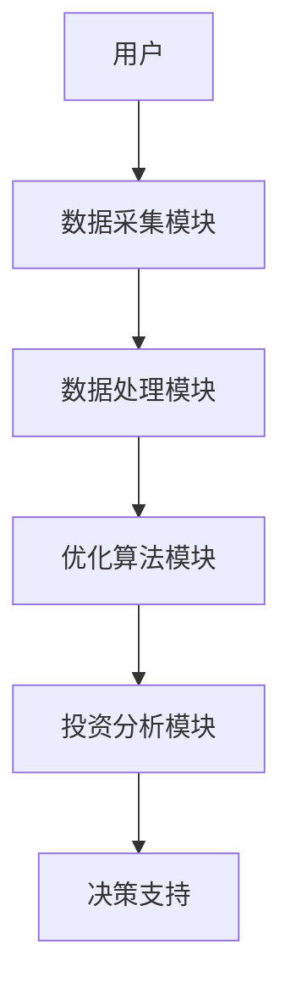
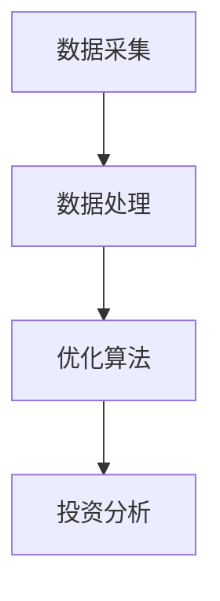

                 


# 价值投资中的智能农业灌溉优化系统分析

> 关键词：价值投资，智能农业，灌溉优化系统，数据采集，优化算法，系统架构

> 摘要：本文详细探讨了智能农业灌溉优化系统在价值投资中的应用，从系统的背景、原理、技术实现到与价值投资的结合，再到系统的架构设计和项目实战，最后总结了最佳实践和未来趋势。通过本文，读者可以全面了解如何利用智能灌溉系统优化农业投资决策，提升投资回报。

---

## 第一部分：背景介绍

### 第1章：价值投资与智能农业灌溉系统概述

#### 1.1 价值投资的基本概念
- 1.1.1 价值投资的定义与核心理念
  - 价值投资是一种以内在价值为导向的投资策略，旨在通过分析企业的基本面，找到被市场低估的投资标的。
  - 农业投资的特殊性：农业项目的回报周期长、受自然条件影响大，传统投资分析方法难以适应。

#### 1.2 智能农业灌溉系统的概念与特点
  - 传统灌溉模式的局限性：水资源浪费、效率低下、难以精准控制。
  - 智能灌溉的核心技术：物联网、传感器、数据采集与分析、自动化控制。
  - 系统优势：提高水资源利用效率、降低生产成本、提升农作物产量和质量。

#### 1.3 智能灌溉系统在农业投资中的重要性
  - 精准灌溉如何提升农业生产效率。
  - 系统数据如何支持投资决策优化。

---

## 第二部分：智能农业灌溉优化系统的原理与技术

### 第2章：智能农业灌溉系统的原理

#### 2.1 数据采集与处理
- 2.1.1 传感器技术的应用
  - 湿度传感器、温度传感器、光照传感器等。
  - 数据采集的频率和精度对灌溉优化的影响。

- 2.1.2 数据采集系统的构建
  - 传感器节点、数据传输模块、数据存储模块。
  - 数据预处理与清洗方法。

- 2.1.3 数据分析与可视化
  - 数据可视化工具的应用，如时间序列分析。
  - 数据驱动的灌溉决策优化。

#### 2.2 灌溉优化算法
- 2.2.1 基于数据的优化策略
  - 灌溉时间、水量的优化模型。
  - 基于历史数据的预测模型。

- 2.2.2 算法的数学模型与实现
  - 使用线性回归、决策树等机器学习算法进行预测和优化。
  - 优化模型的构建与实现。

---

## 第三部分：价值投资与灌溉系统的结合

### 第3章：价值投资的分析框架

#### 3.1 价值投资的分析方法
- 3.1.1 基本面分析的核心要素
  - 财务指标：净利润率、资产负债率、现金流。
  - 非财务因素：管理团队、行业竞争状况。

#### 3.2 智能灌溉系统在农业投资中的应用
- 3.2.1 系统如何提升农业生产效率
  - 精准灌溉如何减少水资源浪费。
  - 如何通过数据优化种植计划。

- 3.2.2 灌溉优化对农业投资回报的影响
  - 提高产量如何提升投资回报。
  - 降低生产成本如何增强企业盈利能力。

---

## 第四部分：系统架构与实现

### 第4章：系统架构设计

#### 4.1 系统功能模块设计
- 4.1.1 数据采集模块
  - 传感器数据采集与传输。
  - 数据存储与管理。

- 4.1.2 优化算法模块
  - 数据分析与处理。
  - 灌溉优化策略生成。

- 4.1.3 投资分析模块
  - 生产成本分析。
  - 投资回报预测。

#### 4.2 系统架构图


---

## 第五部分：项目实战与案例分析

### 第5章：项目实战

#### 5.1 环境搭建与安装
- 开发环境配置：Python、Jupyter Notebook、数据库。
- 安装必要的库：pandas、numpy、scikit-learn。

#### 5.2 核心代码实现
- 数据采集代码：
```python
import pandas as pd
import requests
import json

# 传感器数据接口
url = "http://localhost:8000/sensors"
response = requests.get(url)
data = json.loads(response.text)
df = pd.DataFrame(data)
```

- 优化算法实现：
```python
from sklearn.linear_model import LinearRegression

# 示例数据
X = df[['温度', '湿度']]
y = df['需水量']

model = LinearRegression()
model.fit(X, y)
```

#### 5.3 案例分析
- 某农业项目通过智能灌溉系统优化后的成本降低和产量提升。
- 数据分析结果如何支持投资决策。

---

## 第六部分：总结与展望

### 第6章：总结与最佳实践

#### 6.1 系统总结
- 智能灌溉系统如何提升农业生产效率。
- 优化算法在投资决策中的应用效果。

#### 6.2 最佳实践与注意事项
- 数据质量的重要性。
- 系统维护与更新的必要性。
- 风险管理策略。

#### 6.3 未来趋势与拓展阅读
- 人工智能在农业投资中的进一步应用。
- 更多关于智能灌溉系统的技术资料推荐。

---

## 附录

- 术语表：解释系统中使用的专业术语。
- 参考文献：引用的书籍、论文和工具文档。
- 代码仓库链接：存放项目代码的GitHub仓库链接。

---

## 附图

- 智能灌溉系统架构图（Mermaid）：


---

## 附表

- 数据采集表：记录传感器数据的时间、温度、湿度等。
- 投资分析表：展示各项目的成本、收益和净现值。

---

## 附录代码

- 数据采集代码：
```python
import requests
import json

def fetch_sensor_data():
    response = requests.get("http://localhost:8000/sensors")
    data = json.loads(response.text)
    return data

data = fetch_sensor_data()
print(data)
```

---

## 作者

作者：AI天才研究院/AI Genius Institute & 禅与计算机程序设计艺术 /Zen And The Art of Computer Programming

---

通过以上目录大纲，文章将系统地介绍智能农业灌溉优化系统在价值投资中的应用，从理论到实践，从分析到实现，帮助读者全面理解如何利用先进技术优化农业投资决策。

