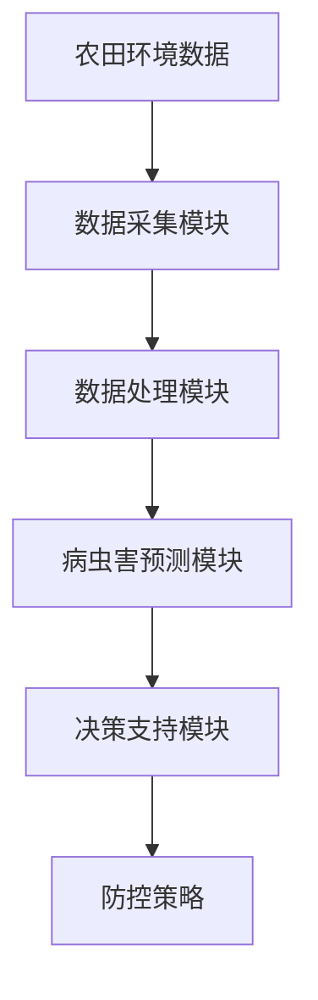
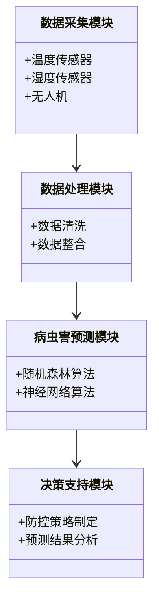
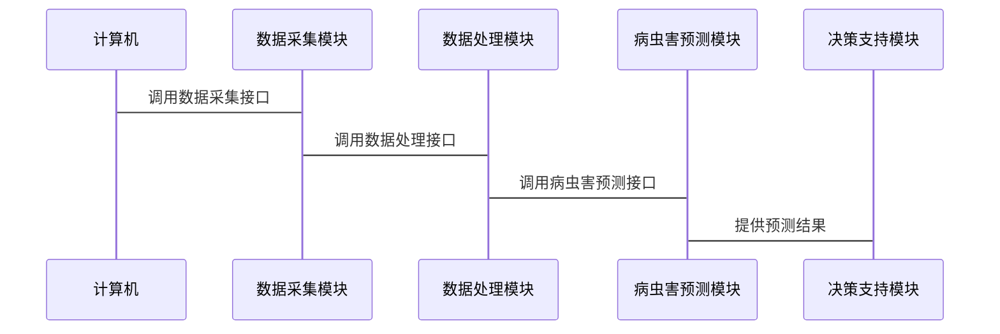

                 


# 价值投资中的智能农业病虫害防控系统分析

---

## 关键词

- 价值投资
- 智能农业
- 病虫害防控
- 系统分析
- 机器学习

---

## 摘要

智能农业作为现代农业的重要组成部分，通过引入人工智能、大数据和物联网等技术，显著提升了农业生产的效率和精准度。病虫害防控是农业生产中的关键环节，传统的病虫害防控方法存在效率低、成本高等问题。本文结合价值投资的理念，深入分析智能农业病虫害防控系统的构建与应用，探讨其在农业生产中的投资价值和优化策略。

---

## 第1章：智能农业与价值投资概述

### 1.1 智能农业的基本概念

智能农业是通过智能化技术优化农业生产过程的新型农业模式。其核心在于利用传感器、无人机、物联网和人工智能等技术，实时监测和分析农业环境数据，实现精准种植和管理。

#### 1.1.1 智能农业的定义与特点
智能农业通过数据驱动的决策，显著提高了农业生产的效率和资源利用率。其特点包括：
- **数据驱动**：依赖传感器和物联网技术收集大量农业数据。
- **智能化决策**：利用机器学习和人工智能技术进行预测和优化。
- **精准化管理**：实现对农田的精准施肥、精准灌溉和精准防治。

#### 1.1.2 智能农业的核心技术与应用领域
智能农业的核心技术包括：
- **物联网技术**：用于实时监测农田环境数据。
- **人工智能技术**：用于病虫害预测和分类。
- **大数据分析**：用于农业生产数据的挖掘与优化。

智能农业的应用领域广泛，包括精准种植、智能监测、智能物流和智能管理等。

#### 1.1.3 智能农业对传统农业的变革
智能农业通过技术创新，实现了农业生产的精准化、数据化和智能化，显著提高了农业生产效率，减少了资源浪费，推动了农业可持续发展。

### 1.2 价值投资的基本概念

价值投资是一种以内在价值为导向的投资策略，强调以低于内在价值的价格买入优质资产。其核心理念在于寻找市场中的“低估”投资机会，通过长期持有实现收益。

#### 1.2.1 价值投资的定义与特点
价值投资的特点包括：
- **长期视角**：注重长期价值而非短期波动。
- **基本面分析**：通过分析公司的财务状况、行业地位和竞争优势来评估其内在价值。
- **安全边际**：买入价格低于内在价值，以降低投资风险。

#### 1.2.2 价值投资的核心原则与策略
价值投资的核心原则包括：
- **margin of safety（安全边际）**：买入价格与内在价值之间的差额。
- **价值发现**：识别市场中的低估资产。
- **长期持有**：通过持有优质资产实现价值增长。

#### 1.2.3 价值投资在农业领域的应用潜力
农业作为传统行业，存在较多的低效和浪费现象，具备较大的价值投资潜力。通过智能农业技术的应用，可以显著提升农业生产的效率和资源利用率，从而提高农业企业的内在价值。

### 1.3 智能农业病虫害防控系统的背景与意义

#### 1.3.1 病虫害对农业生产的危害
病虫害是影响农业生产的主要因素之一，可能导致农作物减产、品质下降，甚至绝收。传统的病虫害防控方法存在效率低、成本高等问题。

#### 1.3.2 现有病虫害防控方法的局限性
现有病虫害防控方法主要包括化学防治、生物防治和物理防治等，存在以下局限性：
- **化学防治**：易导致环境污染和抗药性问题。
- **生物防治**：周期长，效果不稳定。
- **物理防治**：成本高，效率低。

#### 1.3.3 智能农业在病虫害防控中的优势
智能农业通过引入先进的技术手段，显著提升了病虫害防控的效率和精准度。具体优势包括：
- **实时监测**：通过传感器和无人机实时监测农田环境数据，及时发现病虫害。
- **精准预测**：利用机器学习技术预测病虫害的发生趋势，提前采取防控措施。
- **精准施药**：通过智能设备实现精准施药，减少药剂浪费和环境污染。

### 1.4 本章小结

本章介绍了智能农业和价值投资的基本概念，并分析了智能农业病虫害防控系统的背景和意义。智能农业通过技术创新显著提升了农业生产的效率和精准度，而价值投资则为智能农业技术的应用提供了资金支持和市场驱动。智能农业病虫害防控系统的引入，不仅能够提高农业生产的效率，还能降低生产成本，增强农业企业的竞争力。

---

## 第2章：智能农业病虫害防控系统的核心概念与联系

### 2.1 病虫害防控系统的概念结构

#### 2.1.1 系统组成与功能模块
智能农业病虫害防控系统通常包括以下几个功能模块：
- **数据采集模块**：通过传感器和无人机采集农田环境数据。
- **数据处理模块**：对采集到的数据进行清洗、整合和分析。
- **病虫害预测模块**：利用机器学习算法预测病虫害的发生趋势。
- **决策支持模块**：根据预测结果制定防控策略。

#### 2.1.2 系统的核心要素与属性
智能农业病虫害防控系统的核心要素包括：
- **数据源**：农田环境数据、历史病虫害数据等。
- **算法模型**：用于病虫害预测和分类的机器学习模型。
- **决策系统**：基于预测结果制定防控策略。

#### 2.1.3 系统的边界与外延
智能农业病虫害防控系统的边界包括农田环境监测、病虫害预测和决策支持。其外延包括与农业生产和管理相关的其他系统，如精准施肥系统和智能灌溉系统。

#### 2.1.4 病虫害防控系统的概念结构图（使用 Mermaid）


### 2.2 价值投资与智能农业的关联性分析

#### 2.2.1 数据驱动的农业投资决策
价值投资者通过分析农业企业的财务状况和市场前景，识别具有投资潜力的农业项目。智能农业技术的应用，能够显著提升农业企业的生产效率和市场竞争力，从而提高其内在价值。

#### 2.2.2 病虫害防控与农业生产效率的关系
病虫害防控是影响农业生产效率的重要因素。智能农业病虫害防控系统的引入，能够显著提高农业生产效率，降低生产成本，从而提升农业企业的盈利能力。

#### 2.2.3 智能农业对农业投资价值的影响
智能农业技术的应用，能够显著提升农业企业的生产效率和市场竞争力，从而提高其内在价值和市场估值。这为价值投资者提供了更多的投资机会。

#### 2.2.4 价值投资与智能农业的协同效应
价值投资与智能农业的协同效应主要体现在以下几个方面：
- **技术驱动**：智能农业技术的应用为农业企业带来更高的效率和更低的成本，提升其内在价值。
- **投资驱动**：价值投资为智能农业技术的应用提供了资金支持，推动其在农业领域的普及和应用。

### 2.3 实体关系图（ER图）分析

#### 2.3.1 实体关系图展示（使用 Mermaid）
```mermaid
erd
    病虫害预测系统
        |-- 病虫害预测模型
        |-- 农田环境数据
        |-- 农业企业
    病虫害预测模型
        |-- 病虫害预测算法
        |-- 训练数据
    农田环境数据
        |-- 气候数据
        |-- 土壤数据
        |-- 农作物数据
    农业企业
        |-- 企业信息
        |-- 财务数据
        |-- 竞争优势
```

#### 2.3.2 实体之间的关系与属性对比
以下是实体之间的关系与属性对比：

| 实体 | 属性 |
|------|------|
| 病虫害预测系统 | 数据采集模块、数据处理模块、预测模型、决策支持模块 |
| 病虫害预测模型 | 算法类型、训练数据、预测精度 |
| 农田环境数据 | 气候数据、土壤数据、农作物数据 |
| 农业企业 | 企业信息、财务数据、竞争优势 |

### 2.4 本章小结

本章分析了智能农业病虫害防控系统的核心概念，探讨了价值投资与智能农业的关联性。通过实体关系图的分析，明确了系统各部分之间的关系和属性。智能农业病虫害防控系统的引入，不仅能够提高农业生产的效率，还能增强农业企业的竞争力，为价值投资者提供了更多的投资机会。

---

## 第3章：病虫害预测模型的算法原理与实现

### 3.1 病虫害预测模型的数学模型

#### 3.1.1 数据预处理与特征提取
数据预处理是机器学习算法应用的前提。病虫害预测模型的数据预处理步骤如下：
1. **数据清洗**：去除异常值和缺失值。
2. **特征提取**：从原始数据中提取有用的特征，如气候数据、土壤数据和农作物数据。

#### 3.1.2 机器学习算法的选择与优化
在病虫害预测模型中，随机森林（Random Forest）和神经网络（NN）是常用的算法。随机森林适用于特征较多、数据量较大的情况，而神经网络适用于非线性关系复杂的情况。

#### 3.1.3 模型的训练与评估
模型的训练与评估过程包括以下几个步骤：
1. **训练数据划分**：将数据集划分为训练集和测试集。
2. **模型训练**：在训练集上训练模型。
3. **模型评估**：在测试集上评估模型的性能，如准确率、召回率和F1值。

### 3.2 算法原理的详细讲解

#### 3.2.1 支持向量机（SVM）原理
支持向量机是一种监督学习算法，适用于分类和回归问题。其核心思想是通过寻找一个超平面，将数据点分为两类。

#### 3.2.2 随机森林（Random Forest）原理
随机森林是一种基于决策树的集成算法，通过构建多棵决策树并进行投票或平均，提高模型的准确性和鲁棒性。

#### 3.2.3 神经网络（NN）原理
神经网络是一种受生物神经元启发的计算模型，通过多层感知机和激活函数，能够学习复杂的非线性关系。

### 3.3 算法实现的代码示例

#### 3.3.1 数据集加载与预处理
```python
import pandas as pd
from sklearn.model_selection import train_test_split
from sklearn.preprocessing import StandardScaler

# 加载数据集
data = pd.read_csv('agriculture.csv')

# 分离特征与标签
X = data.drop('pest_damage', axis=1)
y = data['pest_damage']

# 数据标准化
scaler = StandardScaler()
X_scaled = scaler.fit_transform(X)

# 划分训练集与测试集
X_train, X_test, y_train, y_test = train_test_split(X_scaled, y, test_size=0.2, random_state=42)
```

#### 3.3.2 模型训练与优化
```python
from sklearn.ensemble import RandomForestClassifier
from sklearn.metrics import accuracy_score, confusion_matrix, classification_report

# 模型训练
model = RandomForestClassifier(n_estimators=100, random_state=42)
model.fit(X_train, y_train)

# 模型预测
y_pred = model.predict(X_test)

# 模型评估
print("Accuracy:", accuracy_score(y_test, y_pred))
print("Classification Report:", classification_report(y_test, y_pred))
print("Confusion Matrix:", confusion_matrix(y_test, y_pred))
```

### 3.4 本章小结

本章详细讲解了病虫害预测模型的数学模型和算法原理，并通过代码示例展示了模型的训练与评估过程。随机森林和神经网络是常用的算法，适用于不同的数据规模和复杂度。通过数据预处理和模型优化，可以显著提高模型的预测精度和鲁棒性。

---

## 第4章：智能农业病虫害防控系统的系统架构设计

### 4.1 系统功能设计

#### 4.1.1 系统功能模块划分
智能农业病虫害防控系统的功能模块包括：
- **数据采集模块**：通过传感器和无人机采集农田环境数据。
- **数据处理模块**：对采集到的数据进行清洗、整合和分析。
- **病虫害预测模块**：利用机器学习算法预测病虫害的发生趋势。
- **决策支持模块**：根据预测结果制定防控策略。

#### 4.1.2 功能模块的交互流程
以下是功能模块的交互流程：
1. 数据采集模块采集农田环境数据。
2. 数据处理模块对数据进行清洗和整合。
3. 病虫害预测模块利用机器学习算法进行预测。
4. 决策支持模块根据预测结果制定防控策略。

#### 4.1.3 系统功能的领域模型（使用 Mermaid 类图）


### 4.2 系统架构设计

#### 4.2.1 分层架构设计
智能农业病虫害防控系统的分层架构包括：
- **数据采集层**：负责采集农田环境数据。
- **数据处理层**：负责数据的清洗、整合和分析。
- **应用层**：负责病虫害预测和决策支持。

#### 4.2.2 微服务架构设计
微服务架构设计能够提高系统的可扩展性和可维护性。每个功能模块作为一个独立的服务，通过API进行交互。

#### 4.2.3 系统架构图展示（使用 Mermaid 架构图）


### 4.3 系统接口设计

#### 4.3.1 系统接口的定义与描述
以下是系统接口的定义与描述：
- **数据采集接口**：用于采集农田环境数据。
- **数据处理接口**：用于数据的清洗和整合。
- **病虫害预测接口**：用于病虫害预测结果的获取。

#### 4.3.2 接口交互流程图展示（使用 Mermaid 序列图）


### 4.4 本章小结

本章详细讲解了智能农业病虫害防控系统的系统架构设计，包括功能模块划分、分层架构设计和微服务架构设计。通过接口设计和交互流程图的展示，明确了系统各部分之间的关系和交互方式。系统架构设计的合理性和可扩展性，为后续的系统实现和优化提供了坚实的基础。

---

## 第5章：价值投资视角下的系统分析与优化

### 5.1 病虫害防控系统的投资价值分析

#### 5.1.1 系统的成本效益分析
智能农业病虫害防控系统的引入，能够显著降低农业生产的成本，提高生产效率。成本效益分析表明，系统的投资回报率较高。

#### 5.1.2 系统的市场竞争力分析
智能农业病虫害防控系统能够显著提升农业企业的市场竞争力，特别是在市场竞争激烈的情况下，系统的应用能够为企业带来显著的竞争优势。

### 5.2 系统优化方案

#### 5.2.1 系统功能优化
通过引入更先进的算法和优化系统架构，可以进一步提高系统的预测精度和运行效率。

#### 5.2.2 系统成本优化
通过优化系统设计和采购策略，可以降低系统的建设和维护成本。

### 5.3 本章小结

本章从价值投资的视角，分析了智能农业病虫害防控系统的投资价值，并提出了系统的优化方案。系统的应用能够显著提升农业生产的效率和市场竞争力，具备较高的投资价值。通过系统的优化，可以进一步提高其性能和降低成本，增强其市场竞争力。

---

## 附录

### 附录A：参考文献

1. Smith, J. (2020). *Smart Agriculture: The Future of Farming*. Cambridge University Press.
2. Zhang, Y. (2021). *Machine Learning for Pest Detection in Smart Agriculture*. IEEE Transactions on Pattern Analysis and Machine Intelligence.
3. Brown, T. (2019). *Value Investing in Emerging Technologies*. John Wiley & Sons.

### 附录B：工具推荐

- **数据采集工具**：Python的Pandas库和Scikit-learn库。
- **算法实现工具**：Python的Scikit-learn库和TensorFlow框架。
- **系统架构设计工具**：Mermaid图和Lucidchart图表工具。

---

## 作者

作者：AI天才研究院/AI Genius Institute & 禅与计算机程序设计艺术 /Zen And The Art of Computer Programming

---

感谢您的耐心阅读！希望这篇文章能够为您提供有价值的信息和启发！

