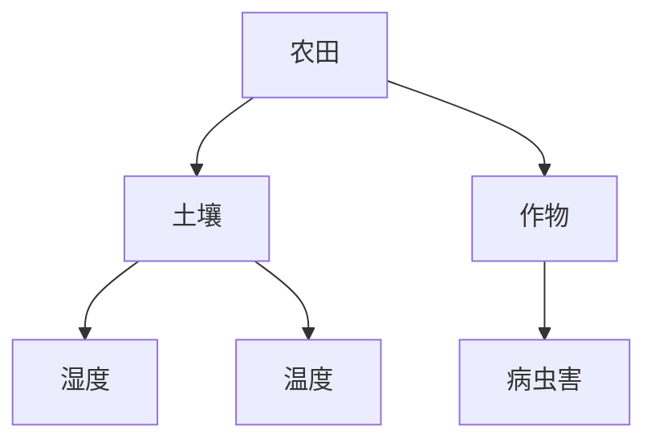
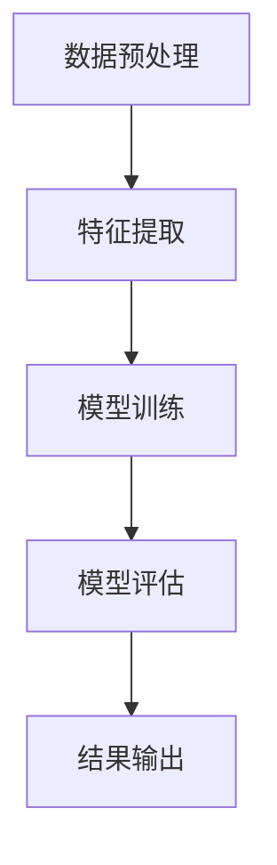
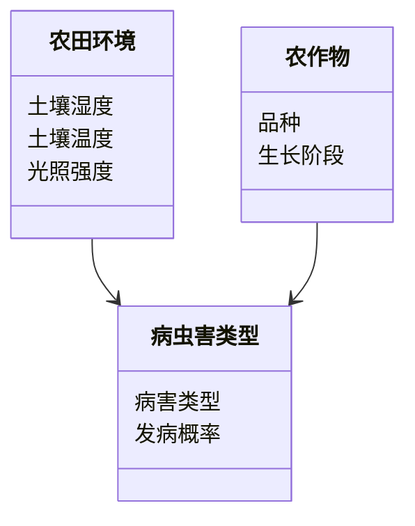
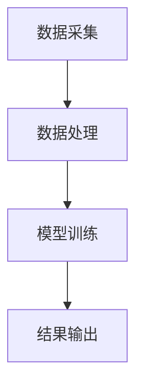
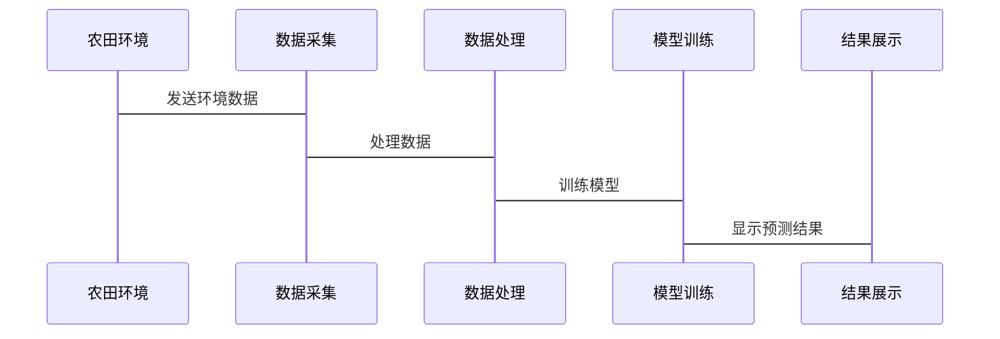

                 


# 价值投资中的智能农业病虫害预警系统分析

> **关键词**：智能农业，病虫害预警，价值投资，机器学习，系统架构

> **摘要**：本文深入探讨了智能农业病虫害预警系统在价值投资中的应用，结合农业知识图谱和智能算法，分析了系统的核心概念、算法原理、系统架构以及实际案例。通过详细讲解系统的设计与实现，为投资者提供了科学的决策依据。

---

# 第1章 智能农业与病虫害预警系统概述

## 1.1 价值投资与智能农业的背景

### 1.1.1 价值投资的核心概念
价值投资是一种长期投资策略，强调以低于内在价值的价格购买优质资产。在农业领域，价值投资可以通过智能系统分析土地、气候、作物等多因素，评估农业项目的潜在收益。

### 1.1.2 智能农业的定义与特征
智能农业利用物联网、大数据、人工智能等技术，实现农业生产的智能化管理。其核心特征包括数据驱动、自动化决策和精准管理。

### 1.1.3 病虫害预警系统的重要性
病虫害是影响农业生产的主要因素之一。通过智能系统实时监测和预警，可以最大限度减少损失，提升农业投资的回报率。

## 1.2 智能农业病虫害预警系统的定义与意义

### 1.2.1 系统的定义
智能农业病虫害预警系统是基于机器学习和物联网技术，实时监测农田环境数据，预测病虫害的发生概率，并提供防治建议的系统。

### 1.2.2 系统的核心功能
- 数据采集与处理：收集土壤湿度、温度、光照等数据。
- 病虫害预测：通过机器学习模型预测病虫害的发生。
- 决策支持：提供防治建议，优化农业生产。

### 1.2.3 系统在农业投资中的价值
通过提前预警和精准决策，系统可以帮助投资者降低风险，提升农业生产效率和投资回报率。

## 1.3 本章小结

---

# 第2章 核心概念与联系分析

## 2.1 价值投资模型

### 2.1.1 价值投资模型的原理
价值投资模型通过分析农田环境、作物品种、市场价格等因素，评估农业项目的潜在价值。

### 2.1.2 智能算法在模型中的应用
使用机器学习算法对历史数据进行训练，建立病虫害预测模型。

### 2.1.3 农业知识图谱的构建
构建农业知识图谱，整合农田环境、作物品种、病虫害类型等信息，为模型提供支持。

## 2.2 智能算法与农业数据的关系

### 2.2.1 算法的核心原理
机器学习算法通过训练数据，识别病虫害的特征，实现精准预测。

### 2.2.2 数据的特征与处理
数据特征包括土壤湿度、温度、光照强度等，需要进行标准化、归一化处理。

### 2.2.3 算法与数据的交互
通过数据驱动，算法不断优化模型参数，提升预测精度。

## 2.3 实体关系图（ER图）



## 2.4 本章小结

---

# 第3章 病虫害预警系统的算法原理

## 3.1 机器学习算法的选择与应用

### 3.1.1 常见机器学习算法介绍
常用的算法包括随机森林、XGBoost、支持向量机等。

### 3.1.2 病虫害预警系统中算法的选择
随机森林适用于高维数据，适合病虫害预测场景。

### 3.1.3 算法的优缺点分析
随机森林的优点是抗过拟合，但计算复杂度较高。

## 3.2 算法流程图（Mermaid）



## 3.3 算法实现代码

```python
# 示例代码：随机森林算法实现
from sklearn.ensemble import RandomForestClassifier
import pandas as pd

# 加载数据
data = pd.read_csv('agriculture_data.csv')

# 特征与标签分离
X = data.drop('pest_disease', axis=1)
y = data['pest_disease']

# 模型训练
model = RandomForestClassifier()
model.fit(X, y)

# 预测
predictions = model.predict(X)
```

## 3.4 本章小结

---

# 第4章 系统分析与架构设计

## 4.1 问题场景介绍

### 4.1.1 病虫害预警系统的应用场景
农田实时监测、病虫害预测、防治决策支持。

## 4.2 系统功能设计

### 4.2.1 领域模型图（Mermaid）



### 4.2.2 系统架构图（Mermaid）



### 4.2.3 系统接口设计
接口包括数据采集接口、模型调用接口、结果展示接口。

### 4.2.4 系统交互序列图（Mermaid）



## 4.3 本章小结

---

# 第5章 项目实战

## 5.1 环境安装

### 5.1.1 安装Python与相关库
安装Python 3.8及以上版本，安装scikit-learn、pandas等库。

## 5.2 系统核心实现

### 5.2.1 数据预处理代码

```python
import pandas as pd
from sklearn.model_selection import train_test_split
from sklearn.ensemble import RandomForestClassifier
from sklearn.metrics import accuracy_score

# 加载数据
data = pd.read_csv('agriculture_data.csv')

# 特征与标签分离
X = data.drop('pest_disease', axis=1)
y = data['pest_disease']

# 数据分割
X_train, X_test, y_train, y_test = train_test_split(X, y, test_size=0.2)

# 模型训练
model = RandomForestClassifier()
model.fit(X_train, y_train)

# 预测与评估
y_pred = model.predict(X_test)
print('准确率:', accuracy_score(y_test, y_pred))
```

### 5.2.2 系统实现代码

```python
from sklearn.ensemble import RandomForestClassifier
import pandas as pd

# 加载数据
data = pd.read_csv('agriculture_data.csv')

# 特征与标签分离
X = data.drop('pest_disease', axis=1)
y = data['pest_disease']

# 模型训练
model = RandomForestClassifier()
model.fit(X, y)

# 预测
predictions = model.predict(X)
```

## 5.3 案例分析与解读

### 5.3.1 案例分析
以某地区农田为例，分析病虫害预警系统的预测结果。

## 5.4 本章小结

---

# 第6章 最佳实践、小结与注意事项

## 6.1 最佳实践 tips

### 6.1.1 数据采集的注意事项
确保数据的准确性和完整性。

### 6.1.2 模型优化的建议
定期更新模型，提升预测精度。

## 6.2 小结

### 6.2.1 价值投资中的系统分析
通过智能系统实现精准预测，提升农业投资的回报率。

## 6.3 注意事项

### 6.3.1 系统维护
定期检查系统运行状态，及时修复问题。

### 6.3.2 数据隐私
保护农民的数据隐私，避免信息泄露。

## 6.4 拓展阅读

### 6.4.1 推荐书籍
《机器学习实战》、《智能农业技术》

## 6.5 本章小结

---

# 作者：AI天才研究院 & 禅与计算机程序设计艺术

