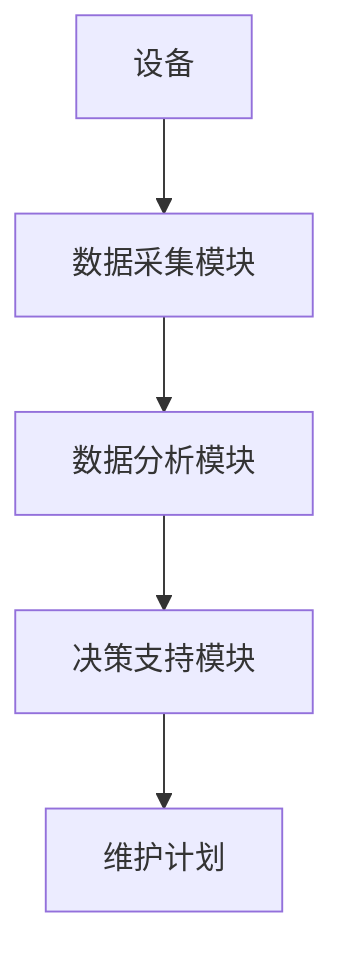

                 


# 价值投资中的智能制造预测性维护分析

---

## 关键词  
价值投资, 智能制造, 预测性维护, 机器学习, 系统架构, 投资策略

---

## 摘要  
智能制造与预测性维护的结合为价值投资提供了新的视角。通过分析智能制造中的预测性维护技术，投资者可以识别那些能够有效降低运营成本、提高设备利用率的企业，从而做出更明智的投资决策。本文从背景介绍、核心概念、算法原理、系统架构、项目实战等方面详细分析了智能制造预测性维护在价值投资中的应用，并通过实际案例展示了如何将这些技术应用于投资决策中。

---

## 目录

1. 背景介绍
2. 预测性维护与价值投资的核心概念
3. 预测性维护的算法原理
4. 预测性维护系统的架构设计
5. 项目实战：智能制造预测性维护分析
6. 总结与最佳实践

---

## 第一部分：背景介绍

### 1. 智能制造与预测性维护概述

#### 1.1 智能制造的基本概念
智能制造是一种通过数字化技术优化生产过程的制造模式，依赖物联网（IoT）、大数据分析和人工智能（AI）等技术。其核心在于提高生产效率、降低成本和增强灵活性。

#### 1.2 预测性维护的基本概念
预测性维护是基于设备的历史数据和实时数据，利用机器学习算法预测设备故障，从而提前安排维护工作。这种方法可以显著减少停机时间，降低维护成本。

#### 1.3 价值投资的基本概念
价值投资是一种投资策略，旨在通过分析企业的基本面，找到市场低估的股票进行长期投资，以获得超额收益。核心在于识别那些具有强大基本面和竞争优势的企业。

---

### 1.4 智能制造与价值投资的结合
智能制造通过提高生产效率和降低成本，增强了企业的盈利能力。预测性维护作为智能制造的重要组成部分，能够进一步优化企业的运营效率，从而提升企业的市场价值。投资者可以通过分析企业的预测性维护能力，识别出具有竞争优势的企业进行投资。

---

## 第二部分：预测性维护与价值投资的核心概念

### 2. 预测性维护的原理与实现

#### 2.1 预测性维护的原理
预测性维护依赖于传感器数据、历史维护记录和环境数据，利用机器学习算法分析这些数据，预测设备的故障时间。常用算法包括回归分析、时间序列分析和支持向量机（SVM）等。

#### 2.2 预测性维护的主要技术
- **数据采集**：通过传感器实时采集设备运行数据。
- **数据分析**：利用机器学习算法分析数据，识别设备的健康状况。
- **预测模型**：构建预测模型，预测设备故障时间。
- **决策支持**：基于预测结果，制定维护计划。

---

### 2.3 预测性维护与价值投资的联系

#### 2.3.1 预测性维护对企业的价值影响
- 提高设备利用率，降低维护成本。
- 减少设备故障停机时间，提高生产效率。
- 提升企业整体竞争力，增强市场价值。

#### 2.3.2 价值投资如何利用预测性维护
- **企业基本面分析**：评估企业的预测性维护能力。
- **竞争优势分析**：选择那些在预测性维护技术上具有优势的企业。
- **投资决策**：基于预测性维护能力，优化投资组合。

---

## 第三部分：预测性维护的算法原理

### 3.1 常用算法介绍

#### 3.1.1 回归分析
回归分析是一种统计方法，用于预测设备故障时间。通过分析设备的运行参数和故障时间的关系，建立回归模型，预测未来设备的故障概率。

#### 3.1.2 时间序列分析
时间序列分析是一种基于时间数据的预测方法，常用于预测设备的故障时间。通过分析设备的历史运行数据，识别出故障时间的变化趋势。

#### 3.1.3 支持向量机（SVM）
支持向量机是一种监督学习算法，常用于分类和回归问题。在预测性维护中，SVM可以用于分类设备的健康状态，预测设备的故障时间。

---

### 3.2 算法实现与流程图

#### 3.2.1 回归分析的实现流程
1. 数据采集：收集设备的运行数据和故障时间。
2. 数据预处理：清洗数据，处理缺失值和异常值。
3. 模型训练：使用回归算法训练模型。
4. 模型预测：基于训练好的模型，预测设备的故障时间。

#### 3.2.2 时间序列分析的实现流程
1. 数据采集：收集设备的历史运行数据。
2. 数据预处理：清洗数据，处理缺失值和异常值。
3. 模型训练：使用时间序列算法训练模型。
4. 模型预测：基于训练好的模型，预测设备的故障时间。

---

### 3.3 算法实现的Python代码示例

#### 3.3.1 回归分析的Python代码示例
```python
import pandas as pd
from sklearn.linear_model import LinearRegression

# 数据加载
data = pd.read_csv('equipment_data.csv')

# 特征与目标分离
X = data[['temperature', 'vibration']]
y = data['failure_time']

# 模型训练
model = LinearRegression()
model.fit(X, y)

# 模型预测
predicted_failure_time = model.predict(X)
```

---

## 第四部分：预测性维护系统的架构设计

### 4.1 系统架构设计

#### 4.1.1 系统功能设计
- 数据采集模块：实时采集设备运行数据。
- 数据分析模块：分析数据，预测设备故障时间。
- 决策支持模块：基于预测结果，制定维护计划。

#### 4.1.2 系统架构图


---

## 第五部分：项目实战

### 5.1 项目介绍
本项目旨在通过分析某制造企业的设备数据，利用预测性维护技术优化其维护策略，从而提升企业的运营效率和市场价值。

---

## 第六部分：总结与最佳实践

### 6.1 总结
智能制造中的预测性维护技术为价值投资提供了新的视角。通过分析企业的预测性维护能力，投资者可以识别出具有竞争优势的企业，优化投资组合。

### 6.2 最佳实践
- **数据质量**：确保数据的准确性和完整性。
- **模型选择**：根据企业的具体情况选择合适的预测算法。
- **持续优化**：定期更新模型，适应设备的变化。

---

## 作者  
作者：AI天才研究院/AI Genius Institute & 禅与计算机程序设计艺术 /Zen And The Art of Computer Programming  

---

通过这篇博客，读者可以深入了解智能制造中的预测性维护技术，并将其应用于价值投资中，识别出具有竞争优势的企业，优化投资策略。

