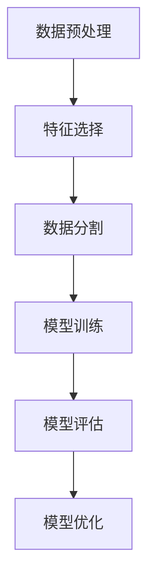
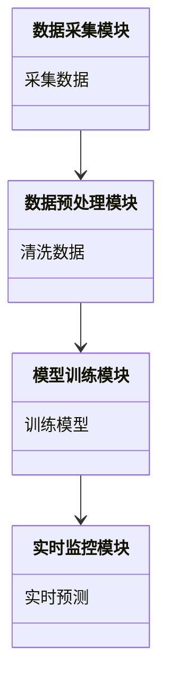
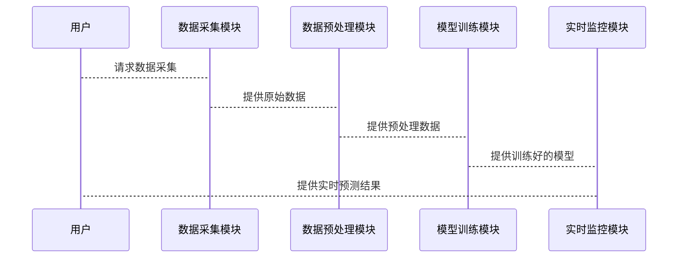

                 


# 价值投资中的智能制造预测性质量控制分析

## 关键词：
- 价值投资
- 智能制造
- 预测性质量控制
- 机器学习
- 数据分析

## 摘要：
智能制造中的预测性质量控制是一种基于数据分析和机器学习的技术，用于预测和优化产品质量，从而影响企业的投资价值。本文将从价值投资的角度，详细分析智能制造中的预测性质量控制，探讨其算法原理、系统架构、项目实战以及对投资决策的影响。通过对预测性质量控制的核心概念、算法流程、系统设计和实际案例的深入解析，本文旨在为投资者和企业提供一种新的视角，以优化投资决策和生产流程。

---

## 第1章: 价值投资与智能制造的背景介绍

### 1.1 价值投资的基本概念与特点
- **1.1.1 价值投资的定义**  
  价值投资是一种投资策略，强调以低于市场价值的价格购买优质资产，长期持有，等待市场对其价值的重新评估。
- **1.1.2 价值投资的核心特点**  
  - 长期导向  
  - 重视基本面分析  
  - 寻找被市场低估的投资标的  
- **1.1.3 价值投资与传统投资的区别**  
  - 传统投资：短期交易、依赖市场波动  
  - 价值投资：长期持有、关注内在价值  

### 1.2 智能制造的基本概念与特点
- **1.2.1 智能制造的定义**  
  智能制造是通过物联网、大数据、人工智能等技术，实现生产过程的智能化、自动化和高效化。
- **1.2.2 智能制造的核心特点**  
  - 数据驱动  
  - 自动化与智能化  
  - 灵活与高效  

### 1.3 预测性质量控制的基本概念与特点
- **1.3.1 预测性质量控制的定义**  
  预测性质量控制是利用数据分析和机器学习技术，提前预测产品质量问题，从而优化生产流程。
- **1.3.2 预测性质量控制的核心特点**  
  - 数据驱动  
  - 预测性  
  - 实时监控  

### 1.4 价值投资与智能制造的结合
- **1.4.1 价值投资在智能制造中的应用**  
  通过分析智能制造企业的基本面，寻找具有长期增长潜力的企业。
- **1.4.2 智能制造对价值投资的影响**  
  智能制造提高了生产效率和产品质量，从而影响企业的内在价值。
- **1.4.3 价值投资与智能制造的结合案例**  
  某智能制造企业的案例分析，展示其如何通过预测性质量控制提升企业价值。

---

## 第2章: 价值投资中的智能制造预测性质量控制的核心概念与联系

### 2.1 预测性质量控制的核心原理
- **2.1.1 数据驱动的预测方法**  
  利用生产过程中的数据，通过统计分析和机器学习模型进行预测。
- **2.1.2 统计分析与机器学习的结合**  
  统计方法（如回归分析）与机器学习算法（如XGBoost）的结合，提高了预测准确性。
- **2.1.3 预测模型的构建与优化**  
  数据清洗、特征选择、模型训练与调优。

### 2.2 预测性质量控制与价值投资的联系
- **2.2.1 数据分析在价值投资中的作用**  
  通过数据分析，发现智能制造企业的潜在价值。
- **2.2.2 预测性质量控制对投资决策的影响**  
  预测产品质量问题，影响企业的盈利能力和市场价值。
- **2.2.3 预测性质量控制在智能制造中的应用**  
  实时监控生产过程，优化产品质量，降低生产成本。

### 2.3 核心概念对比分析
- **2.3.1 统计方法与机器学习方法的对比**  
  | 方法         | 优点                          | 缺点                          |
  |--------------|-------------------------------|-------------------------------|
  | 统计回归     | 简单易懂，计算速度快           | 易受数据分布影响，预测精度有限 |
  | 机器学习     | 预测精度高，可处理复杂特征     | 计算复杂，需要大量数据         |
- **2.3.2 不同预测模型的优缺点对比**  
  - XGBoost：预测精度高，适合处理大量特征。
  - 神经网络：适合处理非线性关系，但需要大量数据和计算资源。
- **2.3.3 数据特征对预测结果的影响分析**  
  - 特征选择：关键特征对模型性能的影响较大。
  - 数据预处理：缺失值、异常值的处理对模型性能有重要影响。

### 2.4 本章小结
预测性质量控制通过数据分析和机器学习技术，优化智能制造企业的产品质量，从而影响企业的内在价值。价值投资者可以通过预测性质量控制，发现具有长期增长潜力的企业。

---

## 第3章: 预测性质量控制的算法原理与数学模型

### 3.1 算法原理
- **3.1.1 统计回归分析**  
  线性回归：通过最小二乘法拟合数据，预测目标变量。
  $$ y = \beta_0 + \beta_1x_1 + \beta_2x_2 + \epsilon $$
- **3.1.2 机器学习算法**  
  - XGBoost：基于树的集成算法，适合分类和回归问题。
  - 神经网络：通过多层神经元模拟人脑的神经网络，适合处理复杂数据。
- **3.1.3 时间序列分析**  
  ARIMA模型：用于时间序列数据的预测。

### 3.2 算法流程图


### 3.3 数学模型与公式
- **线性回归模型**  
  $$ y = \beta_0 + \beta_1x + \epsilon $$
- **XGBoost算法**  
  通过梯度提升树模型，优化目标函数：
  $$ \text{loss} = \sum_{i=1}^n (y_i - \hat{y}_i)^2 $$

### 3.4 本章小结
通过统计回归、机器学习和时间序列分析，预测性质量控制算法能够有效地预测产品质量，优化生产流程。

---

## 第4章: 系统分析与架构设计方案

### 4.1 问题场景介绍
智能制造企业需要实时监控生产过程，预测产品质量问题，优化生产流程。

### 4.2 系统功能设计
- 数据采集与预处理
- 模型训练与部署
- 实时监控与预测

### 4.3 系统架构设计


### 4.4 系统接口设计
- 数据接口：数据采集模块与预处理模块之间的数据传递接口。
- 模型接口：模型训练模块与实时监控模块之间的模型调用接口。

### 4.5 系统交互流程图


### 4.6 本章小结
系统架构设计通过模块化的方式，实现了数据采集、预处理、模型训练和实时监控的功能，为预测性质量控制提供了技术支撑。

---

## 第5章: 项目实战

### 5.1 环境配置
- Python 3.8+
- scikit-learn、XGBoost、TensorFlow等库

### 5.2 系统核心实现源代码
```python
import pandas as pd
from sklearn.model_selection import train_test_split
from xgboost import XGBRegressor
from sklearn.metrics import mean_squared_error

# 数据加载
data = pd.read_csv('production_data.csv')

# 特征选择
features = data[['temperature', 'pressure', 'time']]
target = data['quality']

# 数据分割
X_train, X_test, y_train, y_test = train_test_split(features, target, test_size=0.2)

# 模型训练
model = XGBRegressor(n_estimators=100, learning_rate=0.1)
model.fit(X_train, y_train)

# 模型预测
y_pred = model.predict(X_test)

# 模型评估
mse = mean_squared_error(y_test, y_pred)
print(f'Mean Squared Error: {mse}')
```

### 5.3 代码应用解读与分析
- 数据加载：读取生产数据。
- 特征选择：选择影响产品质量的关键特征。
- 数据分割：将数据分为训练集和测试集。
- 模型训练：使用XGBoost算法训练模型。
- 模型预测：对测试数据进行预测。
- 模型评估：计算均方误差，评估模型性能。

### 5.4 实际案例分析
某智能制造企业通过实施预测性质量控制，成功降低了产品质量问题，提高了生产效率，从而提升了企业的市场价值。

### 5.5 项目小结
通过项目实战，验证了预测性质量控制算法的有效性，展示了其在智能制造中的实际应用价值。

---

## 第6章: 结论与展望

### 6.1 本章小结
本文从价值投资的角度，分析了智能制造中的预测性质量控制，探讨了其算法原理、系统架构、项目实战以及对投资决策的影响。通过理论分析和实际案例，展示了预测性质量控制在智能制造中的重要性。

### 6.2 局限性与未来研究方向
- 局限性：数据质量和模型选择对预测结果的影响较大。
- 未来研究方向：研究更复杂的机器学习算法，如深度学习，优化预测模型。

### 6.3 本章小结
本文的研究为投资者和企业提供了一种新的视角，以优化投资决策和生产流程。

---

## 作者：AI天才研究院 & 禅与计算机程序设计艺术

