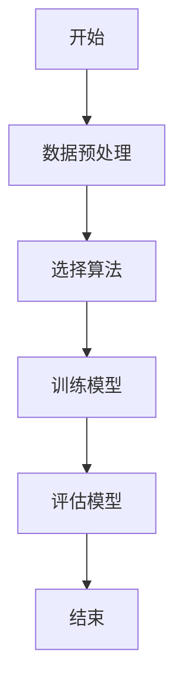
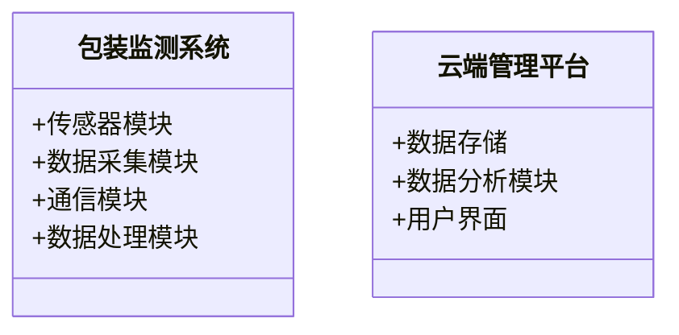
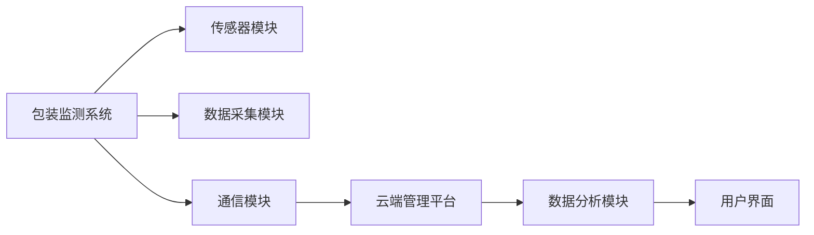
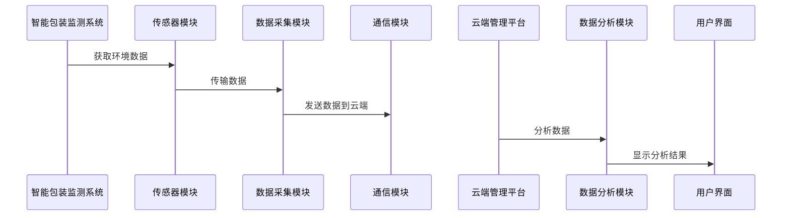

                 


# 价值投资中的智能包装技术发展趋势

## 关键词：价值投资，智能包装技术，发展趋势，算法原理，系统架构，投资策略

## 摘要：  
本文探讨了智能包装技术在价值投资中的应用趋势，分析了智能包装技术的核心概念、算法原理、系统架构，并结合实际案例，提出了价值投资中的智能包装技术的发展策略和投资建议。文章通过详细的系统分析和项目实战，为投资者提供了科学的决策依据。

---

# 第1章 价值投资的基本原理

## 1.1 价值投资的核心概念

### 1.1.1 价值投资的定义与起源
价值投资是一种长期投资策略，强调通过深入分析企业的基本面，寻找那些具有持续竞争优势和合理估值的企业进行投资。其核心理念是购买被市场低估的资产，长期持有，等待其价值回归。

### 1.1.2 价值投资的基本原则
1. **安全边际**：买入价格低于内在价值，以降低投资风险。
2. **长期视角**：关注企业的长期盈利能力，而非短期波动。
3. **深入分析**：研究企业的财务状况、行业地位和管理团队。

### 1.1.3 价值投资的适用场景
- 稳定增长的企业：如公用事业、消费品行业。
- 经济周期波动中的防御性行业。

## 1.2 智能包装技术的定义与特点

### 1.2.1 智能包装技术的定义
智能包装技术是一种结合物联网、传感器、数据采集和通信技术的包装解决方案，能够实时感知环境变化并提供相关信息。

### 1.2.2 智能包装技术的核心特征
- **智能化**：集成传感器和数据处理模块，实时监测包装状态。
- **互联性**：通过通信技术（如蓝牙、Wi-Fi）与外部系统交互。
- **数据驱动**：基于数据分析优化包装设计和供应链管理。

### 1.2.3 智能包装技术的应用领域
- 食品行业：监测温度、湿度，确保产品质量。
- 医药行业：监控药品储存条件，确保用药安全。
- 消费品行业：提升用户体验，增强品牌忠诚度。

## 1.3 价值投资与智能包装技术的结合

### 1.3.1 价值投资视角下的智能包装技术
智能包装技术作为一种创新性技术，具有较高的市场潜力和竞争优势，是价值投资者关注的优质标的。

### 1.3.2 智能包装技术对价值投资的影响
- 提高供应链效率，降低成本。
- 增强产品附加值，提升企业竞争力。

### 1.3.3 价值投资与智能包装技术的协同效应
通过投资智能包装技术企业，投资者可以享受技术创新带来的长期收益，同时推动企业进一步优化包装解决方案。

---

# 第2章 智能包装技术的核心原理

## 2.1 智能包装技术的原理分析

### 2.1.1 智能包装技术的基本原理
智能包装技术通过集成传感器、数据采集和通信模块，实时监测包装环境并反馈数据。

### 2.1.2 智能包装技术的关键技术
- **传感器技术**：温度、湿度、压力传感器等。
- **数据采集技术**：采集包装状态数据。
- **通信技术**：蓝牙、Wi-Fi、NB-IoT等。

### 2.1.3 智能包装技术的核心要素
- 传感器模块：实时监测环境参数。
- 数据处理模块：分析传感器数据。
- 通信模块：将数据传输到云端或管理系统。

## 2.2 智能包装技术与传统包装技术的对比

### 2.2.1 传统包装技术的特点
- 仅提供物理保护功能。
- 无法实时监测包装状态。
- 功能单一，缺乏智能化。

### 2.2.2 智能包装技术的创新点
- 集成传感器和数据处理模块，实现智能化监测。
- 通过通信技术与外部系统交互。
- 提供实时数据反馈，优化供应链管理。

### 2.2.3 两者在功能、成本和效率上的对比

| 对比维度 | 传统包装技术 | 智能包装技术 |
|----------|---------------|----------------|
| 功能     | 物理保护      | 智能监测与反馈 |
| 成本     | 较低          | 较高          |
| 效率     | 低            | 高            |

---

# 第3章 智能包装技术的算法原理

## 3.1 智能包装技术中的算法应用

### 3.1.1 常见算法在智能包装中的应用
- **预测算法**：预测包装材料的性能变化。
- **分类算法**：分类不同环境下的包装状态。

### 3.1.2 算法选择的依据与原则
- 数据量和复杂度：选择适合数据规模的算法。
- 预测准确性：优先选择高精度算法。

### 3.1.3 算法优化的策略与方法
- 参数调整：优化算法性能。
- 模型融合：结合多种算法提升预测准确性。

## 3.2 智能包装技术的数学模型

### 3.2.1 数学模型的构建与分析
$$
y = f(x) + \epsilon
$$
其中，$y$ 为目标变量，$x$ 为输入变量，$\epsilon$ 为误差项。

### 3.2.2 算法流程图


## 3.3 智能包装技术的Python实现

### 3.3.1 核心代码
```python
import numpy as np
from sklearn.linear_model import LinearRegression

# 示例数据
X = np.array([[1], [2], [3], [4], [5]])
y = np.array([2, 4, 5, 4, 6])

# 训练模型
model = LinearRegression()
model.fit(X, y)

# 预测
print(model.predict([[6]]))
```

### 3.3.2 代码解读
- 数据预处理：对输入数据进行标准化或归一化处理。
- 模型训练：使用线性回归算法训练模型。
- 模型评估：通过均方误差（MSE）和决定系数（R²）评估模型性能。

---

# 第4章 智能包装技术的系统架构设计

## 4.1 问题场景介绍
智能包装监测系统用于实时监测包装环境并提供数据支持，帮助优化供应链管理和产品质量控制。

## 4.2 系统功能设计

### 4.2.1 领域模型图


## 4.3 系统架构设计

### 4.3.1 系统架构图


## 4.4 接口设计与交互序列图

### 4.4.1 接口设计
- 传感器模块接口：与数据采集模块通信。
- 云端管理平台接口：接收传感器数据并存储。

### 4.4.2 交互序列图


---

# 第5章 价值投资中的智能包装技术策略

## 5.1 投资策略与建议

### 5.1.1 研究智能包装技术企业的基本面
- 企业的财务状况：收入、利润、现金流。
- 企业的竞争优势：技术专利、市场份额。

### 5.1.2 关注行业趋势
- 包装行业的智能化转型趋势。
- 政策支持：政府对绿色包装、智能包装的鼓励政策。

## 5.2 风险分析与应对措施

### 5.2.1 技术风险
- 技术创新速度快，企业需持续投入研发。

### 5.2.2 市场风险
- 市场需求波动，企业需灵活调整。

### 5.2.3 竞争风险
- 新进入者增多，企业需保持技术领先。

---

# 第6章 案例分析与投资实践

## 6.1 案例分析

### 6.1.1 某智能包装企业分析
- 企业概况：成立时间、主营业务。
- 技术创新：拥有的专利数量、技术优势。
- 财务表现：收入增长、利润率。

## 6.2 投资实践

### 6.2.1 投资组合构建
- 根据企业基本面和技术优势，构建投资组合。
- 分散投资，降低风险。

## 6.3 投资效果评估

### 6.3.1 评估指标
- 投资回报率（ROI）。
- 股价涨幅。

---

# 第7章 最佳实践与小结

## 7.1 最佳实践 tips
- 深入研究企业的基本面和技术实力。
- 关注行业趋势和政策支持。
- 分散投资，降低风险。

## 7.2 小结
智能包装技术作为价值投资的新领域，具有广阔的发展前景和投资潜力。投资者需结合企业的基本面和技术优势，制定科学的投资策略。

## 7.3 注意事项
- 技术风险：关注企业的技术创新能力。
- 市场风险：关注市场需求变化。
- 财务风险：关注企业的财务健康状况。

## 7.4 拓展阅读
- 推荐书籍：《智能包装技术与产业发展》。
- 推荐网站：行业研究报告、技术白皮书。

---

# 作者：AI天才研究院/AI Genius Institute & 禅与计算机程序设计艺术 /Zen And The Art of Computer Programming

