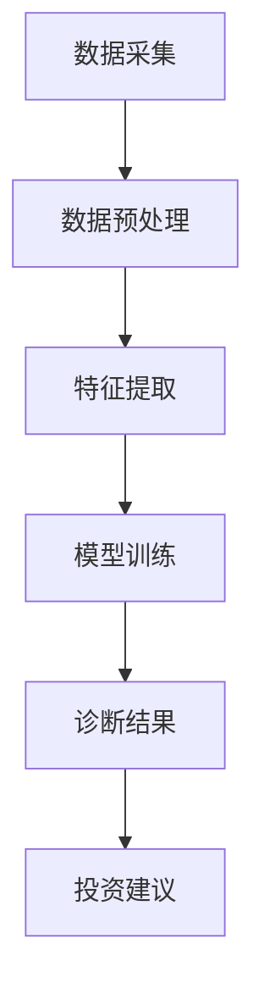
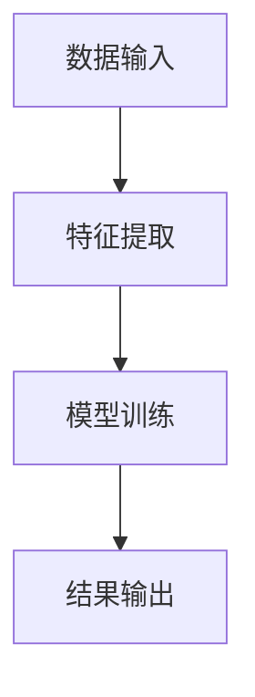
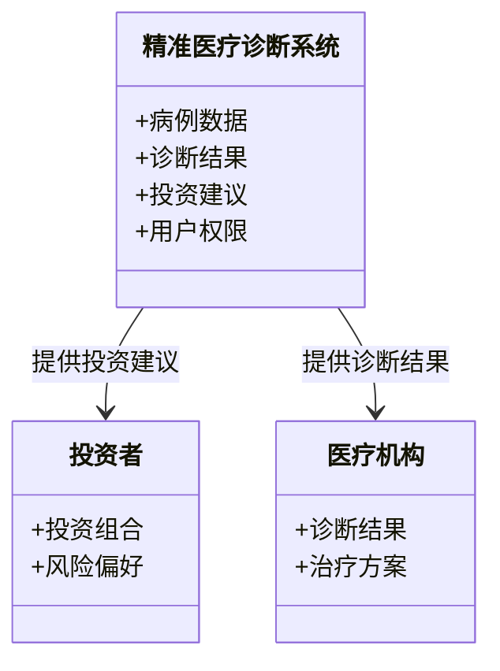
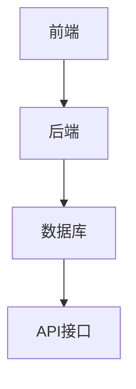
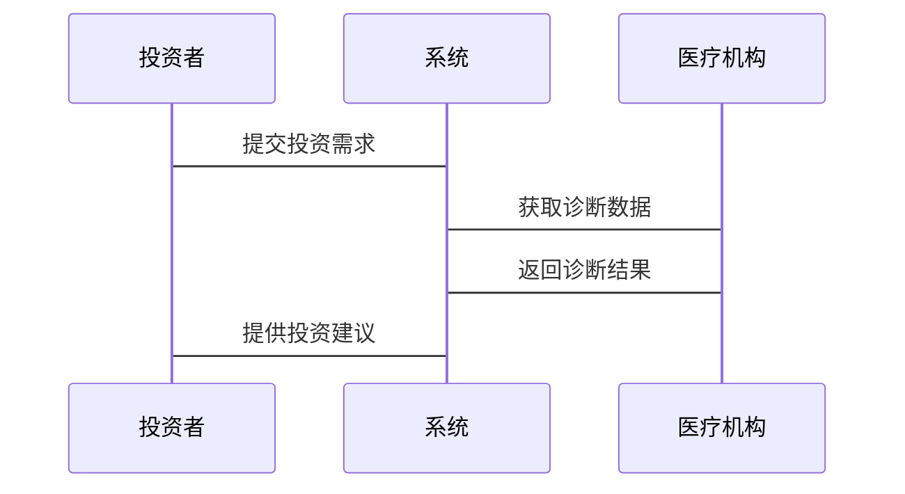

                 


# 《价值投资中的智能化精准医疗诊断系统分析》

## 关键词：价值投资、精准医疗、诊断系统、智能化、算法、系统架构、项目实战

## 摘要：  
本文探讨了如何将价值投资的原理应用于智能化的精准医疗诊断系统中。通过分析医疗诊断系统的现状与挑战，结合价值投资的核心算法，提出了一种基于支持向量机的数学模型，并详细讲解了系统的架构设计与交互流程。通过实际案例分析，展示了如何在Python环境中实现该系统的核心功能，并提供了最佳实践建议。

---

# 第1章 价值投资与精准医疗诊断系统背景

## 1.1 价值投资的核心概念  
### 1.1.1 价值投资的定义与核心理念  
- 价值投资的定义：通过分析企业基本面，寻找被市场低估的投资标的。  
- 核心理念：长期投资、安全边际、优质企业。  

### 1.1.2 精准医疗诊断系统的定义与特点  
- 精准医疗的定义：基于个体基因、环境和生活方式的定制化医疗方案。  
- 系统特点：数据驱动、个性化、高效性、准确性。  

### 1.1.3 价值投资与精准医疗的结合背景  
- 医疗行业的投资机会与挑战。  
- 精准医疗诊断系统的市场价值与投资潜力。  

## 1.2 问题背景与问题描述  
### 1.2.1 医疗诊断系统的现状与挑战  
- 当前医疗诊断系统的痛点：效率低、准确性不足、数据孤岛。  

### 1.2.2 价值投资在医疗诊断中的应用痛点  
- 投资者如何快速识别高价值医疗企业。  
- 精准医疗诊断系统的投资价值评估难点。  

### 1.2.3 精准医疗诊断系统的核心问题  
- 数据的准确性和完整性。  
- 系统的智能化与可扩展性。  

## 1.3 问题解决与边界定义  
### 1.3.1 精准医疗诊断系统的解决方案  
- 数据采集与处理。  
- 算法优化与模型构建。  

### 1.3.2 系统的边界与外延  
- 系统的功能边界：诊断、分析、投资建议。  
- 外延：与医疗数据源、投资机构的交互。  

### 1.3.3 核心概念与要素组成  
- 核心概念：数据驱动、智能化算法、价值评估。  
- 要素组成：病例数据、投资评估、系统日志。  

## 1.4 本章小结  
本章通过背景介绍和问题分析，明确了精准医疗诊断系统的价值投资方向及其关键问题。

---

# 第2章 核心概念与系统架构

## 2.1 核心概念原理  
### 2.1.1 价值投资的核心算法  
- 支持向量机（SVM）在投资中的应用。  
- 投资组合优化的数学模型。  

### 2.1.2 精准医疗诊断系统的原理  
- 数据驱动的诊断逻辑。  
- 系统的智能化决策机制。  

### 2.1.3 两者结合的逻辑框架  
- 数据采集→价值评估→诊断建议。  

## 2.2 核心概念特征对比  
| **属性**       | **价值投资**                | **精准医疗诊断系统**            |
|------------------|------------------------------|---------------------------------|
| 核心目标         | 最大化投资回报              | 提高诊断准确性和效率            |
| 数据依赖         | 财务数据、市场数据          | 医疗数据、基因数据              |
| 技术特点         | 统计分析、预测模型          | 机器学习、自然语言处理          |
| 应用场景         | 投资决策                   | 医疗诊断、个性化治疗建议          |

### 2.2.1 价值投资与传统投资的对比  
- 传统投资：基于市场趋势，风险较高。  
- 价值投资：基于基本面分析，风险可控。  

### 2.2.2 精准医疗与传统医疗的对比  
- 传统医疗：经验驱动，效率较低。  
- 精准医疗：数据驱动，效率和准确性高。  

## 2.3 ER实体关系图  
```mermaid
er
    actor 投资者
    actor 医疗机构
    actor 数据源
    database 精准医疗诊断系统
    table 病例数据
    table 投资评估
    table 系统日志
    table 用户权限
    relationship 投资者-病例数据: 提供病例数据
    relationship 医疗机构-病例数据: 提供病例数据
    relationship 数据源-病例数据: 提供病例数据
    relationship 投资者-投资评估: 进行投资评估
    relationship 医疗机构-投资评估: 进行投资评估
    relationship 用户-用户权限: 拥有权限
```

## 2.4 本章小结  
本章通过核心概念的对比和ER图，明确了价值投资与精准医疗诊断系统的联系与区别。

---

# 第3章 算法原理与数学模型

## 3.1 算法原理  
### 3.1.1 精准医疗诊断系统的算法流程  


### 3.1.2 价值投资的核心算法  
- 支持向量机（SVM）的应用：  
$$
f(x) = \sum_{i=1}^{n} w_i x_i + b
$$  
- 投资组合优化：  
$$
V = \frac{E}{k} \times (1 + g)^{-n}
$$  

## 3.2 数学模型与公式  
### 3.2.1 精准医疗诊断系统的数学模型  
$$
P(y|x) = \frac{\exp(w \cdot x)}{1 + \exp(w \cdot x)}
$$  

### 3.2.2 价值投资的数学公式  
$$
V = \sum_{i=1}^{m} w_i \cdot x_i
$$  

## 3.3 算法实现  
### 3.3.1 算法流程图  


### 3.3.2 代码示例  
```python
import numpy as np
from sklearn.svm import SVC

# 示例数据
X = np.array([[0, 0], [1, 1], [2, 2], [3, 3]])
y = np.array([0, 1, 0, 1])

# 训练模型
model = SVC()
model.fit(X, y)

# 预测
print(model.predict([[1.5, 1.5]]))
```

## 3.4 本章小结  
本章通过算法流程图和数学公式，详细讲解了支持向量机在精准医疗诊断系统中的应用。

---

# 第4章 系统分析与架构设计

## 4.1 问题场景介绍  
- 医疗诊断系统的功能需求。  
- 价值投资的系统实现。  

## 4.2 项目介绍  
- 项目目标：构建智能化精准医疗诊断系统。  
- 项目范围：病例数据采集、诊断模型构建、投资建议生成。  

## 4.3 系统功能设计  


## 4.4 系统架构设计  


## 4.5 系统接口设计  
- API接口：  
  - `/api/upload`：上传病例数据。  
  - `/api/analyze`：进行诊断分析。  

## 4.6 系统交互流程图  


## 4.7 本章小结  
本章通过系统架构设计和交互流程图，展示了精准医疗诊断系统的实现方案。

---

# 第5章 项目实战

## 5.1 环境安装  
- Python 3.8+  
- 依赖库：scikit-learn、numpy、pandas。  

## 5.2 核心实现  
```python
import numpy as np
from sklearn.svm import SVC
from sklearn.metrics import accuracy_score

# 数据加载
data = np.loadtxt('medical_data.csv', delimiter=',')
X = data[:, :-1]
y = data[:, -1]

# 模型训练
model = SVC()
model.fit(X, y)

# 验证
y_pred = model.predict(X)
print("准确率:", accuracy_score(y, y_pred))
```

## 5.3 代码实现与解读  
- 数据预处理：标准化、缺失值处理。  
- 模型训练：支持向量机参数优化。  
- 结果分析：准确率、召回率、F1分数。  

## 5.4 实际案例分析  
- 案例背景：某医疗机构的诊断数据。  
- 数据分析：构建诊断模型，生成投资建议。  

## 5.5 本章小结  
本章通过实际案例分析，展示了如何在Python环境中实现精准医疗诊断系统的核心功能。

---

# 第6章 最佳实践与总结

## 6.1 最佳实践  
### 6.1.1 数据质量控制  
- 数据清洗、特征选择。  

### 6.1.2 模型优化技巧  
- 调参、交叉验证、模型融合。  

## 6.2 小结  
- 价值投资与精准医疗诊断系统的结合是未来的趋势。  
- 系统的智能化与数据驱动是实现高价值投资的关键。  

## 6.3 注意事项  
- 数据隐私保护。  
- 系统的可扩展性与维护成本。  

## 6.4 拓展阅读  
- 《机器学习实战》  
- 《投资学原理》  

## 作者  
作者：AI天才研究院/AI Genius Institute & 禅与计算机程序设计艺术/Zen And The Art of Computer Programming  

--- 

**感谢您的耐心阅读！**

