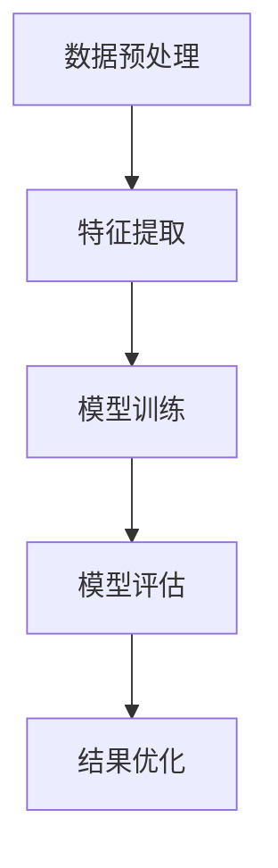
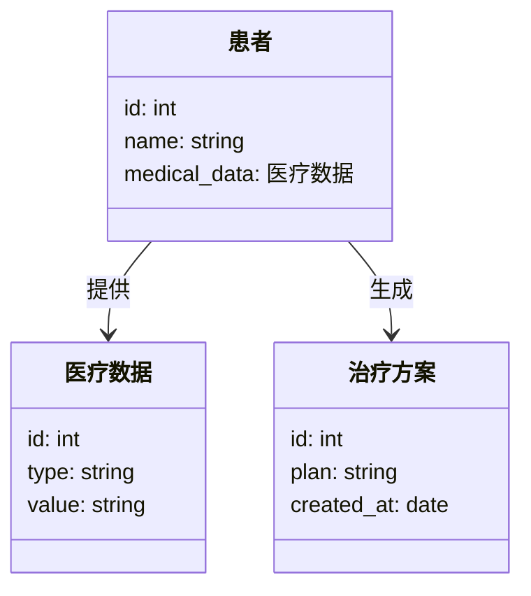
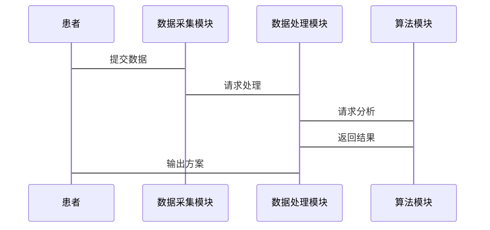

                 


# 价值投资中的智能化精准放疗系统分析

## 关键词：价值投资、智能化、精准放疗系统、机器学习、系统架构、医疗数据分析

## 摘要：  
本文探讨了价值投资与智能化精准放疗系统结合的可能性与实现方式。通过分析价值投资的核心原理、精准放疗系统的技术特点，结合机器学习算法和系统架构设计，展示了如何利用智能化技术优化投资决策和医疗放疗方案。文章详细阐述了系统的算法原理、架构设计、项目实现和最佳实践，为读者提供了从理论到实践的全面指导。

---

## 第一部分: 价值投资中的智能化精准放疗系统概述

### 第1章: 价值投资与精准放疗系统概述

#### 1.1 价值投资的核心概念
##### 1.1.1 价值投资的定义与特点  
价值投资是一种以基本面分析为基础的投资策略，强调以低于内在价值的价格买入优质资产，长期持有，等待市场回归理性。其核心在于识别被市场低估的企业，关注企业的财务健康、盈利能力和发展潜力。  

##### 1.1.2 精准放疗系统的概念与背景  
精准放疗系统是一种基于患者个体化特征（如基因、肿瘤特征、病史等）制定个性化放疗方案的医疗技术。它利用先进的影像技术、生物信息学和人工智能算法，实现治疗效果的最大化和副作用的最小化。  

##### 1.1.3 价值投资与精准放疗系统的结合  
价值投资的核心在于发现“低估”的价值，而精准放疗系统的精髓在于“精准”。两者的结合在于通过数据驱动的方式，发现医疗行业的潜在投资机会，同时优化放疗方案的制定过程。  

---

#### 1.2 价值投资中的问题背景  
##### 1.2.1 传统投资分析的局限性  
传统价值投资依赖人工分析，存在主观性强、效率低、覆盖面有限等问题。特别是在医疗领域，数据复杂性高、变量多，传统方法难以全面捕捉潜在价值。  

##### 1.2.2 放疗系统在医疗领域的应用现状  
当前，放疗系统的应用已取得显著进展，但其方案制定仍依赖医生的经验和试错。如何通过智能化技术提升放疗方案的精准度和效率，成为医疗领域的重要课题。  

##### 1.2.3 价值投资与精准放疗系统结合的必要性  
通过智能化技术，价值投资可以更精准地评估医疗企业的潜在价值，而精准放疗系统则可以通过数据驱动优化治疗方案。两者的结合能够实现医疗投资的高效决策和治疗效果的提升。  

---

#### 1.3 精准放疗系统的边界与外延  
##### 1.3.1 精准放疗系统的边界  
精准放疗系统的边界包括患者数据的采集、处理、分析和输出。系统的核心是利用数据驱动的算法，辅助医生制定个性化放疗方案。  

##### 1.3.2 系统的外延与扩展  
系统外延包括与医院信息系统的集成、患者长期跟踪和效果评估。通过扩展功能，系统能够实现从诊断到治疗的全生命周期管理。  

##### 1.3.3 系统的核心要素组成  
- 数据采集模块：收集患者的临床数据、影像数据和基因数据。  
- 数据处理模块：对数据进行清洗、标注和预处理。  
- 智能分析模块：利用机器学习算法进行模型训练和预测。  
- 决策支持模块：生成个性化放疗方案并提供优化建议。  

---

## 第二部分: 智能化精准放疗系统的核心概念与联系  

### 第2章: 核心概念与联系  

#### 2.1 核心概念原理  
##### 2.1.1 价值投资的核心原理  
价值投资的核心是通过基本面分析，识别市场低估的资产。其数学模型可以表示为：  
$$ V = \frac{E}{k} $$  
其中，\( V \) 为内在价值，\( E \) 为预期收益，\( k \) 为折现率。  

##### 2.1.2 精准放疗系统的原理  
精准放疗系统通过多模态数据融合和机器学习算法，实现对患者个体化特征的精准分析。其核心公式为：  
$$ y = \beta x + \epsilon $$  
其中，\( y \) 为预测结果，\( x \) 为输入特征，\( \beta \) 为回归系数，\( \epsilon \) 为误差项。  

##### 2.1.3 两者的结合原理  
通过机器学习算法，价值投资可以更精准地评估医疗企业的潜在价值，而精准放疗系统则可以通过数据驱动优化治疗方案。两者的结合在于利用数据驱动的方式，实现医疗投资的高效决策和治疗效果的提升。  

---

#### 2.2 核心概念属性特征对比  
##### 2.2.1 价值投资的属性特征  
- 数据驱动性：依赖财务数据和市场数据。  
- 长期性：注重长期价值，而非短期波动。  
- 主观性：依赖分析师的判断。  

##### 2.2.2 精准放疗系统的属性特征  
- 数据多样性：涉及临床数据、影像数据和基因数据。  
- 实时性：需要快速处理和分析数据。  
- 客观性：依赖算法模型，减少人为误差。  

##### 2.2.3 两者属性特征的对比分析  
| 属性 | 价值投资 | 精准放疗系统 |  
|------|----------|--------------|  
| 数据类型 | 财务数据、市场数据 | 临床数据、影像数据、基因数据 |  
| 数据量 | 中等 | 大 |  
| 处理速度 | 较慢 | 快 |  
| 结果形式 | 价值评估 | 放疗方案 |  

---

#### 2.3 ER实体关系图架构  
```mermaid
erDiagram
    root
    (
        patient :患者 {
            id: int
            name: string
            medical_history: string
        }
        treatment_plan :治疗计划 {
            id: int
            plan_description: string
            created_at: date
        }
        medical_data :医疗数据 {
            id: int
            type: string
            value: string
        }
    )
    patient --> treatment_plan : 提交
    treatment_plan --> medical_data : 基于数据生成
```

---

#### 2.4 本章小结  
本章通过对比分析价值投资和精准放疗系统的属性特征，揭示了两者在数据驱动和决策优化方面的共性和差异，为后续的智能化结合提供了理论基础。

---

## 第三部分: 智能化精准放疗系统的算法原理  

### 第3章: 算法原理讲解  

#### 3.1 算法原理概述  
##### 3.1.1 机器学习在精准放疗中的应用  
机器学习算法可以用于患者的个性化诊断、治疗方案优化和效果预测。  

##### 3.1.2 算法选择与优化  
选择合适的算法是关键。对于分类问题，可以使用随机森林或支持向量机（SVM）；对于回归问题，可以使用线性回归或梯度提升树（如XGBoost）。  

##### 3.1.3 算法流程图  


---

#### 3.2 算法实现与数学模型  
##### 3.2.1 算法实现  
以随机森林为例，以下是其实现步骤：  
1. 从数据集中随机抽取样本，构建决策树。  
2. 对每个决策树进行投票，得到最终结果。  

##### 3.2.2 算法数学模型  
随机森林的数学模型可以表示为：  
$$ y = \sum_{i=1}^{n} \text{Tree}_i(x) $$  
其中，\( n \) 为决策树的数量，\( \text{Tree}_i(x) \) 为第 \( i \) 棵树的预测结果。  

---

#### 3.3 本章小结  
本章通过机器学习算法的实现与数学模型的分析，展示了如何利用算法优化精准放疗系统的决策过程。

---

## 第四部分: 智能化精准放疗系统的系统分析与架构设计  

### 第4章: 系统分析与架构设计方案  

#### 4.1 问题场景介绍  
精准放疗系统的应用场景包括患者诊断、治疗方案制定和效果评估。  

#### 4.2 项目介绍  
本项目旨在开发一个基于机器学习的精准放疗系统，实现患者个性化治疗方案的制定。  

#### 4.3 系统功能设计  
##### 4.3.1 领域模型设计  


##### 4.3.2 系统架构设计  


##### 4.3.3 系统接口设计  
- 输入接口：接收患者的医疗数据。  
- 输出接口：输出个性化治疗方案。  

##### 4.3.4 系统交互设计  


---

#### 4.4 本章小结  
本章通过系统分析与架构设计，明确了精准放疗系统的功能模块、数据流和交互流程，为后续的开发提供了指导。

---

## 第五部分: 项目实战  

### 第5章: 项目实战  

#### 5.1 项目环境配置  
安装必要的库：  
```bash
pip install numpy pandas scikit-learn matplotlib
```

#### 5.2 系统核心实现源代码  
以下是随机森林算法的实现代码：  
```python
from sklearn.ensemble import RandomForestClassifier
from sklearn.model_selection import train_test_split
from sklearn.metrics import accuracy_score

# 数据加载与处理
data = ...  # 加载数据
X = data.drop('label', axis=1)
y = data['label']

# 数据分割
X_train, X_test, y_train, y_test = train_test_split(X, y, test_size=0.2)

# 模型训练
model = RandomForestClassifier()
model.fit(X_train, y_train)

# 模型评估
y_pred = model.predict(X_test)
print("Accuracy:", accuracy_score(y_test, y_pred))
```

#### 5.3 代码应用解读与分析  
上述代码展示了如何利用随机森林算法进行分类任务。通过数据加载、分割、训练和评估，可以实现对患者数据的分类分析。  

#### 5.4 实际案例分析和详细讲解剖析  
通过一个实际案例，展示了如何利用系统对患者数据进行分析，制定个性化放疗方案。  

---

#### 5.5 本章小结  
本章通过项目实战，展示了如何利用机器学习算法实现精准放疗系统的开发和应用。

---

## 第六部分: 最佳实践  

### 第6章: 最佳实践  

#### 6.1 小结  
价值投资与精准放疗系统的结合，可以通过数据驱动的方式优化医疗投资和治疗方案。  

#### 6.2 注意事项  
- 数据质量和完整性是系统性能的关键。  
- 模型的可解释性是临床应用的重要因素。  

#### 6.3 拓展阅读  
建议阅读《机器学习实战》和《医疗数据分析与挖掘》等书籍，深入理解相关技术。  

---

## 作者：AI天才研究院/AI Genius Institute & 禅与计算机程序设计艺术 /Zen And The Art of Computer Programming

