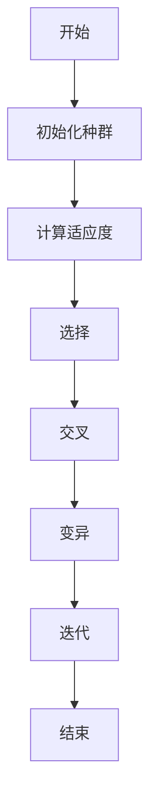
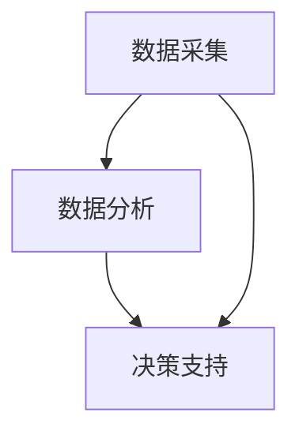

                 


# 价值投资中的智能化精准癌症治疗系统分析

> 关键词：价值投资，精准治疗，人工智能，医疗系统，优化算法

> 摘要：本文探讨了如何将价值投资的理念应用于智能化精准癌症治疗系统中，通过数学建模和算法优化，构建高效、可靠的医疗决策支持系统。文章从系统背景、核心概念、算法原理、系统架构、项目实战等多个维度进行深入分析，旨在为医疗投资者和研究人员提供理论支持和实践指导。

---

## 第一部分：价值投资与精准癌症治疗系统概述

### 第1章：价值投资与精准治疗的基本概念

#### 1.1 价值投资的核心理念
- **定义**：价值投资是一种通过分析资产的内在价值，寻找市场价格低于其真实价值的投资策略。
- **核心思想**：寻找被市场低估的投资标的，长期持有，等待价值回归。
- **在医疗领域的应用**：通过分析医疗技术或治疗方案的潜在价值，优化资源配置。

#### 1.2 精准治疗的基本概念
- **定义**：基于患者个体特征（基因、生活方式、环境等）制定个性化治疗方案。
- **核心技术**：基因测序、人工智能、大数据分析。
- **优势**：提高治疗效果，降低副作用，节省医疗成本。

#### 1.3 智能化精准治疗系统的背景
- **智能化趋势**：医疗技术的快速发展推动了智能化治疗系统的应用。
- **价值投资的潜力**：通过智能化系统优化医疗资源分配，提升治疗效果。
- **应用场景**：癌症早期筛查、治疗方案优化、术后康复管理。

#### 1.4 本章小结
本章介绍了价值投资和精准治疗的基本概念，并阐述了智能化精准治疗系统的背景及其在医疗领域的应用潜力。

---

## 第二部分：智能化精准癌症治疗系统的系统分析

### 第2章：系统核心概念与联系

#### 2.1 系统核心概念
- **价值评估模型**：用于评估治疗方案的潜在价值。
- **精准治疗算法**：用于制定个性化治疗方案。
- **智能化决策支持系统**：整合数据、模型和算法，提供决策支持。

#### 2.2 核心概念原理
- **价值评估模型的数学公式**
  $$ V = \sum_{i=1}^{n} w_i x_i $$
  其中，V为系统总价值，w_i为权重，x_i为各因素的值。

- **精准治疗算法**
  - 输入：患者基因数据、生活习惯、病史。
  - 输出：个性化治疗方案。
  - 参数：治疗效果预测模型。

#### 2.3 概念属性特征对比表格
| 概念                | 属性                | 特征                                  |
|---------------------|---------------------|--------------------------------------|
| 价值评估模型        | 输入                | 患者数据                              |
|                     | 输出                | 治疗价值评分                          |
|                     | 参数                | 权重系数                              |

#### 2.4 ER实体关系图
```mermaid
erDiagram
    患者数据 <--- 关联表 --> 治疗方案
    治疗方案 <--- 关联表 --> 价值评估模型
```

#### 2.5 本章小结
本章分析了智能化精准治疗系统的核心概念及其之间的联系，并通过数学公式和实体关系图明确了各部分的逻辑关系。

---

## 第三部分：算法原理与数学模型

### 第3章：优化算法原理

#### 3.1 优化算法概述
- **目标**：优化治疗方案的价值评估和选择。
- **输入**：患者数据、治疗方案。
- **输出**：最优治疗方案。

#### 3.2 遗传算法流程


#### 3.3 数学模型与公式
- **适应度函数**
  $$ f(x) = \sum_{i=1}^{n} w_i x_i $$
  其中，x_i为治疗方案的特征，w_i为权重系数。

---

## 第四部分：系统架构与项目实战

### 第4章：系统架构设计

#### 4.1 系统功能设计
- **模块划分**：
  - 数据采集模块：收集患者基因、生活习惯等数据。
  - 数据分析模块：利用机器学习算法进行数据分析。
  - 决策支持模块：生成个性化治疗方案。

#### 4.2 系统架构图


#### 4.3 项目实战
- **环境安装**：安装Python、机器学习库（如Scikit-learn）。
- **核心代码实现**
  ```python
  import numpy as np
  from sklearn.model_selection import train_test_split

  # 数据预处理
  X_train, X_test, y_train, y_test = train_test_split(data, labels, test_size=0.2)

  # 模型训练
  model = RandomForestClassifier()
  model.fit(X_train, y_train)

  # 预测与评估
  accuracy = model.score(X_test, y_test)
  print(f"模型准确率：{accuracy}")
  ```

---

## 第五部分：总结与展望

### 第5章：总结与展望

#### 5.1 本章总结
本文通过分析价值投资和精准治疗的核心概念，构建了智能化精准治疗系统，并通过遗传算法和机器学习模型优化了治疗方案的选择。

#### 5.2 未来展望
- **技术改进**：引入更复杂的优化算法，如强化学习。
- **应用场景扩展**：将系统应用于更多类型的疾病治疗。
- **数据共享**：推动医疗数据的共享，提高系统的泛化能力。

---

## 作者信息

作者：AI天才研究院/AI Genius Institute & 禅与计算机程序设计艺术/Zen And The Art of Computer Programming

---

这篇文章通过系统分析、算法优化和项目实战，全面探讨了价值投资理念在智能化精准癌症治疗系统中的应用，为医疗投资者和研究人员提供了理论支持和实践指导。

