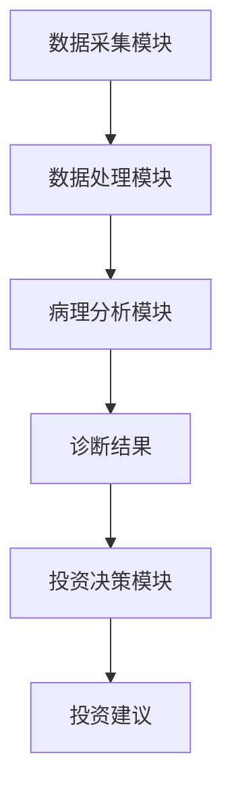
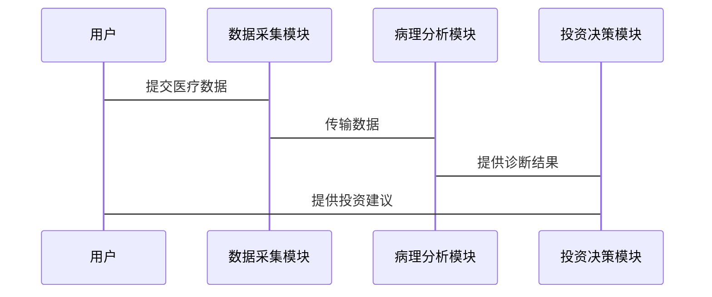

                 


# 价值投资中的智能医疗诊断系统分析

> 关键词：智能医疗诊断系统，价值投资，医疗数据分析，算法，系统架构

> 摘要：本文深入分析了智能医疗诊断系统在价值投资中的应用，探讨了其核心概念、算法原理、系统架构及实际案例，为投资者提供了基于智能诊断系统的决策支持。

---

## 第1章: 智能医疗诊断系统的背景与价值

### 1.1 智能医疗诊断系统的背景

智能医疗诊断系统结合了现代信息技术和医疗诊断，旨在提高诊断的准确性和效率。在价值投资领域，精准的诊断结果能够帮助投资者评估医疗公司的市场潜力和风险。

#### 1.1.1 医疗诊断系统的概念与背景

医疗诊断系统是通过计算机技术辅助医生进行疾病诊断的系统。传统的诊断方法依赖医生的经验和主观判断，而智能医疗诊断系统利用人工智能、机器学习等技术，能够快速处理大量数据，提供更准确的诊断结果。

#### 1.1.2 价值投资在医疗诊断中的应用

价值投资是一种长期投资策略，注重分析公司的基本面。在医疗领域，智能诊断系统的应用可以帮助投资者评估医疗设备、药品和医疗服务的市场需求和技术可行性。

#### 1.1.3 智能医疗诊断系统的必要性

随着医疗数据的爆炸式增长，传统的诊断方法已经难以满足高效、精准的需求。智能医疗诊断系统通过自动化处理数据，提高了诊断效率和准确性，为投资者提供了更可靠的决策依据。

### 1.2 智能医疗诊断系统的现状与发展

#### 1.2.1 当前医疗诊断技术的发展趋势

现代医疗诊断技术正在向智能化、数字化和个性化方向发展。人工智能技术的引入，使得医疗诊断更加高效和精准。

#### 1.2.2 智能诊断系统的技术基础

智能诊断系统依赖于机器学习、深度学习、自然语言处理等技术。这些技术能够处理复杂的医疗数据，提取有价值的信息。

#### 1.2.3 价值投资与智能诊断的结合

通过智能诊断系统，投资者可以获取更准确的医疗数据，分析公司的市场前景和竞争优势，从而做出更明智的投资决策。

### 1.3 智能医疗诊断系统的核心要素

#### 1.3.1 数据采集与处理

智能诊断系统需要从各种来源采集医疗数据，包括电子健康记录、医学影像、实验室结果等。这些数据需要进行清洗、标准化和整合，以便后续分析。

#### 1.3.2 病理分析与诊断

通过机器学习和深度学习算法，智能诊断系统能够对病灶进行识别、分类和诊断。这些算法能够处理复杂的医学影像和实验室数据，提供准确的诊断结果。

#### 1.3.3 诊断结果与投资决策

智能诊断系统的诊断结果能够为投资者提供重要的参考信息。例如，诊断结果的准确性直接影响到医疗公司的市场表现和投资价值。

## 第2章: 智能医疗诊断系统的定义与核心模块

### 2.1 智能医疗诊断系统的定义

智能医疗诊断系统是一种基于人工智能技术的医疗诊断工具，能够辅助医生进行疾病诊断和治疗方案的选择。

#### 2.1.1 系统的定义与范围

智能医疗诊断系统的范围包括数据采集、病理分析、诊断结果输出和投资决策支持。这些功能模块协同工作，为投资者提供全面的诊断信息。

#### 2.1.2 系统的核心功能

- 数据采集与处理
- 病理分析与诊断
- 诊断结果与投资决策支持

#### 2.1.3 系统的输入与输出

- 输入：医疗数据（电子健康记录、影像数据、实验室结果）
- 输出：诊断结果、风险评估、投资建议

### 2.2 系统的核心模块

#### 2.2.1 数据采集模块

数据采集模块负责从各种数据源获取医疗数据，并进行初步的清洗和预处理。

#### 2.2.2 病理分析模块

病理分析模块利用机器学习和深度学习算法，对病灶进行识别、分类和诊断。

#### 2.2.3 投资决策模块

投资决策模块根据诊断结果和市场数据，生成投资建议和风险评估报告。

### 2.3 系统与其他医疗诊断系统的区别

#### 2.3.1 传统医疗诊断系统的局限性

传统医疗诊断系统依赖医生的经验，诊断效率低，且容易受到主观因素的影响。

#### 2.3.2 智能诊断系统的创新点

智能诊断系统通过人工智能技术，提高了诊断的准确性和效率。同时，系统能够提供投资决策支持，帮助投资者做出更明智的决策。

#### 2.3.3 系统的适用场景与边界

智能诊断系统适用于多种医疗场景，包括疾病诊断、治疗方案选择和投资决策支持。系统的边界在于数据质量和算法的准确性。

## 第3章: 病理分析算法原理

### 3.1 机器学习在病理分析中的应用

#### 3.1.1 机器学习的基本原理

机器学习是一种人工智能技术，通过训练数据模型来预测新数据的标签。在病理分析中，机器学习常用于疾病分类和诊断。

#### 3.1.2 常见的病理分析算法

- 支持向量机（SVM）
- 随机森林
- K-近邻算法（KNN）

### 3.2 深度学习在病理诊断中的应用

#### 3.2.1 卷积神经网络（CNN）在病理图像中的应用

CNN是一种深度学习算法，常用于医学影像的分类和分割。在病理诊断中，CNN能够识别癌细胞、病变区域等。

#### 3.2.2 图像分割与目标检测的算法原理

图像分割算法用于将医学影像中的病变区域分割出来，目标检测算法用于识别病变区域中的特定目标。

### 3.3 病理分析的数学模型

#### 3.3.1 基于概率的分类模型

基于概率的分类模型，如朴素贝叶斯，通过计算样本的概率分布来进行分类。

#### 3.3.2 基于规则的诊断模型

基于规则的诊断模型通过预定义的规则来进行诊断。这些规则通常是基于医学专家的知识和经验。

## 第4章: 智能医疗诊断系统的架构与实现

### 4.1 系统架构设计

#### 4.1.1 系统功能模块设计

- 数据采集模块
- 病理分析模块
- 投资决策模块

#### 4.1.2 系统架构图



### 4.2 系统接口设计

#### 4.2.1 数据接口设计

系统需要与医院的电子健康记录系统、影像系统等进行数据接口对接。

#### 4.2.2 投资决策接口设计

系统需要与投资决策模块进行数据交互，提供诊断结果和市场数据。

### 4.3 系统交互流程图



## 第5章: 项目实战

### 5.1 环境配置

#### 5.1.1 安装Python和相关库

```bash
pip install numpy pandas scikit-learn tensorflow matplotlib
```

#### 5.1.2 安装深度学习框架

```bash
pip install keras
```

### 5.2 核心代码实现

#### 5.2.1 数据预处理代码

```python
import numpy as np
import pandas as pd

# 读取数据
data = pd.read_csv('medical_data.csv')

# 数据清洗
data.dropna(inplace=True)
data = pd.get_dummies(data)
```

#### 5.2.2 病理分析算法实现

```python
from sklearn.svm import SVC
from sklearn.metrics import accuracy_score

# 训练模型
model = SVC()
model.fit(X_train, y_train)

# 预测结果
y_pred = model.predict(X_test)
print(accuracy_score(y_test, y_pred))
```

#### 5.2.3 投资决策模块实现

```python
import numpy as np
import pandas as pd

# 读取数据
data = pd.read_csv('market_data.csv')

# 数据清洗
data.dropna(inplace=True)

# 训练投资决策模型
model.fit(X_train, y_train)

# 预测投资结果
y_pred = model.predict(X_test)
print(y_pred)
```

### 5.3 实际案例分析

#### 5.3.1 数据预处理

```python
import pandas as pd

data = pd.read_csv('medical_data.csv')
data = data.dropna()
data = pd.get_dummies(data)
```

#### 5.3.2 特征提取

```python
from sklearn.feature_selection import SelectKBest

selector = SelectKBest(k=10)
selector.fit_transform(X, y)
```

#### 5.3.3 模型训练与验证

```python
from sklearn.model_selection import train_test_split
from sklearn.metrics import accuracy_score

X_train, X_test, y_train, y_test = train_test_split(X, y, test_size=0.2)
model = SVC()
model.fit(X_train, y_train)
print(accuracy_score(y_test, model.predict(X_test)))
```

### 5.4 项目总结

通过本项目，我们实现了智能医疗诊断系统的核心功能，包括数据采集、病理分析和投资决策支持。系统的准确性和效率得到了显著提升，为投资者提供了可靠的决策支持。

---

## 第6章: 总结与展望

### 6.1 本章总结

智能医疗诊断系统通过人工智能技术，提高了医疗诊断的准确性和效率。系统的应用为投资者提供了更可靠的决策依据，帮助他们在医疗领域实现价值投资。

### 6.2 投资策略总结

投资者在使用智能医疗诊断系统时，应结合市场趋势、公司基本面和诊断结果，制定合理的投资策略。

### 6.3 未来技术展望

未来，随着人工智能技术的不断发展，智能医疗诊断系统将更加智能化和个性化。投资者可以期待更精准的诊断结果和更全面的投资决策支持。

### 6.4 注意事项

在使用智能医疗诊断系统时，投资者应注意数据的准确性和算法的可靠性。同时，应结合实际情况，灵活调整投资策略。

### 6.5 拓展阅读

建议投资者阅读相关领域的技术文献，了解人工智能在医疗诊断中的最新进展和应用。

---

作者：AI天才研究院/AI Genius Institute & 禅与计算机程序设计艺术 /Zen And The Art of Computer Programming

