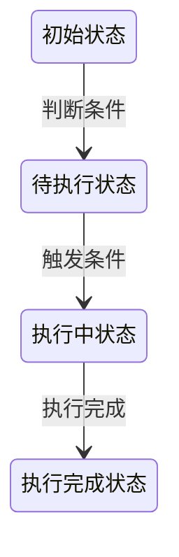
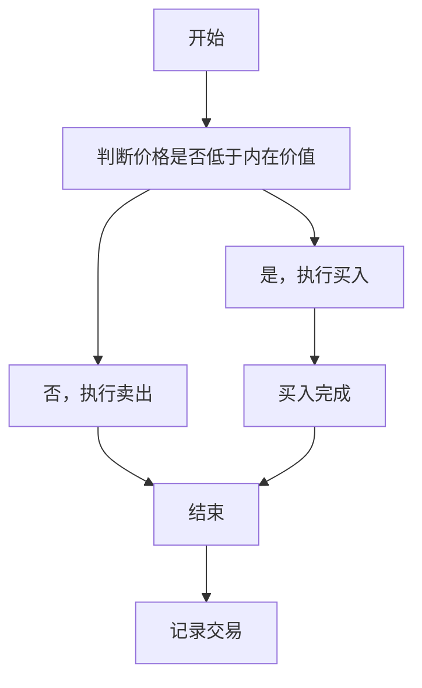
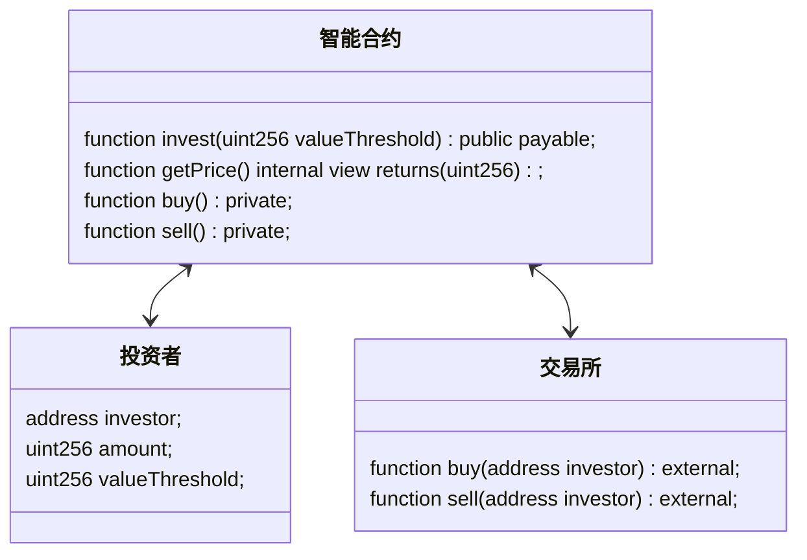
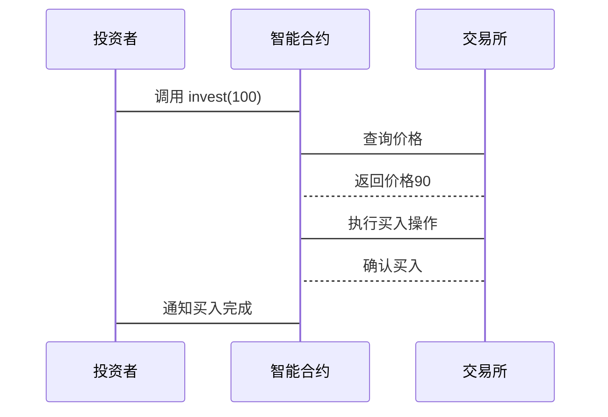

                 


# 价值投资中的智能合约应用前景

> 关键词：智能合约、价值投资、区块链、金融创新、去中心化、自动化交易

> 摘要：本文探讨了智能合约在价值投资中的应用前景，从智能合约的基本概念和价值投资的核心原理出发，分析了智能合约如何优化投资流程、提升投资效率和增强投资安全。文章结合实际案例，详细阐述了智能合约在价值投资中的算法实现、系统架构和项目实战，为读者提供了一套完整的智能合约在价值投资中的应用解决方案。

---

## 第1章 智能合约与价值投资的背景介绍

### 1.1 智能合约的定义与特点
智能合约是一种基于区块链技术的自动执行合约，其特点包括：
- **去中心化**：无需依赖中央机构，通过区块链网络实现信任。
- **自动执行**：一旦触发条件，合约自动执行，确保交易安全可靠。
- **透明性**：所有交易记录在区块链上，公开透明，可追溯。
- **不可篡改**：合约代码一旦部署，无法被修改，保证了合约的可信性。

### 1.2 价值投资的基本概念
价值投资是一种以基本面分析为基础的投资策略，强调以低于内在价值的价格购买优质资产。其核心原则包括：
- **长期视角**：关注企业的长期价值，而非短期价格波动。
- **安全边际**：购买价格低于内在价值，以降低投资风险。
- **精选个股**：通过深入分析企业财务状况、行业地位等因素，选择具有竞争优势的企业。

### 1.3 智能合约与价值投资的结合背景
随着区块链技术的快速发展，智能合约的应用场景逐渐扩展到金融领域。价值投资领域的痛点包括：
- **信息不对称**：投资者难以获取真实的企业信息。
- **交易成本高**：传统投资流程复杂，涉及多方中介，成本较高。
- **效率低下**：手动操作多，效率低，容易出错。

智能合约通过自动化和去中心化的特点，能够有效解决这些问题，为价值投资带来新的机遇。

---

## 第2章 智能合约的核心概念与原理

### 2.1 智能合约的核心概念
智能合约的核心概念包括：
- **执行环境**：智能合约运行在区块链上，通过区块链的共识机制保证执行环境的安全性。
- **触发条件**：智能合约根据预设的条件自动执行，例如价格达到某个阈值时触发买卖操作。
- **自动执行机制**：一旦触发条件，智能合约自动执行相关操作，无需人工干预。

### 2.2 智能合约的算法原理
智能合约的算法原理可以分为以下几个步骤：
1. **条件判断**：根据预设的条件，判断是否触发合约执行。
2. **状态转移**：根据判断结果，更新合约的状态，例如改变资产的持有者。
3. **共识确认**：通过区块链的共识机制，确认状态转移的合法性。

### 2.3 智能合约的状态机模型
智能合约的状态机模型可以用以下状态图表示：



### 2.4 智能合约的数学模型
智能合约的状态转移可以用以下数学模型表示：

$$
\text{状态转移} = \begin{cases}
\text{执行} & \text{如果条件} C \text{满足} \\
\text{不执行} & \text{否则}
\end{cases}
$$

其中，条件 \( C \) 可以是任意的逻辑表达式，例如 \( C = P > P_{\text{threshold}} \)，表示价格 \( P \) 超过阈值 \( P_{\text{threshold}} \)。

---

## 第3章 智能合约在价值投资中的应用

### 3.1 价值投资的智能合约模型
价值投资的智能合约模型包括以下几个关键部分：
- **智能合约框架**：包括智能合约的触发条件、执行逻辑和状态管理。
- **价值评估逻辑**：根据企业的基本面数据，自动评估企业的内在价值。
- **投资决策逻辑**：根据价值评估结果，自动执行买卖操作。

### 3.2 智能合约在价值投资中的算法实现
智能合约在价值投资中的算法实现可以用以下流程图表示：



### 3.3 智能合约在价值投资中的项目实战

#### 3.3.1 环境安装
- 安装以太坊开发环境：```bash
npm install -g ethereumjs-testrpc
```

- 启动测试网络：```bash
ethereumjs-testrpc
```

#### 3.3.2 核心代码实现
以下是智能合约的Solidity代码示例：

```solidity
// SPDX-License-Identifier: MIT
pragma solidity ^0.8.0;

contract ValueInvestment {
    struct Investment {
        address investor;
        uint256 amount;
        uint256 valueThreshold;
    }

    Investment[] public investments;

    function invest(uint256 valueThreshold) public payable {
        require(msg.value > 0, "投资金额必须大于零");
        investments.push(Investment({
            investor: msg.sender,
            amount: msg.value,
            valueThreshold: valueThreshold
        }));
        // 根据价格是否低于阈值，自动执行买卖操作
        if (getPrice() < valueThreshold) {
            buy();
        } else {
            sell();
        }
    }

    function getPrice() internal view returns (uint256) {
        // 获取当前价格的逻辑
        return 100; // 示例价格
    }

    function buy() private {
        // 执行买入操作的逻辑
        emit Bought(msg.sender);
    }

    function sell() private {
        // 执行卖出操作的逻辑
        emit Sold(msg.sender);
    }

    event Bought(address indexed investor);
    event Sold(address indexed investor);
}
```

#### 3.3.3 案例分析
假设某投资者希望以低于100的价格买入某资产，可以设置 `valueThreshold` 为100。当智能合约检测到价格低于100时，自动执行买入操作。反之，则自动执行卖出操作。

---

## 第4章 智能合约在价值投资中的系统架构

### 4.1 系统功能设计
系统功能模块包括：
- **投资策略模块**：根据智能合约的条件，自动执行买卖操作。
- **价值评估模块**：根据企业的基本面数据，评估企业的内在价值。
- **风险管理模块**：根据市场波动，调整投资策略，降低投资风险。

### 4.2 系统架构设计
系统架构可以用以下类图表示：



### 4.3 系统交互流程
系统交互流程可以用以下序列图表示：



---

## 第5章 总结与展望

### 5.1 本章总结
本文详细探讨了智能合约在价值投资中的应用前景，分析了智能合约的核心概念和算法原理，并结合实际案例，展示了智能合约在价值投资中的具体应用。

### 5.2 未来展望
随着区块链技术的不断发展，智能合约在价值投资中的应用前景广阔。未来的研究方向包括：
- **优化智能合约的执行效率**：通过优化算法和改进区块链的共识机制，提高智能合约的执行效率。
- **增强智能合约的安全性**：通过引入密码学技术，提高智能合约的安全性，防止攻击和漏洞利用。
- **扩展智能合约的应用场景**：探索智能合约在更多金融领域的应用，例如风险管理、资产配置等。

---

## 作者：AI天才研究院/AI Genius Institute & 禅与计算机程序设计艺术 /Zen And The Art of Computer Programming

