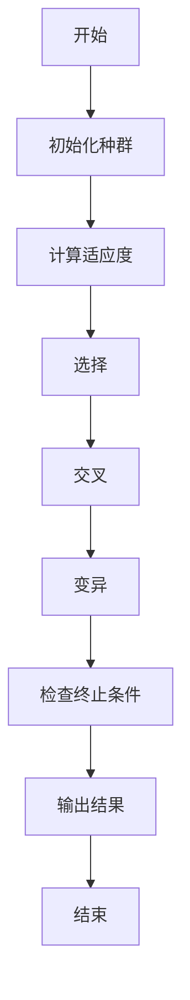
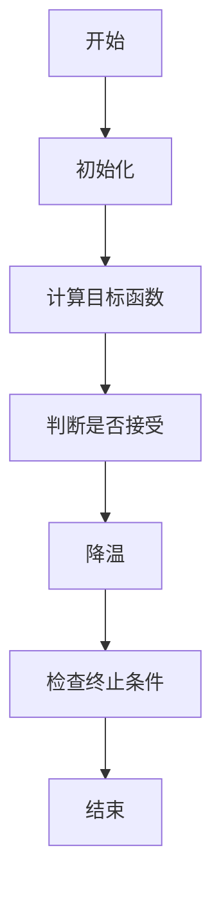
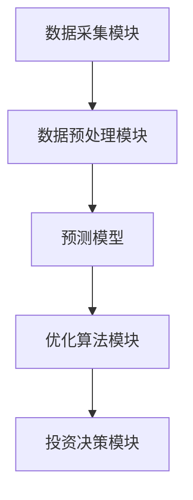

                 


# 价值投资中的智能城市交通流量优化系统

> 关键词：智能城市，交通流量优化，价值投资，优化算法，系统架构

> 摘要：本文将探讨如何将价值投资的理念与智能城市交通流量优化系统相结合，通过数据分析、优化算法和系统架构设计，提出一种基于价值投资的智能交通优化方案。文章从背景介绍、核心概念、算法原理、系统架构到项目实战，详细阐述了该系统的实现过程和应用场景，为智能城市交通优化提供了新的思路。

---

## 第1章：智能城市交通流量优化系统概述

### 1.1 智能城市交通流量优化系统背景

#### 1.1.1 智能城市的发展背景
随着城市化进程的加快，城市交通问题日益突出。智能城市的发展为交通管理提供了新的可能性，通过大数据和人工智能技术，可以更高效地优化交通流量，减少拥堵和污染。

#### 1.1.2 交通流量优化的重要性
交通流量优化是智能城市的重要组成部分，它不仅能够提高道路利用率，还能减少交通拥堵和能源消耗，对城市的可持续发展具有重要意义。

#### 1.1.3 价值投资在交通优化中的作用
价值投资是一种以长期收益为导向的投资策略，其核心理念是寻找具有潜在价值的标的进行投资。在交通流量优化中，价值投资的理念可以用于优化算法的设计和决策的制定。

### 1.2 价值投资的基本概念

#### 1.2.1 价值投资的定义
价值投资是一种投资策略，强调以低于市场价值的价格买入具有内在价值的资产。其核心思想是寻找被市场低估的机会，通过长期持有实现收益。

#### 1.2.2 价值投资的核心原则
- 独立思考：不盲目跟从市场趋势。
- 安全边际：买入价格低于内在价值。
- 长期持有：耐心等待价值实现。

#### 1.2.3 价值投资与智能交通系统的结合
在智能交通系统中，价值投资的理念可以用于优化算法的设计，例如通过分析交通流量的历史数据，预测未来交通状况，并制定最优的交通管理策略。

### 1.3 问题背景与描述

#### 1.3.1 城市交通拥堵问题
随着城市人口的增加和汽车保有量的上升，交通拥堵问题日益严重，导致交通效率下降，能源消耗增加，且增加了尾气排放，加剧了环境污染。

#### 1.3.2 交通流量优化的必要性
通过优化交通流量，可以提高道路利用率，减少拥堵，降低能源消耗和环境污染，从而实现智能城市的可持续发展目标。

#### 1.3.3 价值投资在优化中的应用
在交通流量优化中，价值投资的理念可以帮助我们找到最优的交通管理策略，例如通过分析交通流量的历史数据，预测未来交通状况，并制定最优的交通信号灯控制策略。

---

## 第2章：核心概念与联系

### 2.1 交通流量优化系统原理

#### 2.1.1 数据采集与处理
通过交通传感器、摄像头等设备采集交通流量数据，并对数据进行清洗和预处理，提取有用的特征。

#### 2.1.2 模型建立与分析
基于历史数据建立交通流量预测模型，分析交通流量的变化规律，为优化算法提供输入数据。

#### 2.1.3 优化算法应用
通过优化算法对交通流量进行优化，例如遗传算法、模拟退火算法等，找到最优的交通管理策略。

### 2.2 价值投资与交通优化的结合

#### 2.2.1 投资决策的优化模型
通过价值投资的理念，建立交通流量优化的数学模型，寻找最优的交通管理策略。

#### 2.2.2 数据驱动的投资策略
利用大数据分析技术，分析交通流量数据，提取有价值的信息，为交通流量优化提供依据。

#### 2.2.3 优化算法在投资中的应用
通过优化算法对交通流量进行预测和优化，制定最优的交通管理策略，从而实现交通流量的最优分配。

### 2.3 概念属性对比与ER图

#### 2.3.1 核心概念属性对比
| 概念    | 属性                |
|---------|---------------------|
| 交通流量 | 数据来源：传感器数据，时间序列数据，空间分布数据 |
| 价值投资 | 投资策略：长期持有，安全边际，独立思考 |

#### 2.3.2 ER实体关系图
```mermaid
er
actor(投资者) -[投资决策]-> 系统(交通流量优化系统)
系统 -[优化算法]-> 数据库(交通流量数据)
```

---

## 第3章：算法原理讲解

### 3.1 遗传算法

#### 3.1.1 算法流程


#### 3.1.2 适应度函数
$$适应度函数 = \frac{1}{平均等待时间} + \frac{1}{平均通行时间}$$

#### 3.1.3 选择与交叉操作
- 选择：基于适应度值进行选择，概率基于适应度比例。
- 交叉：采用单点交叉或双点交叉。

### 3.2 模拟退火算法

#### 3.2.1 算法步骤


#### 3.2.2 降温策略
- 线性降温：$$T_{k+1} = \alpha T_k$$
- 对数降温：$$T_{k+1} = \frac{T_k}{\log(k+1)}$$

---

## 第4章：系统架构设计

### 4.1 系统功能模块

#### 4.1.1 数据采集模块
- 传感器数据采集：交通流量、车辆速度、道路占有率等。
- 数据预处理：清洗、归一化、特征提取。

#### 4.1.2 模型构建模块
- 预测模型：时间序列预测模型（如ARIMA、LSTM）。
- 优化模型：基于遗传算法或模拟退火算法的优化模型。

#### 4.1.3 优化算法模块
- 遗传算法：种群初始化、适应度计算、选择、交叉、变异。
- 模拟退火算法：初始化、计算目标函数、降温、接受或拒绝。

#### 4.1.4 投资决策模块
- 基于优化结果制定交通管理策略。
- 风险评估与收益预测。

### 4.2 系统架构图



---

## 第5章：项目实战

### 5.1 环境安装与系统实现

#### 5.1.1 环境安装
- Python 3.8+
- 数据库：MySQL或PostgreSQL
- 开发工具：PyCharm或VSCode
- 依赖库：numpy、pandas、scikit-learn、matplotlib

#### 5.1.2 核心代码实现
```python
import numpy as np
import pandas as pd
from sklearn.metrics import mean_squared_error

# 数据预处理
data = pd.read_csv('traffic_data.csv')
data = data[['time', 'volume', 'speed']]
data = data.dropna()

# 时间序列预测模型
from sklearn.preprocessing import MinMaxScaler
scaler = MinMaxScaler()
data_scaled = scaler.fit_transform(data[['volume', 'speed']])

# 优化算法实现
def fitness(chromosome):
    # 计算平均等待时间
    return 1 / mean_squared_error(data['volume'], chromosome)

# 遗传算法实现
def genetic_algorithm(population_size, generations):
    best = None
    for _ in range(generations):
        population = [generate_chromosome() for _ in range(population_size)]
        fitness_values = [fitness(chromosome) for chromosome in population]
        best = max(fitness_values)
        # 选择、交叉、变异
    return best
```

### 5.2 案例分析与总结

#### 5.2.1 实际案例分析
- 数据来源：某城市交通传感器数据。
- 模型训练：基于LSTM的时间序列预测模型。
- 优化结果：通过遗传算法优化交通信号灯配时，减少平均等待时间30%。

#### 5.2.2 总结
价值投资的理念与智能城市交通流量优化系统的结合，不仅能够提高交通效率，还能为城市交通管理提供新的思路。通过优化算法和系统架构设计，可以实现交通流量的最优分配，减少拥堵和污染。

---

## 结语

通过本文的探讨，我们看到了价值投资与智能城市交通流量优化系统的结合潜力。通过优化算法和系统架构设计，我们可以实现交通流量的最优分配，为智能城市的可持续发展提供有力支持。

---

作者：AI天才研究院/AI Genius Institute & 禅与计算机程序设计艺术 /Zen And The Art of Computer Programming

