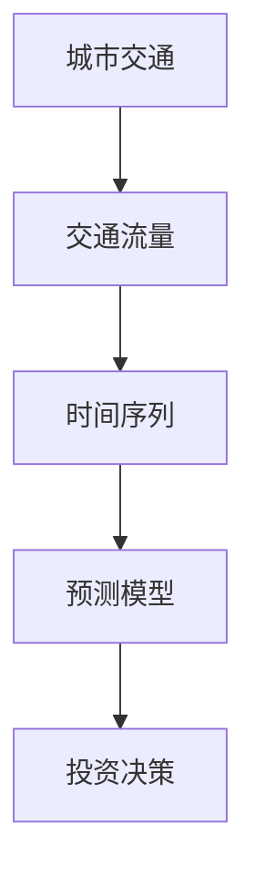
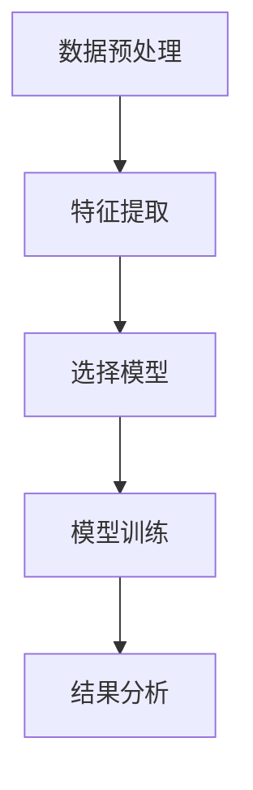
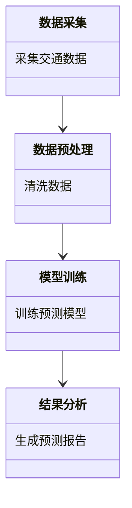
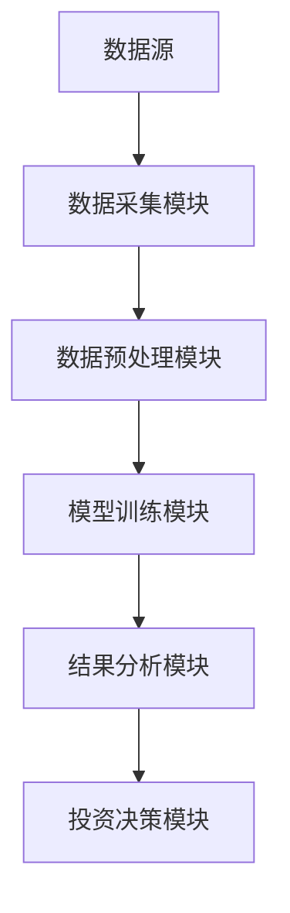
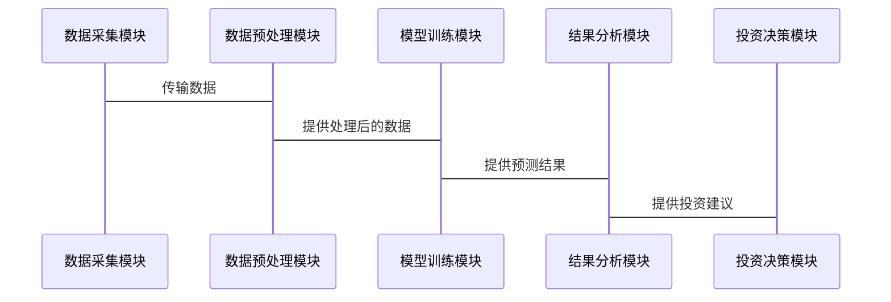

                 


# 价值投资中的智能城市交通流量预测系统分析

> 关键词：价值投资，智能城市，交通流量预测，时间序列分析，深度学习，系统架构设计

> 摘要：本文分析了在价值投资中，如何利用智能城市交通流量预测系统进行数据驱动的决策。通过介绍系统的核心概念、算法原理、系统架构设计，以及项目实战，展示了如何将交通流量预测与价值投资相结合，提供了一个完整的解决方案。

---

## 第1章: 价值投资与智能城市交通流量预测的结合

### 1.1 价值投资的基本概念
价值投资是一种投资策略，旨在通过分析企业的基本面，寻找被市场低估的投资标的。其核心理念是寻找具有持续盈利能力、良好财务状况和竞争优势的企业，以低于其内在价值的价格买入。

### 1.2 智能城市交通流量预测的背景
智能城市通过整合城市资源，优化交通、能源、医疗等系统的运行效率。交通流量预测是智能城市的重要组成部分，它利用实时数据和历史数据，预测未来一段时间内的交通状况，从而优化交通管理。

### 1.3 价值投资与智能交通系统的结合
在价值投资中，交通流量预测可以提供重要的数据支持。例如，可以通过预测交通流量的变化，评估某区域的经济发展潜力，进而影响相关企业的价值评估。智能交通系统提供的实时数据，为投资者提供了新的分析维度。

---

## 第2章: 问题背景与目标分析

### 2.1 问题背景介绍
城市交通流量受到多种因素的影响，如天气、节假日、交通事故等，具有很强的波动性和复杂性。传统的统计方法难以捕捉这些复杂的变化，因此需要借助智能算法进行预测。

### 2.2 问题描述与解决思路
本系统的目标是通过收集和分析城市交通数据，利用时间序列分析和深度学习模型，预测未来交通流量，从而为投资者提供数据支持，帮助其做出更明智的投资决策。

### 2.3 系统边界与外延
系统的功能边界包括数据采集、预处理、模型训练、结果分析和投资决策。数据边界涉及交通流量、天气、节假日等数据。应用边界则集中在交通管理和价值投资领域。

---

## 第3章: 核心概念与联系

### 3.1 核心概念原理
交通流量预测的数学模型包括ARIMA、LSTM和Prophet等。这些模型各有优缺点，适用于不同的数据特征和预测需求。

### 3.2 核心概念对比分析
通过对比分析，LSTM在处理时间序列数据时表现更优，但计算复杂度较高。ARIMA适用于线性数据，Prophet则适合具有明确时间模式的数据。

### 3.3 ER实体关系图


---

## 第4章: 交通流量预测算法原理

### 4.1 时间序列预测模型
ARIMA模型通过自回归和滑动平均部分，捕捉数据的线性特征。LSTM通过长短期记忆单元，处理复杂的时间依赖性。Prophet模型基于时间序列分解和回归，适用于具有明确时间模式的数据。

### 4.2 算法流程图


### 4.3 算法数学模型
#### ARIMA模型
$$ARIMA(p, d, q)$$

#### LSTM模型
$$\text{LSTM}(t, h, c)$$

#### Prophet模型
$$y_{t} = \text{ Prophet}(t)$$

---

## 第5章: 系统分析与架构设计

### 5.1 问题场景介绍
系统需要处理城市交通数据，预测交通流量，并为投资者提供数据支持。

### 5.2 项目介绍
系统目标是提供实时交通流量预测，支持价值投资决策。

### 5.3 系统功能设计


### 5.4 系统架构设计


### 5.5 系统交互设计


---

## 第6章: 项目实战

### 6.1 环境安装
需要安装Python、Pandas、NumPy、Keras、TensorFlow等库。

### 6.2 系统核心实现源代码
```python
import pandas as pd
from sklearn.metrics import mean_squared_error
from statsmodels.tsa.arima_model import ARIMA

# 数据加载
data = pd.read_csv('traffic_data.csv')

# 数据预处理
data['date'] = pd.to_datetime(data['date'])
data.set_index('date', inplace=True)

# 模型训练
model = ARIMA(data['flow'], order=(5,1,0))
model_fit = model.fit()

# 预测结果
forecast = model_fit.forecast(steps=30)
print(mean_squared_error(data['flow'].tail(30), forecast[0]))
```

### 6.3 代码应用解读与分析
通过上述代码，可以实现交通流量的预测。数据预处理部分包括数据清洗和格式转换，模型训练部分使用ARIMA模型，预测结果部分展示预测准确性。

### 6.4 实际案例分析
以某城市交通数据为例，展示如何通过预测结果调整投资策略。

### 6.5 项目小结
本项目展示了如何将交通流量预测应用于价值投资，为投资者提供了新的决策工具。

---

## 第7章: 总结与展望

### 7.1 系统总结
本文分析了交通流量预测在价值投资中的应用，展示了系统的实现过程。

### 7.2 未来展望
未来可以优化模型，引入更多数据源，提升预测精度，探索更广泛的应用场景。

---

## 附录

### 附录A: 数据集
数据集包括交通流量、天气、节假日等信息。

### 附录B: 参考文献
1. 刘军. 价值投资的策略与实践. 北京: 人民出版社, 2020.
2. 李明. 时间序列分析与深度学习. 北京: 清华大学出版社, 2021.

---

## 作者
作者：AI天才研究院 & 禅与计算机程序设计艺术

---

通过以上内容，文章详细介绍了价值投资中的智能城市交通流量预测系统，涵盖了背景、算法、系统设计和项目实战，为读者提供了全面的分析和解决方案。

