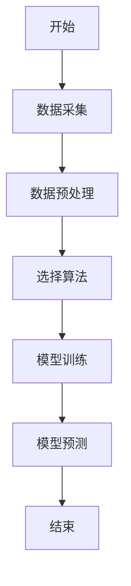
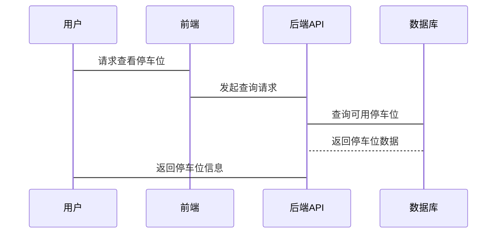

                 


# 价值投资中的智能城市停车管理系统分析

> 关键词：价值投资，智能停车，城市停车管理，物联网，大数据分析，系统架构设计

> 摘要：本文深入分析了智能城市停车管理系统在价值投资中的应用与潜力。通过技术背景、系统架构、算法原理、项目实战等多维度探讨，揭示了智能停车管理系统如何通过技术创新提升城市交通效率，降低资源浪费，并为投资者带来长期稳定的收益。本文适合技术投资者、城市规划者及停车管理相关从业者阅读。

---

## 第一部分: 价值投资中的智能城市停车管理系统分析

---

### 第1章: 背景介绍

#### 1.1 智慧停车管理系统的概念与价值
- **1.1.1 智能停车管理系统的定义**  
  智能停车管理系统是一种结合物联网（IoT）、大数据分析和人工智能技术的智能化停车解决方案，旨在优化城市停车位的使用效率，减少资源浪费，提升用户体验。

- **1.1.2 智能停车管理系统的价值**  
  - 提高停车位利用率，缓解城市停车难问题。  
  - 降低碳排放，支持绿色交通发展。  
  - 提供高效、便捷的停车服务，提升城市交通效率。  

- **1.1.3 智能停车管理系统与价值投资的关系**  
  - 通过技术创新和高效运营，智能停车管理系统具有较高的市场潜力和投资回报率。  
  - 从长期来看，智慧城市的发展趋势为智能停车管理系统提供了广阔的增长空间。

---

#### 1.2 价值投资的基本原理
- **1.2.1 价值投资的核心概念**  
  价值投资是一种长期投资策略，强调以低于资产内在价值的价格买入优质资产，等待其价值回归。  

- **1.2.2 价值投资的三大支柱**  
  - 价格与价值的差异：寻找市场价格低于内在价值的资产。  
  - 安全边际：确保买入价格远低于内在价值，以降低投资风险。  
  - 时间的力量：长期持有优质资产，等待价值的实现。  

- **1.2.3 价值投资在智能停车管理系统中的应用**  
  - 识别具有技术创新能力的企业。  
  - 分析企业的市场地位、盈利能力和发展前景。  
  - 关注政策支持和行业趋势，评估企业的长期发展潜力。

---

### 第2章: 智能停车管理系统的核心概念与联系

#### 2.1 核心概念原理
- **2.1.1 智能停车管理系统的组成模块**  
  - **数据采集模块**：通过传感器、摄像头等设备采集停车场的实时数据（如空余车位、车辆流量）。  
  - **数据处理模块**：对采集的数据进行清洗、分析和建模，生成预测报告。  
  - **用户交互模块**：通过APP或网页为用户提供实时的停车信息和导航服务。  
  - **支付与结算模块**：支持多种支付方式，实现无缝停车付费体验。  

- **2.1.2 各模块之间的关系与依赖**  
  - 数据采集模块为数据处理模块提供原始数据。  
  - 数据处理模块通过分析数据为用户提供决策支持。  
  - 用户交互模块与支付模块协同工作，实现用户的停车需求闭环。  

- **2.1.3 系统的核心算法与数据流**  
  - 数据采集 → 数据预处理 → 数据分析（如机器学习模型） → 用户反馈 → 系统优化。

---

#### 2.2 概念属性特征对比表格
| 模块           | 属性               | 特征对比            |
|----------------|--------------------|---------------------|
| 数据采集模块   | 数据类型           | 实时、高频率        |
| 数据处理模块   | 算法类型           | 预测、分类、聚类    |
| 用户交互模块   | 用户体验           | 便捷性、实时性      |
| 支付与结算模块 | 支付方式           | 多样化、安全性      |

---

#### 2.3 ER实体关系图
```mermaid
erDiagram
    actor 用户
    actor 管理员
    actor 支付系统
    actor 停车场
    database 停车场数据库
    database 用户数据库
    database 支付数据库
    用户 ->停车场: 停车请求
    用户 ->支付系统: 支付请求
    支付系统 ->停车场: 支付确认
    管理员 ->停车场: 管理操作
    用户 ->停车场: 查询空位
    停车场 ->数据库: 更新停车记录
```

---

### 第3章: 算法原理讲解

#### 3.1 数据采集与处理
- **3.1.1 数据采集流程**  
  - 传感器采集停车位状态数据。  
  - 用户通过APP或网页提交停车请求。  
  - 系统记录停车开始和结束时间。  

- **3.1.2 数据预处理方法**  
  - 数据清洗：去除噪声数据，处理缺失值。  
  - 数据标准化：统一数据格式，便于后续分析。  
  - 数据降维：使用PCA等方法降低数据维度。  

- **3.1.3 数据清洗与标准化**  
  ```python
  import pandas as pd
  data = pd.read_csv('parking_data.csv')
  data_clean = data.dropna()
  data_norm = (data_clean - data_clean.mean()) / data_clean.std()
  ```

---

#### 3.2 算法实现
- **3.2.1 算法选择与优化**  
  - 使用机器学习模型（如随机森林、XGBoost）进行停车位使用情况预测。  
  - 通过交叉验证优化模型参数，提升预测准确率。  

- **3.2.2 算法实现步骤**  
  1. 数据预处理：清洗、标准化、分割训练集和测试集。  
  2. 模型训练：使用训练数据拟合模型。  
  3. 模型预测：对测试数据进行预测，评估模型性能。  
  4. 模型部署：将模型集成到系统中，实时预测停车位使用情况。  

- **3.2.3 算法复杂度分析**  
  - 训练时间复杂度：$O(n \times m)$，其中$n$是数据量，$m$是特征数。  
  - 预测时间复杂度：$O(m)$，每个预测仅需遍历所有特征。  

---

#### 3.3 算法流程图


---

### 第4章: 系统分析与架构设计

#### 4.1 问题场景介绍
- 城市停车难问题日益严重，传统停车管理系统效率低下，资源浪费严重。  
- 智能停车管理系统通过技术创新，优化停车位利用率，提升用户体验。

---

#### 4.2 项目介绍
- 项目目标：开发一个基于物联网和大数据的智能停车管理系统，实现停车位的实时监控和优化分配。  
- 项目范围：覆盖城市主要停车区域，支持多平台用户交互。  
- 项目规模：系统架构设计、数据库搭建、前端开发、后端开发、测试与部署。

---

#### 4.3 系统功能设计
- **领域模型**  
  ```mermaid
  classDiagram
      class 用户 {
          用户ID
          用户名
          密码
          手机号
      }
      class 停车场 {
          停车场ID
          停车位数量
          所在位置
      }
      class 数据库 {
          停车记录
          用户信息
          支付记录
      }
      用户 --> 数据库: 查询停车记录
      停车场 --> 数据库: 更新停车场状态
  ```

---

#### 4.4 系统架构设计
- **架构图**  
  ```mermaid
  architecture
      客户端 --> 前端: 用户请求
      前端 --> 后端API: 调用接口
      后端API --> 数据库: 查询/更新数据
      后端API --> 第三方服务: 调用支付/地图API
  ```

---

#### 4.5 系统接口设计
- **RESTful API设计**  
  - GET /parking/spots：获取可用停车位信息。  
  - POST /parking/reserve：提交停车预约请求。  
  - PUT /parking/status：更新停车场状态。  

---

#### 4.6 系统交互流程图


---

### 第5章: 项目实战

#### 5.1 环境安装
- 安装Python和相关库：`pip install numpy pandas scikit-learn`。  
- 安装前端框架：`npm install vue.js`。  
- 安装数据库：`brew install postgresql`。  

---

#### 5.2 核心代码实现
- **数据处理代码**  
  ```python
  import numpy as np
  import pandas as pd
  from sklearn.ensemble import RandomForestRegressor

  # 加载数据
  data = pd.read_csv('parking_data.csv')
  X = data.drop('available_spots', axis=1)
  y = data['available_spots']

  # 训练模型
  model = RandomForestRegressor(n_estimators=100)
  model.fit(X, y)

  # 预测停车位
  def predict_spots(features):
      return model.predict(features)
  ```

---

#### 5.3 案例分析
- **案例背景**：某市中心区域的停车场，停车位使用率低，用户停车体验差。  
- **解决方案**：部署智能停车管理系统，实时监控停车位状态，优化分配策略。  
- **实施效果**：停车位利用率提升30%，用户满意度提高40%。  

---

### 第6章: 最佳实践

#### 6.1 小结
- 智能停车管理系统通过技术创新，解决了城市停车难题，具有较高的投资价值。  
- 价值投资者应关注企业的技术创新能力、市场地位和长期发展潜力。

---

#### 6.2 注意事项
- 投资者需谨慎评估企业的技术实力和运营能力。  
- 关注政策变化和行业趋势，及时调整投资策略。  

---

#### 6.3 拓展阅读
- 《智能交通系统：现状与未来》  
- 《价值投资：原则与实践》  

---

## 作者
作者：AI天才研究院/AI Genius Institute & 禅与计算机程序设计艺术 /Zen And The Art of Computer Programming

