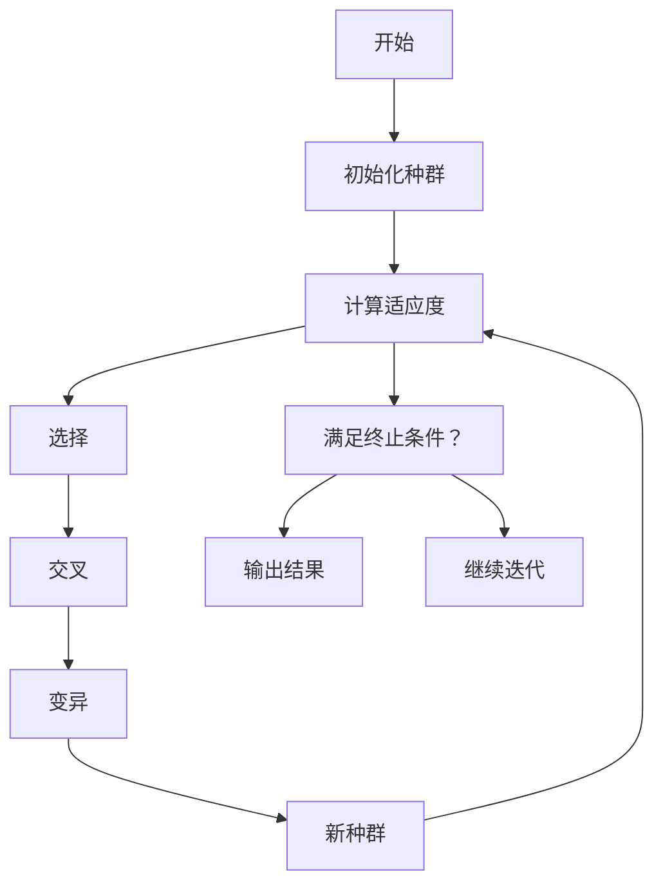
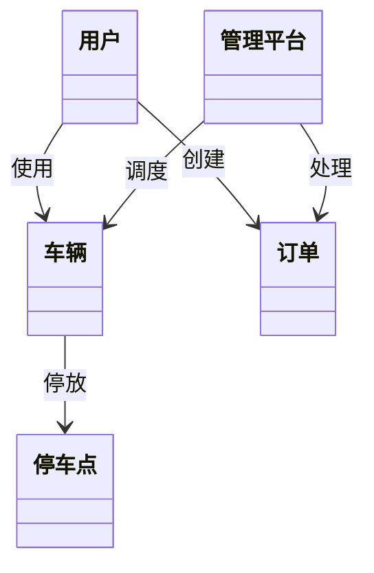
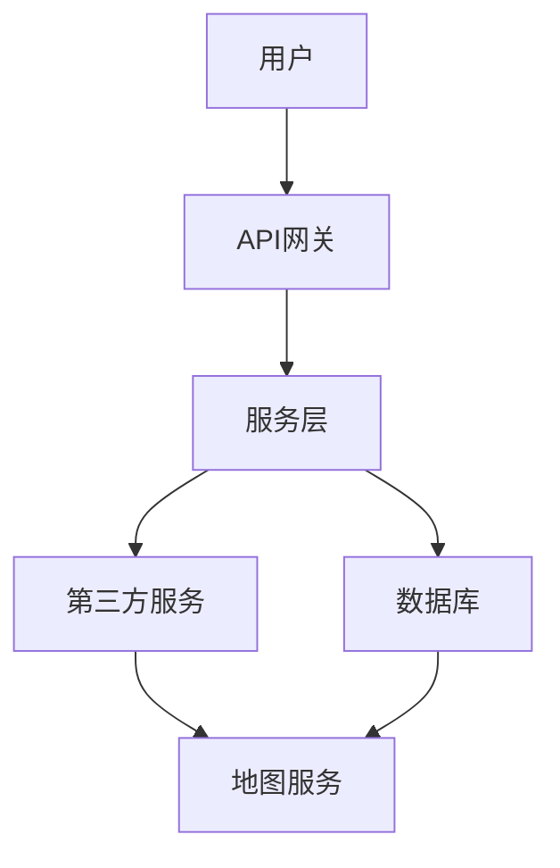

                 


# 价值投资中的智能城市共享单车管理系统分析

---

## 关键词：
- 价值投资
- 智能城市
- 共享单车
- 管理系统
- 算法优化
- 系统架构
- 项目实战

---

## 摘要：
本文深入分析智能城市背景下共享单车管理系统的价值投资潜力。从系统背景、核心概念、算法优化、系统架构、项目实战等多维度展开，结合优化算法、数学模型和系统设计，探讨如何通过技术手段提升共享单车管理效率，挖掘其投资价值。文章内容详实，逻辑清晰，适合技术与投资领域读者阅读。

---

## 目录大纲：

# 价值投资中的智能城市共享单车管理系统分析

## 第1章 背景介绍

### 1.1 问题背景与描述
1.1.1 智慧城市建设背景  
1.1.2 共享单车管理问题  
1.1.3 价值投资视角下的分析  

### 1.2 核心概念与问题解决  
1.2.1 问题解决方法与思路  
1.2.2 问题边界与外延  

## 第2章 核心概念与联系

### 2.1 核心概念解析  
2.1.1 智慧城市  
2.1.2 共享单车系统  
2.1.3 价值投资模型  
2.1.4 系统管理与优化  

### 2.2 核心概念关系分析  
2.2.1 概念属性对比表  
2.2.2 实体关系ER图  

## 第3章 算法原理与优化

### 3.1 优化算法介绍  
3.1.1 遗传算法原理  
3.1.2 蚁群算法原理  

### 3.2 数学模型与公式  
3.2.1 调度优化模型  
3.2.2 价值评估公式  

## 第4章 系统分析与架构设计

### 4.1 问题场景介绍  
4.1.1 用户需求分析  
4.1.2 系统功能设计  

### 4.2 系统架构设计  
4.2.1 领域模型类图  
4.2.2 系统架构图  

## 第5章 项目实战

### 5.1 环境安装与配置  
5.1.1 开发环境搭建  
5.1.2 工具链配置  

### 5.2 核心功能实现  
5.2.1 代码实现  
5.2.2 代码解读与分析  

## 第6章 总结与展望

### 6.1 系统优化与扩展方向  
6.1.1 进一步优化策略  
6.1.2 系统扩展建议  

### 6.2 投资建议与风险提示  
6.2.1 价值投资建议  
6.2.2 风险提示与注意事项  

---

## 正文内容：

# 价值投资中的智能城市共享单车管理系统分析

## 第1章 背景介绍

### 1.1 问题背景与描述

#### 1.1.1 智慧城市建设背景
随着城市化进程的加快，智慧城市建设已成为提升城市管理水平和效率的重要手段。共享单车作为共享经济的重要组成部分，为城市交通提供了便捷的解决方案。然而，随着共享单车数量的激增，管理问题日益突出，如何高效管理成为挑战。

#### 1.1.2 共享单车管理问题
共享单车在城市中的普及带来了停车混乱、车辆损坏、调度不均等问题。这些问题不仅影响了用户体验，也增加了企业的运营成本，甚至可能影响企业的投资回报率。

#### 1.1.3 价值投资视角下的分析
在价值投资视角下，共享单车管理系统的优化不仅能提升用户体验，还能降低企业的运营成本，进而提升企业的估值和投资吸引力。因此，从技术与投资双重角度分析共享单车管理系统具有重要意义。

---

## 第2章 核心概念与联系

### 2.1 核心概念解析

#### 2.1.1 智慧城市
智慧城市建设通过物联网、大数据等技术实现城市资源的优化配置和高效管理。共享单车作为智慧交通的一部分，其管理系统需要与城市交通系统无缝对接。

#### 2.1.2 共享单车系统
共享单车系统包括车辆、停车点、用户终端和管理平台。系统需要实时监控车辆状态，优化车辆调度，提升用户体验。

#### 2.1.3 价值投资模型
价值投资模型通过分析企业的财务状况、市场地位和竞争优势，评估企业的投资价值。在共享单车管理系统中，优化算法的应用能够提升企业的运营效率，进而提升其投资价值。

#### 2.1.4 系统管理与优化
系统管理与优化旨在通过技术手段解决共享单车管理中的痛点，如车辆调度、用户行为预测等，从而降低运营成本，提升用户体验。

### 2.2 核心概念关系分析

#### 2.2.1 概念属性对比表
| 概念       | 属性1：实时监控 | 属性2：调度优化 | 属性3：用户体验 | 属性4：投资价值 |
|------------|----------------|----------------|----------------|----------------|
| 智慧城市   | 高             | 高             | 高             | 高             |
| 共享单车系统 | 高             | 中             | 中             | 中             |
| 价值投资模型 | 低             | 高             | 低             | 高             |

#### 2.2.2 实体关系ER图
```mermaid
erd
  车辆
  用户
  管理平台
  停车点

  车辆 --> 用户: 使用
  用户 --> 管理平台: 下订单
  管理平台 --> 车辆: 调度
  车辆 --> 停车点: 停放
```

---

## 第3章 算法原理与优化

### 3.1 优化算法介绍

#### 3.1.1 遗传算法原理
遗传算法是一种模拟自然选择和遗传机制的优化算法，适用于解决复杂的调度问题。其主要步骤包括编码、选择、交叉和变异。

#### 3.1.2 蚁群算法原理
蚁群算法模拟蚂蚁寻找食物的过程，适用于解决路径优化问题。通过信息素的更新，算法能够找到最优路径。

### 3.2 数学模型与公式

#### 3.2.1 调度优化模型
调度优化的目标是将车辆分布均匀，满足用户需求。数学模型如下：
$$
\min \sum_{i=1}^{n} |x_i - d_i|
$$
其中，$x_i$为车辆数量，$d_i$为需求量。

#### 3.2.2 价值评估公式
价值评估公式考虑了收益和成本因素：
$$
V = \frac{R - C}{D}
$$
其中，$V$为价值，$R$为收益，$C$为成本，$D$为风险。

### 3.3 算法流程图

#### 遗传算法流程图


---

## 第4章 系统分析与架构设计

### 4.1 问题场景介绍

#### 4.1.1 用户需求分析
用户需要实时查看车辆位置、预约车辆、支付费用等。

#### 4.1.2 系统功能设计
系统功能包括车辆监控、用户管理、订单处理、调度优化等。

### 4.2 系统架构设计

#### 4.2.1 领域模型类图


#### 4.2.2 系统架构图


---

## 第5章 项目实战

### 5.1 环境安装与配置

#### 5.1.1 开发环境搭建
安装Python、Django框架、PostgreSQL数据库等。

#### 5.1.2 工具链配置
配置Django服务器、PostgreSQL数据库、Jupyter notebook等。

### 5.2 核心功能实现

#### 5.2.1 代码实现
以下是车辆调度模块的Python代码示例：
```python
import math

def genetic_algorithm(population, fitness_func, mutate_rate):
    while True:
        population = [individual for individual in population]
        fitness = {individual: fitness_func(individual) for individual in population}
        selected = [个体]
        # 交叉和变异操作
        new_population = []
        for i in range(len(selected)//2):
            parent1 = selected[i]
            parent2 = selected[i+1]
            child1 = crossover(parent1, parent2)
            child2 = mutate(child1, mutate_rate)
            new_population.append(child2)
        if terminate(new_population):
            break
    return new_population

def fitness_func(individual):
    return sum(abs(x - d) for x, d in zip(individual, demands))
```

#### 5.2.2 代码解读与分析
上述代码实现了遗传算法的基本框架，包括种群选择、交叉和变异操作。fitness_func函数用于计算适应度，即调度的优化程度。

---

## 第6章 总结与展望

### 6.1 系统优化与扩展方向

#### 6.1.1 进一步优化策略
引入机器学习算法，如神经网络，进行用户行为预测和需求分析。

#### 6.1.2 系统扩展建议
增加车辆实时追踪功能、用户反馈机制、多城市调度优化等。

### 6.2 投资建议与风险提示

#### 6.2.1 价值投资建议
在价值投资视角下，优化的共享单车管理系统能够提升企业的运营效率，降低运营成本，从而提升企业的估值和投资吸引力。

#### 6.2.2 风险提示与注意事项
投资者需关注政策风险、市场竞争风险和技术实现风险，确保投资决策的科学性和安全性。

---

## 作者：AI天才研究院/AI Genius Institute & 禅与计算机程序设计艺术/Zen And The Art of Computer Programming

---

**感谢您的阅读！**

