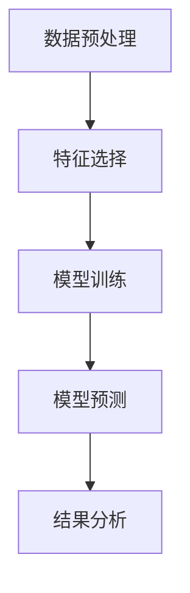
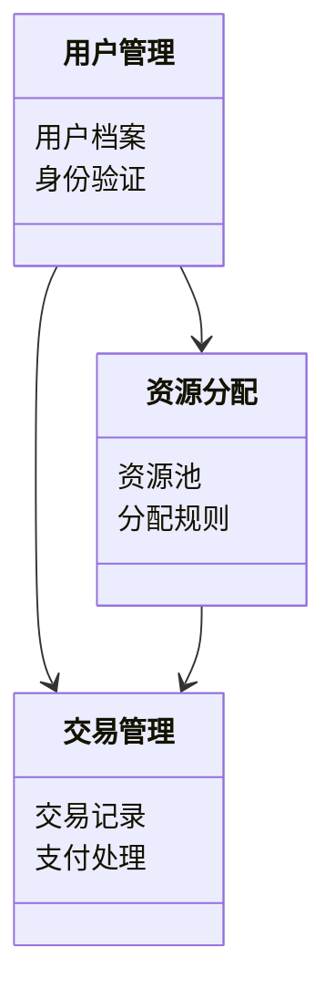
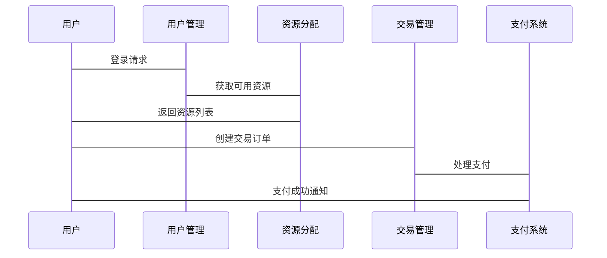

                 


# 价值投资中的智能城市共享经济管理系统分析

---

## 关键词：
价值投资、智能城市、共享经济、管理系统、算法分析、系统架构、项目实战

---

## 摘要：
本文系统分析了价值投资在智能城市共享经济管理系统中的应用，从核心概念、算法原理、系统架构到项目实战，全面探讨了如何利用价值投资理念优化共享经济的资源配置和管理效率。文章通过详细的技术分析和实际案例，揭示了智能城市共享经济管理系统的内在逻辑和实现方法，为读者提供了从理论到实践的深度指导。

---

## 第1章 价值投资的基本概念

### 1.1 价值投资的定义与核心理念
价值投资是一种以基本面分析为基础的投资策略，强调以低于内在价值的价格购买优质资产。其核心理念包括：
- **长期投资**：关注长期收益而非短期波动。
- **安全边际**：买入价格应低于内在价值。
- **企业分析**：深入研究企业的财务状况、行业地位和竞争优势。

### 1.2 价值投资的核心原则
- **价值发现**：识别市场低估的资产。
- **分散投资**：降低风险，避免过度集中。
- **长期持有**：耐心持有优质资产，等待价值回归。

---

## 第2章 智能城市的定义与特点

### 2.1 智能城市的定义
智能城市是利用信息技术和数据驱动的解决方案，优化城市资源配置，提高居民生活质量的城市发展模式。其特点包括：
- **数据驱动**：依赖大数据和人工智能技术。
- **高效协同**：各系统之间高度协同。
- **可持续发展**：注重资源节约和环境保护。

### 2.2 智能城市的核心特征
- **数字化基础设施**：如物联网、5G网络等。
- **智能化管理**：利用AI技术优化城市运行。
- **市民参与**：通过移动应用实现市民与城市服务的互动。

---

## 第3章 共享经济的基本概念

### 3.1 共享经济的定义
共享经济是一种通过数字平台实现资源优化配置的经济模式，强调使用权而非所有权。其特点包括：
- **资源闲置共享**：充分利用闲置资源。
- **平台化运作**：通过在线平台连接供需。
- **信任机制**：依赖平台和用户评价建立信任。

---

## 第4章 智能城市中的共享经济

### 4.1 智能城市与共享经济的关系
智能城市为共享经济提供了技术支撑，而共享经济则推动智能城市的资源优化。两者的结合体现在：
- **技术创新**：大数据、AI技术推动共享经济模式创新。
- **资源共享**：智能城市中的共享经济模式（如共享单车、共享办公空间）极大提升了资源利用效率。

---

## 第5章 价值投资在共享经济中的应用

### 5.1 价值投资在共享经济中的核心作用
价值投资帮助识别具有长期竞争优势的共享经济平台，重点关注：
- **市场需求**：评估共享经济模式的市场规模和增长潜力。
- **竞争格局**：分析企业的市场地位和竞争优势。
- **财务健康**：评估企业的盈利能力、现金流和债务水平。

---

## 第6章 智能城市共享经济管理系统的背景与意义

### 6.1 系统背景
随着智能城市的发展，共享经济在交通、住房、办公等领域广泛应用，但同时也面临资源分配不均、管理效率低下等问题。智能城市共享经济管理系统应运而生，旨在通过技术手段解决这些问题。

### 6.2 系统意义
- **优化资源配置**：通过数据驱动的分配方式提高资源利用效率。
- **提升管理效率**：利用AI和大数据技术实现智能化管理。
- **降低交易成本**：通过平台化运作减少中间环节，降低用户成本。

---

## 第7章 系统核心概念与联系

### 7.1 核心概念原理
智能城市共享经济管理系统的核心概念包括：
- **用户管理**：通过身份识别和信用评估建立用户档案。
- **资源分配**：基于实时数据和用户需求实现资源最优分配。
- **交易管理**：记录交易行为，确保交易安全和合规性。

### 7.2 概念对比表格

| 概念         | 价值投资       | 智能城市       | 共享经济       |
|--------------|----------------|----------------|----------------|
| 定义         | 基于基本面的长期投资策略 | 利用技术优化城市运行 | 资源共享的经济模式 |
| 核心要素     | 内在价值、安全边际 | 数据驱动、智能化 | 平台、闲置资源 |
| 目标         | 实现超额收益 | 提高城市管理效率 | 优化资源配置 |
| 优势         | 低风险、高回报 | 高效、可持续 | 降低成本、提高效率 |

### 7.3 ER实体关系图（Mermaid）
```mermaid
erDiagram
    user}++{role
    resource}++{allocation
    transaction}++{payment
    user}++{transaction
    role}++{resource
```

---

## 第8章 算法原理讲解

### 8.1 数据分析算法
#### 8.1.1 线性回归算法
用于预测共享经济平台的用户增长趋势。


#### 8.1.2 聚类分析算法
用于识别用户行为模式。
```python
from sklearn.cluster import KMeans

# 示例数据
data = [[2, 3], [5, 8], [1, 2]]
model = KMeans(n_clusters=2)
model.fit(data)
print(model.labels_)
```

### 8.2 数学模型
#### 收益预测模型
$$
收益 = \beta_0 + \beta_1 \times 用户增长 + \beta_2 \times 市场需求 + \epsilon
$$

---

## 第9章 系统架构设计

### 9.1 系统功能设计
#### 领域模型（Mermaid类图）


### 9.2 系统架构设计
#### 分层架构（Mermaid架构图）
```mermaid
rect
    分层架构
    <矩形顶部>
    [用户界面层]
    [业务逻辑层]
    [数据访问层]
```

### 9.3 接口设计与交互
#### 系统交互流程（Mermaid序列图）


---

## 第10章 项目实战

### 10.1 环境安装
- **技术选型**：Python、Django框架、PostgreSQL数据库。
- **工具安装**：
  ```bash
  pip install django djangorestframework
  ```

### 10.2 核心代码实现
#### 用户管理模块（Python/Django）
```python
from rest_framework import serializers, viewsets

class UserSerializer(serializers.ModelSerializer):
    class Meta:
        model = User
        fields = ['id', 'username', 'email']

class UserViewSet(viewsets.ModelViewSet):
    queryset = User.objects.all()
    serializer_class = UserSerializer
```

### 10.3 案例分析与优化建议
#### 案例：共享单车管理系统
- **核心代码**：实现用户注册、资源分配、交易记录功能。
- **优化建议**：引入AI算法优化资源分配，提升用户体验。

### 10.4 项目小结
通过实际案例，验证了智能城市共享经济管理系统的可行性和有效性，展示了如何通过技术手段提升共享经济的管理效率。

---

## 第11章 最佳实践与小结

### 11.1 最佳实践
- **技术选型**：选择适合的开发框架和数据库。
- **数据安全**：加强用户数据和交易数据的安全保护。
- **系统优化**：定期监控系统性能，及时优化。

### 11.2 小结
本文全面分析了价值投资在智能城市共享经济管理系统中的应用，从理论到实践，为读者提供了系统的指导。通过实际案例，展示了如何利用技术手段优化共享经济的资源配置和管理效率。

### 11.3 注意事项
- **风险管理**：关注市场波动和政策变化，做好风险评估。
- **持续学习**：关注技术发展和共享经济模式的创新。

### 11.4 拓展阅读
- 推荐阅读《智能城市的建设与管理》和《价值投资的真谛》。

---

## 作者信息
作者：AI天才研究院 & 禅与计算机程序设计艺术

---

# END

