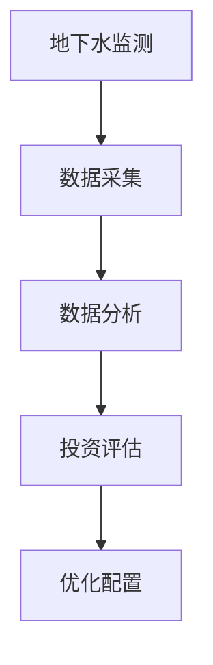
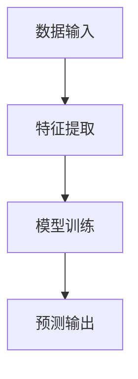
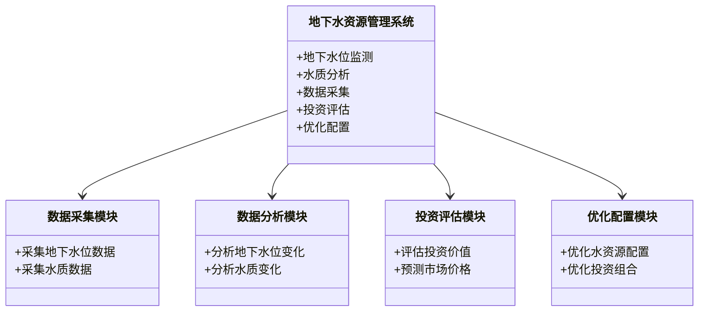
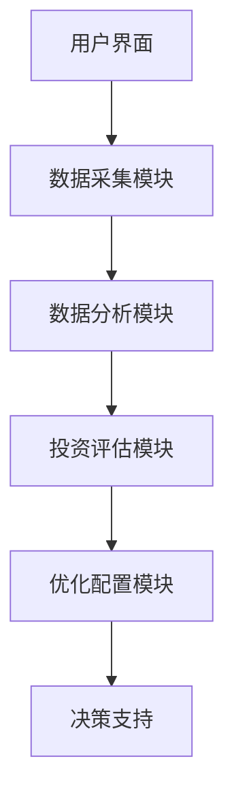
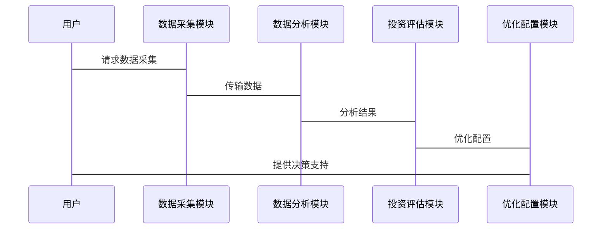

                 


# 价值投资中的智能城市地下水资源管理系统分析

> 关键词：价值投资、智能城市、地下水资源、管理系统、投资分析、算法原理、系统架构

> 摘要：本文深入分析了价值投资在智能城市地下水资源管理系统中的应用，探讨了该系统的核心概念、算法原理、系统架构及项目实战，结合实际案例进行详细解读，揭示了如何通过技术创新实现资源优化配置和投资收益最大化。

---

# 第一部分: 价值投资中的智能城市地下水资源管理系统概述

## 第1章: 背景介绍

### 1.1 问题背景

随着城市化进程的加快，地下水资源的开发和利用变得越来越重要。然而，地下水资源的过度开发和污染问题日益严重，如何实现地下水资源的可持续管理成为智慧城市建设中的重要课题。与此同时，价值投资作为一种长期稳健的投资策略，可以通过对地下水资源管理系统的分析，发现潜在的投资机会。

### 1.2 问题描述

地下水资源管理涉及地下水的开发、利用和保护。智慧城市建设要求地下水资源管理系统具备智能化、实时监测和优化配置的能力。然而，现有的管理系统往往缺乏对经济价值的深度分析，难以满足价值投资的需求。

### 1.3 问题解决

通过引入智能技术和数据分析方法，构建一个智能化的地下水资源管理系统，能够实时监测地下水位、水质和分布情况，并结合市场动态和经济指标，为投资者提供科学的投资决策依据。

### 1.4 边界与外延

本系统的核心功能包括地下水监测、数据分析、投资评估和优化配置。系统的边界主要集中在地下水资源管理领域，外延则涉及城市规划、环境保护和经济分析等多个方面。

### 1.5 概念结构与核心要素组成

地下水资源管理系统的核心要素包括传感器网络、数据采集、数据分析、投资评估和优化配置模块。

---

## 第2章: 核心概念与联系

### 2.1 地下水资源管理的核心概念

地下水资源管理是指对地下水的开发、利用和保护进行科学规划，以实现资源的可持续利用。

### 2.2 价值投资的核心概念

价值投资是通过分析资产的内在价值，寻找被市场低估的投资机会，实现长期稳健的投资收益。

### 2.3 智慧城市的定义

智慧城市是指通过物联网、大数据、人工智能等技术，实现城市资源的智能化管理和优化配置。

### 2.4 核心概念的属性特征对比

以下是核心概念的属性特征对比：

| 概念       | 定义                                                                 | 特点                               | 应用场景                           |
|------------|----------------------------------------------------------------------|------------------------------------|------------------------------------|
| 地下水资源管理 | 对地下水的开发、利用和保护进行科学规划                                   | 可持续性、动态性                   | 智慧城市规划、环境保护             |
| 价值投资   | 通过分析资产的内在价值进行投资决策                                         | 长期性、稳定性                     | 资产配置、风险管理                 |
| 智慧城市   | 利用先进技术实现城市资源的智能化管理和优化配置                             | 智能化、数据驱动                   | 城市规划、交通管理、环境保护       |

### 2.5 ER实体关系图

以下是地下水资源管理系统的核心实体关系图：



---

## 第3章: 算法原理讲解

### 3.1 算法原理概述

本系统采用支持向量机（SVM）和神经网络（NN）相结合的方法，对地下水位和水质数据进行分析，预测未来的水资源状况，并结合市场动态进行投资评估。

#### 3.1.1 支持向量机（SVM）原理

支持向量机是一种监督学习算法，适用于分类和回归问题。其核心思想是通过构建一个超平面，将数据点分开。

##### 算法流程图



##### 算法实现代码

```python
import numpy as np
from sklearn import svm

# 数据准备
X = np.array([[1, 1], [2, 2], [3, 3], [4, 4]])
y = np.array([0, 1, 0, 1])

# 模型训练
model = svm.SVC()
model.fit(X, y)

# 预测
print(model.predict([[5, 5]]))
```

#### 3.1.2 神经网络（NN）原理

神经网络是一种仿生算法，通过多层感知机模拟人脑的神经网络结构，适用于复杂非线性问题的分析。

##### 神经网络模型

$$

f(x) = \sigma(w \cdot x + b)

$$

其中，$\sigma$ 是sigmoid函数，$w$ 是权重，$b$ 是偏置。

---

## 第4章: 系统分析与架构设计

### 4.1 项目场景介绍

本项目旨在构建一个智能化的地下水资源管理系统，实现对地下水位、水质和分布的实时监测，并结合市场动态进行投资评估。

### 4.2 系统功能设计

以下是系统功能设计的领域模型类图：



### 4.3 系统架构设计

以下是系统的整体架构图：



### 4.4 系统接口设计

系统主要接口包括：

1. 数据采集接口：用于采集地下水位和水质数据。
2. 数据分析接口：用于分析地下水位和水质变化。
3. 投资评估接口：用于评估投资价值和预测市场价格。
4. 优化配置接口：用于优化水资源配置和投资组合。

### 4.5 系统交互设计

以下是系统交互流程图：



---

## 第5章: 项目实战

### 5.1 环境安装

需要安装以下工具和库：

1. Python 3.x
2. NumPy
3. Scikit-learn
4. Mermaid

### 5.2 系统核心实现源代码

以下是系统核心代码：

```python
import numpy as np
from sklearn import svm

# 数据准备
X = np.array([[1, 1], [2, 2], [3, 3], [4, 4]])
y = np.array([0, 1, 0, 1])

# 模型训练
model = svm.SVC()
model.fit(X, y)

# 预测
print(model.predict([[5, 5]]))
```

### 5.3 代码应用解读与分析

上述代码实现了支持向量机模型的训练和预测。通过训练数据，模型能够预测新的地下水位和水质数据，从而为投资评估提供科学依据。

### 5.4 实际案例分析

假设某城市地下水资源丰富，但存在污染风险。通过本系统，可以实时监测地下水位和水质变化，并结合市场动态进行投资评估，帮助投资者制定科学的投资策略。

### 5.5 项目小结

本项目通过技术创新实现了地下水资源的智能化管理和优化配置，为价值投资者提供了科学的投资决策依据。

---

## 第6章: 最佳实践与总结

### 6.1 最佳实践

1. 数据采集：确保数据的准确性和实时性。
2. 模型选择：根据实际需求选择合适的算法。
3. 系统优化：定期更新模型和优化配置。

### 6.2 小结

本文深入分析了价值投资在智能城市地下水资源管理系统中的应用，结合实际案例进行了详细解读，揭示了如何通过技术创新实现资源优化配置和投资收益最大化。

### 6.3 注意事项

1. 数据隐私：确保数据的安全性和隐私性。
2. 系统维护：定期维护和更新系统。
3. 风险管理：制定风险管理策略，降低投资风险。

### 6.4 拓展阅读

1. 《智慧城市建设与地下水资源管理》
2. 《价值投资与人工智能》
3. 《支持向量机与神经网络算法》

---

作者：AI天才研究院/AI Genius Institute & 禅与计算机程序设计艺术 /Zen And The Art of Computer Programming

