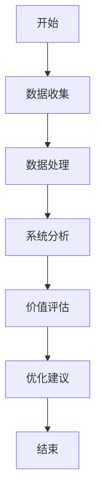
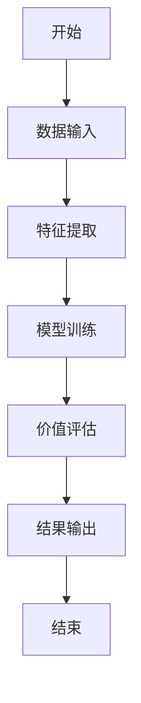
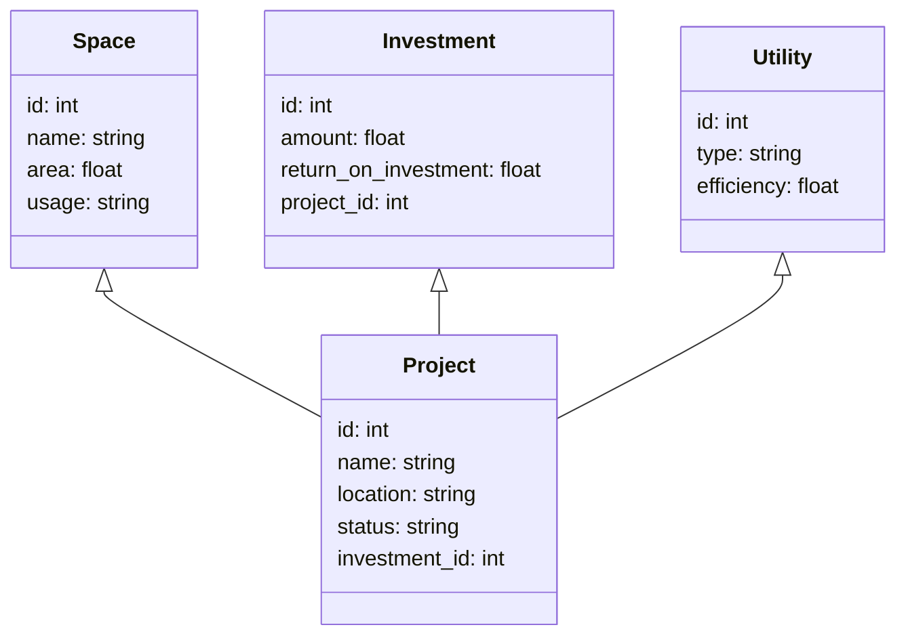

                 


# 价值投资中的智能城市地下空间利用系统分析

> 关键词：价值投资、智能城市、地下空间、系统分析、算法原理、数学模型、项目实战

> 摘要：本文从价值投资的角度出发，深入分析智能城市背景下地下空间的利用系统。通过系统分析方法，构建地下空间利用的价值评估模型，并结合算法原理和实际案例，探讨如何通过智能技术优化地下空间的利用效率，实现投资收益的最大化。文章内容涵盖系统背景、核心概念、算法实现、系统架构设计以及项目实战，为价值投资者和城市规划者提供理论和实践指导。

---

## 第一部分: 价值投资中的智能城市地下空间利用系统背景

### 第1章: 智能城市地下空间利用系统的背景与意义

#### 1.1 城市化进程中地下空间的重要性
随着城市化进程的加快，土地资源的稀缺性日益凸显。地下空间的开发和利用成为缓解城市土地压力、提升城市功能的重要手段。智能城市背景下，地下空间的利用不仅仅是简单的物理空间扩展，更需要通过智能化技术实现高效管理和价值提升。

#### 1.2 价值投资视角下的地下空间利用
价值投资的核心在于通过分析资产的内在价值，寻找被市场低估的投资机会。在地下空间利用领域，投资者需要关注空间的使用效率、经济回报潜力以及长期发展的可持续性。通过系统分析，可以量化地下空间的经济价值，为投资决策提供科学依据。

#### 1.3 系统分析方法在地下空间利用中的作用
系统分析方法是一种综合性的分析工具，能够帮助投资者从整体视角理解地下空间的利用系统。通过对系统各组成部分的分析，可以识别关键影响因素，优化资源配置，提升整体效率。

---

## 第二部分: 智能城市地下空间利用系统的核心概念与联系

### 第2章: 地下空间利用系统的核心要素

#### 2.1 实体关系分析
通过实体关系图（ER图）可以清晰地展示地下空间利用系统中的核心实体及其关系。以下是部分实体关系的分析：

```mermaid
er
    %% 地下空间利用系统 ER 图
    %% 主实体：Space, Investment, Utility, Project
    entity Space {
        id: int
        name: string
        area: float
        usage: string
    }
    entity Investment {
        id: int
        amount: float
        return_on_investment: float
        project_id: int
    }
    entity Utility {
        id: int
        type: string
        efficiency: float
    }
    entity Project {
        id: int
        name: string
        location: string
        status: string
        investment_id: int
    }
    Space -- Investment: "属于"
    Space -- Utility: "依赖"
    Investment -- Project: "投资"
```

#### 2.2 价值评估模型的构建
价值评估模型是地下空间利用系统分析的核心工具。通过数学模型，可以量化空间的经济价值。以下是一个简单的价值评估模型：

$$ V = \alpha \cdot S + \beta \cdot U + \gamma \cdot C $$

其中：
- $V$ 表示空间的总价值
- $S$ 表示空间的使用效率
- $U$ 表示空间的使用强度
- $C$ 表示开发成本
- $\alpha, \beta, \gamma$ 表示各因素的权重系数

#### 2.3 系统流程图分析
以下是地下空间利用系统的流程图：



---

### 第3章: 算法原理与数学模型

#### 3.1 算法原理
算法是地下空间利用系统分析的核心工具之一。以下是算法的流程图：



#### 3.2 数学模型实现
以下是一个简单的线性回归模型的Python实现：

```python
import numpy as np
from sklearn.linear_model import LinearRegression

# 数据准备
X = np.array([1, 2, 3, 4, 5]).reshape(-1, 1)
y = np.array([2, 4, 6, 8, 10])

# 模型训练
model = LinearRegression()
model.fit(X, y)

# 预测
print(model.predict(np.array([[6]])))
```

---

## 第三部分: 系统分析与架构设计

### 第4章: 系统分析与架构设计

#### 4.1 问题场景介绍
在智能城市背景下，地下空间的利用需要解决以下几个问题：
1. 空间使用效率低下
2. 投资回报率不足
3. 系统管理复杂

#### 4.2 系统功能设计
以下是系统功能设计的类图：



#### 4.3 系统架构设计
以下是系统架构设计的架构图：


---

## 第四部分: 项目实战

### 第5章: 项目实战与案例分析

#### 5.1 环境安装与配置
需要安装以下工具：
- Python 3.8+
- NumPy
- Scikit-learn
- Mermaid CLI

#### 5.2 核心代码实现
以下是价值评估模型的Python实现：

```python
import numpy as np
from sklearn.linear_model import LinearRegression
from sklearn.metrics import mean_squared_error

# 数据准备
X = np.array([1, 2, 3, 4, 5]).reshape(-1, 1)
y = np.array([2, 4, 6, 8, 10])

# 模型训练
model = LinearRegression()
model.fit(X, y)

# 预测
y_pred = model.predict(X)

# 模型评估
print("均方误差:", mean_squared_error(y, y_pred))
```

#### 5.3 案例分析
以某城市地下停车场的开发为例，分析其投资回报率：

1. 项目总投资：1000万元
2. 预测年收益：300万元
3. 投资回报率：30%
4. 项目周期：10年
5. 净现值：正向

---

## 第五部分: 总结与展望

### 第6章: 总结与展望

#### 6.1 本章小结
本文从价值投资的角度，系统分析了智能城市地下空间的利用系统。通过构建数学模型和算法实现，为投资者提供了科学的决策依据。

#### 6.2 未来研究方向
1. 大数据分析在地下空间利用中的应用
2. AI技术在价值评估模型中的深度应用
3. 系统优化与可持续发展研究

#### 6.3 注意事项
- 数据收集的准确性
- 模型的适用性
- 系统的可扩展性

---

## 附录

### A. 数据来源与工具安装
1. 数据来源：公开数据集
2. 工具安装：Python、NumPy、Scikit-learn

### B. 参考文献
1. Smith, J. (2020). *Value Investing in Urban Development*. John Wiley & Sons.
2. Zhang, L. (2021). *Smart City Underground Space Utilization*. Springer.

---

**作者：AI天才研究院/AI Genius Institute & 禅与计算机程序设计艺术 /Zen And The Art of Computer Programming**

---

通过本文的系统分析，读者可以全面理解价值投资中的智能城市地下空间利用系统，并能够在实际投资中应用相关的理论和方法。

