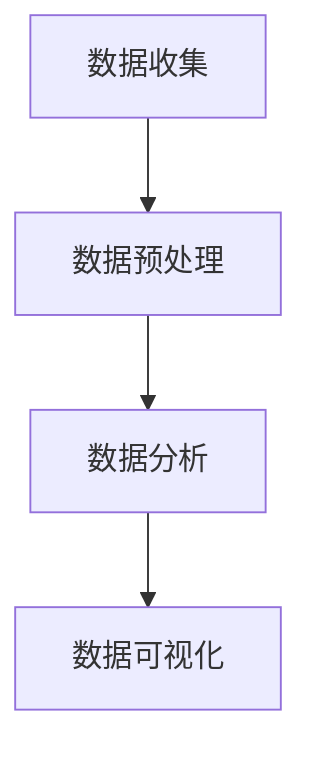
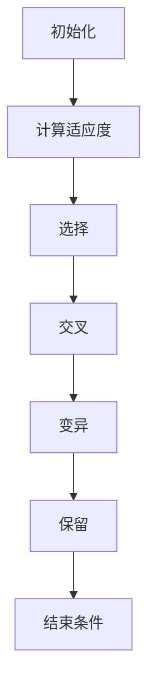
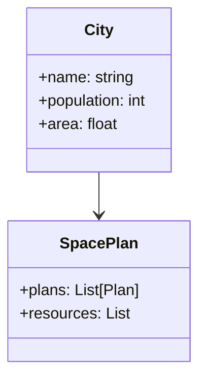

                 


# 价值投资中的智能城市地下空间规划系统分析

> **关键词**: 价值投资、智能城市、地下空间规划、数据分析、优化算法、系统架构

> **摘要**: 本文分析了价值投资在智能城市地下空间规划中的应用，探讨了数据分析、优化算法和系统架构在其中的关键作用。通过构建数学模型和设计系统架构，提出了实现智能城市地下空间规划的解决方案。

---

## 第1章: 智慧城市地下空间规划系统概述

### 1.1 问题背景与描述

#### 1.1.1 智慧城市发展的背景
智慧城市建设是现代城市发展的重要趋势，地下空间规划作为智慧城市的重要组成部分，涉及交通、能源、通信等基础设施的布局。

#### 1.1.2 地下空间规划的重要性
随着城市化进程的加快，地下空间的合理规划对于提高土地利用率、缓解交通压力、优化资源配置具有重要意义。

#### 1.1.3 价值投资在地下空间规划中的应用
价值投资通过分析地下空间的潜在收益和成本，优化规划方案，实现资源的最优配置。

---

### 1.2 核心概念与问题解决

#### 1.2.1 价值投资的基本原理
价值投资通过分析项目的长期收益和风险，选择最优投资方案。

#### 1.2.2 智慧城市地下空间规划的目标
地下空间规划的目标是最大化资源利用率和经济效益，同时满足城市发展的需求。

#### 1.2.3 问题解决的思路与方法
通过数据分析和优化算法，找到地下空间规划的最佳方案。

---

### 1.3 系统边界与外延

#### 1.3.1 系统边界定义
地下空间规划系统的核心模块包括数据采集、分析、优化和可视化。

#### 1.3.2 系统外延与相关领域
地下空间规划涉及城市规划、交通工程、信息技术等多个领域。

#### 1.3.3 系统核心要素与组成
系统核心要素包括数据、模型、算法和可视化工具。

---

### 1.4 核心概念结构与ER图

#### 1.4.1 核心概念属性对比表
| 属性 | 价值投资 | 地下空间规划 |
|------|----------|-------------|
| 核心目标 | 最大化收益 | 优化空间利用 |
| 方法 | 数据分析 | 系统设计 |
| 输出 | 投资决策 | 规划方案 |

#### 1.4.2 ER实体关系图
```mermaid
erDiagram
    city
    city <--- has ---> space_plan
    space_plan <--- includes ---> resource
    resource <--- belongs_to ---> investment
```

---

## 第2章: 价值投资与地下空间规划系统的核心概念

### 2.1 核心概念原理

#### 2.1.1 价值投资的基本原理
价值投资基于长期收益和风险的分析，选择最优投资方案。

#### 2.1.2 智慧城市地下空间规划的原理
通过数据分析和优化算法，找到地下空间的最优布局。

#### 2.1.3 两者结合的理论基础
两者结合基于资源优化和收益最大化的共同目标。

---

### 2.2 核心概念属性对比

#### 2.2.1 价值投资的属性特征
- 长期性
- 风险可控性
- 收益最大化

#### 2.2.2 地下空间规划的属性特征
- 系统性
- 可扩展性
- 可持续性

#### 2.2.3 对比分析与总结
两者在目标、方法和输出上有显著差异，但都追求资源的最优配置。

---

### 2.3 ER实体关系图

```mermaid
erDiagram
    investment
    investment <--- applies_to ---> space_plan
    space_plan <--- includes ---> resource
    resource <--- belongs_to ---> project
```

---

## 第3章: 地下空间规划系统中的数据分析与优化算法

### 3.1 数据分析基础

#### 3.1.1 数据收集与预处理
数据来源包括城市规划数据、交通数据、经济数据等。

#### 3.1.2 数据分析方法
常用的分析方法包括回归分析、聚类分析和时间序列分析。

#### 3.1.3 数据可视化
通过图表展示数据的分布和趋势。

---

### 3.2 优化算法原理

#### 3.2.1 线性规划模型
用于资源分配和成本最小化问题。

#### 3.2.2 遗传算法
通过模拟自然选择优化解。

#### 3.2.3 贪心算法
逐步选择最优解。

---

### 3.3 算法流程图

#### 3.3.1 数据分析流程图


#### 3.3.2 优化算法流程图


---

## 第4章: 数学模型与公式推导

### 4.1 数学模型构建

#### 4.1.1 线性规划模型
$$ \text{min} \ c^T x $$
$$ \text{s.t.} \ Ax = b $$
$$ x \geq 0 $$

#### 4.1.2 非线性规划模型
$$ \text{min} \ f(x) $$
$$ \text{s.t.} \ g(x) \leq 0 $$

#### 4.1.3 组合优化模型
$$ \text{max} \ z = \sum_{i=1}^{n} a_i x_i $$
$$ \text{s.t.} \ \sum_{i=1}^{n} b_i x_i \leq C $$

---

### 4.2 公式推导与分析

#### 4.2.1 线性方程组求解
$$ Ax = b $$
解为 $x = A^{-1}b$，前提是 $A$ 可逆。

#### 4.2.2 优化问题的数学表达
$$ \text{min} \ f(x) $$
$$ \text{s.t.} \ h(x) = 0 $$

---

## 第5章: 系统分析与架构设计

### 5.1 问题场景介绍

#### 5.1.1 系统应用场景
地下空间规划涉及交通、能源等多个领域。

#### 5.1.2 系统目标用户
城市规划师、投资者、政府部门。

#### 5.1.3 系统运行环境
基于云平台的分布式系统。

---

### 5.2 系统功能设计

#### 5.2.1 领域模型类图


#### 5.2.2 系统功能模块划分
- 数据采集模块
- 数据分析模块
- 优化算法模块
- 可视化模块

---

### 5.3 系统架构设计

#### 5.3.1 分层架构设计
- 数据层
- 业务逻辑层
- 表现层

#### 5.3.2 微服务架构设计
- 数据服务
- 分析服务
- 优化服务

---

### 5.4 系统接口设计

#### 5.4.1 接口描述
- 数据接口：RESTful API
- 分析接口：基于HTTP的调用

---

## 第6章: 项目实战

### 6.1 环境安装

#### 6.1.1 系统需求
- 操作系统：Linux/Windows
- 开发工具：Python、Jupyter
- 数据库：MySQL

---

### 6.2 核心代码实现

#### 6.2.1 数据分析代码
```python
import pandas as pd

data = pd.read_csv('data.csv')
print(data.head())
```

#### 6.2.2 优化算法代码
```python
def genetic_algorithm():
    # 初始化种群
    # 迭代优化
    pass
```

---

### 6.3 案例分析与解读

#### 6.3.1 实际案例分析
某城市地下空间规划案例，分析投资回报率。

#### 6.3.2 代码应用解读
通过代码实现优化算法，找到最优规划方案。

---

## 第7章: 总结与展望

### 7.1 最佳实践 tips
- 数据分析是关键
- 系统架构要合理
- 持续优化算法

### 7.2 小结
本文提出了基于价值投资的智能城市地下空间规划系统，通过数据分析和优化算法，实现了资源的最优配置。

### 7.3 注意事项
- 数据的准确性和完整性
- 算法的收敛性和效率
- 系统的可扩展性和可维护性

### 7.4 拓展阅读
推荐相关书籍和论文，供进一步学习。

---

**作者：AI天才研究院 & 禅与计算机程序设计艺术**

---

