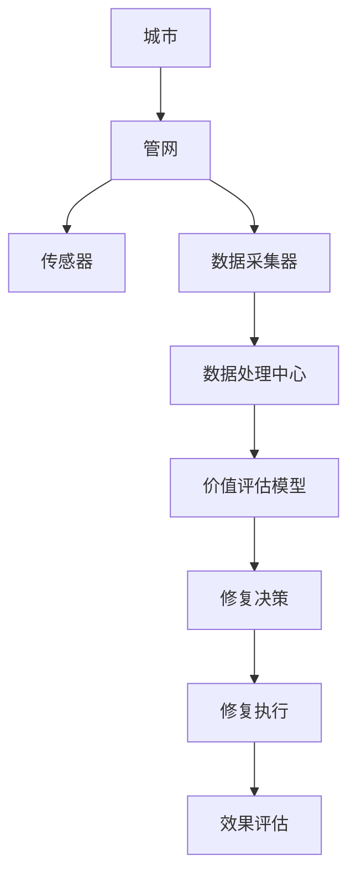

                 


# 价值投资中的智能城市地下管网修复系统分析

---

## 关键词  
智能城市、地下管网修复、价值投资、算法原理、系统架构

---

## 摘要  
智能城市地下管网修复系统是一种利用智能化技术优化城市基础设施维护的重要手段。本文从价值投资的角度，系统分析了智能城市地下管网修复系统的背景、原理、算法实现及实际应用。通过构建价值评估模型，探讨了如何通过技术手段提升城市基础设施的修复效率与经济效益。

---

## 第一部分: 背景介绍

### 第1章: 价值投资与智能城市地下管网修复系统概述

#### 1.1 价值投资的基本概念
- **1.1.1 价值投资的定义与核心理念**  
  价值投资是一种以基本面分析为基础的投资策略，旨在通过识别市场低估的资产，实现长期稳定的收益。其核心理念是关注企业的内在价值，而非市场的短期波动。

- **1.1.2 价值投资在现代金融中的地位与作用**  
  价值投资在现代金融中占据重要地位，尤其是在长期投资和风险管理方面。它强调对企业财务状况、行业地位及发展前景的深入分析。

- **1.1.3 价值投资与智能技术的结合**  
  随着人工智能和大数据技术的发展，价值投资逐渐与智能技术结合，形成智能化投资策略。这种结合通过技术手段优化投资决策，提高投资效率。

#### 1.2 智能城市地下管网修复系统的背景
- **1.2.1 智慧城市建设的现状与趋势**  
  智慧城市建设是全球城市化进程中的重要趋势，旨在通过智能化技术提升城市运行效率和居民生活质量。

- **1.2.2 地下管网修复的必要性与挑战**  
  地下管网是城市的“血管”，其老化和损坏会导致严重的经济损失和安全隐患。传统修复方法效率低下，难以应对复杂的城市管网问题。

- **1.2.3 智能化修复系统的核心优势**  
  智能化修复系统通过实时监测、数据分析和智能决策，显著提高了修复效率和精准度，同时降低了修复成本。

### 第2章: 问题背景与问题描述

#### 2.1 地下管网修复的痛点分析
- **2.1.1 管网老化的问题**  
  管网老化导致泄漏、堵塞等问题，增加了维护成本和安全隐患。

- **2.1.2 传统修复方法的局限性**  
  传统修复方法依赖人工操作，效率低，修复周期长，且难以应对复杂地形。

- **2.1.3 修复成本与效率的平衡**  
  在有限的预算下，如何实现高效修复是城市管理者面临的重要挑战。

#### 2.2 价值投资视角下的修复系统分析
- **2.2.1 投资机会的识别**  
  通过价值投资的方法，识别具有发展潜力的修复技术和企业。

- **2.2.2 系统修复的经济效益**  
  智能化修复系统能够降低维护成本，提高修复效率，从而带来显著的经济效益。

- **2.2.3 风险评估与投资决策**  
  通过风险评估模型，优化投资决策，降低投资风险。

#### 2.3 问题解决与边界定义
- **2.3.1 智能修复系统的解决方案**  
  利用智能化技术实现管网的实时监测、故障诊断和智能修复。

- **2.3.2 系统修复的边界与外延**  
  明确系统的功能边界，确保修复过程的高效性和经济性。

- **2.3.3 核心要素与组成结构**  
  智能修复系统的核心要素包括数据采集、数据分析、决策执行和效果评估。

---

## 第二部分: 核心概念与联系

### 第3章: 智能城市地下管网修复系统的原理与结构

#### 3.1 系统修复的核心原理
- **3.1.1 智能感知与数据采集**  
  利用传感器和物联网技术，实时采集管网的运行数据。

- **3.1.2 数据分析与修复决策**  
  通过数据分析，识别潜在问题并制定修复方案。

- **3.1.3 修复执行与效果评估**  
  执行修复操作，并通过反馈机制评估修复效果。

#### 3.2 系统结构与功能模块
- **3.2.1 数据采集模块**  
  负责采集管网的实时数据，包括压力、流量和温度等参数。

- **3.2.2 数据分析模块**  
  对采集的数据进行处理和分析，识别潜在问题。

- **3.2.3 决策执行模块**  
  根据分析结果，制定修复方案并执行修复操作。

- **3.2.4 效果评估模块**  
  对修复效果进行评估，优化修复策略。

#### 3.3 系统修复的价值评估模型
- **3.3.1 价值评估的核心要素**  
  包括修复成本、修复效率、经济效益和社会效益。

- **3.3.2 价值评估的数学模型**  
  $$ \text{总价值} = \frac{\text{修复收益} - \text{修复成本}}{\text{修复周期}} $$

- **3.3.3 评估模型的优劣势对比**  
  通过对比不同模型，选择最优的评估方法。

### 第4章: 价值评估模型的实体关系图

#### 4.1 实体关系图（ER图）设计


---

## 第三部分: 算法原理与实现

### 第5章: 数据采集与特征提取

#### 5.1 数据采集算法
- **5.1.1 数据采集流程**  
  通过传感器和数据采集器，实时采集管网的运行数据。

- **5.1.2 数据预处理**  
  对采集的数据进行清洗和归一化处理，确保数据的准确性。

### 第6章: 价值评估模型的构建

#### 6.1 算法实现
- **6.1.1 算法流程**  
  ```mermaid
  graph TD
      A[数据采集] --> B[特征提取]
      B --> C[模型训练]
      C --> D[价值评估]
  ```

- **6.1.2 Python代码实现**  
  ```python
  import numpy as np
  import pandas as pd

  # 数据预处理
  data = pd.read_csv('管网数据.csv')
  features = data.drop('label', axis=1)
  labels = data['label']

  # 模型训练
  from sklearn.model

