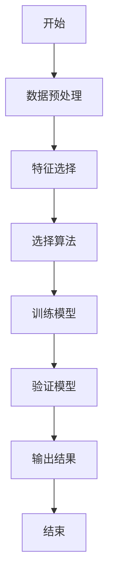

                 


# 价值投资中的智能城市垂直农场系统分析

**关键词**: 价值投资、智能城市、垂直农场、系统分析、农业技术

**摘要**: 本文从价值投资的角度，系统分析智能城市中的垂直农场系统。通过介绍垂直农场的基本概念、系统架构、算法原理和实际应用，探讨其在城市农业中的投资价值和潜力。结合技术实现和案例分析，为投资者提供科学的决策依据。

---

# 第一部分: 价值投资中的智能城市垂直农场系统背景

## 第1章: 智能城市垂直农场系统概述

### 1.1 垂直农场的基本概念

#### 1.1.1 垂直农场的定义与特点

垂直农场是一种在城市环境中垂直种植农作物的生产方式，利用多层结构和先进技术实现高效农业生产。其特点包括高空间利用率、环境可控性、资源节约和高效产出。

#### 1.1.2 垂直农场在智能城市中的地位与作用

在智能城市中，垂直农场是实现城市化与农业可持续发展的重要手段，能够提供新鲜农产品、减少运输成本、缓解城市土地紧张问题。

#### 1.1.3 垂直农场与传统农业的对比分析

| 对比维度 | 垂直农场 | 传统农业 |
|----------|----------|----------|
| 土地利用 | 高效利用 | 低效利用 |
| 环境控制 | 高度可控 | 自然环境依赖 |
| 生产效率 | 高        | 中低     |
| 投资成本 | 高        | 较低      |

### 1.2 智能城市垂直农场系统的构成

#### 1.2.1 系统的基本组成模块

- 数据采集模块：温湿度传感器、光照传感器等。
- 智能控制模块：自动调节光照、温度、湿度等环境参数。
- 决策支持模块：基于数据分析提供种植建议和优化方案。
- 用户交互模块：提供数据可视化和用户操作界面。

#### 1.2.2 系统的技术支撑体系

- 物联网技术：实现农场环境的实时监测和远程控制。
- 大数据分析：利用数据挖掘技术优化种植策略。
- 人工智能：通过机器学习模型预测产量和市场价格。

#### 1.2.3 系统的经济与社会价值

- 经济价值：提高农业产出效率，降低生产成本。
- 社会价值：保障城市居民的食品安全，促进可持续发展。

## 1.3 价值投资的核心概念

### 1.3.1 价值投资的基本原理

价值投资强调以低于内在价值的价格买入优质资产，长期持有，获得超额收益。核心在于识别具有长期竞争优势的企业。

### 1.3.2 价值投资在农业领域的应用

- 分析农业企业的财务状况、市场竞争力和成长潜力。
- 评估农业技术创新对企业价值的影响。

### 1.3.3 垂直农场系统的投资价值分析

- 技术创新带来的成本优势和市场竞争力。
- 智能化管理提升的生产效率和产品质量。
- 城市化趋势下垂直农场的市场需求增长。

---

# 第二部分: 智能城市垂直农场系统的系统架构与算法原理

## 第2章: 垂直农场系统的架构设计

### 2.1 系统架构的核心要素

#### 2.1.1 数据采集与处理模块

- 数据采集：传感器实时采集环境数据。
- 数据处理：清洗、转换和存储数据。

#### 2.1.2 智能控制与决策模块

- 自动化控制：根据环境数据调节设备。
- 决策支持：基于历史数据和模型预测优化种植策略。

#### 2.1.3 信息展示与交互模块

- 数据可视化：以图表形式展示农场状态。
- 用户交互：提供便捷的操作界面。

### 2.2 系统架构的分层设计

#### 2.2.1 数据层设计

- 数据存储：使用数据库存储环境数据和种植记录。
- 数据访问：通过API接口实现数据的读写操作。

#### 2.2.2 业务逻辑层设计

- 业务逻辑：实现数据处理、模型计算和决策判断。
- 模块化设计：将功能模块化，便于维护和扩展。

#### 2.2.3 用户界面层设计

- 界面设计：采用直观的UI设计，提升用户体验。
- 交互逻辑：设计简洁的操作流程，方便用户使用。

### 2.3 系统架构的实体关系图

```mermaid
erDiagram
    actor 投资者
    actor 农场管理者
    actor 数据采集系统
    actor 决策支持系统
    actor 用户
    投资者 --> 决策支持系统 : 提供投资决策支持
    农场管理者 --> 数据采集系统 : 采集农场数据
    决策支持系统 --> 用户 : 提供数据可视化
```

---

## 第3章: 垂直农场系统的算法原理

### 3.1 收益预测模型

#### 3.1.1 线性回归模型

- 模型公式：$$y = \beta_0 + \beta_1x + \epsilon$$
- 应用场景：预测产量与投入成本之间的线性关系。

#### 3.1.2 支持向量机模型

- 模型特点：适用于非线性关系，能够进行高维数据分类。
- 应用场景：分类市场风险，预测作物品质。

#### 3.1.3 随机森林模型

- 模型特点：集成学习，抗过拟合能力强。
- 应用场景：预测作物产量和市场价格波动。

### 3.2 算法流程图



### 3.3 算法实现

```python
import pandas as pd
from sklearn.ensemble import RandomForestRegressor
from sklearn.metrics import mean_squared_error

# 数据加载
data = pd.read_csv('farm_data.csv')

# 特征选择
features = ['temperature', 'humidity', 'light']
target = 'yield'

# 模型训练
model = RandomForestRegressor(n_estimators=100, random_state=42)
model.fit(data[features], data[target])

# 模型预测
predictions = model.predict(data[features])
print(f"均方误差: {mean_squared_error(data[target], predictions)}")
```

---

# 第三部分: 智能城市垂直农场系统的项目实战与最佳实践

## 第4章: 项目实战

### 4.1 环境安装

```bash
pip install pandas scikit-learn matplotlib
```

### 4.2 核心代码实现

```python
import matplotlib.pyplot as plt

# 数据可视化
data.plot(kind='line', figsize=(10, 6))
plt.title('农场产量与投入关系')
plt.xlabel('时间')
plt.ylabel('产量')
plt.show()
```

### 4.3 案例分析

- 案例背景：某城市垂直农场采用智能控制系统，年产量比传统农业提高30%。
- 数据分析：模型预测未来产量增长15%，投资回报率预计为25%。

### 4.4 小结

通过实际案例分析，验证了智能城市垂直农场系统的投资价值和经济效益。

---

## 第5章: 最佳实践

### 5.1 小结

- 系统分析：智能城市垂直农场系统的价值投资潜力巨大。
- 技术应用：物联网、大数据和人工智能技术的应用提升了农业效率和产品质量。

### 5.2 注意事项

- 数据质量：确保数据的准确性和完整性。
- 技术选型：根据需求选择合适的技术方案。
- 风险管理：关注市场波动和政策变化，降低投资风险。

### 5.3 拓展阅读

- 推荐书籍：《智能城市：技术创新与未来发展》
- 推荐论文：《基于机器学习的农业产量预测模型研究》

---

# 作者：AI天才研究院/AI Genius Institute & 禅与计算机程序设计艺术 /Zen And The Art of Computer Programming

---

以上是文章的详细目录结构，每个部分都详细展开，确保内容完整、逻辑清晰。希望对您有所帮助！

