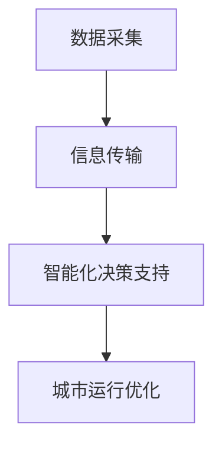
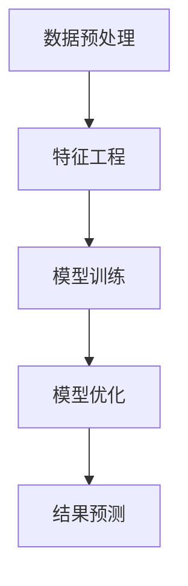
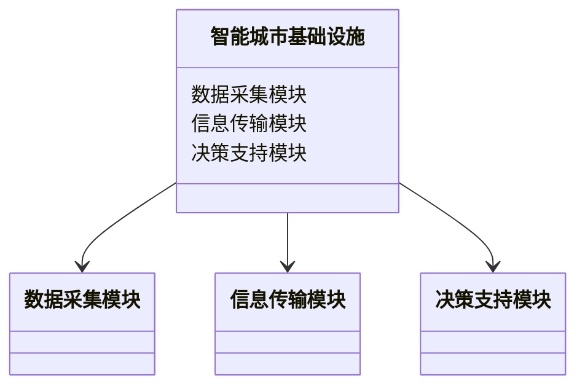

                 

# 价值投资中的智能城市基础设施分析

## 关键词：价值投资、智能城市、基础设施、数据分析、算法、系统架构

## 摘要：本文深入探讨了价值投资在智能城市基础设施中的应用，分析了智能城市基础设施的核心概念、算法原理和系统架构设计，结合实际案例，为投资者提供了数据驱动的决策支持。通过详细的技术分析和投资策略，本文为价值投资者提供了新的视角和方法。

---

## 第1章: 价值投资与智能城市基础设施的背景介绍

### 1.1 价值投资的基本概念

#### 1.1.1 价值投资的定义
价值投资是一种投资策略，强调以低于资产内在价值的价格购买优质资产，长期持有，追求超额收益。其核心在于识别市场低估的资产，通过基本面分析评估其长期价值。

#### 1.1.2 价值投资的核心理念
价值投资的核心理念包括：
1. 市场先生理论：市场情绪波动导致价格偏离价值。
2. 安全边际：购买价格低于内在价值，以降低风险。
3. 长期主义：关注企业的长期盈利能力，而非短期波动。

#### 1.1.3 价值投资在现代金融中的地位
价值投资在现代金融中占据重要地位，尤其是在市场波动加剧的情况下，其稳健的投资策略为投资者提供了避险和增值的机会。近年来，随着技术的进步，价值投资结合数据分析和算法，逐渐从传统的人工分析向智能化、数据化方向发展。

### 1.2 智能城市基础设施的定义与特点

#### 1.2.1 智能城市基础设施的定义
智能城市基础设施是指通过数字化、网络化和智能化技术，将传统的城市基础设施（如交通、能源、通信等）进行升级，以提高城市运行效率、资源利用效率和居民生活质量。

#### 1.2.2 智能城市基础设施的核心要素
智能城市基础设施的核心要素包括：
1. 数据采集与处理：通过传感器、摄像头等设备收集城市运行数据。
2. 信息传输与共享：利用物联网、5G等技术实现数据的实时传输和共享。
3. 智能化决策支持：通过数据分析、人工智能等技术提供决策支持。

#### 1.2.3 智能城市基础设施与传统城市基础设施的区别
| 特性                | 传统基础设施            | 智能基础设施            |
|---------------------|-------------------------|-------------------------|
| 技术基础            | 线下基础设施            | 数字化、智能化技术      |
| 运行效率            | 较低，人工管理为主       | 高效，自动化管理        |
| 可扩展性            | 有限，难以快速调整      | 高，可根据需求灵活扩展 |
| 数据利用            | 无或低效               | 高效，数据驱动决策      |

### 1.3 价值投资与智能城市基础设施的结合

#### 1.3.1 价值投资在智能城市基础设施中的应用
价值投资者可以通过分析智能城市基础设施企业的财务状况、市场地位、竞争优势等因素，识别被低估的投资机会。

#### 1.3.2 智能城市基础设施对价值投资的影响
智能城市基础设施的快速发展为价值投资者提供了新的投资领域，同时，技术的进步也使得价值评估更加复杂，需要结合技术评估和财务分析。

#### 1.3.3 价值投资与智能城市基础设施的未来发展趋势
随着技术的进步和城市化进程的加快，智能城市基础设施的投资价值将更加显著，价值投资在这一领域的应用也将更加广泛和深入。

---

## 第2章: 智能城市基础设施的核心概念与联系

### 2.1 智能城市基础设施的核心要素

#### 2.1.1 数据采集与处理
数据采集与处理是智能城市基础设施的基础，通过传感器、摄像头等设备收集城市运行数据，并进行清洗、转换和存储。

#### 2.1.2 信息传输与共享
信息传输与共享依赖于高速网络和云计算技术，确保数据的实时传输和安全共享。

#### 2.1.3 智能化决策支持
智能化决策支持通过数据分析、机器学习等技术，为城市管理和投资决策提供支持。

### 2.2 核心概念的属性特征对比

#### 2.2.1 数据采集与信息传输的对比分析
| 特性                | 数据采集                | 信息传输              |
|---------------------|-------------------------|------------------------|
| 技术基础            | 传感器、物联网          | 网络通信、5G          |
| 目标                | 收集数据                | 传输数据              |
| 挑战                | 数据质量、采集效率      | 网络延迟、安全性      |

#### 2.2.2 智能化决策支持的特征分析
智能化决策支持具有实时性、准确性、可扩展性和高效性等特点，能够显著提升城市管理和投资决策的效率。

#### 2.2.3 核心要素之间的关系图

---

## 第3章: 智能城市基础设施的算法原理

### 3.1 数据分析与预测算法

#### 3.1.1 数据预处理
数据预处理包括数据清洗、数据转换和数据增强，确保数据的完整性和一致性。

#### 3.1.2 特征工程
特征工程是通过选择和创建特征，提升模型的性能。常用方法包括特征选择、特征提取和特征创建。

#### 3.1.3 模型训练与优化
模型训练包括选择合适的算法、调整超参数和评估模型性能。常用算法包括线性回归、决策树和随机森林。

### 3.2 算法流程图

### 3.3 数学模型与公式

#### 3.3.1 线性回归模型
线性回归模型用于预测连续型变量，公式如下：
$$y = \beta_0 + \beta_1x + \epsilon$$

#### 3.3.2 逻辑回归模型
逻辑回归模型用于分类问题，公式如下：
$$P(y=1|x) = \frac{e^{\beta_0 + \beta_1x}}{1 + e^{\beta_0 + \beta_1x}}$$

---

## 第4章: 智能城市基础设施的系统架构设计

### 4.1 系统功能设计

#### 4.1.1 领域模型
领域模型描述了系统的核心业务流程和实体关系，如下所示：

### 4.2 系统架构设计

#### 4.2.1 分层架构
智能城市基础设施的系统架构通常采用分层架构，包括数据层、服务层和应用层。

#### 4.2.2 微服务架构
微服务架构将系统功能分解为多个独立的服务，每个服务负责特定的功能模块。

### 4.3 接口设计

#### 4.3.1 API接口
系统通过API接口实现数据的交互，常用接口包括RESTful API。

#### 4.3.2 接口文档
接口文档详细描述了接口的功能、参数和返回值。

### 4.4 交互流程

#### 4.4.1 用户交互
用户通过应用层与系统进行交互，提交请求并接收反馈。

#### 4.4.2 系统交互
系统通过内部服务调用实现功能，确保数据的高效处理和传输。

---

## 第5章: 项目实战

### 5.1 环境配置

#### 5.1.1 技术选型
选择合适的开发框架和技术栈，如Python、Flask、Django等。

#### 5.1.2 数据源
数据源可以是公开数据集或企业内部数据。

### 5.2 数据收集与处理

#### 5.2.1 数据清洗
使用Python的pandas库进行数据清洗和预处理。

#### 5.2.2 数据分析
通过数据分析工具（如Jupyter Notebook）进行数据可视化和探索性分析。

### 5.3 模型实现

#### 5.3.1 模型训练
使用机器学习库（如scikit-learn）进行模型训练和优化。

#### 5.3.2 模型部署
将模型部署到生产环境，提供实时预测服务。

### 5.4 案例分析

#### 5.4.1 案例背景
选择一个具体的智能城市基础设施项目，分析其投资价值。

#### 5.4.2 数据分析结果
通过数据分析结果，评估项目的潜在收益和风险。

#### 5.4.3 投资建议
根据分析结果，提出投资建议和策略。

### 5.5 结果解读

#### 5.5.1 模型性能评估
评估模型的准确率、召回率等性能指标。

#### 5.5.2 投资回报分析
分析项目的投资回报率和风险水平。

---

## 第6章: 价值评估与投资策略

### 6.1 投资策略制定

#### 6.1.1 策略目标
明确投资目标和风险偏好。

#### 6.1.2 策略选择
选择合适的策略，如价值投资、成长投资等。

### 6.2 风险分析

#### 6.2.1 市场风险
分析市场波动对投资的影响。

#### 6.2.2 项目风险
评估项目的可行性和技术风险。

### 6.3 投资组合优化

#### 6.3.1 资产配置
根据风险偏好和收益目标，进行资产配置。

#### 6.3.2 绩效评估
定期评估投资组合的绩效，并进行调整。

---

## 第7章: 总结与展望

### 7.1 研究总结

#### 7.1.1 核心内容回顾
总结全文的核心内容和主要观点。

#### 7.1.2 技术应用总结
总结智能城市基础设施在价值投资中的技术应用和实际案例。

### 7.2 未来展望

#### 7.2.1 技术发展趋势
展望智能城市基础设施的技术发展趋势。

#### 7.2.2 投资策略优化
探讨价值投资在智能城市基础设施中的优化方向。

---

## 作者：AI天才研究院 & 禅与计算机程序设计艺术

